# 1.7.1 Guida introduttiva a Firefly Creative Production for Enterprise

Vai a [https://firefly.adobe.com](https://firefly.adobe.com). Fai clic sull&#39;icona del profilo nell&#39;angolo in alto a destra e verifica di aver selezionato l&#39;istanza corretta, che dovrebbe essere `--aepImsOrgName--`.

Vai a **Produzione**.

Dovresti vedere questo. Fai clic su **Crea flusso di lavoro (versione beta)**.

## 1.7.1.1 Rimuovi sfondo

Per conoscere Firefly Creative Production for Enterprise, ora implementerai un caso d’uso di base incentrato sulla rimozione dello sfondo di un’immagine specifica.

Cambia il nome del flusso di lavoro in `vangeluw - remove background`.

Apri **Immagine**

Seleziona **Rimuovi sfondo**, quindi trascina questo nodo nell&#39;area di lavoro.

È ora necessario collegare un nodo immagine di input e un nodo immagine di output a **Rimuovi sfondo**.

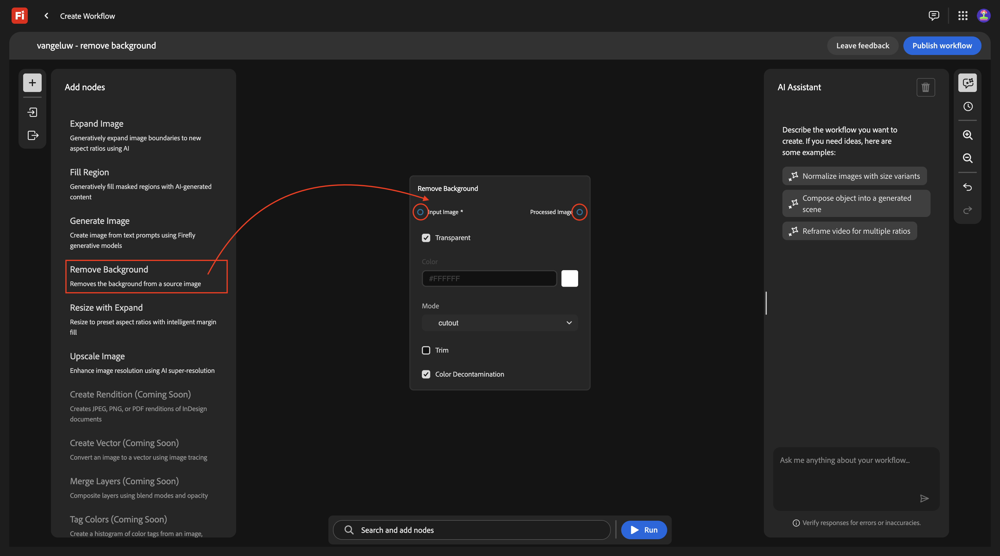

Scorri verso l&#39;alto e passa a **Input e output**. Fare clic sul nodo **Immagini di input** e trascinarlo nell&#39;area di lavoro.

Dovresti avere questo. **&#x200B;**&#x200B;**&#x200B;**&#x200B;**&#x200B;**&#x200B;**&#x200B;**&#x200B;**&#x200B;**&#x200B;**&#x200B;**

You should then have this. Fare clic sul nodo **Immagini di output** e trascinarlo nell&#39;area di lavoro.

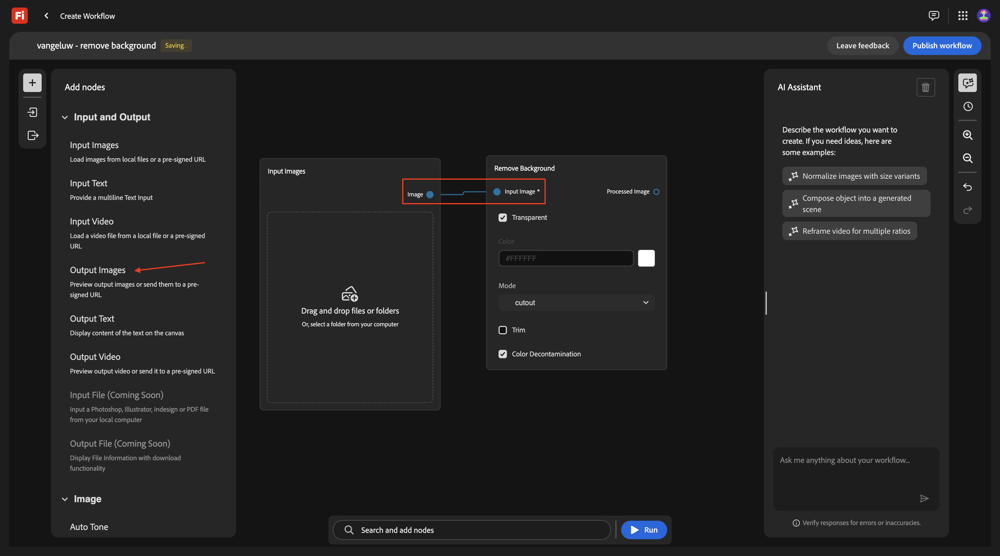

Dovresti avere questo. Connetti il nodo **Rimuovi sfondo** al nodo **Immagini di output** passando il puntatore del mouse sul punto blu accanto a **Immagine di output** nel nodo **Rimuovi sfondo** e disegnando una linea con il punto blu accanto a **Immagine** nel nodo **Immagini di output**.

Dovresti avere questo.

Il flusso di lavoro di base è ora pronto per il test. Scarica l&#39;immagine [phone.png](./assets/phone.png) sul desktop.

Torna al workflow. Fai clic sull&#39;area **Trascina e rilascia** del nodo **Immagini di input**.

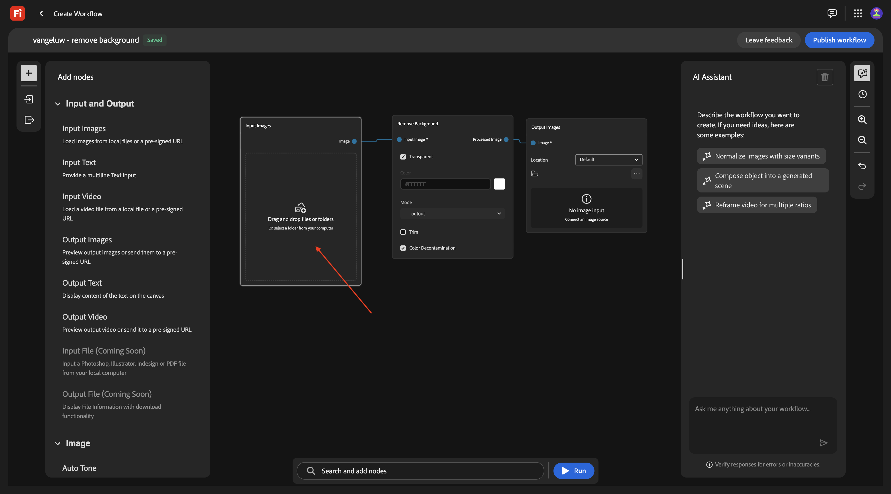

Selezionare il file **phone.png**. Fai clic su **Apri**.

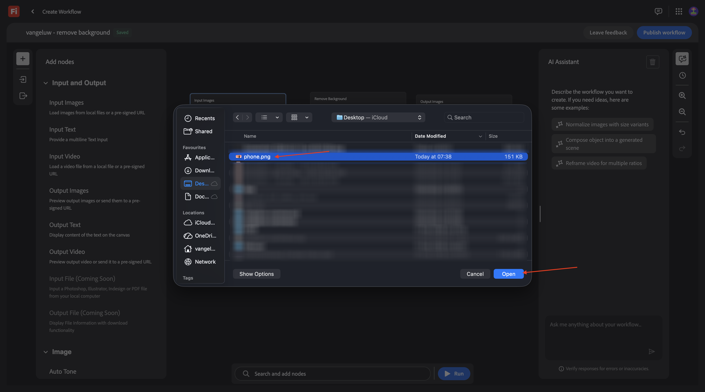

Dovresti vedere questo. Fare clic su **Esegui**.

Dopo 1-2 minuti, dovresti vedere questo risultato.

## 1.7.1.2 Rimuovi sfondo + Ritaglia

È ora necessario aggiungere un nodo **Ritaglio** all&#39;area di lavoro. Nel menu, vai a **Immagine** e scorri verso il basso per trovare **Ritaglio**. Trascinalo nell’area di lavoro.

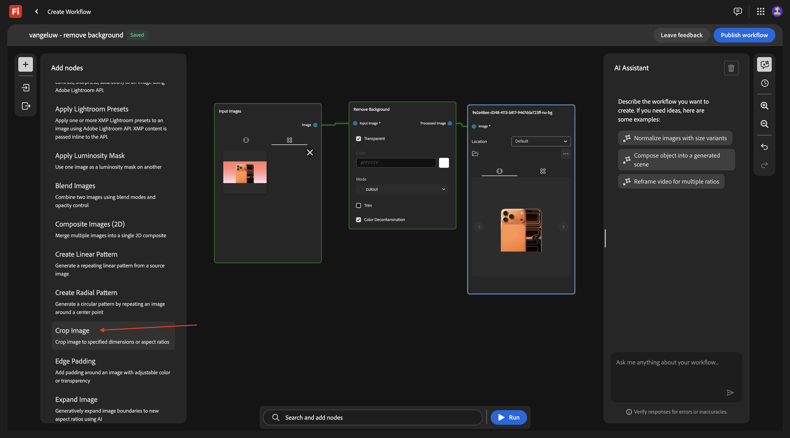

Posiziona il nodo **Ritaglia** tra il nodo **Rimuovi sfondo** e il nodo **Immagine di output**.

È ora necessario rimuovere la connessione tra il nodo **Rimuovi sfondo** e il nodo **Immagine di output**. A tale scopo, fare doppio clic sulla linea tra i due nodi.

Dovresti avere questo. Connetti il nodo **Rimuovi sfondo** al nodo **Ritaglia**, quindi connetti il nodo **Ritaglia** al nodo **Immagine di output**.

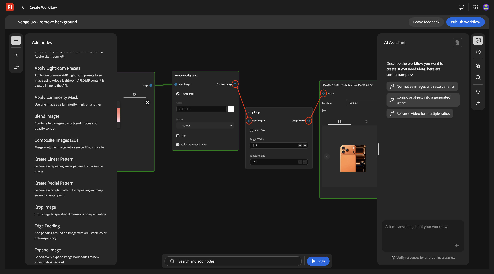

Seleziona la casella di controllo per **Ritaglio automatico**, quindi puoi verificare il flusso di lavoro facendo clic su **Esegui**.

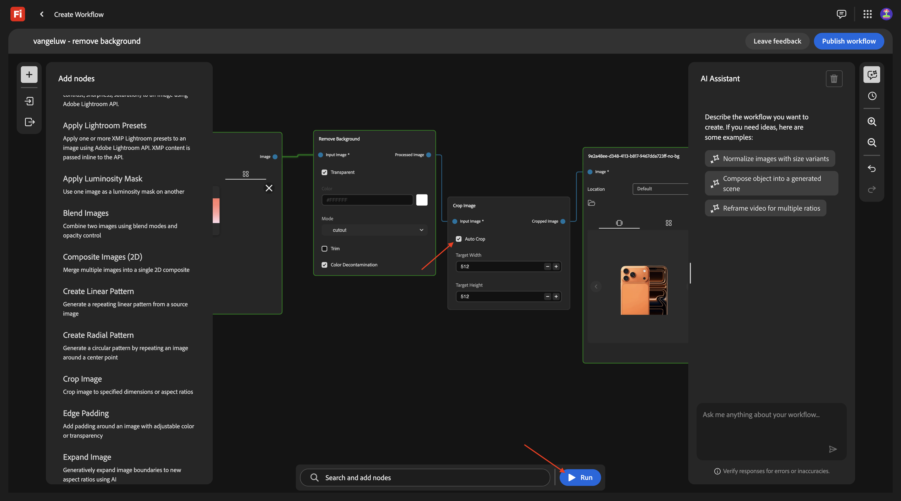

Dopo 1-2 minuti, dovresti vedere questo, che mostra ora un&#39;immagine con una risoluzione diversa.

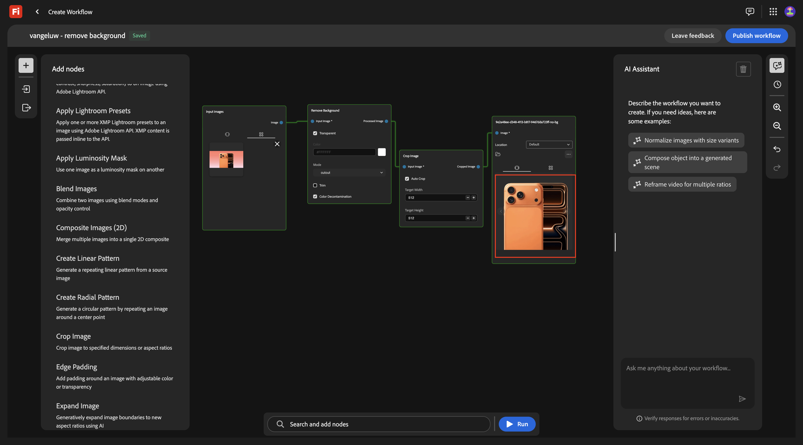

## 1.7.1.3 Rimuovi sfondo + Ritaglio + Immagine composita

Nel menu, in **Immagine** seleziona un nodo **Immagini composite (2D)** e trascinalo nell&#39;area di lavoro.

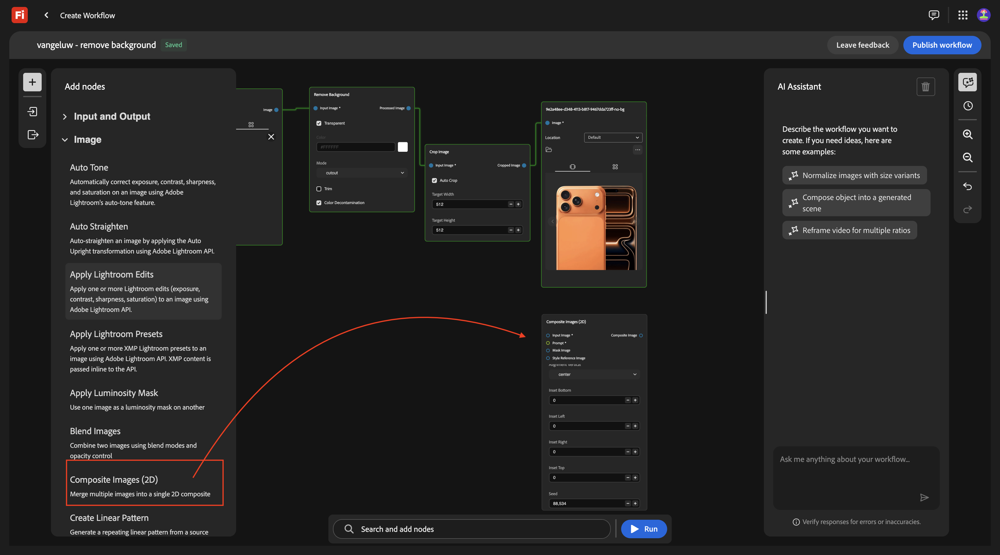

Aggiungi una seconda connessione al nodo **Ritaglia**, connettendo il punto blu accanto a **Immagine ritagliata** al punto blu accanto a **Immagine di input** nel nodo **Immagini composite (2D)**.

Nel menu, in **Input e Output**, seleziona un nodo **Testo di input** e trascinalo nell&#39;area di lavoro.

Connetti il punto verde accanto a **Testo** nel nodo **Testo di input** al punto verde accanto a **Prompt** nel nodo **Immagini composite (2D)**.

Dovresti avere questo. Immettere il seguente prompt nel nodo **Testo di input**.

`magazine quality photo of a phone on a red pedestal with a pink background surrounded by origami style pink paper hearts`

Nel menu, in **Input e Output**, seleziona un nodo **Immagini di output** e trascinalo nell&#39;area di lavoro.

Connetti il punto blu accanto a **Immagine composita** nel nodo **Immagini composte (2D)** al punto blu accanto a **Immagine di input** nel nodo **Immagine di output**.

Fare clic su **Esegui**.

Dopo un paio di minuti, dovresti vedere qualcosa di simile a questo, che mostra l’immagine originale in una composizione in base al prompt fornito, in una risoluzione specifica.

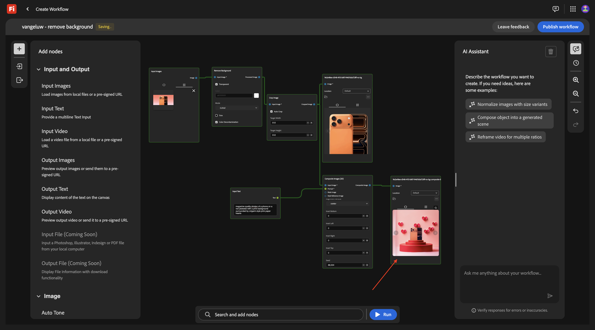

## 1.7.1.4 Rimuovi sfondo + Ritaglio + Immagine composita + Genera video

Nel menu, vai a **Video**. Selezionare il nodo **Genera video** e trascinarlo nell&#39;area di lavoro.

Connetti il punto blu accanto a **Immagine composita** del nodo **Immagini composte (2D)** al punto blu accanto a **Immagine di input** del nodo **Genera video**.

Nel menu, vai a **Input e Output**. Selezionare il nodo **Testo di input** e trascinarlo nell&#39;area di lavoro.

Connetti il punto verde accanto a **Testo** nel nodo **Testo di input** al punto verde accanto a **Prompt** del nodo **Genera video**.

Immettere il prompt `background hearts fluttering` nel nodo **Testo di input**.

Nel menu, vai a **Input e Output**. Selezionare il nodo **Video di output** e trascinarlo nell&#39;area di lavoro.

Connetti il punto viola accanto a **Output video** del nodo **Genera video** al punto viola accanto a **Video** nel nodo **Video output**.

**&#x200B;**

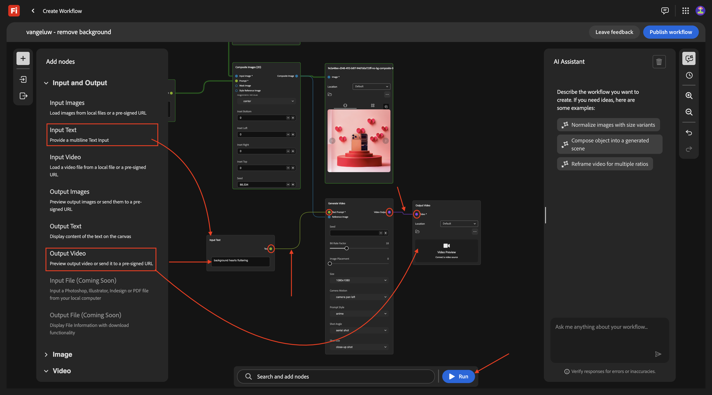

Dopo un paio di video, dovresti vedere questo che mostra un video basato sulla combinazione dell’immagine e del prompt forniti.

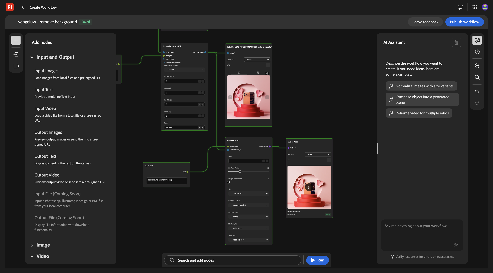

## Scala 1.7.1.5

Questo è stato fatto per 1 immagine. Ora usiamo questo flusso di lavoro, ma per più immagini.

Scarica queste immagini sul desktop:

- [watch.jpg](./assets/watch.jpg)
- [airpods.jpg](./assets/airpods.jpg)

Nel flusso di lavoro, torna al primo nodo, **Immagini di input**. Rimuovi l&#39;immagine attualmente selezionata.

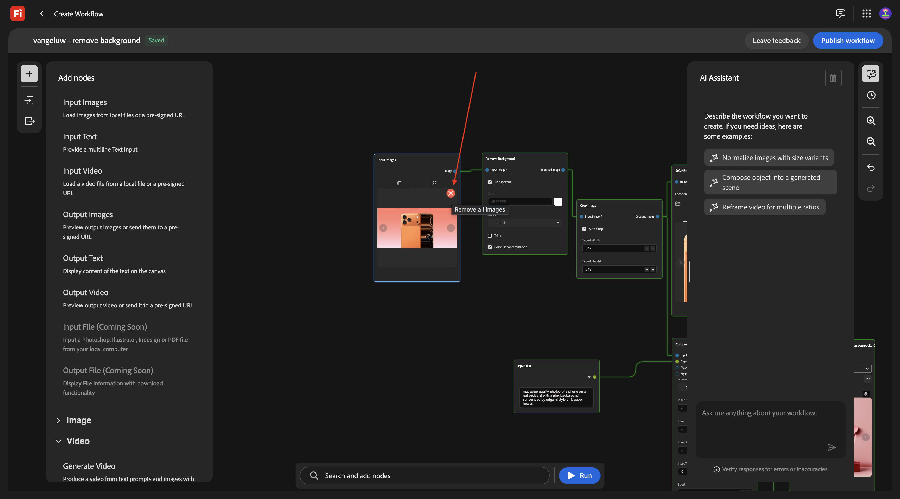

Fai clic sull&#39;area **Trascina e rilascia**.

Seleziona le 3 immagini scaricate. Fai clic su **Apri**.

You should then see this. **&#x200B;**

Dopo alcuni minuti, dovresti vedere un output simile, con 3 immagini generate e 3 video.

## Archivio 1.7.1.5 in AEM Assets CS

In questo esercizio memorizzerete le risorse create come parte del flusso di lavoro personalizzato in AEM Assets CS.

Devi innanzitutto creare una nuova cartella nell’ambiente AEM Assets CS.

Per eseguire questa operazione, vai a [https://experience.adobe.com](https://experience.adobe.com). Fare clic per aprire **Experience Manager Assets**.

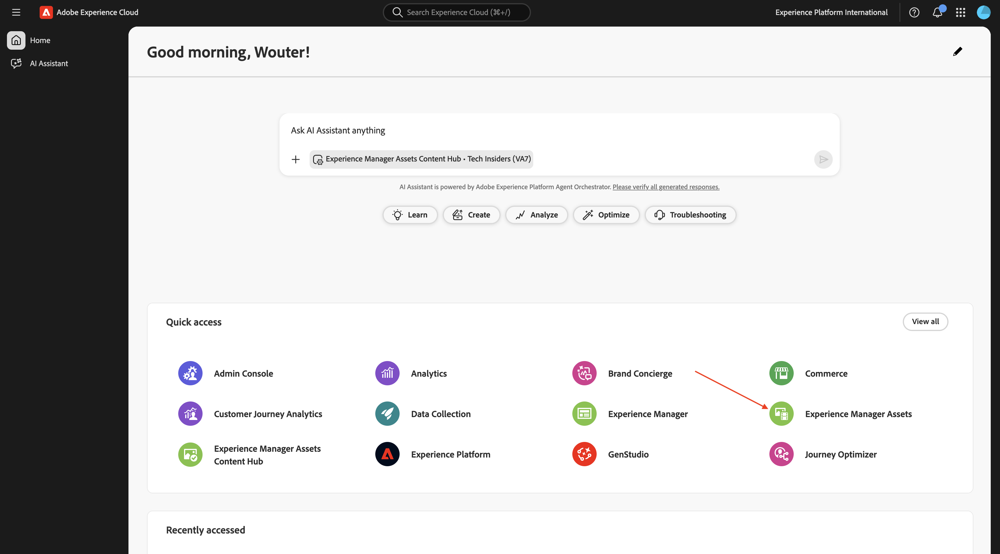

Seleziona l&#39;ambiente AEM Assets CS, che deve essere denominato `--aepUserLdap-- - CitiSignal AEM + ACCS`.

Vai a **Assets** e fai clic su **Crea cartella**.

Immettere il nome: `--aepUserLdap-- - Firefly Creative Production for Enterprise`. Fai clic su **Crea**.

Torna al flusso di lavoro personalizzato e passa al nodo **Immagini di output**. Fai clic su **Predefinito**, quindi seleziona **AEM Assets**.

Dovresti vedere questo pop-up. Selezionare l&#39;archivio AEM Assets CS, quindi selezionare la cartella appena creata, che deve essere denominata: `--aepUserLdap-- - Firefly Creative Production for Enterprise`. Fai clic su **Seleziona**.

Vai al nodo **Video di output**. Fai clic su **Predefinito**, quindi seleziona **AEM Assets**.

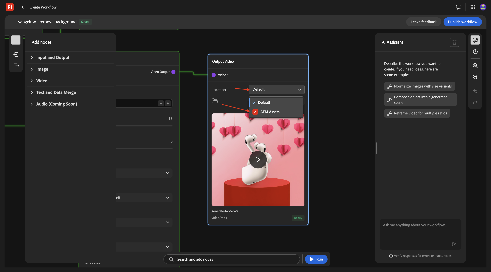

Dovresti vedere questo pop-up. Selezionare l&#39;archivio AEM Assets CS, quindi selezionare la cartella appena creata, che deve essere denominata: `--aepUserLdap-- - Firefly Creative Production for Enterprise`. Fai clic su **Seleziona**.

Dovresti avere questo. Fare clic su **Esegui**.

Dopo un paio di minuti, le risorse create dovrebbero diventare disponibili nella cartella in AEM Assets CS.

Torna al workflow. Fai clic su **Pubblica**.

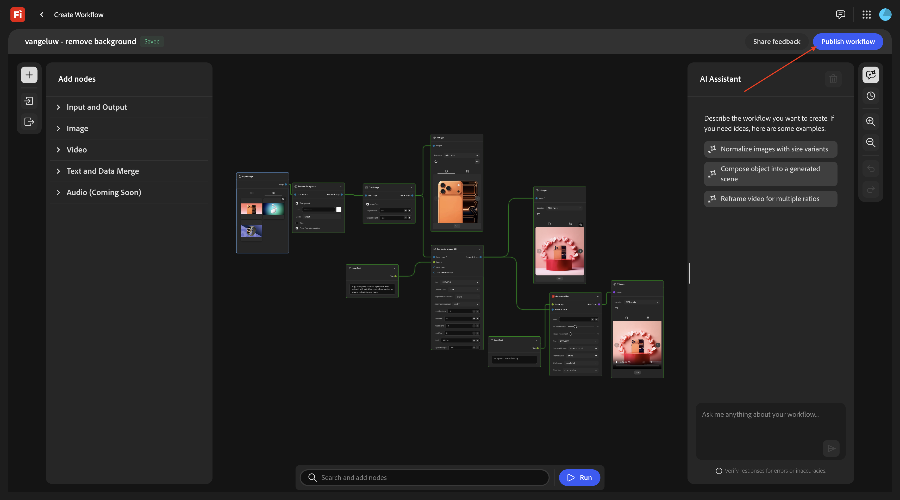

Dovresti vedere questo.

Il flusso di lavoro viene ora pubblicato e può essere eseguito programmaticamente come parte dell’esercizio successivo.

## Passaggi successivi

Vai a [1.7.2 Esegui il flusso di lavoro personalizzato a livello di programmazione](./ex2.md){target="_blank"}

Torna a [Firefly Creative Production for Enterprise](./workflowbuilder.md){target="_blank"}

Torna a [Tutti i moduli](./../../../overview.md){target="_blank"}
