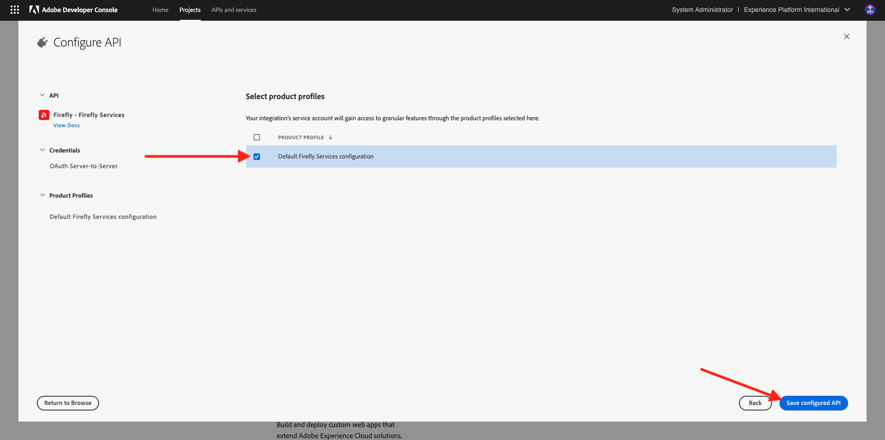
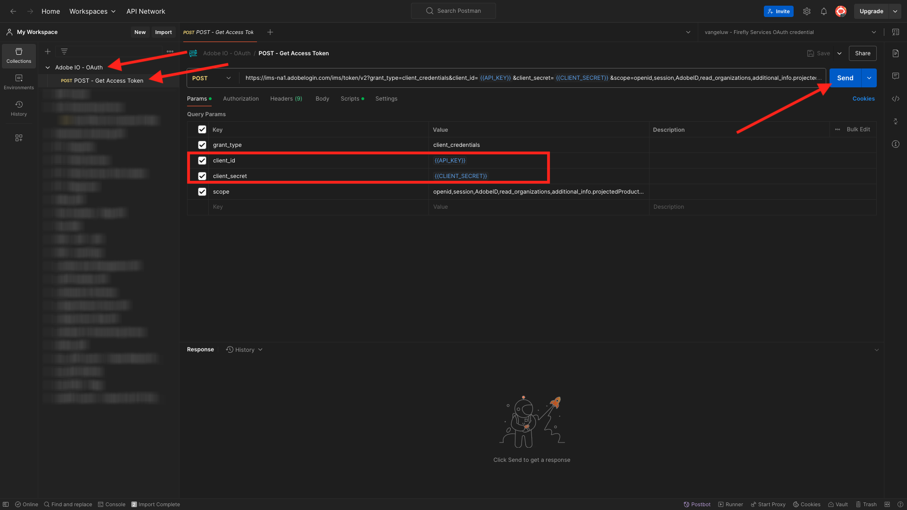

# 1.1.1 Introduzione ai servizi di Firefly

In questo esercizio utilizzerai Postman e Adobe I/O per eseguire query sulle API di Adobe Firefly Services.

## Configurare il progetto Adobe I/O

In questo esercizio utilizzerai Adobe I/O con molta attenzione per eseguire query sulle API dei servizi di Firefly. Per configurare l’Adobe I/O, segui i passaggi seguenti.

Vai a [https://developer.adobe.com/console/home](https://developer.adobe.com/console/projects)

Assicurati di selezionare l’istanza corretta nell’angolo in alto a destra dello schermo. L&#39;istanza è `--aepImsOrgName--`. Fare clic su **Crea nuovo progetto**.

Seleziona **+ Aggiungi al progetto** e seleziona **API**.

A questo punto viene visualizzato quanto segue:

Selezionare **Creative Cloud** e fare clic su **Firefly - Servizi di Firefly**. Fai clic su **Avanti**.

Ora vedrai questo. Specificare un nome per le credenziali: `--aepUserLdap-- - Firefly Services OAuth credential`. Fai clic su **Avanti**.

Successivamente, devi selezionare un profilo di prodotto che definirà quali autorizzazioni sono disponibili per questa integrazione.

Selezionare il profilo **Configurazione predefinita servizi di Firefly**.

Fare clic su **Salva API configurata**.

L’integrazione di Adobe I/O è ora pronta.

Fare clic sul pulsante **Scarica per Postman** e quindi su **OAuth Server-to-Server** per scaricare un ambiente Postman.

Il progetto I/O ha un nome generico. È necessario assegnare un nome descrittivo alla tua integrazione. Fare clic su **Progetto X** (o nome simile) come indicato

Fare clic su **Modifica progetto**.

Immettere un nome per l&#39;integrazione: `--aepUserLdap-- Firefly`.

Fai clic su **Salva**.

La configurazione dell’integrazione Adobe I/O è terminata.

## Autenticazione Postman da Adobe I/O

Vai a [https://www.postman.com/downloads/](https://www.postman.com/downloads/).

Scarica e installa la versione rilevante di Postman per il tuo sistema operativo.

Dopo aver installato Postman, avviare l&#39;applicazione.

In Postman sono disponibili 2 concetti: ambienti e raccolte.

- Il file di ambiente contiene tutte le variabili di ambiente che sono più o meno coerenti. Nell’ambiente troverai elementi come l’IMSOrg dell’ambiente Adobe, insieme alle credenziali di sicurezza come l’ID client e altri. Il file dell&#39;ambiente è quello scaricato durante l&#39;Adobe I/O di configurazione dell&#39;esercizio precedente ed è denominato in questo modo: **`oauth_server_to_server.postman_environment.json`**.

- La raccolta contiene diverse richieste API che puoi utilizzare. Utilizzeremo 2 raccolte
   - 1 raccolta per l&#39;autenticazione all&#39;Adobe I/O
   - 1 Raccolta per gli esercizi in questo modulo

Scarica il file [postman.zip](./../../../assets/postman/postman-ff.zip) sul desktop locale.

In questo file **postman.zip**, troverai i seguenti file:

- `Adobe IO - OAuth.postman_collection.json`
- `FF - Firefly Services Tech Insiders.postman_collection.json`

Decomprimi il file **postman-ff.zip** e archivia questi due file in una cartella sul desktop, insieme all&#39;ambiente Postman scaricato da Adobe I/O, che è il file `oauth_server_to_server.postman_environment.json`. Devi avere questi 3 file in quella cartella:

Torna a Postman. Fai clic su **Importa**.

Fai clic su **file**.

Passa alla cartella sul desktop in cui sono stati estratti i due file scaricati. Selezionare questi 3 file contemporaneamente e fare clic su **Apri**.

Dopo aver fatto clic su **Apri**, Postman ti mostrerà una panoramica dell&#39;ambiente e delle raccolte che stai per importare. Fai clic su **Importa**.

Ora disponi di tutto il necessario in Postman per iniziare a interagire con i servizi di Firefly tramite le API.

La prima cosa da fare è accertarsi di essere autenticati correttamente. Per essere autenticato, devi richiedere un token di accesso.

Assicurati di aver selezionato l’ambiente corretto prima di eseguire qualsiasi richiesta. Per controllare l’ambiente attualmente selezionato, verifica l’elenco a discesa Ambiente nell’angolo in alto a destra.

L&#39;ambiente selezionato deve avere un nome simile a questo, `--aepUserLdap-- Firefly Services OAuth Credential`.

L’ambiente e le raccolte Postman ora sono configurati e funzionanti. Ora puoi eseguire l’autenticazione da Postman a Adobe I/O.

Nella raccolta **Adobe IO - OAuth**, selezionare la richiesta con il nome **POST - Ottieni token di accesso**. In **Params**, si fa riferimento a 2 variabili, `API_KEY` e `CLIENT_SECRET`. Queste variabili vengono prese dall&#39;ambiente selezionato, `--aepUserLdap-- Firefly Services OAuth Credential`.

Fai clic su **Invia**.

Dopo aver fatto clic su **Invia**, verrà visualizzata una risposta nella sezione **Corpo** di Postman:

Se la configurazione è andata a buon fine, dovresti vedere una risposta simile che contiene le seguenti informazioni:

| Chiave | Valore |
|:-------------:| :---------------:| 
| token_type | **portatore** |
| access_token | **eyJhbGciOiJSU...** |
| expires_in | **86399** |

L&#39;Adobe I/O ti ha assegnato un token **bearer**, con un valore specifico (access_token molto lungo) e una finestra di scadenza.

Il token ricevuto è ora valido per 24 ore. Ciò significa che dopo 24 ore, se desideri utilizzare Postman per l’autenticazione in Adobe I/O, dovrai generare un nuovo token eseguendo nuovamente questa richiesta.

## API Servizi di Firefly, immagine Testo 2

Ora puoi procedere e inviare la tua prima richiesta alle API di Servizi di Firefly.

Nella raccolta **FF - Firefly Services Tech Insiders**, selezionare la richiesta con il nome **POST - Firefly - T2I V3**. Nella sezione **Corpo** verrà visualizzato un prompt predefinito che indica `Horses in a field`. Fai clic su **Invia** per fare in modo che i servizi di Firefly generino l&#39;immagine.

Vedrai quindi una risposta simile, contenente un URL immagine. Copia l’URL dell’immagine e aprilo nel browser web.

Ora vedrai una bella immagine che ritrae `horses in a field`.

Puoi rispondere alla richiesta API prima di continuare con l’esercizio successivo.

Passaggio successivo: [1.1.2 Ottimizzare il processo di Firefly utilizzando Microsoft Azure e gli URL prefirmati](./ex2.md)

[Torna al modulo 1.1](./firefly-services.md)

[Torna a tutti i moduli](./../../../overview.md)
