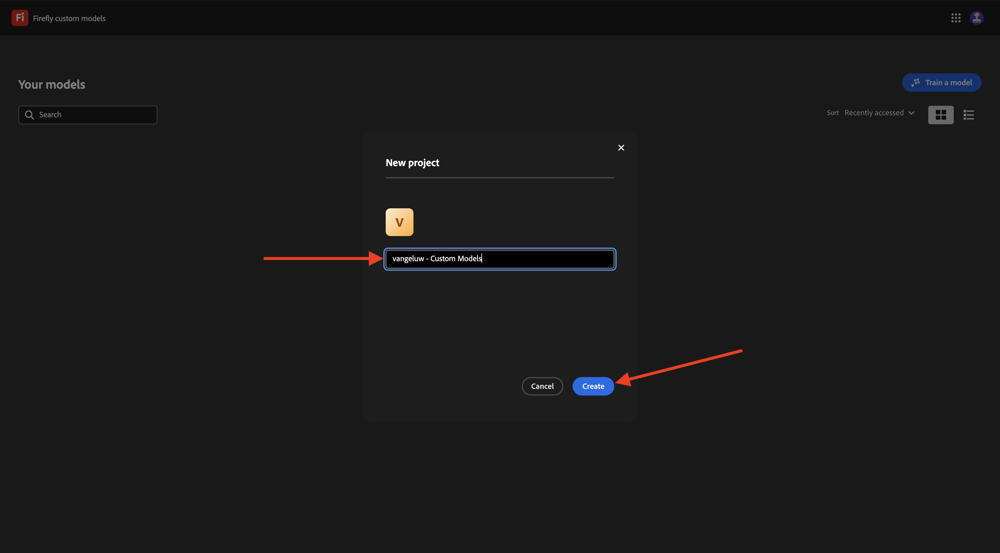

# Modelli personalizzati Firefly 1.1.4

Vai a [https://firefly.adobe.com](https://firefly.adobe.com){target="_blank"}. Vai a **Modelli personalizzati**.

**Accetto** le condizioni di utilizzo dei modelli personalizzati di Firefly.

Fai clic su **Addestra un modello**.

Utilizza il nome `--aepUserLdap-- - CitiSignal Router Model`. Seleziona **Stile** e fai clic su **+ Crea nuovo progetto**.

Utilizza il nome `--aepUserLdap-- - CitiSignal Custom Model`. Fai clic su **Crea**.

Fai clic su **Continua**.

Fai clic su **Seleziona immagini dal computer**.

Puoi utilizzare queste risorse. Scaricali sul computer ed estrai il file zip in una cartella sul desktop.

Seleziona tutte le immagini e fai clic su **Apri**.

Le immagini verranno caricate. Questo potrebbe richiedere un po&#39; di tempo.

Hai completato l&#39;esercizio.

Passaggio successivo: [Riepilogo e vantaggi](./summary.md){target="_blank"}

[Torna al modulo 1.1](./firefly-services.md){target="_blank"}

[Torna a tutti i moduli](./../../../overview.md){target="_blank"}
