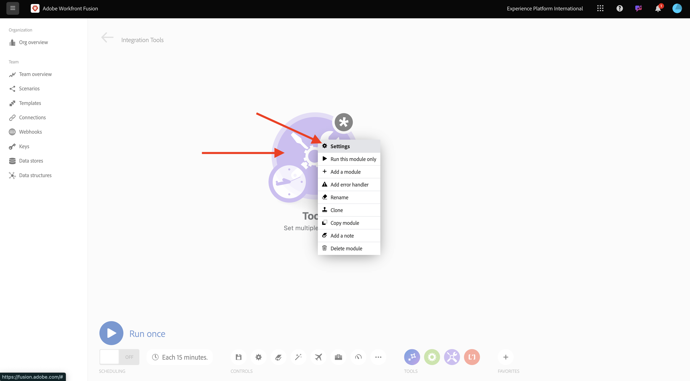
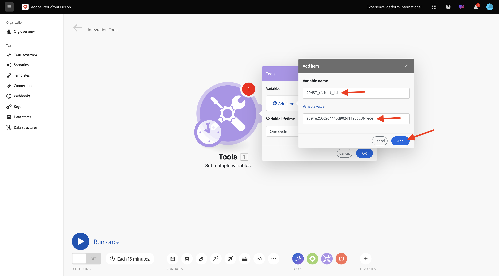
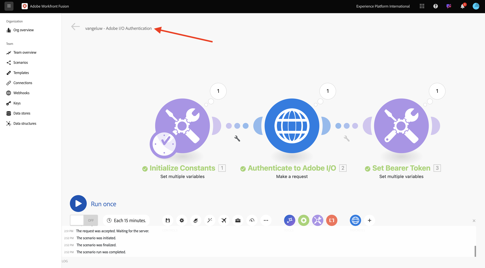

# Guida introduttiva a Workfront Fusion

Scopri come utilizzare Workfront Fusion e Adobe I/O per eseguire query sulle API dei servizi Adobe Firefly.

## Crea nuovo scenario

1. Vai a [https://experience.adobe.com/](https://experience.adobe.com/). Aprire **Workfront Fusion**.

   

1. Vai a **Scenari**.

   

1. Seleziona **Crea nuovo scenario**.

   

1. Assegna un nome alla cartella `--aepUserLdap--` e seleziona **Salva**.

   

1. Selezionare la cartella, quindi selezionare **Crea nuovo scenario**.

   

1. Viene visualizzato uno scenario vuoto. Selezionare **strumenti** e **Imposta più variabili**.

   

1. Sposta l&#39;icona **orologio** nelle **variabili multiple** appena aggiunte.

   

   Lo schermo dovrebbe essere simile al seguente.

   

1. Fare clic con il pulsante destro del mouse sul punto interrogativo e selezionare **Elimina modulo**.

   

1. Fare clic con il pulsante destro del mouse su **Imposta più variabili** e selezionare **Impostazioni**.

   

## Configurare l’autenticazione Adobe I/O

Ora devi configurare le variabili necessarie per l’autenticazione in base a Adobe I/O. Nell’esercizio precedente hai creato un progetto di Adobe I/O. Le variabili di tale progetto di Adobe I/O ora devono essere definite in Workfront Fusion.

È necessario definire le seguenti variabili:

| Chiave | Valore |
|:-------------:| :---------------:| 
| `CONST_client_id` | ID client del progetto Adobe I/O |
| `CONST_client_secret` | il segreto client del progetto Adobe I/O |
| `CONST_scope` | ambito del progetto di Adobe I/O |

1. Trova queste variabili da [https://developer.adobe.com/console/projects](https://developer.adobe.com/console/projects) e apri il tuo progetto di Adobe I/O, denominato `--aepUserLdap-- Firefly`.

   

1. Nel progetto, seleziona **OAuth Server-Server** per visualizzare i valori per le chiavi di cui sopra.

   

1. Utilizzando le chiavi e i valori di cui sopra, è possibile configurare l&#39;oggetto **Imposta più variabili**. Seleziona **Aggiungi elemento**.

   

1. Immetti il **Nome variabile**: **CONST_client_id** e il relativo **Valore variabile**, seleziona **Aggiungi**.

   

1. Seleziona **Aggiungi elemento**.

   

1. Immetti **Nome variabile**: **CONST_client_secret** e il relativo **Valore variabile**. Seleziona **Aggiungi**.

   

1. Seleziona **Aggiungi elemento**.

   

1. Immetti **Nome variabile**: **CONST_scope** e il relativo **Valore variabile**. Seleziona **Aggiungi**.

   

1. Selezionare **OK**.

   

1. Passa il puntatore del mouse su **Imposta più variabili** e seleziona l&#39;icona grande **+** per aggiungere un altro modulo.

   

   Lo schermo dovrebbe essere simile al seguente.

   

1. Nella barra di ricerca immettere **http**. Seleziona **HTTP** per aprirlo.

   

1. Seleziona **Crea una richiesta**.

   

   | Chiave | Valore |
   |:-------------:| :---------------:| 
   | `URL` | `https://ims-na1.adobelogin.com/ims/token/v3` |
   | `Method` | `POST` |
   | `Body Type` | `x-www-form-urlencoded` |

1. Seleziona **Aggiungi elemento**.

   

1. Aggiungi elementi per ciascuno dei seguenti valori:

   | Chiave | Valore |
   |:-------------:| :---------------:| 
   | `client_id` | la variabile predefinita per `CONST_client_id` |
   | `client_secret` | la variabile predefinita per `CONST_client_secret` |
   | `scope` | la variabile predefinita per `CONST_scope` |
   | `grant_type` | `client_credentials` |

1. Configurazione per `client_id`:

   

1. Configurazione per `client_secret`.

   

1. Configurazione per `scope`.

   

1. Configurazione per `grant_type`.

   

1. Scorri verso il basso e seleziona la casella per **Analizzare la risposta**. Selezionare **OK**.

   

1. Lo schermo dovrebbe essere simile al seguente. Selezionare **Esegui una volta**.

   

   Una volta eseguito lo scenario, lo schermo dovrebbe essere simile al seguente:

   

1. Selezionare l&#39;icona **punto interrogativo** nell&#39;oggetto **Imposta più variabili** per visualizzare l&#39;evento che si è verificato durante l&#39;esecuzione dell&#39;oggetto.

   

1. Seleziona l&#39;icona **punto interrogativo** sull&#39;oggetto **HTTP - Richiedi** per visualizzare l&#39;evento che si è verificato durante l&#39;esecuzione dell&#39;oggetto. Nel **OUTPUT**, vedi il **access_token** restituito dall&#39;Adobe I/O.

   

1. Passa il puntatore del mouse su **HTTP - Effettua una richiesta** e seleziona l&#39;icona **+** per aggiungere un altro modulo.

   

1. Nella barra di ricerca, cercare `tools`. Seleziona **Strumenti**.

   

1. Selezionare **Imposta più variabili**.

   

1. Seleziona **Aggiungi elemento**.

   

1. Imposta **Nome variabile** su `bearer_token`. Selezionare `access_token` come **valore di variabile** dinamico. Seleziona **Aggiungi**.

   

1. Lo schermo dovrebbe essere simile al seguente. Selezionare **OK**.

   

1. Seleziona di nuovo **Esegui**.

   

1. Una volta eseguito lo scenario, selezionare l&#39;icona **punto interrogativo** sull&#39;ultimo oggetto **Imposta più variabili**. Il token di accesso viene archiviato nella variabile `bearer_token`.

   

1. Fare quindi clic con il pulsante destro del mouse sul primo oggetto **Imposta più valori** e selezionare **Rinomina**.

   

1. Imposta il nome su **Inizializza costanti**. Selezionare **OK**.

   

1. Rinomina il secondo oggetto in **Autentica in Adobe I/O**. Selezionare **OK**.

   

1. Rinomina il terzo oggetto in **Imposta token Bearer**. Selezionare **OK**.

   

   Lo schermo dovrebbe essere simile al seguente:

   

1. Quindi, cambia il nome dello scenario in `--aepUSerLdap-- - Adobe I/O Authentication`.

   

1. Seleziona **Salva**.

   

## Passaggi successivi

Vai a [Utilizza le API di Adobe in Workfront Fusion](./ex2.md){target="_blank"}

Torna a [Automazione dei servizi Adobe Firefly](./automation.md){target="_blank"}

Torna a [Tutti i moduli](./../../../overview.md){target="_blank"}
