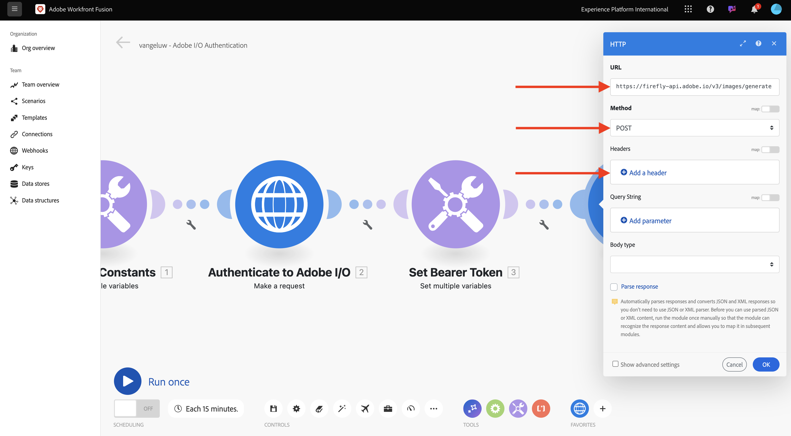
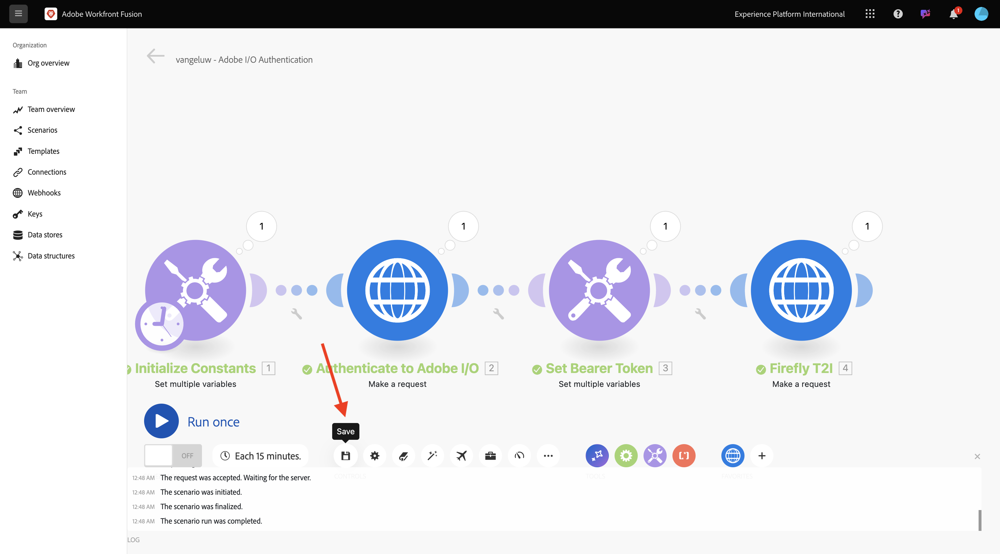
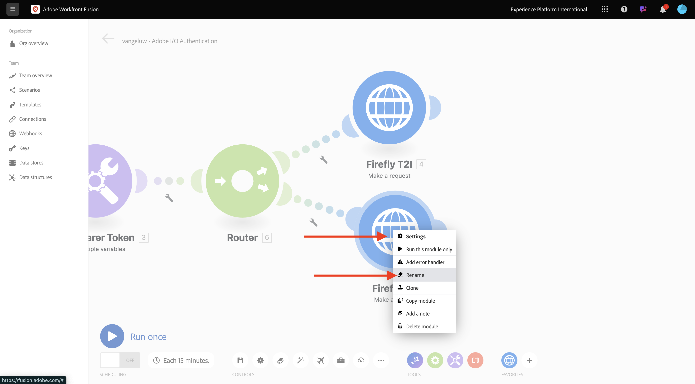
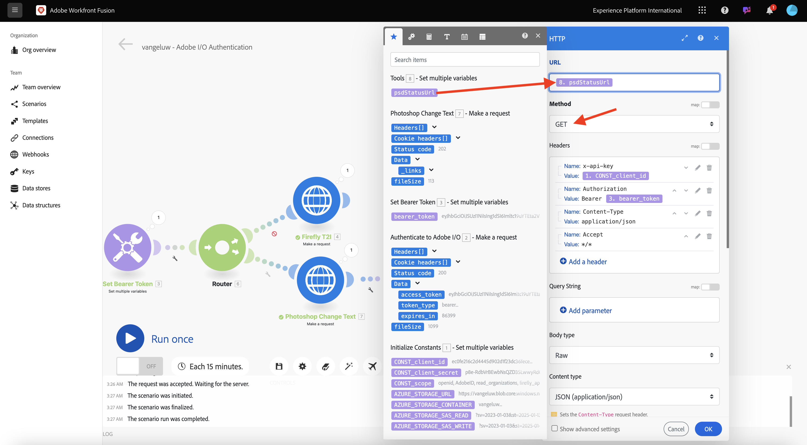
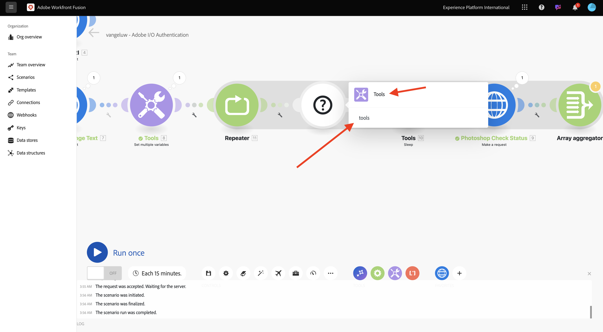

# 1.2.2 Utilizzare le API di Adobe in Workfront Fusion

## 1.2.2.1 Utilizzare l’API Testo Firefly per immagine con Workfront Fusion

Passa il puntatore del mouse sul secondo nodo **Imposta più variabili** e fai clic su **+** per aggiungere un altro modulo.


Cerca **http**, quindi seleziona **HTTP**.


Seleziona **Crea una richiesta**.


Seleziona queste variabili:

- **URL**: `https://firefly-api.adobe.io/v3/images/generate`
- **Metodo**: `POST`

Fai clic su **Aggiungi un&#39;intestazione**.



Inserisci le seguenti intestazioni:

| Chiave | Valore |
|:-------------:| :---------------:| 
| `x-api-key` | la variabile archiviata per `CONST_client_id` |
| `Authorization` | `Bearer ` + la variabile archiviata per `bearer_token` |
| `Content-Type` | `application/json` |
| `Accept` | `*/*` |

Immettere i dettagli per `x-api-key`. Fai clic su **Aggiungi**.


Fai clic su **Aggiungi un&#39;intestazione**.


Immettere i dettagli per `Authorization`. Fai clic su **Aggiungi**.


Fai clic su **Aggiungi un&#39;intestazione**. Immettere i dettagli per `Content-Type`. Fai clic su **Aggiungi**.


Fai clic su **Aggiungi un&#39;intestazione**. Immettere i dettagli per `Accept`. Fai clic su **Aggiungi**.


Imposta **Body type** su **Raw**. Per **Tipo di contenuto**, selezionare **JSON (application/json)**.


Incolla questo payload nel campo **Contenuto richiesta**.

```json
{
  "numVariations": 1,
  "size": {
    "width": 2048,
    "height": 2048
  },
  "prompt": "Horses in a field",
  "promptBiasingLocaleCode": "en-US"
}
```

Seleziona la casella di controllo per **Analisi risposta**. Fai clic su **OK**.


Fare clic su **Esegui una volta**.


Una volta eseguito lo scenario, dovresti visualizzarlo.


Fare clic su **?Icona** sul quarto nodo HTTP per visualizzare la risposta. Dovresti trovare un file di immagine nella risposta.


Copia l’URL dell’immagine e aprilo in una finestra del browser. Dovresti vedere qualcosa di simile a questo:


Fare clic con il pulsante destro del mouse sull&#39;oggetto **HTTP** e rinominarlo in **Firefly T2I**.


Fai clic su **Salva** per salvare le modifiche.



## 1.2.2.2 Utilizzare l’API Photoshop con Workfront Fusion

Fai clic sull&#39;icona **chiave inglese** tra i nodi **Imposta token Bearer** e **Firefly T2I**. Selezionare **Aggiungi un router**.


Fare clic con il pulsante destro del mouse sull&#39;oggetto **Firefly T2I** e selezionare **Clone**.


Trascina e rilascia l&#39;oggetto clonato in prossimità dell&#39;oggetto **Router**, che si connetterà automaticamente al **Router**. Dovresti avere questo.


È ora disponibile una copia identica basata sulla richiesta HTTP di **Firefly T2I**. Alcune impostazioni della richiesta HTTP **Firefly T2I** sono simili a quelle necessarie per interagire con l&#39;**API Photoshop**, che consente di risparmiare tempo. Ora devi solo modificare le variabili che non sono uguali, come l’URL della richiesta e il payload.

Cambia **URL** in `https://image.adobe.io/pie/psdService/text`.


Sostituisci il **contenuto richiesta** con il seguente payload:

```json
{
  "inputs": [
    {
      "storage": "external",
      "href": "{{AZURE_STORAGE_URL}}/{{AZURE_STORAGE_CONTAINER}}/sevoi-psd.psd{{AZURE_STORAGE_SAS_READ}}"
    }
  ],
  "options": {
    "layers": [
      {
        "name": "2048x2048-button",
        "text": {
          "content": "Click here"
        }
      },
      {
        "name": "2048x2048-cta",
        "text": {
          "content": "Buy this stuff"
        }
      }
    ]
  },
  "outputs": [
    {
      "storage": "azure",
      "href": "{{AZURE_STORAGE_URL}}/{{AZURE_STORAGE_CONTAINER}}/sevoi-psd-changed-text.psd{{AZURE_STORAGE_SAS_WRITE}}",
      "type": "vnd.adobe.photoshop",
      "overwrite": true
    }
  ]
}
```


Per il corretto funzionamento di **Richiedi contenuto**, mancano alcune variabili:

- `AZURE_STORAGE_URL`
- `AZURE_STORAGE_CONTAINER`
- `AZURE_STORAGE_SAS_READ`
- `AZURE_STORAGE_SAS_WRITE`

Torna al primo nodo, fai clic su **Inizializza costanti**, quindi seleziona **Aggiungi elemento** per ciascuna di queste variabili.


| Chiave | Esempio di valore |
|:-------------:| :---------------:| 
| `AZURE_STORAGE_URL` | `https://vangeluw.blob.core.windows.net` |
| `AZURE_STORAGE_CONTAINER` | `vangeluw` |
| `AZURE_STORAGE_SAS_READ` | `?sv=2023-01-03&st=2025-01-13T07%3A36%3A35Z&se=2026-01-14T07%3A36%3A00Z&sr=c&sp=rl&sig=4r%2FcSJLlt%2BSt9HdFdN0VzWURxRK6UqhB8TEvbWkmAag%3D` |
| `AZURE_STORAGE_SAS_WRITE` | `?sv=2023-01-03&st=2025-01-13T17%3A21%3A09Z&se=2025-01-14T17%3A21%3A09Z&sr=c&sp=racwl&sig=FD4m0YyyqUj%2B5T8YyTFJDi55RiTDC9xKtLTgW0CShps%3D` |

Puoi trovare le variabili tornando a Postman e aprendo **Variabili di ambiente**.


Copiate questi valori in Workfront Fusion e aggiungete un nuovo elemento per ciascuna di queste 4 variabili.

Dovresti avere questo. Fai clic su **OK**.


Quindi, torna alla richiesta HTTP clonata per aggiornare il **contenuto della richiesta**. Noterai queste variabili nere nel **Contenuto richiesta**, che sono le variabili copiate da Postman. È ora necessario modificare queste variabili nelle appena definite in Workfront Fusion. Sostituire ciascuna variabile con una eliminando il testo nero e sostituendolo con la variabile corretta.


Nella sezione **input** è necessario apportare 3 modifiche.


Nella sezione **output** sono inoltre disponibili 3 modifiche da apportare. Fai clic su **OK**.


Fare clic con il pulsante destro del mouse sul nodo clonato e selezionare **Rinomina**. Cambia il nome in **Testo modifica Photoshop**.



Dovresti avere questo.


Fare clic su **Esegui una volta**.


Fai clic sull&#39;icona **ricerca** nel nodo **Testo di modifica di Photoshop** per visualizzare la risposta. Dovresti avere una risposta simile a questa, con un collegamento a un file di stato.


Prima di continuare con le interazioni API di Photoshop, disabilitiamo la route al nodo **Firefly T2I** per non inviare chiamate API non necessarie a tale endpoint API. Fare clic sull&#39;icona **chiave inglese**, quindi selezionare **Disattiva route**.


Dovresti avere questo.


Quindi, aggiungere un altro nodo **Imposta più variabili**.


Inseriscilo dopo il nodo **Testo modifica Photoshop**.


Fai clic sul nodo **Imposta più variabili**, quindi seleziona **Aggiungi elemento**. Seleziona il valore della variabile dalla risposta della richiesta precedente.

| Nome variabile | Valore variabile |
|:-------------:| :---------------:| 
| `psdStatusUrl` | `data > _links > self > href` |

Fai clic su **Aggiungi**.


Fai clic su **OK**.


Fare clic con il pulsante destro del mouse sul nodo **Testo modifica Photoshop** e selezionare **Clona**.


Trascina la richiesta HTTP clonata dopo il nodo **Imposta più variabili** appena creato.


Fai clic con il pulsante destro del mouse sulla richiesta HTTP clonata, seleziona **Rinomina** e cambia il nome in **Stato controllo Photoshop**.


Fai clic su per aprire la richiesta HTTP. Modificare l&#39;URL in modo che faccia riferimento alla variabile creata nel passaggio precedente e impostare il **Metodo** su **GET**.



Rimuovi **Corpo** selezionando l&#39;opzione vuota.


Fai clic su **OK**.


Fare clic su **Esegui una volta**.


Dovresti quindi ricevere una risposta che contiene il campo **status**, con lo stato impostato su **running**. Photoshop impiega un paio di secondi per completare il processo.


Ora che sai che la risposta richiede un po’ più di tempo per essere completata, potrebbe essere una buona idea aggiungere un timer prima di questa richiesta HTTP in modo che non venga eseguita immediatamente.

Fai clic sul nodo **Strumenti**, quindi seleziona **Sospendi**.


Posizionare il nodo **Sospendi** tra **Impostare più variabili** e **Stato controllo Photoshop**. Imposta **Delay** su **5** secondi. Fai clic su **OK**.


Allora avrai questo. La sfida con la configurazione seguente è che 5 secondi di attesa possono essere sufficienti, ma forse non lo sono. In realtà, sarebbe meglio avere una soluzione più intelligente come un ciclo do...while che controlla lo stato ogni 5 secondi fino a quando lo stato non è uguale a **success**. Ora implementerai questa tattica nei passaggi successivi.


Fai clic sull&#39;icona **chiave inglese** tra **Imposta più variabili** e **Sospendi**. Seleziona **Aggiungi modulo**.


Cercare `flow`, quindi selezionare **Controllo flusso**.


Seleziona **Ripetitore**.


Imposta **Repeats** su **20**. Fai clic su **OK**.


Fare clic su **+** in **Stato controllo Photoshop** per aggiungere un altro modulo.


Cerca **flusso** e seleziona **Controllo flusso**.


Selezionare **Aggregatore Array**.


Imposta **Modulo Source** su **Ripetitore**. Selezionare **OK**.


A questo punto dovresti avere:


Fai clic sull&#39;icona **chiave inglese** e seleziona **Aggiungi modulo**.


Cerca **strumenti** e seleziona **Strumenti**.



Selezionare **Ottieni più variabili**.


Fare clic su **+ Aggiungi elemento** e impostare **Nome variabile** su `done`.


Fai clic su **OK**.


Fare clic sul nodo **Imposta più variabili** configurato in precedenza. Per inizializzare la variabile **done**, è necessario impostarla qui su `false`. Fare clic su **+ Aggiungi elemento**.


Per **Nome variabile**, utilizzare `done`. Per impostare lo stato, è necessario un valore booleano. Per trovare il valore booleano, fai clic sull&#39;icona **ingranaggio**, quindi seleziona `false`. Fai clic su **Aggiungi**.


Fai clic su **OK**.


Quindi, fai clic sull&#39;icona **chiave inglese** dopo il nodo **Get multiple variables** configurato.


Selezionare **Configura filtro**. È ora necessario controllare il valore della variabile **done**. Se tale valore è impostato su **false**, è necessario eseguire la parte successiva del ciclo. Se il valore è impostato su **true**, significa che il processo è già stato completato correttamente, quindi non è necessario continuare con la parte successiva del ciclo.


Per l&#39;etichetta, utilizzare **L&#39;operazione è completata?**. Imposta **Condition** utilizzando la variabile già esistente **done**. L&#39;operatore deve essere impostato su **Equal to** e il valore deve essere la variabile booleana `false`. Fai clic su **OK**.


Fare quindi spazio tra i nodi **Stato controllo Photoshop** e **Aggregatore array**. Quindi fare clic sull&#39;icona **chiave inglese** e selezionare **Aggiungi router**. Stai effettuando questa operazione perché dopo aver controllato lo stato del file Photoshop, dovrebbero essere presenti 2 percorsi. Se lo stato è `succeeded`, la variabile di **done** deve essere impostata su `true`. Se lo stato non è uguale a `succeeded`, il ciclo deve continuare. Il router consentirà di controllare e impostare questo valore.


Dopo aver aggiunto il router, fare clic sull&#39;icona **chiave inglese** e selezionare **Configura filtro**.


Per l&#39;etichetta, utilizzare **Operazione completata**. Imposta la **condizione** utilizzando la risposta del nodo **Stato controllo Photoshop** scegliendo il campo di risposta **dati.output[].stato**. L&#39;operatore deve essere impostato su **Uguale a** e il valore deve essere `succeeded`. Fai clic su **OK**.


Quindi, fai clic sul nodo vuoto con il punto interrogativo e cerca **strumenti**. Quindi, seleziona **Strumenti**.


Selezionare **Imposta più variabili**.


Quando si utilizza questo ramo del router, lo stato della creazione del file Photoshop è stato completato correttamente. Ciò significa che il ciclo do...while non deve più continuare a controllare lo stato in Photoshop, pertanto è necessario impostare la variabile `done` su `true`.

Per **Nome variabile**, utilizzare `done`. Per il **valore di variabile**, è necessario utilizzare il valore booleano `true`. Fai clic sull&#39;icona **ingranaggio**, quindi seleziona `true`. Fai clic su **Aggiungi**.


Fai clic su **OK**.


Fare clic con il pulsante destro del mouse sul nodo **Imposta più variabili** appena creato e selezionare **Clona**.


Trascinare il nodo clonato in modo che si connetta con l&#39;**aggregatore di matrici**. Quindi fare clic con il pulsante destro del mouse sul nodo e selezionare **Rinomina**, quindi modificare il nome in `Placeholder End`.


Rimuovere la variabile esistente e fare clic su **+ Aggiungi elemento**. Per **Nome variabile**, utilizzare `placeholder`, per **Valore variabile**, utilizzare `end`. Fare clic su **Aggiungi** e quindi su **OK**.


Fai clic su **Salva** per salvare lo scenario. Fare clic su **Esegui una volta**.


Lo scenario verrà quindi eseguito e dovrebbe essere completato correttamente. Noterai che il ciclo do...while configurato ha funzionato correttamente. Nell&#39;esecuzione seguente, è possibile vedere che il **Repeater** è stato eseguito 20 volte in base alla bolla nel nodo **Tools > Get multiple variables**. Dopo tale nodo, hai configurato un filtro che controllava lo stato e solo se lo stato non era uguale a **completato**, sono stati eseguiti i nodi successivi. In questa esecuzione, la parte dopo il filtro è stata eseguita una sola volta, perché lo stato era già **riuscito** nella prima esecuzione.


Puoi verificare lo stato della creazione del nuovo file Photoshop facendo clic sul fumetto nella richiesta HTTP **Photoshop Check Status** ed eseguendo l&#39;espansione al campo **status**.


Ora hai configurato la versione di base di uno scenario ripetibile che automatizza una serie di passaggi. Nell&#39;esercizio successivo, verrà eseguita un&#39;iterazione aggiungendo complessità.

Passaggio successivo: [1.2.3 Automazione dei processi con Workfront Fusion](./ex3.md)

[Torna al modulo 1.2](./automation.md)

[Torna a tutti i moduli](./../../../overview.md)
