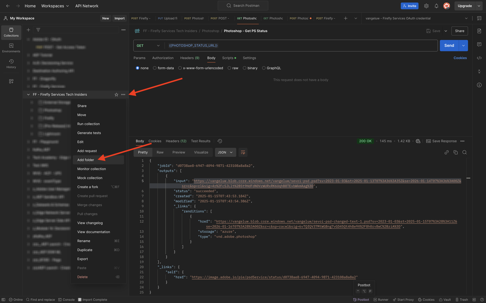

# 1.2.3 Automazione dei processi con Workfront Fusion

Il tuo scenario ora si presenta così.


## 1.2.3.1 Iterazione su più valori

Finora hai modificato il testo in un file Photoshop di un valore statico. Per ridimensionare e automatizzare i flussi di lavoro di creazione dei contenuti, è necessario scorrere un elenco di valori e inserirli in modo dinamico nel file Photoshop. Nei passaggi successivi, aggiungerai un messaggio per eseguire iterazioni sui valori nello scenario esistente.

Tra il nodo **Router** e il nodo **Testo modifica Photoshop**, fare clic sull&#39;icona **chiave inglese** e selezionare **Aggiungi modulo**.


Cercare `flow` e selezionare **Controllo flusso**.


Selezionare **Iteratore**.


Dovresti avere questo.


Anche se è possibile leggere file di input come i file CSV, per il momento devi utilizzare una versione di base di un file CSV definendo una stringa di testo e dividendo il file di testo.

Per trovare la funzione **split**, fai clic sull&#39;icona **T**, in cui sono visualizzate tutte le funzioni disponibili per manipolare i valori di testo. Fai clic sulla funzione **split** per visualizzarla.


La funzione split prevede una matrice di valori prima del punto e virgola e specifica il separatore dopo il punto e virgola. Per questo test, è necessario utilizzare un array semplice con 2 campi, **Acquista ora** e **Fai clic qui** e il separatore da utilizzare è **,**.

Immetti questo valore nel campo **Array** sostituendo la funzione **split** attualmente vuota: `{{split("Buy now, Click here "; ",")}}`. Fai clic su **OK**.


L’iteratore è ora configurato e, se esegui ora lo scenario, lo eseguirebbe due volte. Si è verificato comunque un problema, poiché si stanno utilizzando valori statici nel nodo **Testo di modifica Photoshop**. Fare clic su **Testo modifica Photoshop** per aggiungere alcune variabili anziché valori statici per i campi di input e output.


Nel **Contenuto richiesta**, verrà visualizzato il testo **Fare clic qui**. Questo testo deve essere sostituito dai valori provenienti dall’array.


Eliminare il testo **Fare clic qui** e sostituirlo selezionando la variabile **Value** dal nodo **Iterator**. In questo modo il testo sul pulsante nel documento Photoshop verrà aggiornato in modo dinamico.


È inoltre necessario aggiornare il nome del file utilizzato per scrivere il file nell’account di archiviazione Azure. Se il nome del file è statico, ogni nuova iterazione sovrascriverà semplicemente il file precedente e come tale, perderai i file personalizzati. Il nome del file statico corrente è **citisignal-fiber-changed-text.psd** ed è ora necessario aggiornarlo. Posizionare il cursore dietro la parola `text`.


Aggiungere un trattino `-`, quindi selezionare il valore **Posizione ordine bundle**. In questo modo, per la prima iterazione, Workfront Fusion aggiungerà `-1` al nome del file, per la seconda iterazione `-2` e così via. Fai clic su **OK**.


Salva lo scenario e fai clic su **Esegui una volta**.


Una volta eseguito lo scenario, torna ad Azure Storage Explorer e aggiorna la cartella. Dovresti quindi visualizzare i 2 file appena creati.


Scarica e apri ciascun file. Dovresti quindi vedere i vari testi sui pulsanti. Questo è il file `citisignal-fiber-changed-text-1.psd`.


Questo è il file `citisignal-fiber-changed-text-2.psd`.


## 1.2.3.2 Attiva lo scenario utilizzando un webhook

Finora lo scenario è stato eseguito manualmente per essere testato. Aggiorniamo ora lo scenario con un webhook, in modo che possa essere attivato da un ambiente esterno.

Fai clic sull&#39;icona **+**, cerca **webhook**, quindi seleziona **Webhook**.


Seleziona **WebHook personalizzato**.

Trascinare e connettere il nodo **Webhook personalizzato** in modo che si connetta al primo nodo dell&#39;area di lavoro, denominato **Inizializza costanti**.


Fai clic sul nodo **Webhook personalizzato**. Quindi fare clic su **Aggiungi**.


Imposta **Nome webhook** su `--aepUserLdap-- - Tutorial 1.2`.


Seleziona la casella di controllo per **Ottieni intestazioni richiesta**. Fai clic su **Salva**.


L’URL del webhook è ora disponibile. Copia l’URL.


Apri Postman e aggiungi una nuova cartella nella raccolta **FF - Firefly Services Tech Insiders**.



Denomina la cartella `--aepUserLdap-- - Workfront Fusion`.


Nella cartella appena creata, fai clic sui tre punti **...** e seleziona **Aggiungi richiesta**.


Imposta **Tipo di metodo** su **POST** e incolla l&#39;URL del webhook nella barra degli indirizzi.


È necessario inviare un corpo personalizzato, in modo che gli elementi della variabile possano essere forniti da un’origine esterna allo scenario Workfront Fusion. Vai a **Body** e seleziona **raw**.


Incolla il testo seguente nel corpo della richiesta. Fai clic su **Invia**.

```json
{
    "psdTemplate": "placeholder",
    "xlsFile": "placeholder"
}
```


Tornare a Workfront Fusion. Nel webhook personalizzato verrà visualizzato un messaggio con il seguente messaggio: **Determinato correttamente**.


Fare clic su **Salva** e quindi su **Esegui una volta**. Il tuo scenario sarà ora attivo ma non verrà eseguito finché non farai di nuovo clic su **Invia** in Postman.


Vai a Postman e fai di nuovo clic su **Invia**.


Lo scenario verrà quindi eseguito di nuovo e creerà i 2 file come in precedenza.


Modifica il nome della richiesta Postman in `POST - Send Request to Workfront Fusion Webhook`.


Ora devi iniziare a utilizzare la variabile **psdTemplate**. Invece di codificare la posizione del file di input nel nodo **Testo di modifica di Photoshop**, verrà ora utilizzata la variabile in ingresso della richiesta di Postman.

Apri il nodo **Testo modifica Photoshop** e passa a **Contenuto richiesta**. Selezionare il nome di file hardcoded **citisignal-fiber.psd** in **inputs** ed eliminarlo.


Selezionare la variabile **psdTemplate**. Fai clic su **OK** e quindi salva lo scenario.


Fai clic su **ON** per attivare lo scenario. Lo scenario verrà eseguito senza interruzioni.


Torna a Postman. Immetti il nome file `citisignal-fiber.psd` come valore per la variabile **psdTemplate** e fai di nuovo clic su **Invia** per eseguire di nuovo lo scenario.


Specificando il modello di PSD come variabile fornita da un sistema esterno, è stato creato uno scenario riutilizzabile.

Hai terminato questo esercizio.

Passaggio successivo: [Riepilogo e vantaggi](./summary.md)

[Torna al modulo 1.2](./automation.md)

[Torna a tutti i moduli](./../../../overview.md)
