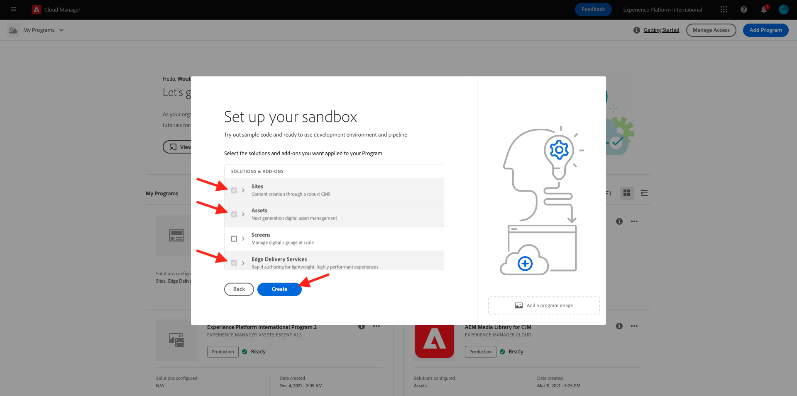
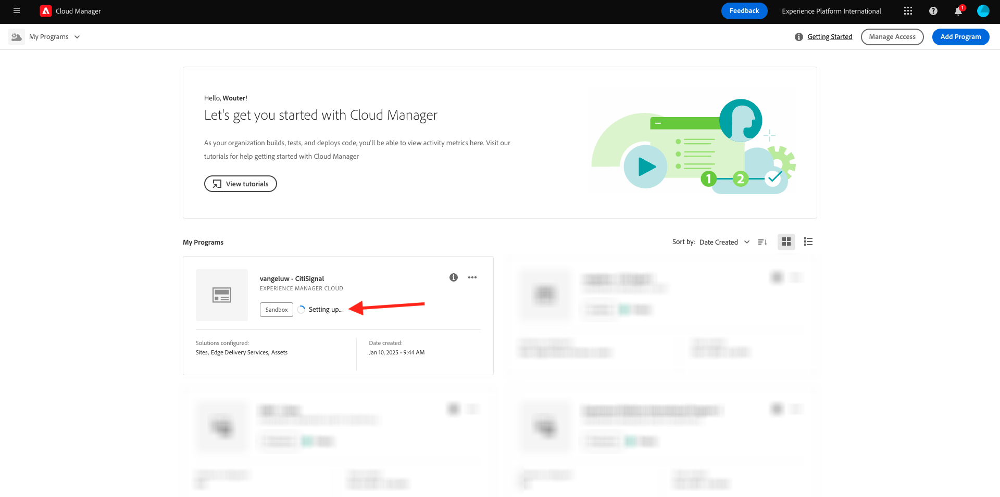
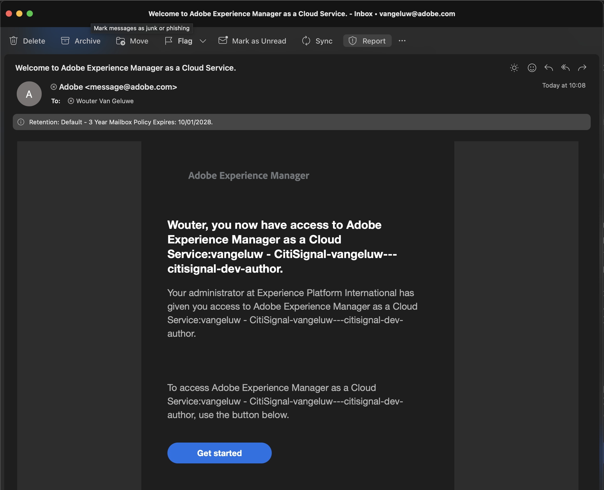

# 2.1.1 Creare un programma Cloud Manager

Vai a [https://my.cloudmanager.adobe.com](https://my.cloudmanager.adobe.com). L&#39;organizzazione da selezionare è `--aepImsOrgName--`. Poi vedrai qualcosa del genere. Fai clic su **Aggiungi programma**.

Per il **nome programma**, utilizzare `--aepUserLdap-- - CitiSignal`. Fai clic su **Continua**.

Accertati che siano selezionate le seguenti opzioni:

- Siti
- Risorse
- Edge Delivery Services

Fai clic su **Crea**.

La creazione degli ambienti richiede un po’ di tempo, 10-20 minuti.

Mentre attendi, puoi già iniziare con l&#39;esercizio [2.1.2 Crea il tuo sito Web basato su documenti](./ex2.md).

Una volta creati gli ambienti e pronti per l’uso, riceverai una conferma e-mail dopo la quale potrai tornare qui.

Dopo aver ricevuto la conferma e-mail, torna a [https://my.cloudmanager.adobe.com](https://my.cloudmanager.adobe.com). Lo stato del programma è cambiato in **Pronto**. Fai clic sul programma per aprirlo.

Osserva la scheda **Pipeline**. Fare clic sui tre punti **...** e quindi su **Esegui**.

Fare clic su **Esegui**.

Fare clic sui tre punti **...** nella scheda **Ambienti** e quindi su **Visualizza dettagli**.

Potrai quindi visualizzare i dettagli dell&#39;ambiente, incluso l&#39;URL dell&#39;ambiente **Author**, che ti serviranno nel prossimo esercizio.

Al termine dell’esecuzione della pipeline, puoi continuare con l’esercizio successivo.

Passaggio successivo: [2.1.2 Creare il sito Web basato su documenti](./ex2.md)

[Torna al modulo 2.1](./aemcs.md)

[Torna a tutti i moduli](./../../../overview.md)
