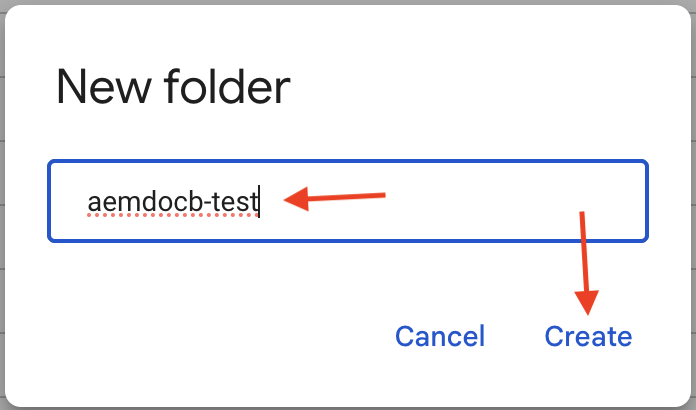
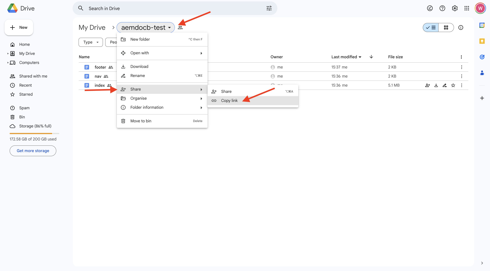
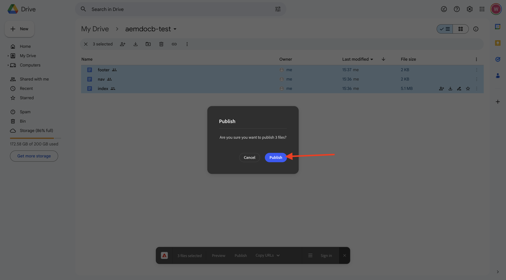

# 2.1.2 Creare un sito web basato su documenti

Nell&#39;attesa della creazione del programma Cloud Manager, si dispone di tempo sufficiente per impostare il primo sito Web di authoring basato su documenti. L&#39;esercizio seguente è basato sull&#39;[esercitazione per sviluppatori aem.live](https://www.aem.live/developer/tutorial){target="_blank"}. Per iniziare, segui la procedura riportata di seguito.

## 2.1.2.1 Configurare l&#39;unità Google

Vai a [https://drive.google.com](https://drive.google.com){target="_blank"}. Fare clic su **+ Nuovo** e quindi su **Nuova cartella**.

{zoomable="yes"}

Denomina la cartella `aemdocb-test`. Fai clic su **Crea**.

{zoomable="yes"}

Scarica il file [aemboilerplate.zip](./../../../assets/aem/aemboilerplate.zip){target="_blank"} ed estrailo dal computer.

{zoomable="yes"}

Nella cartella sono presenti 3 file. Copiare tali file nella nuova cartella di Google Drive.

{zoomable="yes"}

Ora devi convertire questi file in un file nativo di Google. Per eseguire questa operazione, aprire ogni file, quindi passare a **File** > **Salva come Google Docs**.

{zoomable="yes"}

È necessario eseguire questa operazione per tutti e 3 i file e in seguito verranno visualizzati 6 file nella cartella Google Drive.

{zoomable="yes"}

A questo punto si trova nella cartella.

{zoomable="yes"}

Per il corretto funzionamento della demo di authoring basata su documenti, è ora necessario condividere la cartella di Google Drive con l&#39;indirizzo e-mail **helix@adobe.com**. Fai clic sul nome della cartella, fai clic su **Condividi** e quindi di nuovo su **Condividi**.

{zoomable="yes"}

Immetti l&#39;indirizzo e-mail **helix@adobe.com** e fai clic su **Invia**.

{zoomable="yes"}

Copiare e annotare quindi l&#39;URL della cartella di Google Drive in quanto sarà necessario nell&#39;esercizio successivo. Fai clic sul nome della cartella, fai clic su **Condividi** e quindi su **Copia collegamento**.

{zoomable="yes"}

`https://drive.google.com/drive/folders/1PNIOFeptIfszSebawT-Y_bwB4_anQWk5?usp=drive_link`

Rimuovere il parametro della stringa di query `?usp=drive_link` in modo che l&#39;URL sia simile al seguente:

`https://drive.google.com/drive/folders/1PNIOFeptIfszSebawT-Y_bwB4_anQWk5`

## 2.1.2.2 Configurare l’archivio GitHub

Vai a [https://github.com](https://github.com){target="_blank"}. Fai clic su **Accedi**.

{zoomable="yes"}

Immettere le credenziali. Fai clic su **Accedi**.

{zoomable="yes"}

Una volta effettuato l’accesso, verrà visualizzata la dashboard di GitHub.

{zoomable="yes"}

Vai a [https://github.com/adobe/aem-boilerplate](https://github.com/adobe/aem-boilerplate){target="_blank"}. Poi vedrai questo. Fare clic su **Usa questo modello** e quindi su **Crea nuovo repository**.

{zoomable="yes"}

Per il **nome archivio**, utilizzare `aemdocb-test`. Imposta la visibilità su **Privato**. Fare clic su **Crea repository**.

{zoomable="yes"}

Dopo un paio di secondi, potrai creare l’archivio.

{zoomable="yes"}

Quindi, vai a [https://github.com/apps/aem-code-sync](https://github.com/apps/aem-code-sync){target="_blank"}. Fare clic su **Configura**.

{zoomable="yes"}

Fai clic sul tuo account GitHub.

{zoomable="yes"}

Fai clic su **Seleziona solo archivi** e quindi aggiungi l&#39;archivio appena creato. Fare clic su **Installa**.

{zoomable="yes"}

Riceverai questa conferma.

{zoomable="yes"}

## 2.1.2.3 Aggiornare il file fstab.yaml

Nel repository GitHub, fare clic per aprire il file `fstab.yaml`.

{zoomable="yes"}

Fai clic sull&#39;icona **modifica**.

{zoomable="yes"}

È ora necessario aggiornare il valore per il campo **url** nella riga 2.

{zoomable="yes"}

Devi sostituire il valore corrente con l’URL del tuo ambiente AEM CS specifico, in combinazione con le impostazioni del tuo archivio GitHub.

Valore corrente dell&#39;URL: `https://drive.google.com/drive/u/0/folders/1MGzOt7ubUh3gu7zhZIPb7R7dyRzG371j`.

Sostituire il valore con l&#39;URL copiato dalla cartella dell&#39;unità Google, `https://drive.google.com/drive/folders/1PNIOFeptIfszSebawT-Y_bwB4_anQWk5`. Fare clic su **Commit changes...**.

{zoomable="yes"}

Fai clic su **Commit changes**.

{zoomable="yes"}

## 2.1.2.4 Installare l’estensione AEM Sidekick

Vai a [https://chromewebstore.google.com/detail/aem-sidekick/ccfggkjabjahcjoljmgmklhpaccedipo](https://chromewebstore.google.com/detail/aem-sidekick/ccfggkjabjahcjoljmgmklhpaccedipo){target="_blank"}. Fai clic su **Aggiungi a Chrome**.

{zoomable="yes"}

Fissa l&#39;estensione **AEM Sidekick**.

{zoomable="yes"}

## 2.1.2.5 Anteprima e Publish del sito web basato su documenti

Tornare alla cartella dell&#39;unità Google. Nella barra delle applicazioni fare clic sull&#39;estensione **AEM Sidekick**. Nella cartella viene quindi visualizzato un popup della barra AEM Sidekick.

{zoomable="yes"}

Selezionare i 3 file nella cartella Google Drive. Fare clic su **Anteprima**.

{zoomable="yes"}

Fai di nuovo clic su **Anteprima**.

{zoomable="yes"}

Fate clic su per chiudere la finestra di dialogo a comparsa verde.

{zoomable="yes"}

Selezionare di nuovo i 3 file nella cartella Google Drive. Fare clic su **Publish**.

{zoomable="yes"}

Fare clic su **Publish**.

{zoomable="yes"}

Fai clic su per chiudere nuovamente la finestra di dialogo verde. Ora, seleziona il file **index**, fai clic su **Copia URL**, quindi fai clic su **Copia URL live**.

{zoomable="yes"}

L&#39;URL copiato sarà simile al seguente: `https://main--aemdocb-test--woutervangeluwe.aem.live/`.

Nell’URL precedente:

- **main** fa riferimento al ramo nell&#39;archivio GitHub
- **aemdocb-test** fa riferimento al nome dell&#39;archivio GitHub
- **woutervangeluwe** fa riferimento al nome dell&#39;account utente GitHub
- **.live** fa riferimento all&#39;ambiente live dell&#39;istanza AEM
- È possibile sostituire **.live** con **.page** per aprire l&#39;ambiente di anteprima dell&#39;istanza AEM

Apri una nuova finestra del browser e passa all’URL.

{zoomable="yes"}

## 2.1.2.6 Apportare una modifica e pubblicarla

Torna all&#39;unità Google e apri il filtro **index** in Google.

{zoomable="yes"}

Sostituire il testo **Test** con qualsiasi altro testo scelto. Fare clic su **Anteprima**.

{zoomable="yes"}

Viene quindi aperta la versione di anteprima del sito Web. Rivedi le modifiche e fai clic su **Publish**.

{zoomable="yes"}

Viene quindi visualizzata la versione live del sito Web.

{zoomable="yes"}

L’esercizio precedente era un buon modo per iniziare e sperimentare autonomamente l’authoring basato su documenti. Ora puoi continuare con il prossimo esercizio, in cui configurerai il tuo sito web demo utilizzando CitiSignal come brand demo.

Passaggio successivo: [2.1.3 Configurare l&#39;ambiente AEM CS](./ex3.md){target="_blank"}

[Torna al modulo 2.1](./aemcs.md){target="_blank"}

[Torna a tutti i moduli](./../../../overview.md){target="_blank"}
