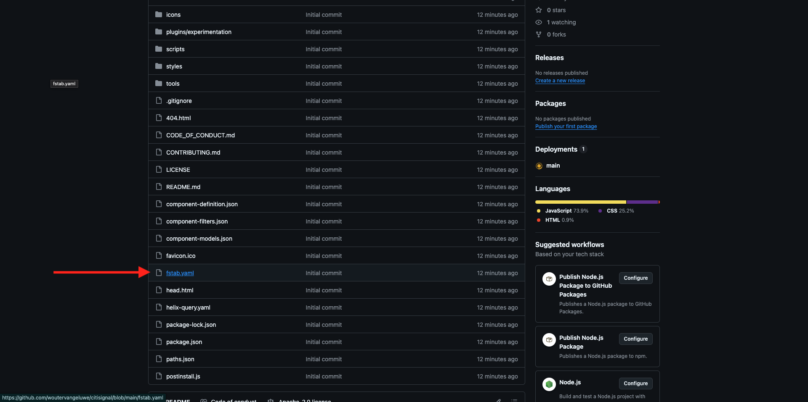
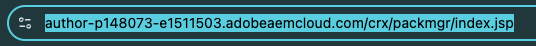
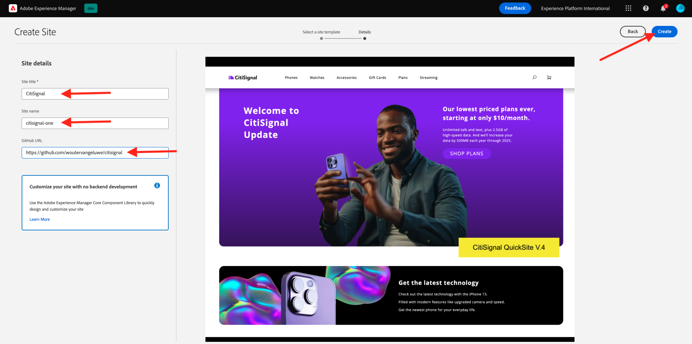
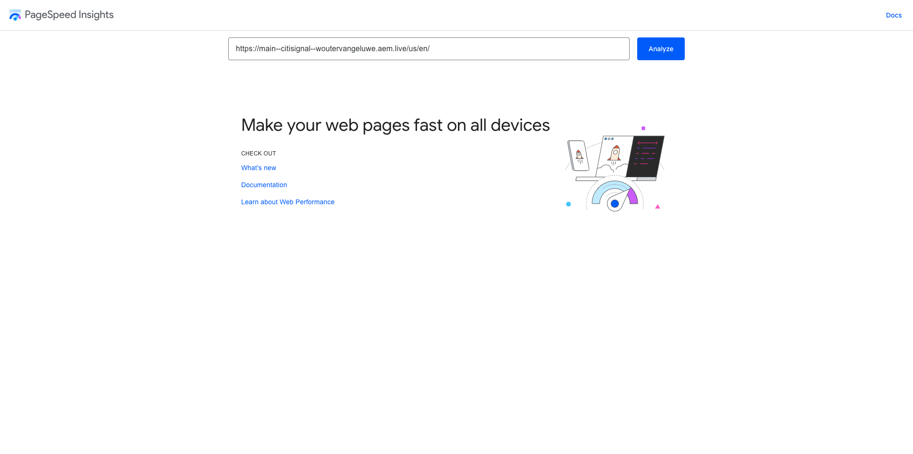
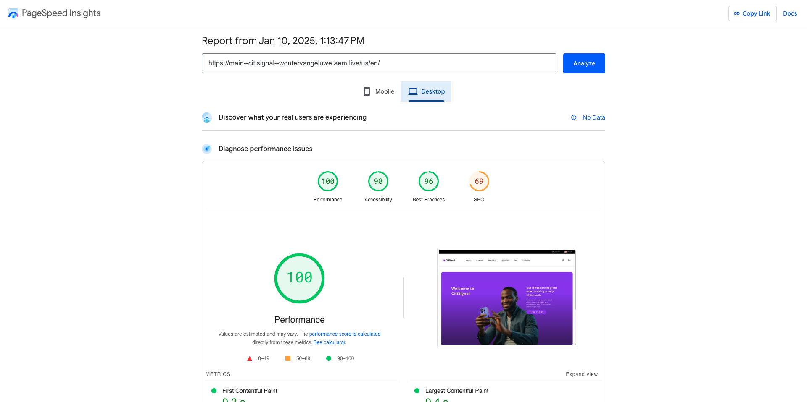

# 2.1.2 Configurare l’ambiente AEM CS

## 2.1.2.1 Configurare l’archivio GitHub

Vai a [https://github.com](https://github.com). Fai clic su **Accedi**.

Immettere le credenziali. Fai clic su **Accedi**.

Una volta effettuato l’accesso, verrà visualizzata la dashboard di GitHub.

Vai a [https://github.com/AdobeDevXSC/citisignal-one](https://github.com/AdobeDevXSC/citisignal-one). Poi vedrai questo. Fare clic su **Usa questo modello** e quindi su **Crea nuovo repository**.

Prima del **nome archivio**, utilizzare `citisignal`. Imposta la visibilità su **Privato**. Fare clic su **Crea repository**.

Dopo un paio di secondi, potrai creare l’archivio.

Quindi, vai a [https://github.com/apps/aem-code-sync](https://github.com/apps/aem-code-sync). Fare clic su **Configura**.

Fai clic sul tuo account GitHub.

Fai clic su **Seleziona solo archivi** e quindi aggiungi l&#39;archivio appena creato. Fare clic su **Installa**.

Riceverai questa conferma.

## 2.1.2.2 Aggiornare il file fstab.yaml

Nel repository GitHub, fare clic per aprire il file `fstab.yaml`.

Fai clic sull&#39;icona **modifica**.

È ora necessario aggiornare il valore per il campo **url** nella riga 4.

Devi sostituire il valore corrente con l’URL del tuo ambiente AEM CS specifico, in combinazione con le impostazioni del tuo archivio GitHub.

Valore corrente dell&#39;URL: `https://author-p131639-e1282833.adobeaemcloud.com/bin/franklin.delivery/adobedevxsc/citisignal-one/main`.

È necessario aggiornare 3 parti dell’URL

`https://XXX/bin/franklin.delivery/YYY/ZZZ/main`

XXX deve essere sostituito dall’URL dell’ambiente di authoring di AEM CS.

YYY deve essere sostituito dall’account utente GitHub.

ZZZ deve essere sostituito dal nome dell’archivio GitHub utilizzato nell’esercizio precedente.

Per trovare l&#39;URL dell&#39;ambiente di authoring di AEM CS, vai a [https://my.cloudmanager.adobe.com](https://my.cloudmanager.adobe.com). Fai clic sul **Programma** per aprirlo.

Fare clic sui tre punti **...** nella scheda **Ambienti** e quindi su **Visualizza dettagli**.

Visualizzerai quindi i dettagli dell&#39;ambiente, incluso l&#39;URL dell&#39;ambiente **Author**. Copia l’URL.

XXX = `author-p148073-e1511503.adobeaemcloud.com`

Per il nome dell’account utente GitHub, puoi trovarlo facilmente nell’URL del browser. In questo esempio, il nome dell&#39;account utente è `woutervangeluwe`.

AAAA = `woutervangeluwe`

Per il nome dell’archivio GitHub, puoi trovarlo anche nella finestra del browser che hai aperto in GitHub. In questo caso, il nome dell&#39;archivio è `citisignal`.

ZZZ = `citisignal`

Questi 3 valori combinati generano questo nuovo URL che deve essere configurato nel file `fstab.yaml`.

`https://author-p148073-e1511503.adobeaemcloud.com/bin/franklin.delivery/woutervangeluwe/citisignal/main`

Fare clic su **Commit changes...**.

Fai clic su **Commit changes**.

Il file `fstab.yaml` è stato aggiornato.

## 2.1.2.3 Caricare risorse CitiSignal

Vai a [https://my.cloudmanager.adobe.com](https://my.cloudmanager.adobe.com). Fai clic sul **Programma** per aprirlo.

Quindi, fai clic sull’URL dell’ambiente di authoring.

Fai clic su **Accedi con Adobe**.

Viene quindi visualizzato l’ambiente di authoring.

L&#39;URL sarà simile al seguente: `https://author-p148073-e1511503.adobeaemcloud.com/ui#/aem/aem/start.html?appId=aemshell`

È ora necessario accedere all&#39;ambiente **Gestione pacchetti CRX** dell&#39;AEM. Per eseguire questa operazione, rimuovere `ui#/aem/aem/start.html?appId=aemshell` dall&#39;URL e sostituirlo con `crx/packmgr`, il che significa che l&#39;URL dovrebbe avere un aspetto simile al seguente:
`https://author-p148073-e1511503.adobeaemcloud.com/crx/packmgr`.
Premi **Invio** per caricare l&#39;ambiente di gestione dei pacchetti

Fare clic su **Carica pacchetto**.

Fai clic su **Sfoglia** per individuare il pacchetto da caricare.

Il pacchetto da caricare si chiama **citisignal-assets.zip** e può essere scaricato qui: [https://tech-insiders.s3.us-west-2.amazonaws.com/one-adobe/citisignal-assets.zip](https://tech-insiders.s3.us-west-2.amazonaws.com/one-adobe/citisignal-assets.zip).

Selezionare il pacchetto e fare clic su **Apri**.

Fare clic su **OK**.

Il pacchetto verrà quindi caricato.

Fai clic su **Installa** nel pacchetto appena caricato.

Fare clic su **Installa**.

Dopo un paio di minuti, il pacchetto verrà installato.

È ora possibile chiudere questa finestra.

## 2.1.2.4 Risorse Publish CitiSignal

Vai a [https://my.cloudmanager.adobe.com](https://my.cloudmanager.adobe.com). Fai clic sul **Programma** per aprirlo.

Quindi, fai clic sull’URL dell’ambiente di authoring.

Fai clic su **Accedi con Adobe**.

Viene quindi visualizzato l’ambiente di authoring. Fare clic su **Sites**.

Fare clic su **File**.

Fare clic per selezionare la cartella **CitiSignal** e quindi fare clic su **Gestisci pubblicazione**.

Fai clic su **Avanti**.

Fare clic su **Publish**.

Le risorse sono state pubblicate.

## 2.1.2.5 Creare il sito web CitiSignal

Vai a [https://my.cloudmanager.adobe.com](https://my.cloudmanager.adobe.com). Fai clic sul **Programma** per aprirlo.

Quindi, fai clic sull’URL dell’ambiente di authoring.

Fai clic su **Accedi con Adobe**.

Viene quindi visualizzato l’ambiente di authoring. Fare clic su **Sites**.

Fare clic su **Crea** e quindi su **Sito da modello**.

Fai clic su **Importa**.

Ora devi importare un modello preconfigurato per il sito. Puoi scaricare il modello [qui](./../../../assets/aem/citisignal-edge-delivery-services-template-0.0.4.zip). Salva il file sul desktop.

Selezionare il file `citisignal-edge-delivery-services-template-0.0.4.zip` e fare clic su **Apri**.

Poi vedrai questo. Fai clic per selezionare il modello appena caricato, quindi fai clic su **Avanti**.

Ora devi compilare alcuni dettagli.

- Titolo sito: utilizza **CitiSignal**
- Nome sito: utilizzare **citisignal-one**
- URL GitHub: copia l’URL dell’archivio GitHub utilizzato in precedenza

Allora avrai questo. Fai clic su **Crea**.

Creazione del sito in corso. L&#39;operazione potrebbe richiedere alcuni minuti. Fare clic su **OK**.

Dopo alcuni minuti, aggiorna lo schermo e vedrai il tuo nuovo sito Web CitiSignal creato.

## 2.1.2.6 Sito web Publish CitiSignal

Fare clic sulla casella di controllo davanti a **CitiSignal**. Quindi fare clic su **Gestisci pubblicazione**.

Fai clic su **Avanti**.

Fare clic su **Includi impostazioni figlio**.

Fare clic per selezionare la casella di controllo **Includi elementi figlio** e quindi fare clic per deselezionare le altre caselle di controllo. Fai clic su **OK**.

Fare clic su **Publish**.

Allora verrai rimandato qui. Passa a **CitiSignal** > **us** > **en**. Fare clic sulla casella di controllo davanti a **index** e quindi su **Modifica**.

Il sito Web verrà quindi aperto in **Universal Editor**.

Ora potrai accedere al tuo sito web da `main--citisignal--XXX.aem.page/us/en` e/o `main--citisignal--XXX.aem.live/us/en`, dopo aver sostituito XXX con il tuo account utente GitHub, che in questo esempio è `woutervangeluwe`.

In questo esempio, l’URL completo diventa:
`https://main--citisignal--woutervangeluwe.aem.page/us/en` e/o `https://main--citisignal--woutervangeluwe.aem.live/us/en`.

Potrebbero essere necessari alcuni minuti prima che tutte le risorse vengano visualizzate correttamente, in quanto devono essere pubblicate prima.

A questo punto viene visualizzato quanto segue:

Dopo un paio di minuti, tutte le risorse verranno caricate correttamente.

## 2.1.2.7 Prestazioni della pagina di prova

Vai a [https://pagespeed.web.dev/](https://pagespeed.web.dev/). Immetti l&#39;URL e fai clic su **Analizza**.

Vedrai quindi che il tuo sito web, sia nella visualizzazione per dispositivi mobili che in quella desktop, ottiene un punteggio alto:

**Dispositivi mobili**:

**Desktop**:

Passaggio successivo: [2.1.3 Configura un blocco personalizzato](./ex3.md)

[Torna al modulo 2.1](./aemcs.md)

[Torna a tutti i moduli](./../../../overview.md)
