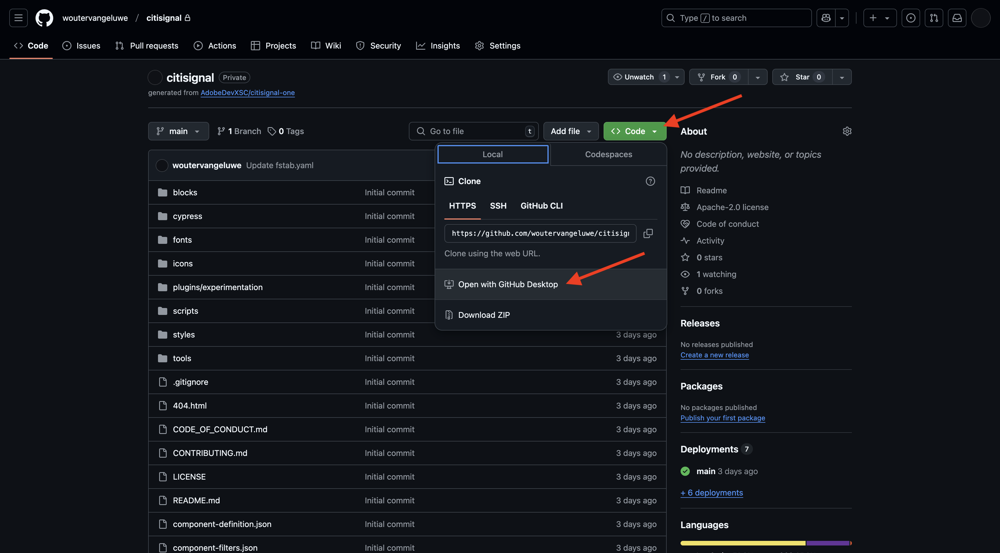

# 2.1.4 Sviluppare un blocco personalizzato

## 2.1.4.1 Configurare l’ambiente di sviluppo locale

Vai a [https://desktop.github.com/download/](https://desktop.github.com/download/), scarica e installa **Github Desktop**.

Una volta installato Github Desktop, vai all’archivio GitHub creato nell’esercizio precedente. Fare clic su **&lt;> Codice** e quindi su **Apri con GitHub Desktop**.

L’archivio GitHub verrà quindi aperto in GitHub Desktop. Puoi cambiare il **percorso locale**. Fare clic su **Clona**.

Un fo locale

[Torna al modulo 2.1](./aemcs.md)

[Torna a tutti i moduli](./../../../overview.md)
