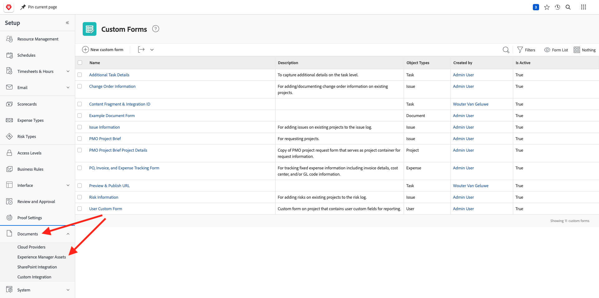

# 2.2.1 Guida introduttiva a Workfront

Accedi ad Adobe Workfront da [https://experienceplatform.my.workfront.com/](https://experienceplatform.my.workfront.com/){target="_blank"}.

Poi vedete questo.

## 2.2.1.1 Configurare l’integrazione di AEM Assets

Fai clic sull&#39;icona dei 9 punti **hamburger**, quindi seleziona **Configurazione**.

Nel menu a sinistra, scorri verso il basso fino a **Documenti** e quindi fai clic su **Experience Manager Assets**.

Fare clic su **+ Aggiungi integrazione Experience Manager**.

Per il nome dell&#39;integrazione, utilizzare `--aepUserLdap-- - Citi Signal AEM`.

Apri il menu a discesa **Archivio Experience Manager** e seleziona l&#39;istanza di AEM CS, che deve essere denominata `--aepUserLdap-- - Citi Signal`.

In **Metadati**, configura la seguente mappatura:

| Campo Workfront | Campo Experience Manager Assets |
| --------------- | ------------------------------ | 
| **Documento** > **Nome** | **wm:nomeDocumento** |
| **Progetto** > **Descrizione** | **wm:projectDescription** |
| **Attività** > **Nome** | **wm:taskName** |
| **Attività** > **Descrizione** | **wm:taskDescription** |

Abilitare il parametro per **sincronizzare i metadati dell&#39;oggetto**.

Fai clic su **Salva**.

L’integrazione da Workfront ad AEM Assets CS è ora configurata.

## 2.2.1.2 Configurare l’integrazione dei metadati con AEM Assets

Successivamente, devi configurare AEM Assets in modo che i campi di metadati della risorsa in Workfront vengano condivisi con l’AEM.

Per eseguire questa operazione, vai a [https://experience.adobe.com/](https://experience.adobe.com/). Fare clic su **Experience Manager Assets**.

Fai clic per selezionare l&#39;ambiente AEM Assets, che deve essere denominato `--aepUserLdap-- - Citi Signal dev`.

Dovresti vedere questo. Nel menu a sinistra, vai a **Assets** e fai clic su **Crea cartella**.

Assegna un nome alla cartella `--aepUserLdap-- - Workfront Assets` e fai clic su **Crea**.

Quindi, vai a **Forms metadati** nel menu a sinistra e quindi fai clic su **Crea**.

Utilizza il nome `--aepUserLdap-- - Metadata Form` e fai clic su **Crea**.

Aggiungi al modulo 3 nuovi campi **Testo a riga singola** e seleziona il primo campo. Quindi, fai clic sull&#39;icona **Schema** accanto al campo **Proprietà metadati**.

Nel campo di ricerca, immettere `wm:project` e selezionare il campo **Descrizione progetto**. Fai clic su **Seleziona**.

Cambia l&#39;etichetta del campo in **Descrizione progetto**.

Quindi, seleziona il secondo campo **Testo a riga singola** e fai di nuovo clic sull&#39;icona **Schema** accanto al campo **Proprietà metadati**.

Poi vedrai di nuovo questo popup. Nel campo di ricerca, immettere `wm:project` e selezionare il campo **ID progetto**. Fai clic su **Seleziona**.

Cambia l&#39;etichetta del campo in **ID progetto**.

Seleziona il terzo campo **Testo a riga singola** e fai di nuovo clic sull&#39;icona **Schema** accanto al campo **Proprietà metadati**.

Poi vedrai di nuovo questo popup. Nel campo di ricerca, immettere `wm:project` e selezionare il campo **Nome progetto**. Fai clic su **Seleziona**.

Cambia l&#39;etichetta del campo in **Nome progetto**. Fai clic su **Salva**.

Cambia il **nome scheda** nel modulo in `--aepUserLdap-- - Workfront Metadata`. Fai clic su **Salva** e **Chiudi**.

Il **modulo metadati** è ora configurato.

Successivamente, devi assegnare il modulo metadati alla cartella creata in precedenza. Seleziona la casella di controllo per il modulo metadati e fai clic su **Assegna a cartelle**.

Selezionare la cartella, che deve essere denominata `--aepUserLdap-- - Workfront Assets`. Fai clic su **Assegna**.

Il modulo metadati è ora assegnato alla cartella correttamente.

## 2.2.1.2 Configurare l’integrazione di AEM Sites

>[!NOTE]
>
>Questo plug-in è attualmente in modalità **Accesso anticipato** e non è ancora disponibile a livello generale.
>
>Questo plug-in potrebbe essere già installato nell’istanza di Workfront utilizzata. Se è già installato, puoi consultare le istruzioni riportate di seguito, ma non è necessario apportare alcuna modifica alla configurazione.

Vai a [https://experience.adobe.com/#/@experienceplatform/aem/extension-manager/universal-editor](https://experience.adobe.com/#/@experienceplatform/aem/extension-manager/universal-editor){target="_blank"}.

Verificare che l&#39;opzione **Attiva** per questo plug-in sia impostata su **Attiva**. Quindi, fai clic sull&#39;icona **ingranaggio**.

Verrà visualizzata una finestra a comparsa **Configurazione estensione**. Configura i campi seguenti per utilizzare questo plug-in.

| Chiave | Valore |
| --------------- | ------------------------------ | 
| **`IMS_ENV`** | **PROD** |
| **`WORKFRONT_INSTANCE_URL`** | **https://experienceplatform.my.workfront.com** |
| **`SHOW_CUSTOM_FORMS`** | **&#39;{&quot;previewUrl&quot;: true, &quot;publishUrl&quot;: true}&#39;** |

Fai clic su **Salva**.

Torna all&#39;interfaccia utente di Workfront e fai clic sull&#39;icona dei 9 puntini **hamburger**. Selezionare **Configurazione**.

Nel menu a sinistra, vai a **Forms personalizzato** e seleziona **Modulo**. Fare clic su **+ Nuovo modulo personalizzato**.

Seleziona **Attività** e fai clic su **Continua**.

Verrà quindi visualizzato un modulo personalizzato vuoto. Immettere il nome del modulo `Content Fragment & Integration ID`.

Trascina un nuovo campo **Testo su riga singola** nell&#39;area di lavoro.

Configura il nuovo campo come segue:

- **Etichetta**: **Frammento di contenuto**
- **Nome**: **`aem_workfront_integration_content_fragment`**

Aggiungi un nuovo campo **Testo a riga singola** nell&#39;area di lavoro e configura il nuovo campo come segue:

- **Etichetta**: **ID integrazione**
- **Nome**: **`aem_workfront_integration_id`**

Fare clic su **Applica**.

Ora devi configurare un secondo modulo personalizzato. Fare clic su **+ Nuovo modulo personalizzato**.

Seleziona **Attività** e fai clic su **Continua**.

Verrà quindi visualizzato un modulo personalizzato vuoto. Immettere il nome del modulo `Preview & Publish URL`.

Trascina un nuovo campo **Testo su riga singola** nell&#39;area di lavoro.

Configura il nuovo campo come segue:

- **Etichetta**: **URL anteprima**
- **Nome**: **`aem_workfront_integration_preview_url`**

Aggiungi un nuovo campo **Testo a riga singola** nell&#39;area di lavoro e configura il nuovo campo come segue:

- **Etichetta**: **URL Publish**
- **Nome**: **`aem_workfront_integration_publish_url`**

Fare clic su **Applica**.

Dovresti quindi avere a disposizione 2 moduli personalizzati.

Passaggio successivo: [2.2.2 Verifica con Workfront](./ex2.md){target="_blank"}

[Torna al modulo 2.2](./workfront.md){target="_blank"}

[Torna a tutti i moduli](./../../../overview.md){target="_blank"}
