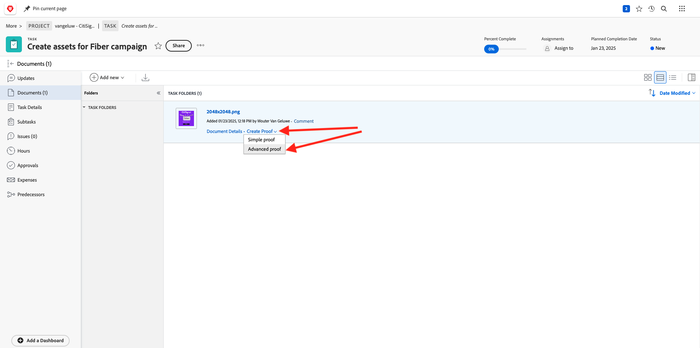
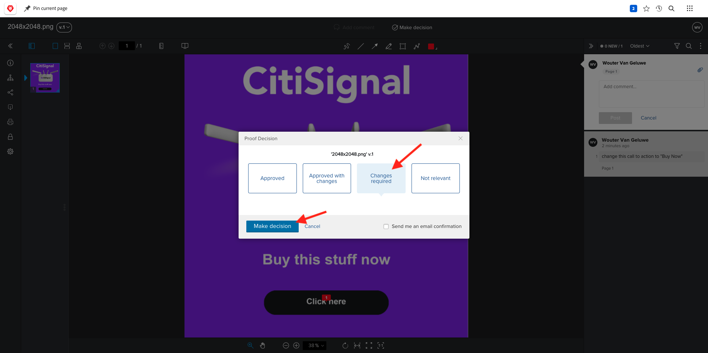
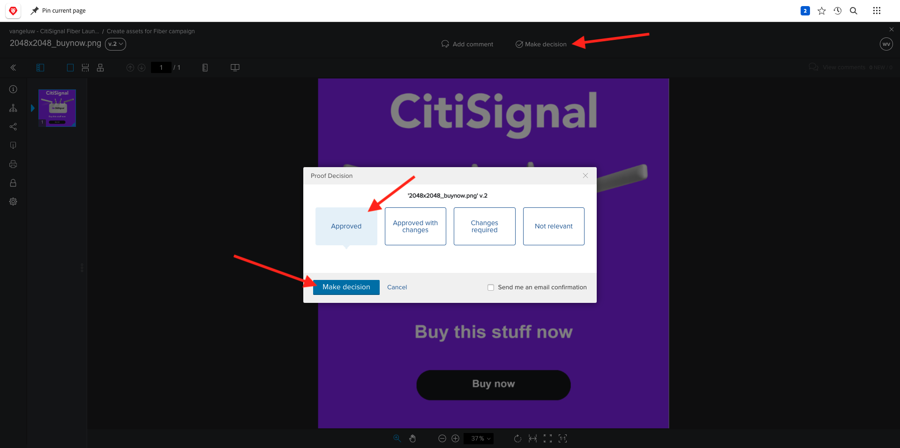

# 2.2.2 Strumenti di correzione con Workfront

## 2.2.2.1 Creare un nuovo flusso di approvazione

Vai a [https://experienceplatform.my.workfront.com/](https://experienceplatform.my.workfront.com/){target="_blank"}.

Fai clic sull&#39;icona dei 9 punti **hamburger** e seleziona **Strumenti di correzione**.

Vai a **Flussi di lavoro**, fai clic su **+ Nuovo**, quindi seleziona **Nuovo modello**.

Imposta **Nome modello** su `--aepUserLdap-- - Approval Workflow` e imposta il **Proprietario modello** su se stesso.

Scorri verso il basso e, in **Stadi** > **Stadio 1**, aggiungi **Wouter Van Geluwe** con il **Ruolo** di **Revisore e Approvatore**.

Fai clic su **Crea**.

Il flusso di lavoro di approvazione di base è ora pronto per essere utilizzato.

## 2.2.2.2 Creare un nuovo progetto

Dalla home page di Workfront, fare clic su **Nuovo** nella scheda **Progetti**. Seleziona **Progetto vuoto**.

Dovresti vedere questo. Cambia il nome in `--aepUserLdap-- - CitiSignal Fiber Launch`.

Il progetto è stato creato.

## 2.2.2.3 Creare una nuova attività

Immetti questo nome per l&#39;attività: **Crea risorse per la campagna fiber**. Fai clic su **Crea attività**.

Dovresti vedere questo.

## 2.2.2.4 Aggiungere un nuovo documento all’attività per tutta la durata del flusso di approvazione

Fare clic su **+ Aggiungi nuovo** e quindi selezionare **Documento**.

Scarica [questo file](./images/2048x2048.png) sul desktop.

{width="50px" align="left"}

Seleziona il file **2048x2048.png** e fai clic su **Apri**.

Dovresti avere questo. Fai clic su **Crea bozza** e scegli **Advanced Proof**.

Nella finestra **nuova bozza** selezionare il modello di workflow creato in precedenza, che deve essere denominato `--aepuserLdap-- - Approval Workflow`. Fare clic su **Crea bozza**.

Tornerai al tuo compito. Fai clic sul pulsante **Assegna a** e seleziona **Assegna a me**.

Fai clic su **Salva**.

Fai clic su **Lavoraci**.

Fai clic su **Apri bozza**

È ora possibile rivedere la bozza. Selezionare **Aggiungi commento** per aggiungere un commento che richiede la modifica del documento.

Inserisci il commento e fai clic su **Post**. Fai clic su **Chiudi**.

Successivamente, devi cambiare il tuo ruolo da **Revisore** a **Revisore e Approvatore**. Per eseguire questa operazione, torna all&#39;attività e fai clic su **Flusso di lavoro di verifica**.

Cambia il tuo ruolo da **Revisore** a **Revisore e Approvatore**.

Torna all’Attività e apri nuovamente la bozza. Viene visualizzato un nuovo pulsante, **Decidi**. Fai clic su di esso.

Seleziona **Modifiche richieste** e fai clic su **prendi decisione**.

Allora dovresti tornare qui. Ora devi caricare una seconda immagine che tenga conto dei commenti forniti.

Scarica [questo file](./images/2048x2048_buynow.png) sul desktop.

{width="50px" align="left"}

Nella visualizzazione Attività, selezionare il file di immagine precedente che non è stato approvato. Quindi fare clic su **+ Aggiungi nuovo**, selezionare **Versione** e quindi selezionare **Documento**.

Seleziona il file **2048x2048_buynow.png** e fai clic su **Apri**.

Dovresti avere questo. Fai clic su **Crea bozza**, quindi seleziona di nuovo **Advanced Proof**.

Poi vedrai questo. Il modello di **flusso di lavoro** è ora preselezionato in quanto Workfront presuppone che il flusso di lavoro di approvazione precedente sia ancora valido. Fare clic su **Crea bozza**.

Seleziona **Apri bozza**.

Ora puoi vedere due versioni del file una accanto all’altra.

Fai clic su **Prendi una decisione**, seleziona **Approvato**, quindi fai di nuovo clic su **Prendi una decisione**.

Chiudi l’anteprima della bozza.

Tornerai quindi nella vista Attività, con una risorsa approvata. Questa risorsa ora deve essere condivisa con AEM Assets.

Fai clic sull&#39;icona **Condividi freccia** e seleziona l&#39;integrazione AEM Assets, che deve essere denominata `--aepUserLdap-- - Citi Signal AEM`.

Fare doppio clic sulla cartella creata in precedenza, che deve essere denominata `--aepUserLdap-- - Workfront Assets`.

Fare clic su **Seleziona cartella**.

Dopo 1-2 minuti, il documento verrà pubblicato in AEM Assets. Accanto al nome del documento verrà visualizzata l&#39;icona AEM.

Fare clic su **Apri riepilogo**.

Vai a **Metadati**. Dovresti visualizzare:

Vai a **Panoramica** e fai clic su **+ Aggiungi** per aggiungere una descrizione.

Immetti la descrizione. Le impostazioni della bozza e del documento sono completate.

## 2.2.2.5 Visualizza il file in AEM Assets

Vai alla cartella in AEM Assets, denominata `--aepUserLdap - Workfront Assets`.

Fai clic sui 3 punti sotto l&#39;immagine, quindi seleziona **Dettagli**.

Viene quindi visualizzato il Modulo metadati creato in precedenza, con i valori che sono stati compilati automaticamente dall’integrazione tra Workfront e AEM Assets.

[Torna al modulo 2.2](./workfront.md){target="_blank"}

[Torna a tutti i moduli](./../../../overview.md){target="_blank"}
