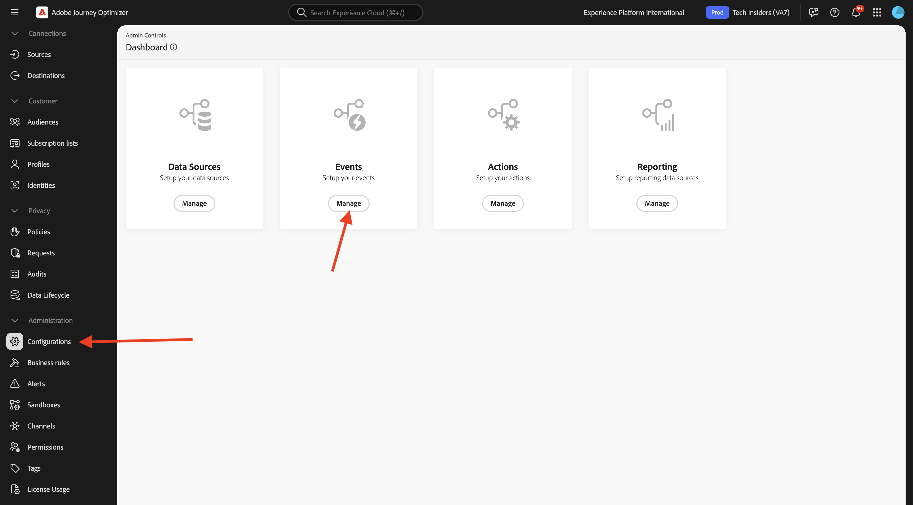
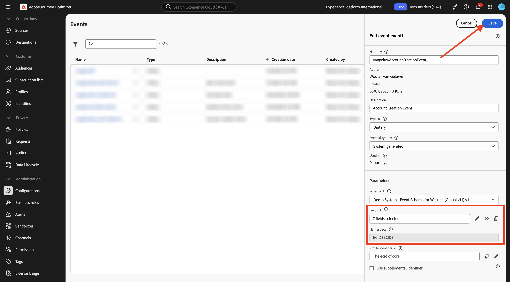

# 3.1.1 Creare l’evento

Accedi a Adobe Journey Optimizer da [Adobe Experience Cloud](https://experience.adobe.com). Fare clic su **Journey Optimizer**.

Verrai reindirizzato alla visualizzazione **Home** in Journey Optimizer. Innanzitutto, assicurati di utilizzare la sandbox corretta. La sandbox da utilizzare si chiama `--aepSandboxName--`.

Nel menu a sinistra, scorri verso il basso e fai clic su **Configurazioni**. Fare clic sul pulsante **Gestisci** in **Eventi**.

Viene quindi visualizzata una panoramica di tutti gli eventi disponibili. Fai clic su **Crea evento** per iniziare a creare il tuo evento.

Viene visualizzata una nuova finestra di evento vuota.

Prima di tutto, assegna all&#39;evento un nome simile al seguente: `--aepUserLdap--AccountCreationEvent`.
Imposta la descrizione su `Account Creation Event`, assicurati che il **Tipo** sia impostato su **Unitario** e per la selezione del **Tipo ID evento**, seleziona **Generato dal sistema**.

Di seguito è riportata la selezione dello schema. Utilizzare lo schema `Demo System - Event Schema for Website (Global v1.1) v.1`.

Dopo aver selezionato lo schema, nella sezione **Payload** verranno selezionati diversi campi. Passa il cursore del mouse sulla sezione **Payload** per visualizzare la finestra a comparsa delle 3 icone. Fai clic sull&#39;icona **Modifica**.

Verrà visualizzata una finestra popup **Campi** in cui è necessario selezionare alcuni dei campi necessari per personalizzare l&#39;e-mail.  In seguito sceglieremo altri attributi di profilo, utilizzando i dati già presenti in Adobe Experience Platform.

Nell&#39;oggetto `--aepTenantId--.demoEnvironment`, assicurarsi di selezionare i campi **brandLogo** e **brandName**.

Nell&#39;oggetto `--aepTenantId--.identification.core`, assicurarsi di selezionare il campo **email**. Fai clic su **Ok** per salvare le modifiche.

Dovresti vedere questo. Imposta **Spazio dei nomi** su **ECID (ECID)**. Fai clic su **Salva**.

L’evento è ora configurato e salvato.

Fai di nuovo clic sull&#39;evento per aprire di nuovo la schermata **Modifica evento**. Passa di nuovo il puntatore del mouse sul campo **Payload** per visualizzare nuovamente le 3 icone. Fai clic sull&#39;icona **Visualizza payload**.

Ora vedrai un esempio del payload previsto.

Il tuo evento ha un ID evento di orchestrazione univoco, che puoi trovare scorrendo verso il basso in tale payload fino a visualizzare `_experience.campaign.orchestration.eventID`.

L’ID evento è ciò che deve essere inviato a Adobe Experience Platform per attivare il percorso che verrà creato successivamente. Ricorda questo eventID, in quanto sarà necessario in uno degli esercizi successivi.
`"eventID": "5ae9b8d3f68eb555502b0c07d03ef71780600c4bd0373a4065c692ae0bfbd34d"`

Fare clic su **Ok**.

Fare clic su **Annulla**.

Hai terminato questo esercizio.

## Passaggi successivi

Vai a [3.1.2 Crea frammenti da utilizzare nel messaggio](./ex2.md){target="_blank"}

Torna a [Adobe Journey Optimizer: orchestrazione](./journey-orchestration-create-account.md){target="_blank"}

Torna a [Tutti i moduli](./../../../../overview.md){target="_blank"}
