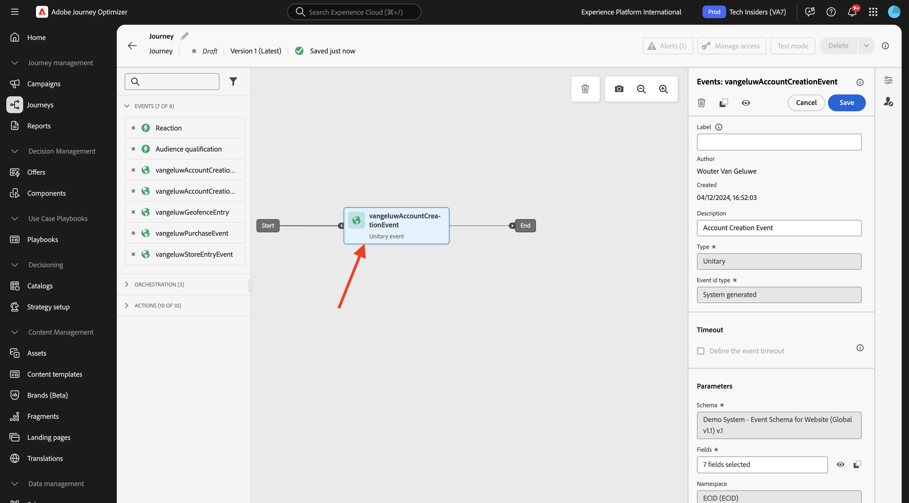
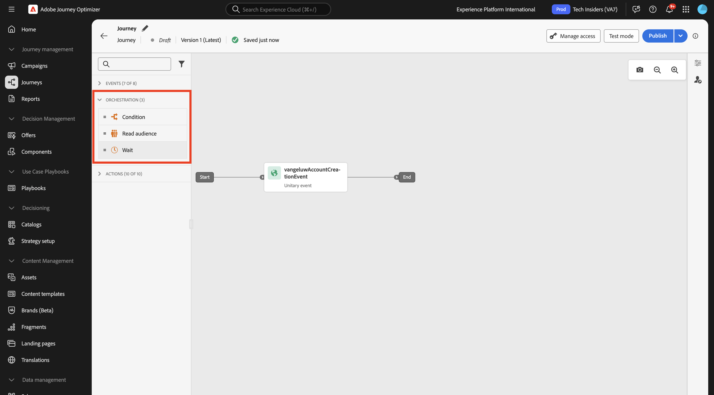
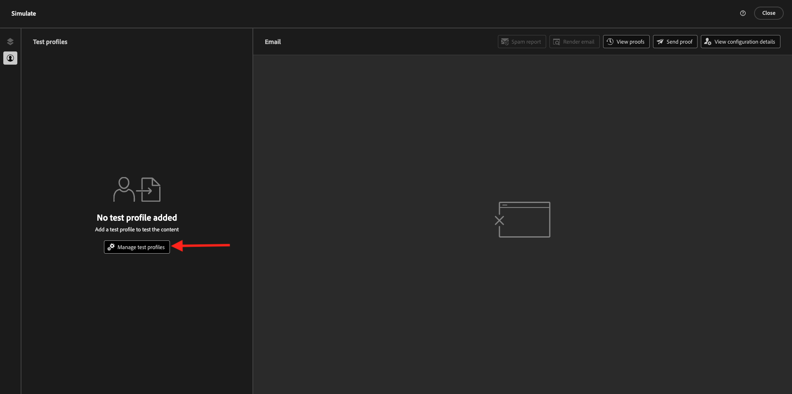

# 3.1.3 Creare il percorso e il messaggio e-mail

In questo esercizio configurerai il percorso e il messaggio da attivare quando qualcuno crea un account sul sito web demo.

Accedi a Adobe Journey Optimizer da [Adobe Experience Cloud](https://experience.adobe.com). Fare clic su **Journey Optimizer**.


Verrai reindirizzato alla visualizzazione **Home** in Journey Optimizer. Innanzitutto, assicurati di utilizzare la sandbox corretta. La sandbox da utilizzare si chiama `--aepSandboxName--`.


## 3.1.3.1 Crea il tuo Percorso

Nel menu a sinistra, fai clic su **Percorsi**. Fare clic su **Crea Percorso** per creare un nuovo percorso.


Viene quindi visualizzata una schermata di percorso vuota.


Nell&#39;esercizio precedente è stato creato un nuovo **evento**. L&#39;hai denominato così `--aepUserLdap--AccountCreationEvent`. Questo è stato il risultato della creazione dell’evento:


Ora devi prendere questo evento come inizio di questo Percorso. Per farlo, vai sul lato sinistro della schermata e cerca l’evento nell’elenco degli eventi.


Seleziona l’evento, trascinalo sull’area di lavoro del percorso. Il percorso si presenta ora come segue:



Come secondo passaggio del percorso, devi aggiungere un breve passaggio **Attendi**. Vai sul lato sinistro della schermata alla sezione **Orchestration** per trovarlo. Utilizzerai gli attributi del profilo e dovrai accertarti che siano popolati in Real-time Customer Profile.



Il tuo percorso ora si presenta così. Sul lato destro dello schermo è necessario configurare il tempo di attesa. Imposta su 1 minuto. In questo modo gli attributi del profilo saranno disponibili dopo l’attivazione dell’evento. Fai clic su **Salva** per salvare le modifiche.


Come terzo passaggio del percorso, devi aggiungere un&#39;azione **E-mail**. Vai sul lato sinistro della schermata a **Azioni**, seleziona l&#39;azione **E-mail**, quindi trascinala sul secondo nodo del percorso. Ora vedete questo.


Imposta **Categoria** su **Marketing** e seleziona una configurazione e-mail che ti consenta di inviare messaggi e-mail. In questo caso, la configurazione e-mail da selezionare è **Email-TI**.


## 3.1.3.2 Crea il tuo messaggio

Per creare il messaggio, fai clic su **Modifica contenuto**.


Ora vedete questo.


Fai clic sull&#39;icona **Apri finestra di personalizzazione**.


Scrivere il testo `Hi `. Successivamente devi inserire il token di personalizzazione per il campo **First name**, memorizzato in `profile.person.name.firstName`. Nel menu a sinistra, individua il campo **Persona > Nome completo > Nome** e fai clic sull&#39;icona **+**. Il token di personalizzazione verrà quindi visualizzato nel campo di testo.


Quindi, aggiungere il testo **. Grazie per la registrazione.**. Fai clic su **Salva**.


Ora puoi iniziare a configurare il corpo dell’e-mail. Fai clic su **Modifica corpo dell&#39;e-mail**.


Prima di iniziare a creare il contenuto del messaggio effettivo, è consigliabile considerare il contenuto del messaggio. Alcuni contenuti del messaggio sono specifici per il messaggio stesso, ma altre parti sono componenti standard che probabilmente saranno gli stessi per ogni e-mail che invierai ai clienti.

Nell’esercizio precedente, hai già creato questi componenti standard come Frammenti in Journey Optimizer, a cui ora puoi fare riferimento in questo messaggio e in tutti gli altri messaggi futuri che creerai.

Nella schermata successiva ti verranno richiesti 3 metodi diversi per fornire il contenuto dell’e-mail:

- **Progettazione da zero**: inizia con un&#39;area di lavoro vuota e utilizza l&#39;editor di WYSIWYG per trascinare i componenti struttura e contenuto per creare visivamente il contenuto dell&#39;e-mail.
- **Crea un codice personale**: crea un modello di e-mail personalizzato codificandolo con HTML
- **Importa HTML**: importa un modello HTML esistente che potrai modificare.

Fare clic su **Progetta da zero**.


Nel menu a sinistra trovi i componenti struttura che puoi utilizzare per definire la struttura dell’e-mail (righe e colonne).


Troverai anche **Frammenti** nel menu a sinistra, dove vedrai i frammenti creati in precedenza.


Prima di poter aggiungere l’intestazione e il piè di pagina all’area di lavoro, è necessario aggiungere 2 strutture all’e-mail. Fai clic sull&#39;icona **+** nel menu a sinistra e trascina 2 componenti **1:1 column** nell&#39;area di lavoro.


Nel menu a sinistra, torna a **Frammenti**. Trascina il frammento di intestazione nel primo componente e il frammento di piè di pagina nel secondo componente. Poi vedrai questo.


Fai clic sull&#39;icona **+** nel menu a sinistra e trascina altri 2 componenti **1:1 column** nell&#39;area di lavoro, tra l&#39;intestazione e il piè di pagina.


Trascina e rilascia un componente **Immagine** nel primo componente **1:1 colonna**. Fare clic su **Sfoglia**.


Nella cartella **citi-signal-images**. Selezionare l&#39;immagine **`welcome_email_image.png`** e fare clic su **Seleziona**.


A questo punto si otterrà:


Quindi, vai a **Sommario** e trascina un componente **Testo** nel componente struttura nella quarta riga.


Selezionare il testo predefinito **Digitare qui il testo.** come si farebbe con qualsiasi editor di testo. Scrivi invece **Benvenuto nella famiglia**. Nella barra degli strumenti, fai clic sull&#39;icona **Aggiungi personalizzazione**.


Successivamente, devi portare il token di personalizzazione **First name** memorizzato in `profile.person.name.firstName`. Nel menu, trovare l&#39;elemento **Person**, espandere l&#39;elemento **Full Name** e quindi fare clic sull&#39;icona **+** per aggiungere il campo First Name all&#39;editor di espressioni.

Fai clic su **Salva**.


Ora noterai come il campo di personalizzazione è stato aggiunto al testo.


Nello stesso campo di testo, premere **Invio** due volte per aggiungere due righe e copiare e incollare il testo seguente:

```
Welcome aboard! We're thrilled to have you join the CitiSignal family. 
As a valued member of our community, you're now poised to experience top-notch telecommunications services that cater to your every need.

At CitiSignal, we understand that staying connected is more than just a convenience - it's a necessity. Whether you're browsing the web, streaming your favourite content, or keeping in touch with loved ones, we're here to ensure you have the best tools and resources at your fingertips.
```


Imposta l&#39;allineamento del testo **Allineamento testo** da centrare e puoi modificare l&#39;aspetto del messaggio in base alle tue esigenze. Al termine, fai clic su **Salva**.


Il controllo finale da eseguire per verificare che l&#39;e-mail sia pronta è l&#39;anteprima, fare clic sul pulsante **Simula contenuto**.


Prima di poter simulare il messaggio e-mail, devi aggiungere un profilo di test. Fare clic su **Gestisci profili di test**.



Seleziona lo spazio dei nomi **email** facendo clic sull&#39;icona accanto al campo **Enter identity namespace** (Inserisci spazio dei nomi delle identità).

Nell&#39;elenco degli spazi dei nomi di identità, seleziona lo spazio dei nomi **E-mail**. Nel campo **Valore identità** immettere l&#39;indirizzo di posta elettronica di un profilo precedente utilizzato in un esercizio precedente e già archiviato in Adobe Experience Platform. Fare clic su **Aggiungi profilo**. Torna alla schermata precedente.


Visualizzerai quindi il tuo messaggio e-mail, ora simulato per questo profilo cliente. Ora puoi convalidare la personalizzazione nell’oggetto e nel corpo e inviare un’e-mail di bozza, se necessario.

Fai clic su **Chiudi** per chiudere l&#39;anteprima.


Fai clic su **Salva** per salvare il messaggio e tornare alla dashboard dei messaggi facendo clic sulla **freccia** accanto al testo dell&#39;oggetto nell&#39;angolo in alto a sinistra.


Fai clic sulla **freccia** per tornare al percorso.


## 3.1.3.3 Pubblica il tuo percorso

Fai clic su **Salva**.


È comunque necessario assegnare un nome al percorso. Per farlo, fai clic sull&#39;icona **Proprietà** in alto a destra nella schermata.


È quindi possibile immettere qui il nome del percorso. Utilizzare `--aepUserLdap-- - Registration Journey`. Fai clic su **Salva**.


Per pubblicare il percorso, fai clic su **Pubblica**.


Fai di nuovo clic su **Pubblica**.


Dopo alcuni minuti, lo stato del percorso passerà a **Live** e vedrai una dashboard in tempo reale delle prestazioni del percorso.


Hai terminato questo esercizio.

## Passaggi successivi

Vai a [3.1.4 Aggiorna la proprietà di raccolta dati e verifica il percorso](./ex4.md){target="_blank"}

Torna a [Adobe Journey Optimizer: orchestrazione](./journey-orchestration-create-account.md){target="_blank"}

Torna a [Tutti i moduli](./../../../../overview.md){target="_blank"}
