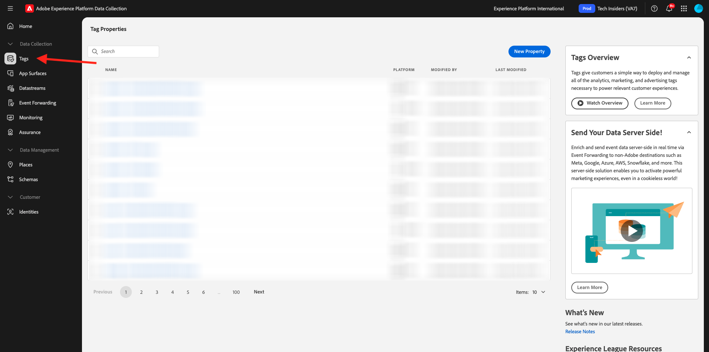

# 3.1.3 Aggiorna la proprietà Data Collection e verifica il percorso

## 3.1.3.1 Aggiornare la proprietà Data Collection

Vai a [Raccolta dati Adobe Experience Platform](https://experience.adobe.com/launch/) e seleziona **Tag**.

In **Guida introduttiva**, Demo System ha creato due proprietà client: una per il sito Web e una per l&#39;app mobile. Trovarli cercando `--aepUserLdap--` nella casella **[!UICONTROL Cerca]**. Fare clic per aprire la proprietà **Web**.

Poi vedrai questo.

Nel menu a sinistra, vai a **Regole** e cerca la regola **Crea account**. Fai clic sulla regola **Crea account** per aprirla.

Vedrai quindi i dettagli di questa regola. Fare clic per aprire l&#39;azione **Invia evento di registrazione all&#39;evento esperienza**.

Quando questa azione viene attivata, vedrai che viene utilizzato un elemento dati specifico per definire la struttura dati XDM. È necessario aggiornare l&#39;elemento dati e definire l&#39;**ID evento** dell&#39;evento configurato in [Esercizio 3.1.1](./ex1.md).

Ora devi andare ad aggiornare l&#39;elemento dati **XDM - Evento registrazione**. A tale scopo, passare a **Elementi dati**. Cerca **XDM - Registration** e fai clic per aprire l&#39;elemento dati.

A questo punto viene visualizzato quanto segue:

Passare al campo `_experience.campaign.orchestration.eventID`. Rimuovi il valore corrente e incolla il tuo eventID lì.

Come promemoria, l&#39;ID evento si trova in Adobe Journey Optimizer in **Configurazioni > Eventi** e troverai l&#39;ID evento nel payload di esempio del tuo evento, che si presenta così: `"eventID": "5ae9b8d3f68eb555502b0c07d03ef71780600c4bd0373a4065c692ae0bfbd34d"`.

Dopo aver incollato l’ID evento, lo schermo dovrebbe essere simile al seguente. Fare clic su **Salva** o **Salva nella libreria**.

Infine, devi pubblicare le modifiche. Vai a **Flusso di pubblicazione** nel menu a sinistra e fai clic per aprire la libreria **Principale**.

Fai clic su **Aggiungi tutte le risorse modificate**, quindi fai clic su **Salva e genera in sviluppo**.

La libreria verrà quindi aggiornata e dopo 1-2 minuti puoi procedere e verificare la configurazione.

## 3.1.3.2 Test del Percorso

Vai a [https://dsn.adobe.com](https://dsn.adobe.com). Dopo aver effettuato l’accesso con il tuo Adobe ID, visualizzerai questo. Fai clic sui tre punti **...** del progetto del sito Web, quindi fai clic su **Esegui** per aprirlo.

Poi vedrai il tuo sito web demo aperto. Seleziona l’URL e copialo negli Appunti.

Apri una nuova finestra del browser in incognito.

Incolla l’URL del sito web demo, che hai copiato nel passaggio precedente. Ti verrà quindi chiesto di effettuare l’accesso con il tuo Adobe ID.

Seleziona il tipo di account e completa la procedura di accesso.

Vedrai quindi il tuo sito web caricato in una finestra del browser in incognito. Per ogni esercizio, dovrai utilizzare una nuova finestra del browser in incognito per caricare l’URL del sito web demo.

Fai clic sull’icona del logo Adobe nell’angolo in alto a sinistra dello schermo per aprire il Visualizzatore profili.

Dai un&#39;occhiata al pannello Visualizzatore profili e al Profilo cliente in tempo reale con **Experience Cloud ID** come identificatore primario per questo cliente attualmente sconosciuto. Fai clic su **Accedi**.

Fare clic su **CREA UN ACCOUNT**.

Compila i tuoi dettagli e fai clic su **Registra** dopo di che sarai reindirizzato alla pagina precedente.

Apri il pannello Visualizzatore profilo e passa a Profilo cliente in tempo reale. Nel pannello Visualizzatore profili dovresti visualizzare tutti i dati personali, come gli identificatori e-mail e telefonici appena aggiunti.

1 minuto dopo aver creato l’account, riceverai l’e-mail di creazione dell’account da Adobe Journey Optimizer.

Vedrai anche l’entrata nel percorso e l’avanzamento nel percorso sulla dashboard del percorso in Journey Optimizer.

## Passaggi successivi

Vai a [Riepilogo e vantaggi](./summary.md){target="_blank"}

Torna a [Adobe Journey Optimizer: orchestrazione](./journey-orchestration-create-account.md){target="_blank"}

Torna a [Tutti i moduli](./../../../../overview.md){target="_blank"}
