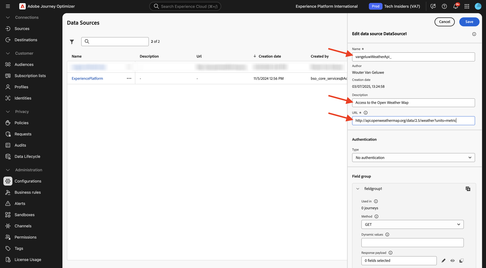

# 3.2.2 Definire una sorgente di dati esterna

In questo esercizio creerai un’origine dati esterna personalizzata utilizzando Adobe Journey Optimizer.

Accedi a Adobe Journey Optimizer da [Adobe Experience Cloud](https://experience.adobe.com). Fare clic su **Journey Optimizer**.


Verrai reindirizzato alla visualizzazione **Home** in Journey Optimizer. Innanzitutto, assicurati di utilizzare la sandbox corretta. La sandbox da utilizzare si chiama `--aepSandboxName--`. Ti troverai quindi nella **Home** della tua sandbox `--aepSandboxName--`.


Nel menu a sinistra, scorri verso il basso e fai clic su **Configurazioni**. Fare clic sul pulsante **Gestisci** in **Origini dati**.


Verrà quindi visualizzato l&#39;elenco **Origini dati**.
Fai clic su **Crea Source dati** per iniziare ad aggiungere la tua origine dati.


Verrà visualizzata una finestra a comparsa dell&#39;origine dati vuota.


Prima di iniziare la configurazione, è necessario un account con il servizio **Apri mappa meteo**. Per creare l’account e ottenere la chiave API, segui la procedura riportata di seguito.

Vai a [https://openweathermap.org/](https://openweathermap.org/). Nella home page fare clic su **Accedi**.


Fai clic su **Crea un account**.


Compila i dettagli. Fare clic su **Crea account**.


Verrai quindi reindirizzato alla pagina del tuo account.


Nel menu, fai clic su **Chiavi API** per recuperare la tua chiave API, che dovrai impostare l&#39;origine dati esterna personalizzata.


Una chiave **API** si presenta così: `b2c4c36b6bb59c3458d6686b05311dc3`.

Puoi trovare la **documentazione API** per il **meteo attuale** [qui](https://openweathermap.org/current).

Per questo caso d&#39;uso, implementerai la connessione con Open Weather Map in base alla città in cui si trova il cliente, utilizzando la **richiesta API integrata per nome città**.


Torna a **Adobe Journey Optimizer**, al popup **External Data Source** vuoto.


Come nome per l&#39;origine dati, utilizzare `--aepUserLdap--WeatherApi`.

Imposta descrizione su: `Access to the Open Weather Map`.

L&#39;URL per l&#39;API Open Weather Map è: **http://api.openweathermap.org/data/2.5/weather?units=metric**



Quindi, seleziona l’Autenticazione da utilizzare.

Utilizza queste variabili:

| Campo | Valore |
|:-----------------------:| :-----------------------|
| Tipo | **Chiave API** |
| Nome | **APPID** |
| Valore | **la tua chiave API** |
| Posizione | **Parametro query** |


Infine, devi definire un **GruppoCampi**, che è sostanzialmente la richiesta che invierai all&#39;API Meteo. Nel nostro caso, vogliamo usare il nome della Città per richiedere il Tempo Attuale per quella Città.


In base alla documentazione dell&#39;API meteo, è necessario inviare un parametro `q=City`.


Per corrispondere alla richiesta API prevista, configura il FieldGroup come segue:

>[!IMPORTANT]
>
>Il nome del gruppo di campi deve essere univoco. Utilizzare questa convenzione di denominazione: `--aepUserLdap--WeatherByCity`


Per il payload di risposta, è necessario incollare un esempio della risposta che verrà inviata dall’API meteo.

La risposta JSON API prevista è disponibile nella pagina della documentazione API [qui](https://openweathermap.org/current), nell&#39;oggetto **JSON**.


Oppure puoi copiare la risposta JSON da qui:

```json
{
   "coord": {
      "lon": 7.367,
      "lat": 45.133
   },
   "weather": [
      {
         "id": 501,
         "main": "Rain",
         "description": "moderate rain",
         "icon": "10d"
      }
   ],
   "base": "stations",
   "main": {
      "temp": 284.2,
      "feels_like": 282.93,
      "temp_min": 283.06,
      "temp_max": 286.82,
      "pressure": 1021,
      "humidity": 60,
      "sea_level": 1021,
      "grnd_level": 910
   },
   "visibility": 10000,
   "wind": {
      "speed": 4.09,
      "deg": 121,
      "gust": 3.47
   },
   "rain": {
      "1h": 2.73
   },
   "clouds": {
      "all": 83
   },
   "dt": 1726660758,
   "sys": {
      "type": 1,
      "id": 6736,
      "country": "IT",
      "sunrise": 1726636384,
      "sunset": 1726680975
   },
   "timezone": 7200,
   "id": 3165523,
   "name": "Province of Turin",
   "cod": 200
}    
```

Copia la risposta JSON di cui sopra negli Appunti, quindi vai alla schermata di configurazione dell’origine dati personalizzata.

Fai clic sull&#39;icona **Modifica payload**.


Viene visualizzata una finestra a comparsa in cui è necessario incollare la risposta JSON precedente.


Incolla la risposta JSON, dopo di che visualizzerai questo. Fai clic su **Salva**.


La configurazione dell’origine dati personalizzata è stata completata. Scorri verso l&#39;alto e fai clic su **Salva**.


L&#39;origine dati è stata creata correttamente e fa parte dell&#39;elenco **Origini dati**.


## Passaggi successivi

Vai a [3.2.3 Definisci un&#39;azione personalizzata](./ex3.md){target="_blank"}

Torna a [Adobe Journey Optimizer: origini dati esterne e azioni personalizzate](journey-orchestration-external-weather-api-sms.md){target="_blank"}

Torna a [Tutti i moduli](./../../../../overview.md){target="_blank"}
