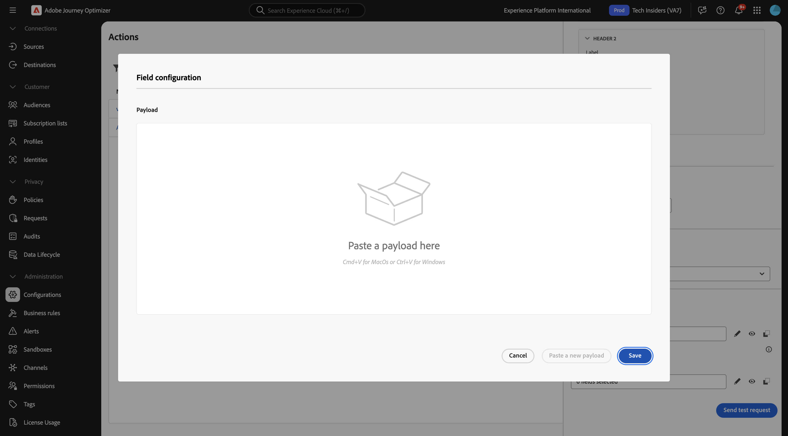
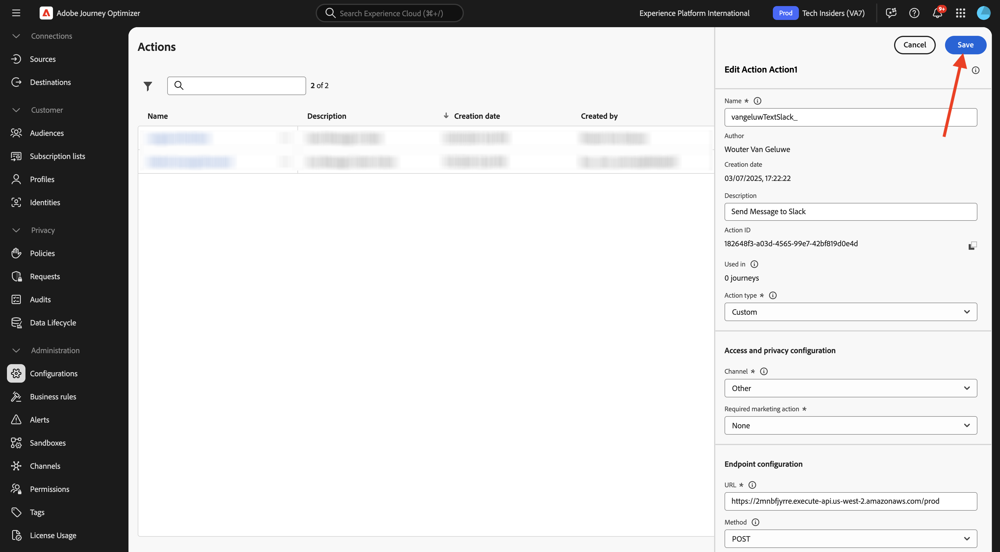

# 3.2.3 Definire un&#39;azione personalizzata

In questo esercizio creerai un’azione personalizzata per inviare un messaggio a un canale Slack.

Accedi a Adobe Journey Optimizer da [Adobe Experience Cloud](https://experience.adobe.com). Fare clic su **Journey Optimizer**.


Verrai reindirizzato alla visualizzazione **Home** in Journey Optimizer. Innanzitutto, assicurati di utilizzare la sandbox corretta. La sandbox da utilizzare si chiama `--aepSandboxName--`. Ti troverai quindi nella **Home** della tua sandbox `--aepSandboxName--`.


Ora utilizzerai un canale Slack esistente e invierai messaggi a tale canale Slack. Slack dispone di un’API di facile utilizzo e utilizzerai Adobe Journey Optimizer per attivarne l’API.


Nel menu a sinistra, scorri verso il basso e fai clic su **Configurazioni**. Fare clic sul pulsante **Gestisci** in **Azioni**.


Verrà quindi visualizzato l&#39;elenco **Azioni**. Fai clic su **Crea azione**.


Viene visualizzata una finestra a comparsa Azione vuota.


Come nome dell&#39;azione, utilizzare `--aepUserLdap--TextSlack`.

Imposta descrizione su: `Send Message to Slack`.

Per la **configurazione URL**, utilizzare:

- URL: `https://2mnbfjyrre.execute-api.us-west-2.amazonaws.com/prod`
- Metodo: **POST**

>[!NOTE]
>
>L’URL riportato sopra fa riferimento a una funzione AWS Lambda che inoltra la richiesta al canale Slack come indicato sopra. Questa operazione viene eseguita per proteggere l’accesso a un canale Slack di proprietà di Adobe. Se disponi di un tuo canale Slack, devi creare un&#39;app Slack tramite [https://api.slack.com/](https://api.slack.com/), quindi devi creare un webhook in ingresso nell&#39;app Slack e quindi sostituire l&#39;URL precedente con l&#39;URL del webhook in ingresso.


Non è necessario modificare i campi intestazione.


**Autenticazione** deve essere impostato su **Nessuna autenticazione**.


In **Payload**, è necessario definire quali campi devono essere inviati a Slack. Logicamente, vuoi che Adobe Journey Optimizer e Adobe Experience Platform siano il cervello della personalizzazione, quindi il testo da inviare a Slack deve essere definito da Adobe Journey Optimizer e quindi inviato a Slack per l’esecuzione.

Per **Richiesta**, fai clic sull&#39;icona **Modifica payload**.


Viene quindi visualizzata una finestra popup vuota.



Copiare il testo seguente e incollarlo nella finestra popup vuota.

```json
{
 "text": {
  "toBeMapped": true,
  "dataType": "string",
  "label": "textToSlack"
 }
}
```

A questo punto viene visualizzato quanto segue:


Scorri verso l&#39;alto e fai clic su **Salva** un&#39;altra volta per salvare l&#39;azione.



L&#39;azione personalizzata fa ora parte dell&#39;elenco **Azioni**.


Hai definito eventi, un’origine dati esterna e azioni. Ora consolidiamo tutto questo in un percorso.

## Passaggi successivi

Vai a [3.2.4 Creare il percorso e i messaggi](./ex4.md){target="_blank"}

Torna a [Adobe Journey Optimizer: origini dati esterne e azioni personalizzate](journey-orchestration-external-weather-api-sms.md){target="_blank"}

Torna a [Tutti i moduli](./../../../../overview.md){target="_blank"}
