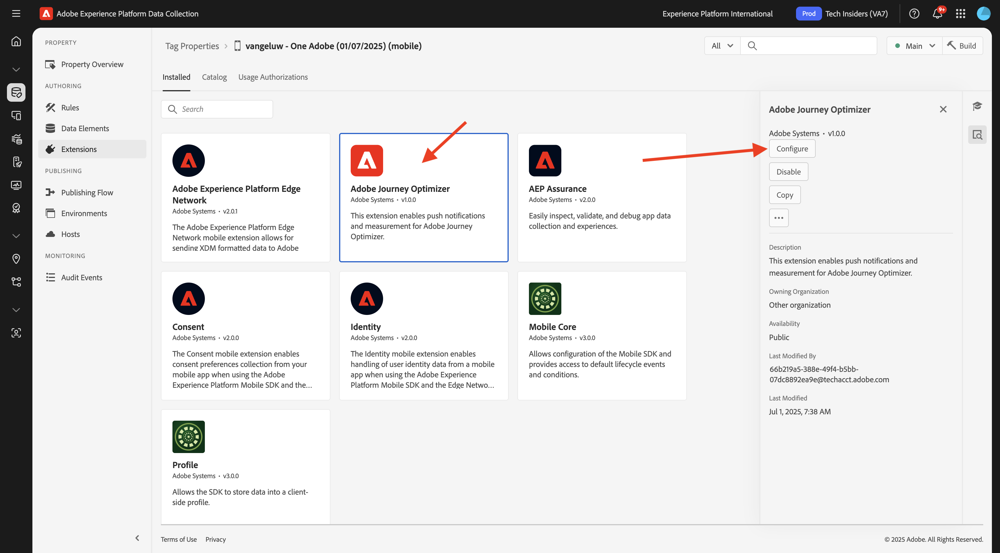
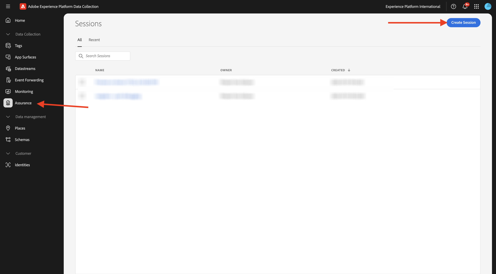
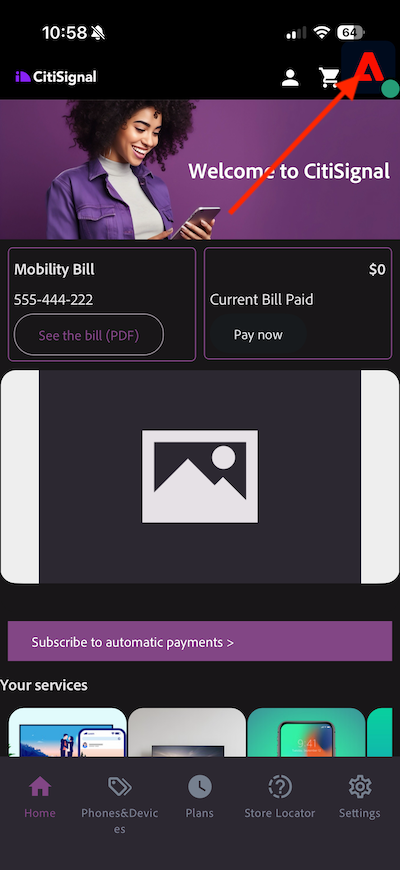

# 3.3.1 Guida introduttiva alle notifiche push

Per utilizzare le notifiche push con Adobe Journey Optimizer, è necessario controllare e conoscere diverse impostazioni.

Di seguito sono elencate tutte le impostazioni da verificare:

- Set di dati e schemi in Adobe Experience Platform
- Stream di dati per dispositivi mobili
- Proprietà raccolta dati per dispositivi mobili
- Superficie app per certificati push
- Testare la configurazione push con AEP Assurance

Esaminiamo questi uno per uno.

Accedi a Adobe Journey Optimizer da [Adobe Experience Cloud](https://experience.adobe.com). Fare clic su **Journey Optimizer**.

Verrai reindirizzato alla visualizzazione **Home** in Journey Optimizer. Innanzitutto, assicurati di utilizzare la sandbox corretta. La sandbox da utilizzare si chiama `--aepSandboxName--`. Ti troverai quindi nella **Home** della tua sandbox `--aepSandboxName--`.

## 3.4.4.1 set di dati push

Adobe Journey Optimizer utilizza i set di dati per memorizzare elementi come i token push da dispositivi mobili o interazioni con messaggi push (come: messaggio inviato, messaggio aperto, ecc.) in un set di dati in Adobe Journey Optimizer.

Puoi trovare questi set di dati da **[!UICONTROL Set di dati]** nel menu sul lato sinistro della schermata. Per visualizzare i set di dati di sistema, fai clic sull’icona del filtro.

Abilita l&#39;opzione **Mostra set di dati di sistema** e cerca **AJO**. Vedrai quindi i set di dati utilizzati per le notifiche push.

## 3.4.4.2 Datastream per dispositivi mobili

Vai a [https://experience.adobe.com/#/data-collection/](https://experience.adobe.com/it#/data-collection/).

Nel menu a sinistra, vai a **[!UICONTROL Datastream]** e cerca lo stream di dati creato in [Guida introduttiva](./../../../../modules/getting-started/gettingstarted/ex2.md), denominato `--aepUserLdap-- - Demo System Datastream (Mobile)`. Fai clic su per aprirlo.

Fai clic su **Modifica** nel servizio **Adobe Experience Platform**.

Vengono quindi visualizzate le impostazioni dello stream di dati definite e in quali set di dati verranno memorizzati gli eventi e gli attributi del profilo.

Se non sono ancora abilitate, abilita anche le seguenti opzioni:

- **Offer Decisioning**
- **Destinazioni di personalizzazione**
- **Adobe Journey Optimizer**

Fai clic su **Salva**.

## 3.4.4.3 Rivedi la proprietà Data Collection per Mobile

Vai a [https://experience.adobe.com/#/data-collection/](https://experience.adobe.com/it#/data-collection/). Come parte della [Guida introduttiva](./../../../../modules/getting-started/gettingstarted/ex1.md), sono state create 2 proprietà di raccolta dati.
Queste proprietà del client di raccolta dati sono già state utilizzate nei moduli precedenti.

Fai clic su per aprire la proprietà Raccolta dati per dispositivi mobili.

Nella proprietà Raccolta dati, vai a **Estensioni**. Vedrai quindi le varie estensioni necessarie per l’app mobile. Fare clic per aprire l&#39;estensione **Adobe Experience Platform Edge Network**.

Vedrai quindi che il flusso di dati per dispositivi mobili è collegato qui. Fai clic su **Annulla** per tornare alla panoramica delle estensioni.

Allora tornerai qui. Verrà visualizzata l&#39;estensione per **AEP Assurance**. AEP Assurance consente di verificare, verificare, simulare e convalidare la modalità di raccolta dei dati o di gestione delle esperienze nell’app mobile. Ulteriori informazioni su AEP Assurance e sul progetto Griffon sono disponibili qui [https://aep-sdks.gitbook.io/docs/beta/project-griffon](https://aep-sdks.gitbook.io/docs/beta/project-griffon).

Fare clic su **Configura** per aprire l&#39;estensione **Adobe Journey Optimizer**.

Qui è collegato il set di dati per il tracciamento degli eventi push.

Non è necessario apportare modifiche alla proprietà Data Collection.

## 3.4.4.4 Verifica la configurazione della superficie dell&#39;app

Vai a [https://experience.adobe.com/#/data-collection/](https://experience.adobe.com/it#/data-collection/). Nel menu a sinistra, vai a **Superfici app** e apri la Superficie app per **APNS app demo**.

Viene quindi visualizzata la superficie configurata dell’app per iOS e Android.

## 3.4.4.5 Verifica la configurazione della notifica push tramite AEP Assurance.

Una volta installata l’app, questa si trova nella schermata iniziale del dispositivo. Fai clic sull&#39;icona per aprire l&#39;app.

Quando utilizzi l’app per la prima volta, ti verrà richiesto di accedere con il tuo Adobe ID. Completa il processo di accesso.

Dopo aver effettuato l’accesso, verrà visualizzata una notifica con la richiesta dell’autorizzazione per l’invio di notifiche. Invieremo notifiche come parte dell&#39;esercitazione, quindi fai clic su **Consenti**.

Viene quindi visualizzata la home page dell’app. Vai a **Impostazioni**.

Nelle impostazioni, vedrai che attualmente un **progetto pubblico** è caricato nell&#39;app. Fai clic su **Progetto personalizzato**.

Ora puoi caricare un progetto personalizzato. Fai clic sul codice QR per caricare facilmente il progetto.

Dopo aver esaminato la sezione **Guida introduttiva**, si è verificato questo risultato. Fai clic per aprire il **progetto Mobile Retail** creato per te.

Nel caso in cui tu abbia chiuso accidentalmente la finestra del browser o per sessioni di attivazione o demo future, puoi anche accedere al progetto del tuo sito web da [https://dsn.adobe.com/projects](https://dsn.adobe.com/projects). Dopo aver effettuato l’accesso con il tuo Adobe ID, visualizzerai questo. Fai clic sul progetto dell’app mobile per aprirlo.

Fare clic su **Esegui**.

Viene quindi visualizzata questa finestra a comparsa contenente un codice QR. Esegui la scansione di questo codice QR dall’app mobile.

Nell&#39;app verrà quindi visualizzato l&#39;ID progetto, dopodiché potrai fare clic su **Salva**.

Ora torna alla **Home** nell&#39;app. L&#39;app è ora pronta per essere utilizzata.

Ora devi scansionare un codice QR per collegare il dispositivo mobile alla sessione di AEP Assurance.

Per avviare una sessione di AEP Assurance, vai a [https://experience.adobe.com/#/data-collection/](https://experience.adobe.com/it#/data-collection/). Fai clic su **Assurance** nel menu a sinistra. Quindi fare clic su **Crea sessione**.

Fare clic su **Inizio**.

Compila i valori:

- Nome sessione: usa `--aepUserLdap-- - push debugging` e sostituisci ldap con il tuo ldap
- URL di base: utilizzare `dxdemo://default`

Fai clic su **Avanti**.

Visualizzerai quindi un codice QR sullo schermo, che dovresti scansionare con il dispositivo iOS.

Sul dispositivo mobile, apri l’app della fotocamera e scansiona il codice QR visualizzato da AEP Assurance.

Viene quindi visualizzata una finestra a comparsa in cui viene richiesto di immettere il codice PIN. Copia il codice PIN dalla schermata Assurance di AEP e fai clic su **Connetti**.

Poi vedrai questo.

In Assurance, ora vedrai che un dispositivo si trova nella sessione di Assurance. Fai clic su **Fine**.

Vai a **Debug push**.

>[!NOTE]
>
>Se non riesci a trovare **Debug push** nel menu di sinistra, fai clic su **Configura** nell&#39;angolo in basso a sinistra dello schermo e aggiungi **Debug push** al menu.

Vedrai qualcosa del genere.

Alcune spiegazioni:

- La prima colonna, **Client**, mostra gli identificatori disponibili sul dispositivo iOS. Vedrai un ECID e un Token push.
- La seconda colonna mostra le **credenziali e configurazione di App Store**, che è stata impostata come parte dell&#39;esercizio **3.4.5.4Crea configurazione app in Launch**
- La seconda colonna mostra le informazioni del **profilo**, con informazioni aggiuntive sulla piattaforma in cui si trova il token push (APNS o APNSSandbox). Se fai clic sul pulsante **Ispeziona profilo**, verrai indirizzato a Adobe Experience Platform e visualizzerai l&#39;intero profilo cliente in tempo reale.

Per verificare la configurazione push, vai al pulsante **Invia configurazione push di prova**. Fai clic su **Invia notifica push di prova**

Assicurati che l&#39;app **DX Demo** non sia aperta al momento di fare clic sul pulsante **Invia notifica push**. Se l’app è aperta, la notifica push potrebbe essere ricevuta in background e non sarebbe visibile.

Vedrai quindi una notifica push come questa visualizzata sul tuo dispositivo mobile.

Se hai ricevuto la notifica push, significa che la configurazione è corretta e funziona correttamente e ora puoi creare un percorso reale che si tradurrà nell’invio di un messaggio push da Journey Optimizer.

## Passaggi successivi

Vai a [3.3.2 Configurare un percorso con messaggi push](./ex2.md){target="_blank"}

Torna a [Adobe Journey Optimizer: messaggi push e in-app](ajopushinapp.md){target="_blank"}

Torna a [Tutti i moduli](./../../../../overview.md){target="_blank"}
