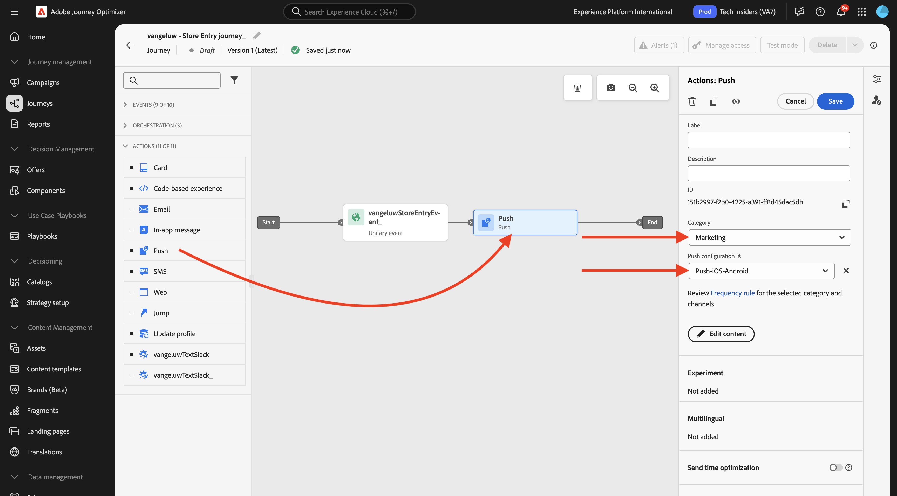

# 3.3.2 Configurare un percorso con messaggi push

## 3.4.4.6 Crea un nuovo evento

Vai a **Journey Optimizer**. Nel menu a sinistra, vai a **Configurazioni** e fai clic su **Gestisci** in **Eventi**.

Nella schermata **Eventi** verrà visualizzata una visualizzazione simile a questa. Fare clic su **Crea evento**.

Viene quindi visualizzata una configurazione dell’evento vuota.
Prima di tutto, assegna all&#39;evento un nome come `--aepUserLdap--StoreEntryEvent` e imposta la descrizione su `Store Entry Event`.
La selezione **Tipo evento** è successiva. Seleziona **Unitario**.
La selezione del **Tipo ID evento** è successiva. Selezionare **Generato dal sistema**.

Di seguito è riportata la selezione dello schema. Per questo esercizio è stato preparato uno schema. Utilizzare lo schema `Demo System - Event Schema for Mobile App (Global v1.1) v.1`.

Dopo aver selezionato lo schema, nella sezione **Payload** verranno selezionati diversi campi. Il tuo evento è ora completamente configurato.

Fai clic su **Salva**.

L’evento è ora configurato e salvato. Fai di nuovo clic sull&#39;evento per aprire di nuovo la schermata **Modifica evento**.

Passa il puntatore del mouse sul campo **Payload** e fai clic sull&#39;icona **Visualizza payload**.

Ora vedrai un esempio del payload previsto.

Il tuo evento ha un ID evento di orchestrazione univoco, che puoi trovare scorrendo verso il basso in tale payload fino a visualizzare `_experience.campaign.orchestration.eventID`.

L’ID evento è ciò che deve essere inviato a Adobe Experience Platform per attivare il Percorso che verrà generato nel passaggio successivo. Annota questo eventID, come sarà necessario nel passaggio successivo.
`"eventID": "89acd341ec2b7d1130c9a73535029debf2ac35f486bc99236b1a5091d6f4bc68"`

Fai clic su **Ok**, seguito da **Annulla**.

## 3.4.4.7 Creazione di un percorso

Nel menu, vai a **Percorsi** e fai clic su **Crea Percorso**.

Poi vedrai questo. Assegna un nome al percorso. Usa `--aepUserLdap-- - Store Entry journey`. Fai clic su **Salva**.

Innanzitutto, devi aggiungere l’evento come punto di partenza del percorso. Cercare l&#39;evento `--aepUserLdap--StoreEntryEvent` e trascinarlo sull&#39;area di lavoro. Fai clic su **Salva**.

Quindi, in **Azioni**, cerca l&#39;azione **Invia**. Trascina e rilascia l&#39;azione **Push** nell&#39;area di lavoro.

Imposta **Categoria** su **Marketing** e seleziona una superficie push che ti consenta di inviare notifiche push. In questo caso, la superficie e-mail da selezionare è **Push-iOS-Android**.

>[!NOTE]
>
>Deve esistere un canale in Journey Optimizer che utilizza la **superficie app** come rivisto in precedenza.

Il passaggio successivo consiste nel creare il messaggio. A tale scopo, fare clic su **Modifica contenuto**.

Poi vedrai questo. Fai clic sull&#39;icona **personalization** per il campo **Title**.

Poi vedrai questo. Ora puoi selezionare qualsiasi attributo di profilo direttamente da Real-time Customer Profile.

Cerca il campo **Nome**, quindi fai clic sull&#39;icona **+** accanto al campo **Nome**. Verrà quindi visualizzato il token di personalizzazione per First Name aggiunto: **{{profile.person.name.firstName}}**.

Quindi, aggiungi il testo **, benvenuto nel nostro store!** dietro **{{profile.person.name.firstName}}**.

Fai clic su **Salva**.

Ora hai questo. Fai clic sull&#39;icona **personalization** per il campo **Body**.

Immetti questo testo **Fai clic qui per ottenere uno sconto del 10% al momento dell&#39;acquisto.** e fare clic su **Salva**.

Allora avrai questo. Fai clic sulla freccia nell’angolo in alto a sinistra per tornare al percorso.

Fai clic su **Salva** per chiudere l&#39;azione push.

Fai clic su **Pubblica**.

Fai di nuovo clic su **Pubblica**.

Il percorso è stato pubblicato.

## 3.4.4.8 Test del percorso e messaggio push

Nell&#39;app mobile DX Demo 2.0, vai alla schermata **Impostazioni**. Fare clic sul pulsante **Voce archivio**.

>[!NOTE]
>
>Il pulsante **Voce archivio** è attualmente in fase di implementazione. Non lo troverai ancora nell’app.

Assicurati di chiudere l&#39;app immediatamente dopo aver fatto clic sull&#39;icona **Voce store**, altrimenti il messaggio push non verrà visualizzato.

Dopo un paio di secondi, verrà visualizzato il messaggio.

Hai finito questo esercizio.

## Passaggi successivi

Vai a [3.3.3 Configurare una campagna con messaggi in-app](./ex3.md){target="_blank"}

Torna a [Adobe Journey Optimizer: messaggi push e in-app](ajopushinapp.md){target="_blank"}

Torna a [Tutti i moduli](./../../../../overview.md){target="_blank"}
