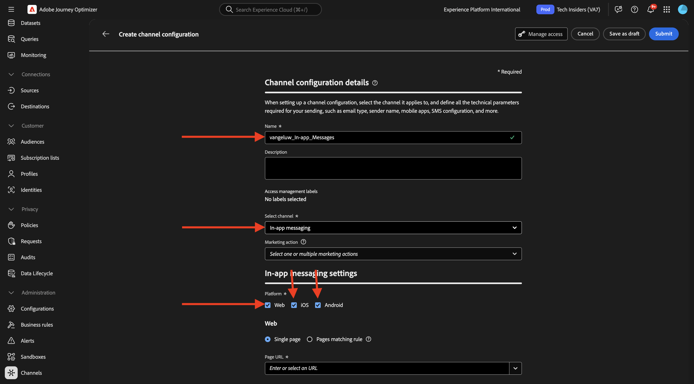
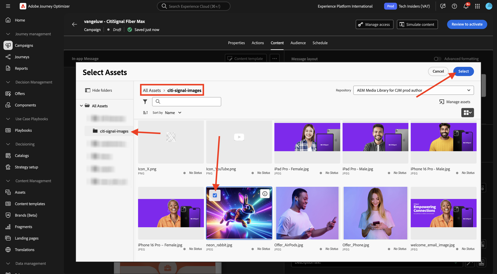

# 3.3.3 Configurare una campagna con messaggi in-app

Accedi a Adobe Journey Optimizer da [Adobe Experience Cloud](https://experience.adobe.com). Fare clic su **Journey Optimizer**.

Verrai reindirizzato alla visualizzazione **Home** in Journey Optimizer. Innanzitutto, assicurati di utilizzare la sandbox corretta. La sandbox da utilizzare si chiama `--aepSandboxName--`. Ti troverai quindi nella **Home** della tua sandbox `--aepSandboxName--`.

## Configurazione canale messaggi in-app 3.3.3.1

Nel menu a sinistra, vai a **Canali** e quindi seleziona **Configurazioni canale**. Fai clic su **Crea configurazione canale**.

Immetti il nome: `--aepUserLdap--_In-app_Messages`, seleziona il canale **Messaggistica in-app**, quindi abilita le piattaforme **Web**, **iOS** e **Android**.

Scorri verso il basso, dovresti vedere questo.

Verificare che **Pagina singola** sia abilitato.

Per **Web**, immettere l&#39;URL del sito Web creato in precedenza come parte del modulo **Guida introduttiva**, che si presenta così: `https://dsn.adobe.com/web/--aepUserLdap---XXXX`. Non dimenticare di modificare **XXXX** nel codice univoco del sito Web.

Per **iOS** e **Android**, immetti `com.adobe.dsn.dxdemo`.

Scorri verso l&#39;alto e fai clic su **Invia**.

La configurazione del canale è ora pronta per essere utilizzata.

## 3.3.3.2 Configurare una campagna pianificata per i messaggi in-app

Nel menu a sinistra, vai a **Campagne** e quindi fai clic su **Crea campagna**.

Selezionare **Pianificato - Marketing**, quindi fare clic su **Crea**.

Immettere il nome `--aepUserLdap-- - CitiSignal Fiber Max` e quindi fare clic su **Azioni**.

Fai clic su **+ Aggiungi azione**, quindi seleziona **Messaggio in-app**.

Selezionare la configurazione del canale messaggi in-app creata nel passaggio precedente, denominata: `--aepUserLdap--_In-app_Messages`. Fare clic su **Modifica contenuto**.

Dovresti vedere questo. Fai clic su **Modale**.

Fare clic su **Cambia layout**.

Fai clic sull&#39;icona **URL file multimediali** per scegliere una risorsa da AEM Assets.

Vai alla cartella **citisignal-images** e seleziona il file di immagine **neon-rabbit.jpg**. Fai clic su **Seleziona**.

Per il testo **Intestazione**, utilizzare: `CitiSignal Fiber Max`.
Per il testo **Body**, utilizzare: `Conquer lag with Fiber Max`.

Impostare il **pulsante #1 testo** su: `Go to Plans`.
Imposta **target** su `com.adobe.dsn.dxdemo://plans`.

Fai clic su **Rivedi per attivare**.

Fare clic su **Attiva**.

Lo stato della campagna è ora impostato su **Attivazione**. Potrebbero essere necessari un paio di minuti prima che la campagna sia in diretta.

Dopo aver cambiato lo stato in **Live**, puoi testare la tua campagna.

## 3.3.3.3 Test della campagna di messaggistica in-app su dispositivi mobili

Sul dispositivo mobile, apri l’app. Dovresti quindi visualizzare il nuovo messaggio in-app dopo l’avvio dell’app. Fai clic sul pulsante **Vai a piani**.

Verrai quindi portato alla pagina **Piani**.

## Passaggi successivi

Torna a [Adobe Journey Optimizer: messaggi push e in-app](ajopushinapp.md){target="_blank"}

Torna a [Tutti i moduli](./../../../../overview.md){target="_blank"}
