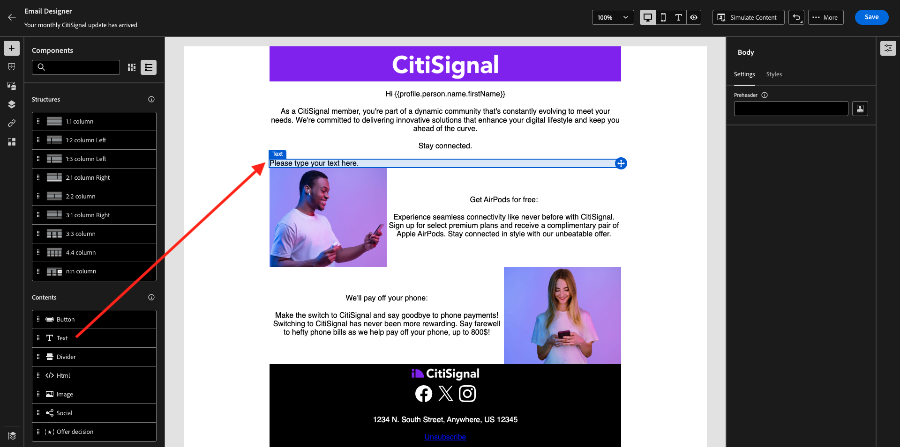

# 3.4.3 Applicare la personalizzazione basata sui segmenti in un messaggio e-mail

Accedi a Adobe Experience Cloud da [Adobe Experience Cloud](https://experience.adobe.com). Fare clic su **Adobe Journey Optimizer**.

Verrai reindirizzato alla visualizzazione **Home** in Journey Optimizer. Prima di continuare, devi selezionare una **sandbox**. La sandbox da selezionare è denominata ``--aepTenantId--``.

## Personalizzazione basata su 3.4.3.1 segmenti

In questo esercizio migliorerai il messaggio e-mail per la newsletter creato nell’esercizio precedente con un testo personalizzato in base all’iscrizione al segmento.

Vai a **Campagne**. Trova il percorso di newsletter creato nell’esercizio precedente. Cerca `--aepUserLdap-- - CitiSignal Newsletter`. Fare clic con il pulsante destro del mouse sui tre punti **...** e scegliere **Duplica**.

Poi vedrai questo. Utilizza questo per il **titolo**: `--aepUserLdap-- - CitiSignal Newsletter (SBP)`. Fai clic su **Duplica**.

Fai clic sulla campagna duplicata per aprirla.

Fai clic su **Modifica** per modificare il contenuto.

Fai clic su **Modifica corpo dell&#39;e-mail**.

Poi vedrai questo.

Apri **Componenti contenuto** e trascina una **colonna 1:1** sopra l&#39;offerta AirPods.

Trascina e rilascia un componente **Testo** nella colonna 1:1.

Selezionare l&#39;intero testo predefinito ed eliminarlo. Quindi fare clic sul pulsante **Aggiungi personalizzazione** nella barra degli strumenti.

Poi vedrai questo. Nel menu a sinistra, fai clic su **Tipi di pubblico**.

Selezionare il segmento `--aepUserLdap-- - Interest in Plans` e fare clic sull&#39;icona **+** per aggiungerlo all&#39;area di lavoro.

Lasciare quindi invariata la prima riga e sostituire le righe 2 e 3 con questo codice:

&grave;&grave;
    PS: It may be a good idea to check if your plan still meets your needs! Click here to be contacted by one of our experts!

    PS: Thanks for taking the time to read our newsletter. Here is a 10% promo code to use on the website: NEWSLETTER10

&grave;&grave;

Allora avrai questo. Fai clic su **Salva**.

Cambia l&#39;allineamento del testo in **Allineamento al centro**.

Per salvare il messaggio, fai clic sul pulsante **Salva** nell&#39;angolo in alto a destra. Quindi, fai clic sulla **freccia** accanto al testo della riga dell&#39;oggetto nell&#39;angolo in alto a sinistra.

Fai clic su **Rivedi per attivare**.

Fare clic su **Attiva**.

È ora pubblicata la newsletter con personalizzazione basata sui segmenti. Il messaggio e-mail della newsletter verrà inviato in base alla pianificazione e il percorso verrà interrotto non appena l’ultima e-mail sarà stata inviata.

Se ti qualifichi per il segmento utilizzato, lo vedrai nell’e-mail che riceverai:

Hai finito questo esercizio.

## Passaggi successivi

Vai a [Riepilogo e vantaggi](./summary.md){target="_blank"}

Torna a [Adobe Journey Optimizer](journeyoptimizer.md){target="_blank"}

Torna a [Tutti i moduli](./../../../../overview.md){target="_blank"}
