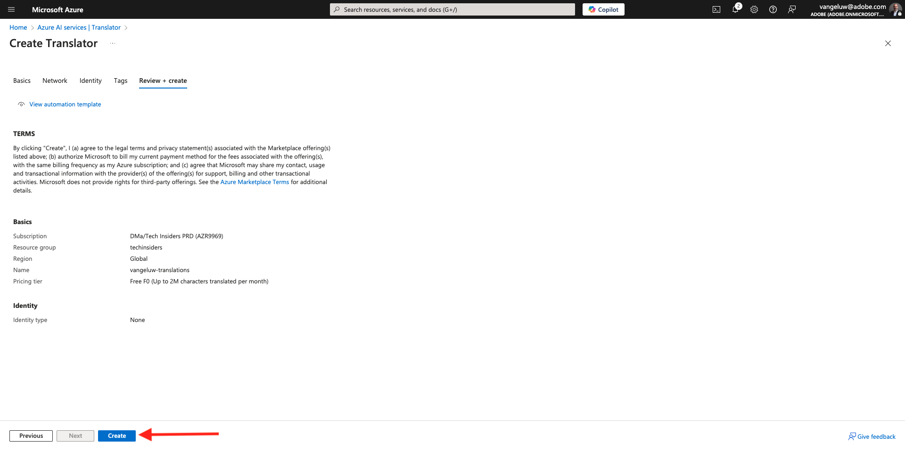
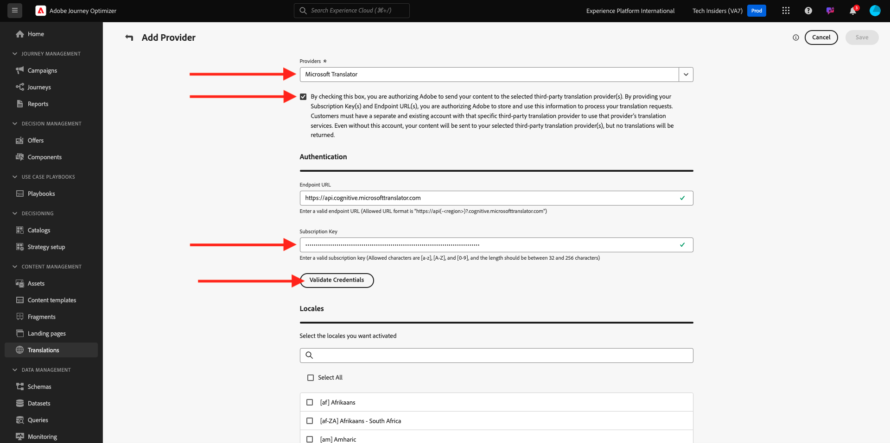
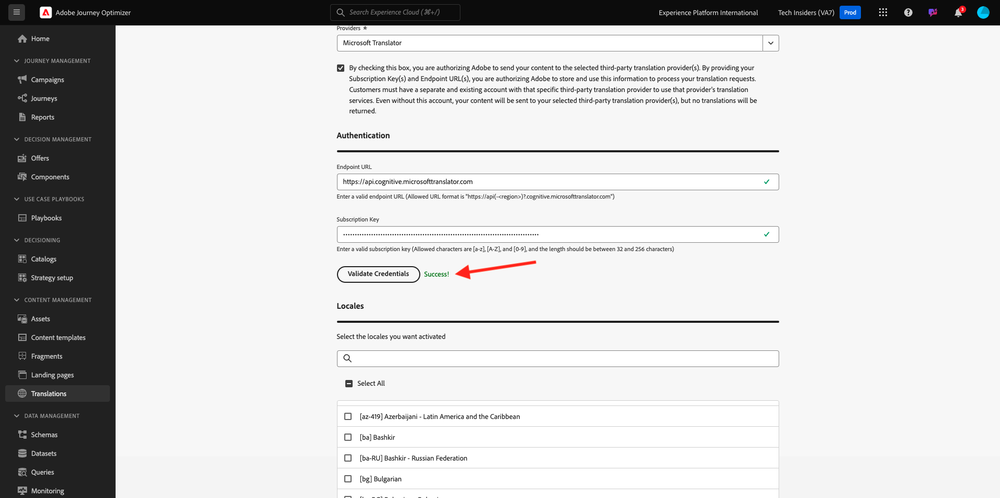

# 3.5.1 Fornitore di traduzioni

## 3.5.1.1 Configurare Microsoft Azure Translator

Vai a [https://portal.azure.com/#home](https://portal.azure.com/#home).

Nella barra di ricerca immettere `translators`. Quindi fare clic su **+ Crea**.

Seleziona **Crea traduttore**.

Scegli il tuo **ID abbonamento** e **gruppo di risorse**.
Imposta **Regione** su **Globale**.
Impostare **Livello prezzi** su **F0** gratuito.

Seleziona **Rivedi + crea**.

Seleziona **Crea**.

Selezionare **Vai alla risorsa**.

Nel menu a sinistra, vai a **Gestione risorse** > **Chiavi ed endpoint**. Fai clic su per copiare la chiave.

## 3.5.1.2 Dizionario delle impostazioni internazionali

Vai a [https://experience.adobe.com/](https://experience.adobe.com/). Fare clic su **Journey Optimizer**.

Nel menu a sinistra, vai a **Traduzioni** e quindi vai a **Dizionario impostazioni internazionali**. Se viene visualizzato questo messaggio, fare clic su **Aggiungi impostazioni internazionali predefinite**.

Dovresti vedere questo.

## 3.5.1.3 Configurare il provider di traduzioni in AJO

Vai a [https://experience.adobe.com/](https://experience.adobe.com/). Fare clic su **Journey Optimizer**.

Nel menu a sinistra, vai a **Traduzioni** e quindi vai a **Provider**. Fare clic su **Aggiungi provider**.

In **Provider**, selezionare **Microsoft Translator**. Seleziona la casella di controllo per abilitare l’utilizzo del provider di traduzione. Incolla la chiave copiata da Microsoft Azure Translators. Quindi fare clic su **Convalida credenziali**.

Le credenziali devono quindi essere convalidate correttamente. Se lo sono, scorri verso il basso per selezionare le lingue per la traduzione.

Selezionare `[en-US] English`, `[es] Spanish`, `[fr] French`, `[nl] Dutch`.

Scorri verso l&#39;alto e fai clic su **Salva**.

Il **provider di traduzioni** è pronto per essere utilizzato.

## 3.5.1.4 Configurare il progetto di traduzione

Vai a [https://experience.adobe.com/](https://experience.adobe.com/). Fare clic su **Journey Optimizer**.

Nel menu a sinistra, vai a **Traduzioni** e quindi vai a **Dizionario impostazioni internazionali**. Se viene visualizzato questo messaggio, fare clic su **Crea progetto**.

Immettere il nome `--aepUserLdap-- - Translations`, impostare **Impostazioni internazionali Source** su `[en-US] English - United States` e selezionare le caselle di controllo per abilitare **Pubblica automaticamente traduzioni approvate** e **Abilita flusso di lavoro di revisione**. Fare clic su **+ Aggiungi una lingua**.

Cerca `fr`, abilita la casella di controllo per `[fr] French`, quindi abilita la casella di controllo per **Microsoft Translator**. Fare clic su **+ per aggiungere una lingua**.

Cerca `es`, abilita la casella di controllo per `[es] Spanish`, quindi abilita la casella di controllo per **Microsoft Translator**. Fare clic su **+ per aggiungere una lingua**.

Cerca `nl`, abilita la casella di controllo per `[nl] Spanish`, quindi abilita la casella di controllo per **Microsoft Translator**. Fare clic su **+ per aggiungere una lingua**.

Fai clic su **Salva**.

Il progetto **Traduzioni** è pronto per essere utilizzato.

## 3.5.1.5 Configurare le impostazioni della lingua

Vai a **Canali** > **Impostazioni generali** > **Impostazioni lingua**. Fare clic su **Crea impostazioni lingua**.

Utilizza il nome `--aepUserLdap--_translations`. Seleziona **Progetto di traduzione**. Quindi fai clic sull&#39;icona **modifica**.

Seleziona il progetto di traduzioni creato nel passaggio precedente. Fai clic su **Seleziona**.

Dovresti vedere questo. Imposta la **preferenza di fallback** su **Inglese - Stati Uniti**. Fai clic per selezionare **Seleziona l&#39;attributo preferito della lingua del profilo**, che deciderà quale campo del profilo cliente utilizzare per caricare le traduzioni. Quindi fai clic sull&#39;icona **modifica** per selezionare il campo da utilizzare.

Immetti **lingua preferita** nella barra di ricerca, quindi seleziona il campo **Lingua preferita**.

Fai clic sull&#39;icona **modifica** per **Inglese - Stati Uniti** e **Olandese** per esaminarne la configurazione.

Ecco la configurazione per **Inglese - Stati Uniti**. Fare clic su **Annulla**.

Fare clic per visualizzare la configurazione per **Olandese**. Fare clic su **Annulla**.

Scorri verso l&#39;alto e fai clic su **Invia**.

Le impostazioni della lingua sono ora configurate.

Hai finito questo esercizio.

## Passaggi successivi

Vai a [3.5.2 Crea la tua campagna](./ex2.md)

Torna a [Adobe Journey Optimizer: Servizi di traduzione](./ajotranslationsvcs.md){target="_blank"}

Torna a [Tutti i moduli](./../../../../overview.md){target="_blank"}
