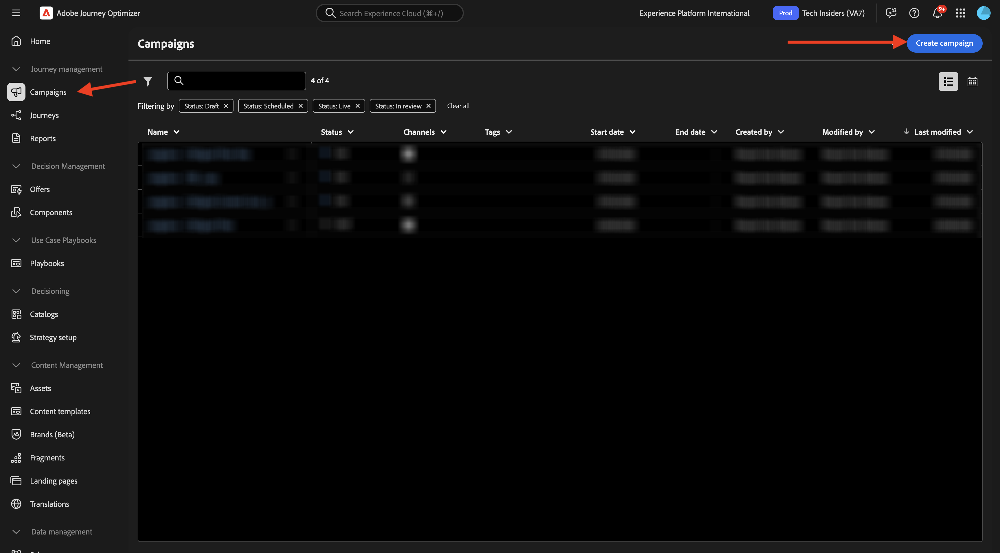
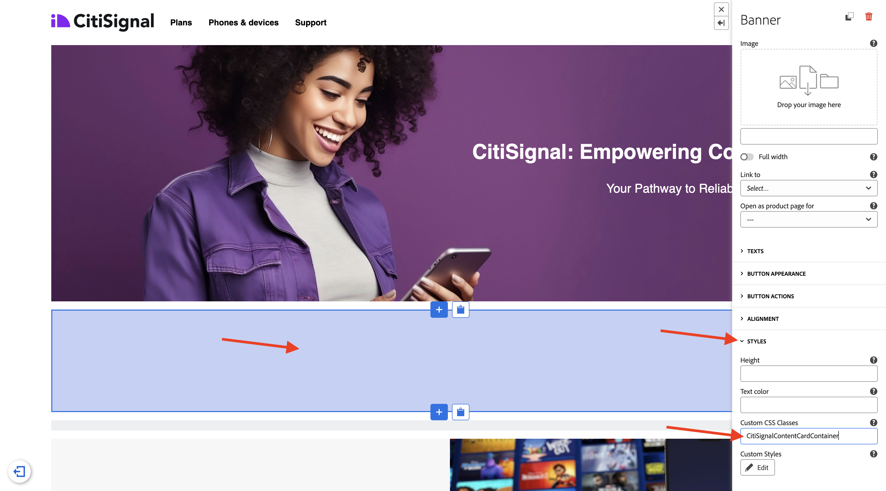
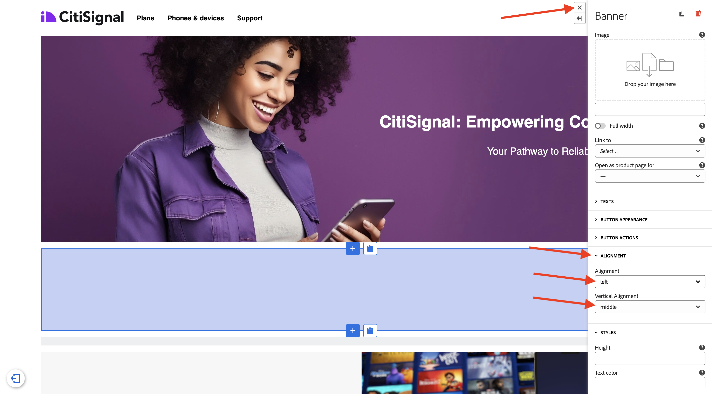

# 3.6.1 Schede di contenuto

Accedi a Adobe Journey Optimizer da [Adobe Experience Cloud](https://experience.adobe.com). Fare clic su **Journey Optimizer**.


Verrai reindirizzato alla visualizzazione **Home** in Journey Optimizer. Innanzitutto, assicurati di utilizzare la sandbox corretta. La sandbox da utilizzare si chiama `--aepSandboxName--`. Ti troverai quindi nella **Home** della tua sandbox `--aepSandboxName--`.


## Configurazione canale schede di contenuto 3.6.1.1

Nel menu a sinistra, vai a **Canali** e quindi seleziona **Configurazioni canale**. Fai clic su **Crea configurazione canale**.


Immettere il nome: `--aepUserLdap--_Content_Cards_Web`, selezionare il canale **Schede di contenuto**, quindi attivare la piattaforma **Web**.


Scorri verso il basso e accertati che l&#39;opzione **Pagina singola** sia abilitata.

Immetti l&#39;URL del sito Web creato in precedenza come parte del modulo **Guida introduttiva**, che si presenta così: `https://dsn.adobe.com/web/--aepUserLdap---XXXX`. Non dimenticare di modificare **XXXX** nel codice univoco del sito Web.

>[!IMPORTANT]
>
>Il riferimento precedente all&#39;URL del sito Web di dimostrazione di CitiSignal `https://dsn.adobe.com/web/--aepUserLdap---XXXX` deve essere modificato nell&#39;URL effettivo. Per trovare l&#39;URL, vai al progetto del tuo sito Web su [https://dsn.adobe.com/](https://dsn.adobe.com/).

Imposta il campo **Posizione a pagina** su `CitiSignalContentCardContainer`.


Scorri verso l&#39;alto e fai clic su **Invia**.


La configurazione del canale è ora pronta per essere utilizzata.


## 3.6.1.2 Configura una campagna pianificata per le schede di contenuto

Nel menu a sinistra, vai a **Campagne** e quindi fai clic su **Crea campagna**.



Selezionare **Pianificato - Marketing**, quindi fare clic su **Crea**.


Immettere il nome `--aepUserLdap-- - CitiSignal Fiber Max Content Cards` e quindi fare clic su **Azioni**.


Fare clic su **+ Aggiungi azione** e quindi selezionare **Scheda contenuto**.


Selezionare la configurazione del canale delle schede di contenuto creata nel passaggio precedente, denominata: `--aepUserLdap--_Content_Cards_Web`.

Fare clic su **Modifica regole**.


Fare clic su **X** per rimuovere la regola corrente.


Fare clic su **+ Aggiungi condizione**.


Selezionare la condizione **Dati inviati a Platform**. Fai clic su **Fine**


Dovresti vedere questo. Fare clic su **Modifica contenuto**.


Dovresti vedere questo.


Configura le seguenti impostazioni:

- **Titolo**: `CitiSignal Fiber Max`
- **Corpo**: `Lightning speed for gamers`
- **URL di destinazione**: `https://dsn.adobe.com/web/--aepUserLdap---XXXX/plans`

>[!IMPORTANT]
>
>Il riferimento precedente all&#39;URL del sito Web di dimostrazione di CitiSignal `https://dsn.adobe.com/web/--aepUserLdap---XXXX/plans` deve essere modificato nell&#39;URL effettivo. Per trovare l&#39;URL, vai al progetto del tuo sito Web su [https://dsn.adobe.com/](https://dsn.adobe.com/).

Fai clic sull&#39;icona per modificare l&#39;URL selezionando una risorsa da AEM Assets.


Vai alla cartella **citisignal-imaes** e seleziona il file **`neon_rabbit_banner.jpg`**. Fai clic su **Seleziona**.


Dovresti avere questo. Fare clic sul pulsante Aggiungi **+**.


Configura le seguenti impostazioni per il pulsante:

- **Titolo pulsante**: `Upgrade now!`
- **Evento di interazione**: `click`
- **Destinazione**: `https://dsn.adobe.com/web/--aepUserLdap---XXXX/plans`

>[!IMPORTANT]
>
>Il riferimento precedente all&#39;URL del sito Web di dimostrazione di CitiSignal `https://dsn.adobe.com/web/--aepUserLdap---XXXX/plans` deve essere modificato nell&#39;URL effettivo. Per trovare l&#39;URL, vai al progetto del tuo sito Web su [https://dsn.adobe.com/](https://dsn.adobe.com/).

Fai clic su **Rivedi per attivare**.


Fare clic su **Attiva**.


La campagna verrà quindi attivata e l&#39;operazione potrebbe richiedere alcuni minuti.


Dopo un paio di minuti, la tua campagna sarà live.


## 3.6.1.3 Aggiornare il sito Web DSN

Per visualizzare la scheda dei contenuti sul sito web, è necessario apportare una modifica alla progettazione della pagina home del sito web di dimostrazione di CitiSignal.

Vai a [https://dsn.adobe.com/](https://dsn.adobe.com/). Fai clic sui **3 punti** del tuo sito Web e fai clic su **Modifica**.


Fare clic per selezionare la pagina **Home**. Fare clic su **Modifica contenuto**.


Passa il puntatore sull&#39;immagine principale e fai clic sul pulsante **+**.


Vai a **Generale**, seleziona **Banner**, quindi fai clic su **Aggiungi**.


Fai clic su per selezionare il banner appena creato. Vai a **Stile** e immetti `CitiSignalContentCardContainer` nel campo **Classi CSS personalizzate**.



Vai a **Allineamento**. Impostare il campo **Allineamento** su `left` e il campo **Allineamento verticale** su `middle`.

Fai clic sull&#39;icona **X** per chiudere la finestra di dialogo.



Sono state apportate le modifiche alla progettazione del sito Web.

Se apri il sito in una nuova finestra del browser ora, dovrebbe essere simile a questa. l&#39;area grigia è il banner appena creato, ma non ha ancora alcun contenuto.


Per garantire che il contenuto venga caricato dinamicamente nel banner appena creato, è necessario apportare una modifica alla proprietà Tag raccolta dati.

## 3.6.1.4 Aggiorna la proprietà dei tag della raccolta dati

Vai a [https://experience.adobe.com/#/data-collection/](https://experience.adobe.com/it#/data-collection/), a **Tag**. Come parte del modulo [Guida introduttiva](./../../../../modules/getting-started/gettingstarted/ex1.md), sono state create le proprietà dei tag di raccolta dati.

Queste proprietà dei tag di raccolta dati sono già state utilizzate nei moduli precedenti.

Fai clic su per aprire la proprietà Raccolta dati per il Web.


Nel menu a sinistra, vai a **Regole** e fai clic per aprire la regola **Visualizzazione pagina**.


Fai clic sull&#39;azione **Invia evento esperienza &quot;Visualizzazione pagina&quot;**.


Come parte della regola **Visualizzazione pagina**, è necessario richiedere le istruzioni di personalizzazione da Edge per una superficie specifica. La superficie è il banner configurato nel passaggio precedente. Per eseguire questa operazione, scorri verso il basso fino a **Personalization** e immetti `web://dsn.adobe.com/web/--aepUserLdap---XXXX#CitiSignalContentCardContainer` in **Superfici**.

>[!IMPORTANT]
>
>Il riferimento precedente all&#39;URL del sito Web di dimostrazione di CitiSignal `web://dsn.adobe.com/web/--aepUserLdap---XXXX#CitiSignalContentCardContainer` deve essere modificato nell&#39;URL effettivo. Per trovare l&#39;URL, vai al progetto del tuo sito Web su [https://dsn.adobe.com/](https://dsn.adobe.com/).

Fai clic su **Mantieni modifiche**.


Fai clic su **Salva** o **Salva nella libreria**.


Nel menu a sinistra, vai a **Regole** e fai clic su **Aggiungi regola**.


Immettere il nome: `Display AJO Content Cards`. Fare clic su **+ Aggiungi** per aggiungere un nuovo evento.


Selezionare l&#39;**estensione**: **Adobe Experience Platform Web SDK**, quindi selezionare **Tipo evento**: **Sottoscrivi elementi set di regole**.

In **Schemi**, seleziona **Scheda contenuto**.

In **Superfici** immettere `web://dsn.adobe.com/web/--aepUserLdap---XXXX#CitiSignalContentCardContainer`

>[!IMPORTANT]
>
>Il riferimento precedente all&#39;URL del sito Web di dimostrazione di CitiSignal `web://dsn.adobe.com/web/--aepUserLdap---XXXX#CitiSignalContentCardContainer` deve essere modificato nell&#39;URL effettivo. Per trovare l&#39;URL, vai al progetto del tuo sito Web su [https://dsn.adobe.com/](https://dsn.adobe.com/).

Fai clic su **Mantieni modifiche**.


Dovresti vedere questo. Fare clic su **+ Aggiungi** per aggiungere una nuova azione.


Seleziona l&#39;**Estensione**: **Core** e il **Tipo azione**: **Codice personalizzato**.

Abilitare la casella di controllo per **Lingua**: **JavaScript** e quindi fare clic su **Apri editor**.


Dovresti quindi visualizzare una finestra dell’editor vuota.


Incolla il codice seguente nell&#39;editor e fai clic su **Salva**.

```javascript
if (!Array.isArray(event.propositions)) {
  console.log("No personalization content");
  return;
}

console.log(">>> Content Card response from Edge: ", event.propositions);

event.propositions.forEach(function (payload) {
  payload.items.forEach(function (item) {
    if (!item.data || !item.data.content || item.data.content === "undefined") {
      return;
    }
    console.log(">>> Content Card response from Edge: ", item);
    const { content } = item.data;
    const { title, body, image, buttons } = content;
    const titleValue = title.content;
    const description = body.content;
    const imageUrl = image.url;
    const buttonLabel = buttons[0]?.text.content;
    const buttonLink = buttons[0]?.actionUrl;
    const html = `<div  class="Banner Banner--alignment-left Banner--verticalAlignment-left hero-banner ContentCardContainer"  oxygen-component-id="cmp-0"  oxygen-component="Banner"  role="presentation"  style="color: rgb(255, 255, 255); height: 60%;">  <div class="Image" role="presentation">      </div>  <div class="Banner__content">    <div class="Title Title--alignment-left Title--textAlignment-left">      <div class="Title__content" role="presentation">        <strong class="Title__pretitle">${titleValue}</strong>        <h2>${description}</h2>      </div>    </div>    <div class="Button Button--alignment-left Button--variant-cta">              <button          class="Dniwja_spectrum-Button Dniwja_spectrum-BaseButton Dniwja_i18nFontFamily Dniwja_spectrum-FocusRing Dniwja_spectrum-FocusRing-ring"          type="button"          data-variant="accent"          data-style="fill"          onclick="window.open('${buttonLink}')"       style="color:#FFFFFF;padding: 12px 28px;font-size: 24px;font-family: adobe-clean;font-weight: bolder;" >          <span            id="react-aria5848951631-49"            class="Dniwja_spectrum-Button-label"            >${buttonLabel}</span          >        </button>            </div>  </div></div>`;
    if (document.querySelector(".CitiSignalContentCardContainer")) {
      const contentCardContainer = document.querySelector(
        ".CitiSignalContentCardContainer"
      );
      contentCardContainer.innerHTML = html;
      contentCardContainer.style.height = "60%";
    }
  });
});
```


Fai clic su **Mantieni modifiche**.


Fai clic su **Salva** o **Salva nella libreria**.


Nel menu a sinistra, vai a **Flusso di pubblicazione** e fai clic per aprire la libreria **Principale**.


Fai clic su **Aggiungi tutte le risorse modificate**, quindi fai clic su **Salva e genera in sviluppo**.


## 3.6.1.5 Verifica la tua scheda di contenuti sul tuo sito Web

Vai a [https://dsn.adobe.com](https://dsn.adobe.com). Dopo aver effettuato l’accesso con il tuo Adobe ID, visualizzerai questo. Fai clic sui tre punti **...** del progetto del sito Web, quindi fai clic su **Esegui** per aprirlo.


Poi vedrai il tuo sito web demo aperto. Seleziona l’URL e copialo negli Appunti.


Apri una nuova finestra del browser in incognito.


Incolla l’URL del sito web demo, che hai copiato nel passaggio precedente. Ti verrà quindi chiesto di effettuare l’accesso con il tuo Adobe ID.


Seleziona il tipo di account e completa la procedura di accesso.


Ora dovresti caricare il sito web di CitoSignal e visualizzare la scheda di contenuto configurata invece dell’area grigia vuota che c’era prima.


## Passaggi successivi

Vai a [3.6.2 Pagine di destinazione](./ex2.md)

Torna a [Adobe Journey Optimizer: gestione dei contenuti](./ajocontent.md){target="_blank"}

Torna a [Tutti i moduli](./../../../../overview.md){target="_blank"}
