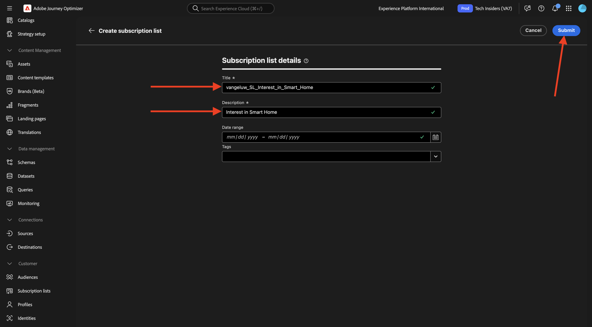
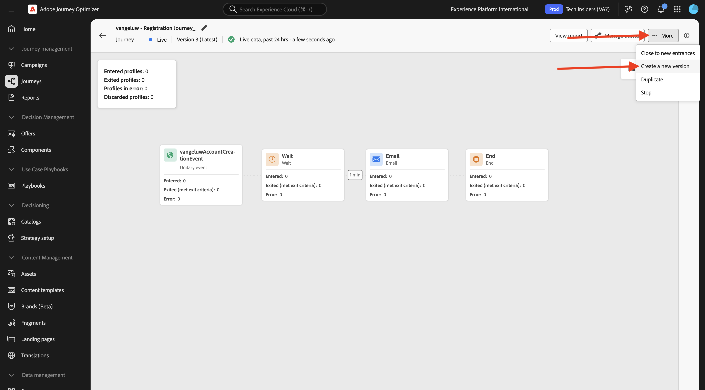
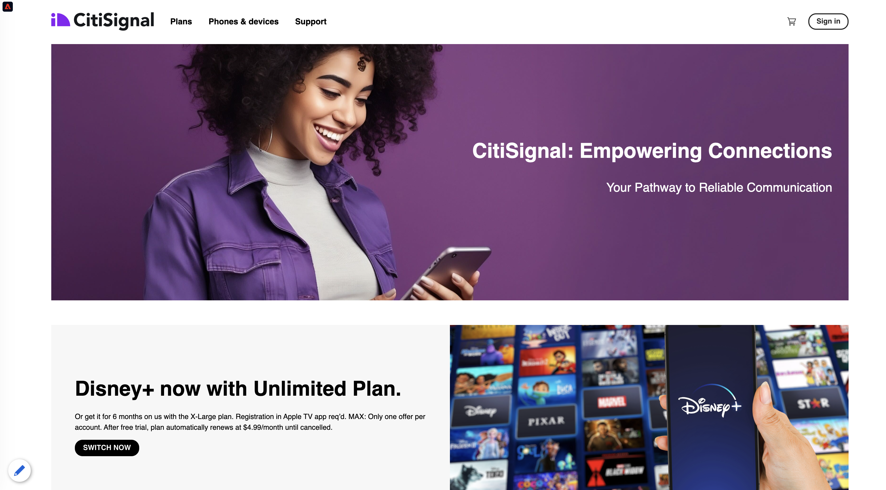
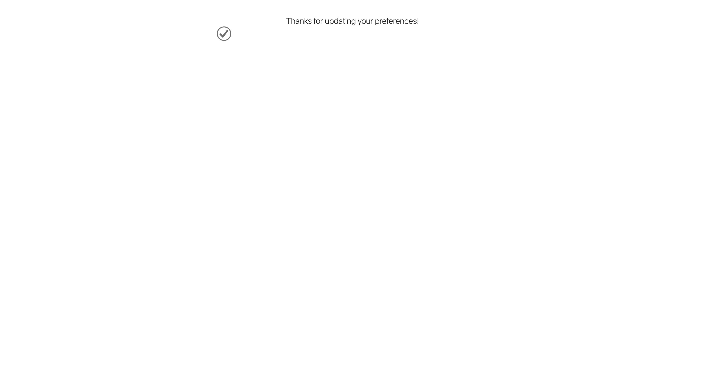

# 3.6.2 Pagine di destinazione

Accedi a Adobe Journey Optimizer da [Adobe Experience Cloud](https://experience.adobe.com). Fare clic su **Journey Optimizer**.

Verrai reindirizzato alla visualizzazione **Home** in Journey Optimizer. Innanzitutto, assicurati di utilizzare la sandbox corretta. La sandbox da utilizzare si chiama `--aepSandboxName--`. Ti troverai quindi nella **Home** della tua sandbox `--aepSandboxName--`.

## 3.6.2.1 elenchi di iscrizioni

Le pagine di destinazione in Adobe Journey Optimizer funzionano insieme a **Elenchi di iscrizioni**. Per impostare le pagine di destinazione, devi prima configurare **Elenchi di iscrizioni**.

CitiSignal desidera invitare i propri clienti a conoscere il loro interesse per i seguenti domini:

- Pagina principale Smart
- Lavoro da casa
- Giochi online

Una volta che un cliente ha indicato il suo interesse in uno di questi domini, deve essere aggiunto a un elenco specifico in modo che possa successivamente essere utilizzato come destinazione un contenuto specifico nell’ambito delle prossime campagne.

Verranno creati 3 elenchi di iscrizioni.

Nel menu a sinistra, vai a **Elenchi di iscrizioni**. Fai clic su **Crea elenco iscrizioni**.

Per **Titolo**, utilizzare: `--aepUserLdap--_SL_Interest_in_Smart_Home`.
Per **Descrizione**, utilizzare: `Interest in Smart Home`.

Fai clic su **Invia**.

Fai clic su **Crea elenco iscrizioni** per creare un altro elenco.

Per **Titolo**, utilizzare: `--aepUserLdap--_SL_Interest_WFH`.
Per **Descrizione**, utilizzare: `Interest in Work From Home`.

Fai clic su **Invia**.

Fai clic su **Crea elenco iscrizioni** per creare un altro elenco.

Per **Titolo**, utilizzare: `--aepUserLdap--_SL_Interest_Online_Gaming`.
Per **Descrizione**, utilizzare: `Interest in Online Gaming`.

Fai clic su **Invia**.

Sono stati creati i 3 elenchi necessari.

## Predefinito per pagina di destinazione 3.6.2.2

Per utilizzare le pagine di destinazione in Adobe Journey Optimizer, è necessario creare un predefinito.

Nel menu a sinistra, vai a **Amministrazione** > **Canali**, quindi seleziona **Predefiniti pagina di destinazione**.

Fai clic su **Crea predefinito per pagina di destinazione**.

Per il campo **Nome**, utilizza: `--aepUserLdap-- - CitiSignal LP` e seleziona il sottodominio disponibile nella tua istanza.

>[!NOTE]
>
>Se nell’istanza non trovi un sottodominio, contatta il tuo amministratore AJO per aggiungerne uno.

Fai clic su **Invia**.

Il predefinito per pagina di destinazione è stato creato.

## Pagina di destinazione 3.6.2.3

Ora puoi creare la pagina di destinazione. Nel menu a sinistra, vai a **Gestione contenuto** > **Pagine di destinazione**.

Fai clic su **Crea pagina di destinazione**.

Per il campo **Titolo**, utilizzare: `vangeluw - CitiSignal Interests`. Quindi, seleziona il **predefinito per pagina di destinazione** configurato nel passaggio precedente.

Fai clic su **Crea**.

Dovresti vedere questo.

Cambia il campo **Nome pagina** in `--aepUserLdap-- - CitiSignal Interests`.

Immettere il nome personalizzato in **Impostazioni di accesso**: `--aepUserLdap---citisignal-interests`.

Fare clic su **Apri Designer**.

Seleziona **Progettazione da zero**.

Dovresti vedere questo.

Aggiungere un componente struttura **1:1 colonna** all&#39;area di lavoro.

Aggiungi un componente di contenuto **Modulo** all&#39;area di lavoro.

Aggiorna il campo **Etichetta** per **Casella di controllo 1** in `Keep me updated about CitiSignal's offering for Smart Home`.

Assicurati che la casella di controllo **Consenso se selezionata** sia abilitata e che sia selezionato **Elenco iscrizioni**.

Quindi fare clic su **Seleziona elenco iscrizioni**.

Selezionare quindi l&#39;elenco `--aepUserLdap--_SL_Interest_in_Smart_Home` e fare clic su **Seleziona**.

Fare clic su **+ Aggiungi campo** e quindi selezionare **Casella di controllo**.

Dovresti vedere questo.

Aggiorna il campo **Etichetta** per **Casella di controllo 2** in `Keep me updated about CitiSignal's offering for Work From Home`.

Assicurati che la casella di controllo **Consenso se selezionata** sia abilitata e che sia selezionato **Elenco iscrizioni**.

Quindi fare clic su **Seleziona elenco iscrizioni**.

Selezionare quindi l&#39;elenco `--aepUserLdap--_SL_Interest_WFH` e fare clic su **Seleziona**.

Fare clic su **+ Aggiungi campo** e quindi selezionare **Casella di controllo**.

Dovresti vedere questo.

Aggiorna il campo **Etichetta** per **Casella di controllo 3** in `Keep me updated about CitiSignal's offering for Online Gaming`.

Assicurati che la casella di controllo **Consenso se selezionata** sia abilitata e che sia selezionato **Elenco iscrizioni**.

Quindi fare clic su **Seleziona elenco iscrizioni**.

Selezionare quindi l&#39;elenco `--aepUserLdap--_SL_Interest_Online_Gaming` e fare clic su **Seleziona**.

Dovresti vedere questo.

Vai al campo modulo **CALL TO ACTION**.

Aggiorna i campi seguenti:

- **Testo** - Etichetta pulsante: `Save`.
- **Azione di conferma**: selezionare **Testo di conferma**.
- **Testo di conferma**: utilizzare: `Thanks for updating your preferences!`
- **Azione errore**: selezionare **Testo errore**.
- **Testo errore**: utilizzare: `There was an error updating your preferences.`

Fai clic su **Salva**, quindi fai clic sulla freccia nell&#39;angolo in alto a sinistra per tornare alla schermata precedente.

Fai clic su **Pubblica**.

Fai di nuovo clic su **Pubblica**.

La pagina di destinazione è ora pubblicata e può essere utilizzata in un’e-mail.

## 3.6.2.4 Includi pagina di destinazione nell&#39;e-mail

Nell&#39;esercizio 3.1 hai creato un percorso denominato `--aepUserLdap-- - Registration Journey`.

Ora devi aggiornare il messaggio e-mail in tale percorso per includere il collegamento alla pagina di destinazione.

Nel menu a sinistra, vai a **Percorsi** e fai clic per aprire il percorso `--aepUserLdap-- - Registration Journey`.

Fai clic su **Altro...**, quindi seleziona **Crea una nuova versione**.

Fai clic su **Crea una nuova versione**.

Fare clic per selezionare l&#39;azione **E-mail**, quindi selezionare **Modifica contenuto**.

Fai clic su **Modifica corpo dell&#39;e-mail**.

Dovresti vedere qualcosa del genere. Aggiungere un nuovo componente struttura **1:1 colonna** all&#39;area di lavoro.

Aggiungi un nuovo componente contenuto **Testo** nel componente struttura appena creato.

Incolla il testo seguente nel componente di contenuto **Testo**.

`Would you like to hear from us about Smart Home news? Do you work from home and would you like to hear our tips? Or are you an avid online gamer and do you want to receive our game reviews? Click here to update your preferences and interests!`

Applicare lo stile al testo e selezionare la parola `here`. Fai clic sull&#39;icona **collegamento**.

Imposta **Tipo** del collegamento su **Pagina di destinazione** e imposta il campo **Destinazione** su **Vuota**.

Fai clic sull&#39;icona **modifica** per selezionare la pagina di destinazione da collegare.

Selezionare la pagina di destinazione `--aepUserLdap-- - CitiSignal Interests`. Fai clic su **Seleziona**.

Dovresti vedere questo. Fai clic su **Salva**.

Fai clic sulla freccia nell’angolo in alto a sinistra per tornare alla schermata precedente.

Fai clic sulla freccia nell’angolo in alto a sinistra per tornare nuovamente alla schermata precedente.

Fai clic su **Salva**.

Fai clic su **Pubblica**.

Fai di nuovo clic su **Pubblica**.

Le modifiche sono state pubblicate e puoi testare il percorso.

## 3.6.2.5 Verifica percorso e pagina di destinazione

Vai a [https://dsn.adobe.com](https://dsn.adobe.com). Dopo aver effettuato l’accesso con il tuo Adobe ID, visualizzerai questo. Fai clic sui tre punti **...** del progetto del sito Web, quindi fai clic su **Esegui** per aprirlo.

Poi vedrai il tuo sito web demo aperto. Seleziona l’URL e copialo negli Appunti.

Apri una nuova finestra del browser in incognito.

Incolla l’URL del sito web demo, che hai copiato nel passaggio precedente. Ti verrà quindi chiesto di effettuare l’accesso con il tuo Adobe ID.

Seleziona il tipo di account e completa la procedura di accesso.

Vedrai quindi il tuo sito web caricato in una finestra del browser in incognito. Per ogni esercizio, dovrai utilizzare una nuova finestra del browser in incognito per caricare l’URL del sito web demo. Vai a **Accedi**

Fare clic su **CREA UN ACCOUNT**. Compila i tuoi dettagli e fai clic su **Registra**.

Ora verrai reindirizzato alla home page. Apri il pannello Visualizzatore profilo e passa a Profilo cliente in tempo reale. Nel pannello Visualizzatore profili dovresti visualizzare tutti i dati personali, come gli identificatori e-mail e telefonici appena aggiunti.

1 minuto dopo aver creato l’account, riceverai l’e-mail di creazione dell’account da Adobe Journey Optimizer.

Fai clic sul collegamento nell’e-mail per aggiornare le preferenze.

Dovresti quindi visualizzare il modulo creato. Abilita alcune caselle di controllo e fai clic su **Salva**.

Dovresti quindi visualizzare un messaggio di conferma.

## Reporting elenco iscrizioni 3.6.2.6

Per visualizzare i report disponibili sugli elenchi di abbonamento, vai a **Elenchi di abbonamento** nel menu a sinistra e fai clic su per aprire uno degli elenchi di abbonamento configurati in precedenza.

Fai clic su **Report**.

Dovresti quindi visualizzare la panoramica dell’elenco, con la quantità di persone che si sono iscritte o hanno annullato l’iscrizione.

## Passaggi successivi

Vai a [3.6.3 AJO e GenStudio for Performance Marketing](./ex3.md)

Torna a [Adobe Journey Optimizer: gestione dei contenuti](./ajocontent.md){target="_blank"}

Torna a [Tutti i moduli](./../../../../overview.md){target="_blank"}
