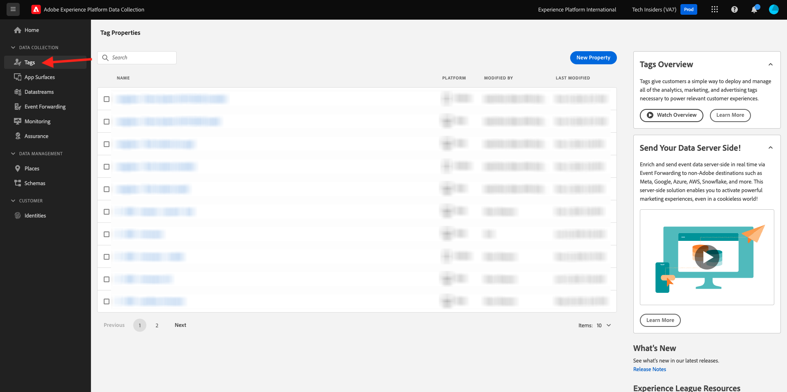

# 1.1.1 Informazioni sulla raccolta dei dati in Adobe Experience Platform

## Contesto

La Raccolta dati di Adobe Experience Platform viene utilizzata dai brand per diversi casi d’uso. Si tratta di un sistema Tag Management di nuova generazione (TMS) che offre ai clienti un modo semplice di implementare e gestire tutte le soluzioni di analisi, marketing e annunci pubblicitari necessarie per fornire ai clienti esperienze personalizzate. La raccolta dati di Adobe Experience Platform non comporta alcun costo aggiuntivo ed è disponibile per tutti i clienti Adobe Experience Cloud. Un brand può utilizzare Raccolta dati di Adobe Experience Platform per:

- Implementare applicazioni Adobe Experience Cloud e Adobe Experience Platform.
- Gestisci i diversi requisiti delle diverse parti dell&#39;organizzazione fornendo a ciascuna la propria **Proprietà** da gestire.
- Consenti test e gestione del ciclo di vita.
- Inserisci tag JavaScript personalizzati e di terze parti, tutti gestiti in un’unica posizione.

## Esplorare l’interfaccia utente

Vai a [Raccolta dati Adobe Experience Platform](https://experience.adobe.com/it#/data-collection/).

Vai a **Tag**. Visualizzazione **[!UICONTROL Proprietà]** in corso. Le proprietà elencate qui sono per la gestione dei tutorial. Queste proprietà rappresentano:

- Proprietà app e web
- Siti web diversi che servono i clienti in modi diversi. Ad esempio, Luma Retail avrebbe una proprietà, Luma Travel un’altra.
- Siti Web legacy e correnti
- Una progettazione Adobe Analytics specifica comune a più siti Web diversi
- Pagine intranet interne e siti esterni

Dai un&#39;occhiata alla barra a sinistra.

- **[!UICONTROL Tag]** offre una panoramica di tutte le proprietà lato client
- **[!UICONTROL Superfici app]** offre una panoramica di tutte le configurazioni di app per abilitare le notifiche push (utilizzate/abilitate in combinazione con Project Sierra)
- **[!UICONTROL Gli stream di dati]** sono analizzati nell&#39;[esercizio successivo](./ex2.md)
- **[!UICONTROL Inoltro eventi]** offre una panoramica di tutte le proprietà lato server esplorate in [Modulo 2.5 - Connessioni Real-Time CDP: inoltro eventi](./../../../../modules/delivery-activation/rtcdp-b2c/rtcdpb2c-5/aep-data-collection-ssf.md)
- **[!UICONTROL Il monitoraggio]** fornisce una panoramica del traffico degli eventi in entrata e in uscita tramite l&#39;inoltro degli eventi
- **[!UICONTROL Assurance]** fornisce l&#39;accesso per il debug di un&#39;implementazione tramite Adobe Debugger
- **[!UICONTROL Places]** consente di gestire i POI che diventano accessibili per la personalizzazione basata sulla posizione nelle applicazioni mobili
- **[!UICONTROL Schemi]** fornisce l&#39;accesso all&#39;editor schema di Adobe Experience Platform
- **[!UICONTROL Identities]** fornisce l&#39;accesso alla configurazione di Adobe Experience Platform Identity Graph

## Ulteriori informazioni

La raccolta dati di Adobe Experience Platform è uno strumento molto avanzato che ha un ambito che va oltre l’esercitazione di Adobe Experience Platform. È possibile che le organizzazioni non utilizzino la raccolta dati di Adobe Experience Platform per le funzionalità di gestione dei tag e utilizzino invece soluzioni di gestione tag non Adobe per l’inserimento di codice e la gestione dei tag. Adobe e Adobe Professional Services supportano l’utilizzo di una soluzione di gestione dei tag non Adobe.
Di seguito sono riportate alcune ulteriori informazioni per coloro che sono interessati a ulteriori informazioni sulla raccolta dati di Adobe Experience Platform.

- [Guida utente di Adobe Experience Platform Data Collection](https://experienceleague.adobe.com/docs/experience-platform/tags/home.html?lang=it)
- [Tutorial sull’implementazione di Adobe Experience Cloud con Web SDK](https://experienceleague.adobe.com/docs/platform-learn/implement-web-sdk/overview.html?lang=it)
- [Configurare le autorizzazioni utente](https://experienceleague.adobe.com/docs/experience-platform/tags/admin/user-permissions.html)
- [Documentazione API](https://developer.adobelaunch.com/api/)

## Passaggi successivi

Vai a [1.1.2 Edge Network, Datastreams e Raccolta dati lato server](./ex2.md){target="_blank"}

Torna a [Configurazione della raccolta dati di Adobe Experience Platform ed estensione tag Web SDK](./data-ingestion-launch-web-sdk.md){target="_blank"}

Torna a [Tutti i moduli](./../../../../overview.md){target="_blank"}
