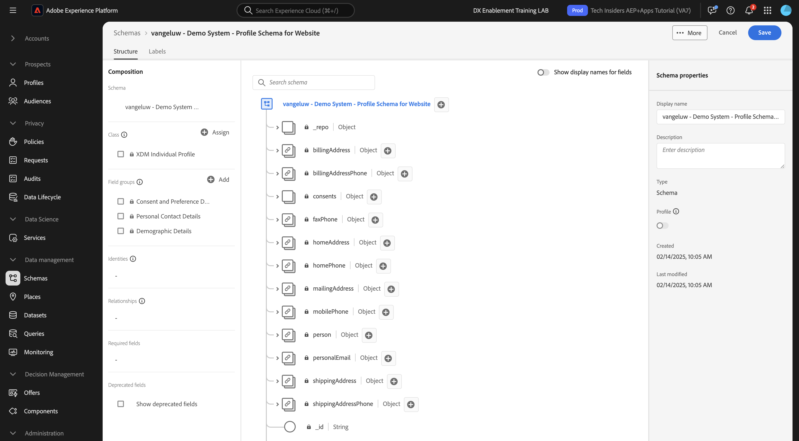
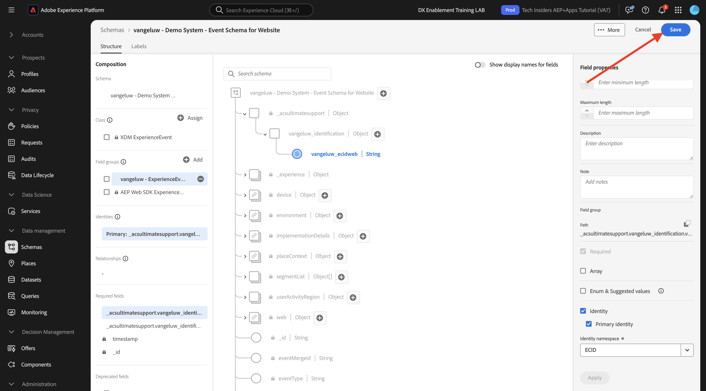

# 1.2.2 Configurare schemi e impostare identificatori

In questo esercizio esaminerai la configurazione degli schemi XDM richiesti per classificare le informazioni di profilo e il comportamento del cliente. In ogni schema XDM, vedrai anche che è definito un identificatore principale per collegare tutte le informazioni relative al cliente a.

## Storia

Prima di iniziare a configurare gli ID dello schema XDM e a definire gli identificatori, è necessario considerare il contesto di business di ciò che si sta tentando di fare:

- Desideri dati
- Desideri collegare i dati a un cliente
- Desideri creare un profilo cliente progressivo e in tempo reale

Esistono 2 tipi di dati che desideri acquisire:

- Chi è questo cliente?
- Cosa fa questo cliente?

Tuttavia, la domanda **Chi è questo cliente?** è una domanda molto aperta che ha molte risposte. Quando la tua organizzazione desidera vedere la risposta a questa domanda, stai cercando informazioni demografiche come Nome, Cognome e Indirizzo. Ma anche per informazioni di contatto come un indirizzo e-mail o un numero di telefono cellulare. E anche per informazioni collegate a Lingua, OptIn/OptOut e forse anche Immagini del profilo. Infine, quello che bisogna sapere è come identificare il cliente nei vari sistemi utilizzati dalla propria organizzazione.

Lo stesso vale per la domanda **Che cosa fa questo cliente?**. È una domanda molto aperta con molte risposte. Quando la tua organizzazione desidera vedere la risposta a questa domanda, stai cercando qualsiasi interazione che un cliente ha avuto con una qualsiasi delle tue proprietà online e offline. Quali pagine o prodotti sono stati visitati? Il cliente ha aggiunto un prodotto al carrello o acquistato un articolo? Quale dispositivo e browser è stato utilizzato per navigare nel sito web? Che tipo di informazioni sta cercando questo cliente e come possiamo utilizzarle per configurare e fornire al cliente un&#39;esperienza eccezionale? E infine, ciò che dobbiamo davvero sapere, è come identificheremo questo cliente nei vari sistemi che la vostra organizzazione utilizzerà.

## Chi è questo cliente

Acquisizione della risposta a **Chi è questo cliente?** per la tua organizzazione viene eseguito tramite la pagina di accesso/registrazione.

Dal punto di vista dello schema, questo viene considerato come una **classe**. La domanda: **Chi è questo cliente?** è definito nella classe **[!UICONTROL Profilo individuale XDM]**.

Quando si crea uno schema XDM per acquisire la risposta a **Chi è questo cliente?**, prima di tutto, devi creare e definire 1 schema che fa riferimento alla classe **[!UICONTROL Profilo individuale XDM]**.

Per specificare il tipo di risposte da fornire a tale domanda, è necessario definire [!UICONTROL Gruppi di campi]. [!UICONTROL I gruppi di campi] sono estensioni della classe Profile e dispongono di configurazioni molto specifiche. Ad esempio, informazioni demografiche come Nome, Cognome, Genere e Compleanno fanno parte del [!UICONTROL Gruppo di campi]: **[!UICONTROL Dettagli demografici]**.

In secondo luogo, l’organizzazione deve decidere come identificare questo cliente. Nel caso dell’organizzazione, l’identificatore principale di un cliente noto potrebbe essere un ID cliente specifico, ad esempio un indirizzo e-mail. Tecnicamente, tuttavia, esistono altri modi per identificare un cliente all’interno della tua organizzazione, come l’utilizzo di un numero di telefono cellulare.
In questo laboratorio, definiremo l’indirizzo e-mail come identificatore primario e il numero di telefono come identificatore secondario.

Infine, è importante distinguere il canale su cui sono stati acquisiti i dati. In questo caso, parleremo delle registrazioni dei siti Web e lo schema da definire deve riflettere **dove** sono stati acquisiti i dati di registrazione. Il canale avrà anche un ruolo importante nell’influenzare i dati acquisiti. Di conseguenza, è consigliabile definire gli schemi per ogni combinazione di canale, identificatore principale e tipo di dati raccolti.

In base a quanto sopra, gli schemi sono stati creati in Adobe Experience Platform.

Accedi a Adobe Experience Platform da questo URL: [https://experience.adobe.com/platform](https://experience.adobe.com/platform).

Dopo aver effettuato l’accesso, accedi alla home page di Adobe Experience Platform.

Prima di continuare, devi selezionare una **sandbox**. La sandbox da selezionare è denominata ``--aepSandboxName--``. Dopo aver selezionato la sandbox appropriata, la schermata cambia e ora sei nella sandbox dedicata.

In Adobe Experience Platform, fai clic su **[!UICONTROL Schemi]** nel menu sul lato sinistro dello schermo. Verrà visualizzato l&#39;elenco degli [!UICONTROL schemi] disponibili. Devi creare un nuovo schema. Per creare un nuovo schema, fare clic su **[!UICONTROL + Crea schema]**.

Seleziona **Manuale** e fai clic su **Seleziona**.

Quindi, seleziona **Profilo individuale** e fai clic su **Avanti**.

Immettere il nome dello schema in questo modo: `--aepUserLdap-- - Demo System - Profile Schema for Website`. Fai clic su **Fine**.

Viene creato un nuovo schema.

Ora è necessario definire quale risposta alla domanda **Chi è questo cliente?** dovrebbe essere simile a.
Nell’introduzione di questo laboratorio, abbiamo notato la necessità dei seguenti attributi per definire un cliente:

- Informazioni demografiche come nome, cognome e indirizzo
- Informazioni di contatto come l’indirizzo dell’abitazione, l’indirizzo e-mail o un numero di telefono cellulare
- Altre informazioni collegate a Lingua, OptIn/OptOut e forse anche Immagini del profilo.
- Identificatore principale di un cliente

Per rendere queste informazioni parte dello schema, devi aggiungere i seguenti [!UICONTROL Gruppi di campi] allo schema:

- Dettagli demografici (informazioni demografiche)
- Dati di contatto personali (informazioni di contatto)
- Dettagli su consenso e preferenze (altre informazioni)
- Gruppo di campi per l’identificazione del profilo personalizzato della tua organizzazione (identificatori primario e secondario)

Fai clic sul pulsante **+Aggiungi** in **Gruppi di campi**.

Nella schermata **[!UICONTROL Aggiungi gruppo di campi]**, seleziona il [!UICONTROL gruppo di campi] **[!UICONTROL Dettagli demografici]**, **[!UICONTROL Dettagli contatto personali]** e **[!UICONTROL Dettagli consenso e preferenze]**.

Fai clic sul pulsante **[!UICONTROL Aggiungi gruppi di campi]** per aggiungere il [!UICONTROL gruppo di campi] allo schema.

Ora avrai questo:

È quindi necessario un nuovo [!UICONTROL Gruppo di campi] per acquisire l&#39;**[!UICONTROL Identificatore]** utilizzato per la raccolta dati. Come hai visto nell’esercizio precedente, esiste un concetto di identificatori. L’identificatore primario è il più importante, in quanto tutti i dati raccolti saranno collegati a questo identificatore.

Ora creerai il tuo [!UICONTROL Gruppo di campi] personalizzato e come tale estenderai lo [!UICONTROL schema XDM] per soddisfare i requisiti della tua organizzazione.

Fai clic su **[!UICONTROL + Aggiungi]** in **Gruppi di campi** per iniziare ad aggiungere un [!UICONTROL Gruppo di campi].

Invece di riutilizzare un [!UICONTROL Gruppo di campi] esistente, ora creerai il tuo [!UICONTROL Gruppo di campi]. A tale scopo, selezionare **[!UICONTROL Crea nuovo gruppo di campi]**.

È ora necessario fornire **[!UICONTROL Nome visualizzato]** e **[!UICONTROL Descrizione]** per il nuovo [!UICONTROL Gruppo di campi].

Come nome dello schema, utilizzeremo quanto segue:
`--aepUserLdap-- - Profile Identification Field Group`

Fai clic sul pulsante **[!UICONTROL Aggiungi gruppi di campi]** per aggiungere il [!UICONTROL gruppo di campi] appena creato allo schema.

Ora disponi di questa struttura di schema.

Il nuovo [!UICONTROL Gruppo di campi] è ancora vuoto, quindi ora dovrai aggiungere campi a tale [!UICONTROL Gruppo di campi].
Nell&#39;elenco [!UICONTROL Gruppo di campi], fai clic sul tuo [!UICONTROL Gruppo di campi] personalizzato.

Ora vengono visualizzati diversi nuovi pulsanti.

Al livello superiore dello schema, fare clic sul pulsante **[!UICONTROL + Aggiungi campo]**.

Dopo aver fatto clic sul pulsante **[!UICONTROL + Aggiungi campo]**, viene visualizzato un nuovo campo senza titolo nello schema.

A questo punto è necessario immettere le informazioni di questo nuovo campo, utilizzando le seguenti definizioni di oggetto:

- Nome campo: **`--aepUserLdap--_identification`**
- Nome visualizzato: **`--aepUserLdap--_identification`**
- Tipo: **[!UICONTROL oggetto]**
- Gruppo di campi: **`--aepUserLdap-- - Profile Identification Field Group`**

Fare clic su **Applica**.

Verrà ora visualizzato un nuovo oggetto nello schema, che rappresenta un **[!UICONTROL oggetto]** personalizzato nello schema e che prende il nome dall&#39;ID tenant di Adobe Experience Platform. L&#39;ID tenant di Adobe Experience Platform è `--aepTenantId--` ed è univoco per ogni istanza di AEP.

Ora aggiungi un nuovo oggetto campi sotto tale tenant nell&#39;oggetto **identificazione** appena creato. Per iniziare ad aggiungere ogni singolo di questi 3 campi, fai clic sull&#39;icona **+** in **identificazione** per ogni campo.

Utilizza le informazioni seguenti per creare questi 3 nuovi campi nell&#39;oggetto **[!UICONTROL identity]**:

- ecid:
   - Nome campo: **`--aepUserLdap--_ecid`**
   - Nome visualizzato: **`--aepUserLdap--ecid`**
   - Tipo: **[!UICONTROL Stringa]**
   - Gruppo di campi: **`--aepUserLdap-- - Profile Identification Field Group`**

- emailId
   - Nome campo: **`--aepUserLdap--_emailId`**
   - Nome visualizzato: **`--aepUserLdap--_emailId`**
   - Tipo: **[!UICONTROL Stringa]**
   - Gruppo di campi: **`--aepUserLdap-- - Profile Identification Field Group`**

- cellulare
   - Nome campo: **`--aepUserLdap--_mobilenr`**
   - Nome visualizzato: **`--aepUserLdap--_mobilenr`**
   - Tipo: **[!UICONTROL Stringa]**
   - Gruppo di campi: **`--aepUserLdap-- - Profile Identification Field Group`**

Questo è il modo in cui ogni campo dovrebbe apparire dopo la configurazione iniziale del campo.

- `--aepUserLdap--_mobilenr`

Per salvare il campo, scorri verso il basso in **[!UICONTROL Proprietà campo]** fino a visualizzare il pulsante **[!UICONTROL Applica]**. Fare clic sul pulsante **[!UICONTROL Applica]**.

- `--aepUserLdap--_ecid`

Non dimenticare di scorrere verso il basso e fare clic su **Applica**.

- `--aepUserLdap--_emailId`

Non dimenticare di scorrere verso il basso e fare clic su **Applica**.

Ogni campo è definito come tipo **[!UICONTROL Stringa]** e questi campi verranno ora configurati come **[!UICONTROL Identità]**. Per questo schema, si presuppone che un cliente sarà sempre identificato dal suo indirizzo e-mail, il che significa che devi configurare il campo **[!UICONTROL emailId]** come identificatore **[!UICONTROL primary]** e gli altri campi come identificatori normali.

I 3 campi ora devono essere definiti come **[!UICONTROL Campi di identità]**.

Per iniziare a definire questi campi come campi **[!UICONTROL Identity]**, effettua le seguenti operazioni:

- Selezionare il campo **`--aepUserLdap--_emailId`**.
- Sul lato destro, nelle proprietà del campo, scorri verso il basso fino a visualizzare **[!UICONTROL Identità]**. Seleziona la casella di controllo per **[!UICONTROL Identità]**.

- Ora seleziona la casella di controllo per **[!UICONTROL Identità primaria]**.

- Infine, seleziona lo spazio dei nomi **[!UICONTROL E-mail]** dall&#39;elenco di **[!UICONTROL Spazi dei nomi]**. Uno spazio dei nomi viene utilizzato dal grafo delle identità in Adobe Experience Platform per classificare gli identificatori negli spazi dei nomi e definire la relazione tra tali spazi dei nomi. Fai clic su **[!UICONTROL Applica]** per salvare le modifiche.

Successivamente, è necessario definire gli altri campi per **`--aepUserLdap--_ecid`** e **`--aepUserLdap--_mobilenr`** come identificatori standard.

Selezionare il campo **`--aepUserLdap--_ecid`**. Sul lato destro, nelle proprietà del campo, scorri verso il basso fino a visualizzare **[!UICONTROL Identità]**. Seleziona la casella di controllo per **[!UICONTROL Identità]**.
Selezionare quindi lo spazio dei nomi **[!UICONTROL ECID]** dall&#39;elenco di **[!UICONTROL Spazi dei nomi]**.
Fai clic su **[!UICONTROL Applica]** per salvare le modifiche.

Selezionare il campo **`--aepUserLdap--_mobilenr`**. Sul lato destro, nelle proprietà del campo, scorri verso il basso fino a visualizzare **[!UICONTROL Identità]**. Seleziona la casella di controllo per **[!UICONTROL Identità]**.
Selezionare lo spazio dei nomi **[!UICONTROL Telefono]** dall&#39;elenco di **[!UICONTROL Spazi dei nomi]**.
Fai clic su **[!UICONTROL Applica]** per salvare le modifiche.

L&#39;oggetto **[!UICONTROL identity]** dovrebbe ora avere questo aspetto, con i 3 campi ID che ora mostrano anche un&#39;icona **[!UICONTROL impronta digitale]** per mostrare che sono stati definiti come identificatori.

Fai clic su **[!UICONTROL Salva]** per salvare le modifiche.

L&#39;ultima cosa da fare qui è attivare lo schema da collegare al **[!UICONTROL profilo]**.
Attivando lo schema per il profilo, ti assicuri che tutti i dati inviati a Adobe Experience Platform in base a questo schema facciano parte dell’ambiente Profilo cliente in tempo reale, il quale assicura che tutti i dati possano essere utilizzati in tempo reale per l’esecuzione di query, la segmentazione e l’attivazione.

A questo scopo, seleziona il nome dello schema.

Nella scheda a destra dello schema, fai clic sull&#39;interruttore **[!UICONTROL Profilo]**, attualmente disattivato.

Attiva il [!UICONTROL profilo] facendo clic su di esso.

Fai clic su **[!UICONTROL Abilita]** per abilitare questo schema per il profilo.

Lo schema è ora configurato per far parte di [!UICONTROL Real-time Customer Profile]. Fai clic su **[!UICONTROL Salva]** per salvare lo schema.

## Cosa fa questo cliente?

Acquisizione della risposta alla domanda **Quali operazioni svolge il cliente?** per la tua organizzazione viene eseguito tramite, ad esempio una visualizzazione prodotto in una pagina di prodotto.

Dal punto di vista dello schema, questo viene considerato come una **[!UICONTROL Classe]**. La domanda: **Cosa fa questo cliente?** è definito nella classe **[!UICONTROL ExperienceEvent]**.

Quando crei uno [!UICONTROL schema XDM] per acquisire la risposta a **Quali operazioni svolge il cliente?**, innanzitutto devi creare e definire 1 schema che fa riferimento alla classe **[!UICONTROL ExperienceEvent]**.

Per specificare il tipo di risposte da fornire a tale domanda, è necessario definire [!UICONTROL Gruppo di campi]. [!UICONTROL I gruppi di campi] sono estensioni della classe [!UICONTROL ExperienceEvent] e dispongono di configurazioni molto specifiche. Ad esempio, informazioni sul tipo di prodotti visualizzati o aggiunti al carrello da un cliente fanno parte del [!UICONTROL Gruppo di campi] **Dettagli Commerce**.

In secondo luogo, la tua organizzazione deve decidere come identificare il comportamento di questo cliente. Dal momento che stiamo parlando di interazioni su un sito web, è possibile che la tua organizzazione conosca il cliente, ma è ugualmente possibile che un visitatore anonimo sconosciuto sia attivo sul sito web. Quindi non possiamo usare un identificatore come l&#39;indirizzo e-mail. In questo caso, è probabile che l&#39;organizzazione decida di utilizzare [!UICONTROL Experience Cloud ID (ECID)] come identificatore primario.

Infine, è importante distinguere il canale su cui sono stati acquisiti i dati. In questo caso, parleremo delle interazioni con il sito Web e lo schema da definire deve riflettere **dove** sono stati acquisiti i dati di interazione. Il canale avrà anche un ruolo importante nell’influenzare i dati acquisiti. Di conseguenza, è consigliabile definire gli schemi per ogni combinazione di canale, identificatore principale e tipo di dati raccolti.

In base a quanto sopra, dovrai configurare uno schema in Adobe Experience Platform.

Dopo aver effettuato l’accesso, accedi alla home page di Adobe Experience Platform.

Prima di continuare, devi selezionare una **[!UICONTROL sandbox]**. La [!UICONTROL sandbox] da selezionare è denominata ``--aepSandboxName--``. Dopo aver selezionato la sandbox appropriata, la schermata cambia e ora sei nella sandbox dedicata.

In Adobe Experience Platform, fai clic su **[!UICONTROL Schemi]** nel menu sul lato sinistro dello schermo e passa a **Sfoglia**. Devi creare un nuovo schema. Per creare un nuovo schema, fare clic sul pulsante **[!UICONTROL + Crea schema]**.

Seleziona **Manuale** e fai clic su **Seleziona**.

Seleziona **Experience Event** e fai clic su **Next**.

Immettere un nome per lo schema, ad esempio: `--aepUserLdap-- - Demo System - Event Schema for Website`. Fai clic su **Fine**.

Viene creato un nuovo schema e puoi configurare i dati da raccogliere in base a esso.

Ora è necessario definire una risposta alla domanda **Che cosa fa questo cliente?** dovrebbe essere simile a.
Nell’introduzione di questo laboratorio, abbiamo notato la necessità dei seguenti attributi per definire ciò che un cliente fa:

- Quali pagine o prodotti sono stati visitati?
- Il cliente ha aggiunto un prodotto al carrello o acquistato un articolo?
- Quale dispositivo e browser è stato utilizzato per navigare nel sito web?
- Che tipo di informazioni sta cercando questo cliente e come possiamo utilizzarle per configurare e fornire al cliente un&#39;esperienza eccezionale?
- Identificatore principale di un cliente

Per rendere queste informazioni parte dello schema, devi aggiungere il seguente [!UICONTROL Gruppo di campi] allo schema:

- AEP Web SDK ExperienceEvent
- Identificazione profilo personalizzata [!UICONTROL Gruppo di campi] della tua organizzazione

Fare clic su **+ Aggiungi** in **Gruppi di campi**.

Nella schermata **[!UICONTROL Aggiungi gruppo di campi]**, seleziona il [!UICONTROL gruppo di campi] **[!UICONTROL AEP Web SDK ExperienceEvent]**. Fare clic su **[!UICONTROL Aggiungi gruppi di campi]**.

A questo punto si otterrà:

È quindi necessario creare un nuovo [!UICONTROL Gruppo di campi] per acquisire l&#39;**[!UICONTROL Identificatore]** utilizzato per la raccolta dati.

Ora creerai il tuo [!UICONTROL Gruppo di campi] personalizzato e come tale estenderai lo [!UICONTROL schema XDM] per soddisfare i requisiti della tua organizzazione.

Un [!UICONTROL Gruppo di campi] è collegato a una [!UICONTROL Classe], pertanto non è possibile riutilizzare semplicemente il [!UICONTROL Gruppo di campi] creato in precedenza.

Fai clic sul pulsante **[!UICONTROL + Aggiungi]** per iniziare ad aggiungere un [!UICONTROL gruppo di campi].

Invece di riutilizzare un [!UICONTROL Gruppo di campi] esistente, ora creerai il tuo [!UICONTROL Gruppo di campi]. Seleziona **[!UICONTROL Crea nuovo gruppo di campi]** e immetti il nome del gruppo di campi, come segue: `--aepUserLdap-- - ExperienceEvent Identification Field Group`.
Fai clic su **Aggiungi gruppi di campi**

La struttura [!UICONTROL Schema] deve essere ora attiva.

Il nuovo [!UICONTROL Gruppo di campi] è ancora vuoto, quindi è necessario aggiungere campi a tale gruppo di campi.
Nell&#39;elenco [!UICONTROL Gruppo di campi], fai clic sul tuo [!UICONTROL Gruppo di campi] personalizzato.

Ora vengono visualizzati diversi nuovi pulsanti.

Nel livello principale dello schema, accanto al nome dello schema, fare clic sul pulsante **[!UICONTROL +]**.

Dopo aver fatto clic sul pulsante **+**, verrà visualizzato un nuovo campo senza titolo nello schema.

Utilizza questa opzione per definire il nuovo campo:

- Nome campo: **`--aepUserLdap--_identification`**
- Nome visualizzato: **`--aepUserLdap--_identification`**
- Tipo: **[!UICONTROL oggetto]**
- Gruppo di campi: `--aepUserLdap-- - ExperienceEvent Identification Field Group`

Fare clic su **Applica**.

Il nuovo campo viene ora creato con il tuo ID tenant Adobe Experience Platform. L&#39;ID tenant Adobe Experience Platform è `--aepTenantId--`.

Ora aggiungi 1 nuovo campo sotto l&#39;oggetto **[!UICONTROL identity]**.

Fai clic sul pulsante **[!UICONTROL +]** accanto all&#39;oggetto **[!UICONTROL identity]** per creare un nuovo campo.

Il campo ECID sarà definito come tipo **[!UICONTROL Stringa]** e configurerai questo campo come **[!UICONTROL Identità]**. Per lo schema **[!UICONTROL Demo System - Event Schema for Website]**, si presuppone che un cliente sarà sempre identificato dal proprio [!UICONTROL ECID], il che significa che è necessario configurare il campo **[!UICONTROL ECID]** come identificatore **primary**

Ora hai un campo vuoto. Devi configurare il campo precedente come indicato.

- ecid:

   - Nome campo: **`--aepUserLdap--_ecidweb`**
   - Nome visualizzato: **`--aepUserLdap--_ecidweb`**
   - Tipo: **[!UICONTROL Stringa]**
   - Gruppo di campi: `--aepUserLdap-- - ExperienceEvent Identification Field Group`

Il campo `--aepUserLdap--_ecidweb` deve essere visualizzato in questo modo dopo la configurazione iniziale del campo:

Scorri verso il basso e fai clic su **[!UICONTROL Applica]**.

Ora hai un nuovo campo, ma questo campo non è ancora stato definito come campo **[!UICONTROL Identità]**.

Per iniziare a definire questi campi come campi **[!UICONTROL Identità]**, selezionare il campo **`--aepUserLdap--_ecidweb`**.
Sul lato destro, nelle proprietà del campo, scorri verso il basso fino a visualizzare **[!UICONTROL Identità]**. Selezionare la casella di controllo per **[!UICONTROL Identità]** e la casella di controllo per **[!UICONTROL Identità primaria]**.
Selezionare lo spazio dei nomi **[!UICONTROL ECID]** dall&#39;elenco di **[!UICONTROL Spazi dei nomi]**.

Fai clic su **[!UICONTROL Applica]** per salvare le modifiche.

L&#39;oggetto **[!UICONTROL identity]** dovrebbe ora avere questo aspetto, con il campo ecid che ora mostra anche un&#39;icona **impronta digitale** per mostrare che sono stati definiti come identificatori.
Fai clic su **[!UICONTROL Salva]** per salvare le modifiche.

È importante notare che quando alla fine si acquisiscono dati in base a questo schema, alcuni campi sono obbligatori.
Ad esempio, i campi **[!UICONTROL _id]** e **[!UICONTROL timestamp]** sono campi obbligatori, un requisito imposto dalla classe ExperienceEvent.

- _id deve contenere un id univoco per una specifica acquisizione di dati
- la marca temporale deve essere la marca temporale di questo hit, nel formato **`"YYYY-MM-DDTHH:MM:SSSZ"`**, come ad esempio: **`"2024-11-18T07:20:000Z"`**

Hai definito uno schema, collegato [!UICONTROL Gruppi di campi] esistenti e appena creati e disponi di identificatori definiti.

L&#39;ultima cosa da fare qui è attivare lo schema da collegare al **[!UICONTROL profilo]**.
Attivando lo schema per [!UICONTROL Profilo], assicurati che tutti i dati inviati a Adobe Experience Platform in base a questo schema facciano parte di Real-time Customer Profile, che garantisce che tutti i dati possano essere utilizzati in tempo reale per l&#39;esecuzione di query, la segmentazione e l&#39;attivazione.

A questo scopo, fai clic sul nome dello schema.

Nella scheda a destra dello schema verrà visualizzata l&#39;opzione **[!UICONTROL Profilo]**, attualmente disattivata. Fare clic su [!UICONTROL Profilo] per attivarlo.

Vedrai questo messaggio. Fai clic su **[!UICONTROL Abilita]** per abilitare questo schema per il profilo.

Lo schema è ora configurato per far parte di Real-time Customer Profile.

Fai clic su **[!UICONTROL Salva]** per salvare lo schema.

Ora hai completato la creazione di schemi attivati per essere utilizzati nel Profilo cliente in tempo reale.

Nel prossimo esercizio esamineremo i set di dati.

## Passaggi successivi

Vai a [1.2.3 Configurare i set di dati](./ex3.md){target="_blank"}

Torna a [Acquisizione dati](./data-ingestion.md){target="_blank"}

Torna a [Tutti i moduli](./../../../../overview.md){target="_blank"}
