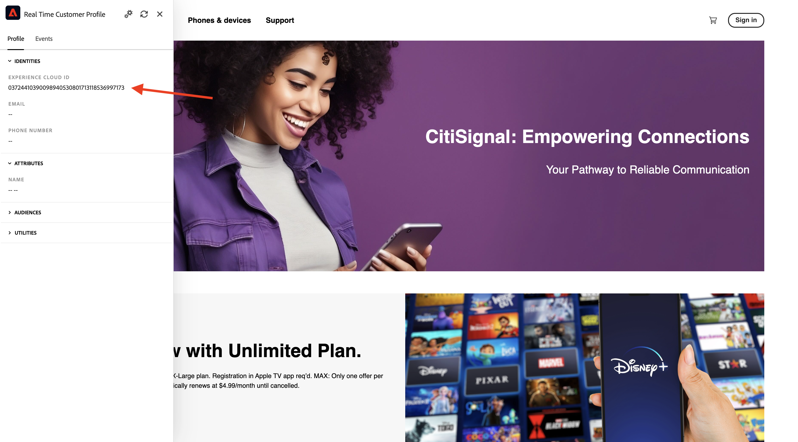
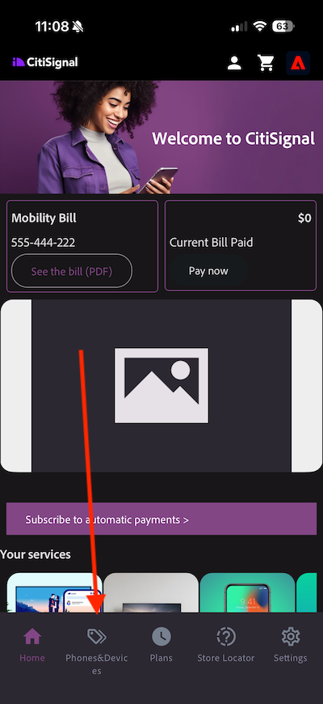
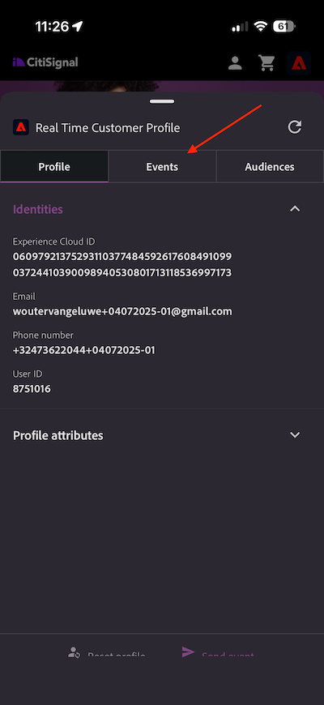
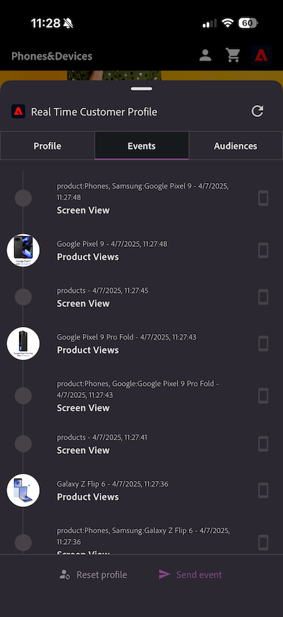

# 2.1.1 Da sconosciuto a noto sul sito web

## Contesto

Il percorso da sconosciuto a noto è uno degli argomenti più importanti tra i brand di oggi, così come il percorso del cliente dall&#39;acquisizione alla conservazione.

Adobe Experience Platform gioca un ruolo fondamentale in questo percorso. Platform è il cervello della comunicazione, il &quot;sistema di esperienza di registrazione&quot;.

Platform è un ambiente in cui la parola cliente è più ampia rispetto ai soli clienti noti. Un visitatore sconosciuto sul sito web è anche un cliente dal punto di vista di Platform e, come tale, anche tutto il comportamento di un visitatore sconosciuto viene inviato a Platform. Grazie a questo approccio, quando il visitatore diventa un cliente noto, un brand può visualizzare anche quello che è successo prima di quel momento. Questo è utile dal punto di vista dell’attribuzione e dell’ottimizzazione dell’esperienza.

## Flusso di percorso cliente

Vai a [https://dsn.adobe.com](https://dsn.adobe.com). Dopo aver effettuato l’accesso con il tuo Adobe ID, visualizzerai questo. Fai clic sui tre punti **...** del progetto del sito Web, quindi fai clic su **Esegui** per aprirlo.

Poi vedrai il tuo sito web demo aperto. Seleziona l’URL e copialo negli Appunti.

Apri una nuova finestra del browser in incognito.

Incolla l’URL del sito web demo, che hai copiato nel passaggio precedente. Ti verrà quindi chiesto di effettuare l’accesso con il tuo Adobe ID.

Seleziona il tipo di account e completa la procedura di accesso.

Vedrai quindi il tuo sito web caricato in una finestra del browser in incognito. Per ogni esercizio, dovrai utilizzare una nuova finestra del browser in incognito per caricare l’URL del sito web demo.

Fai clic sull’icona del logo Adobe nell’angolo in alto a sinistra dello schermo per aprire il Visualizzatore profili.

Dai un&#39;occhiata al pannello Visualizzatore profili e al Profilo cliente in tempo reale con **Experience Cloud ID** come identificatore primario per questo cliente attualmente sconosciuto.

Puoi anche visualizzare tutti gli eventi esperienza che sono stati raccolti in base al comportamento del cliente. L’elenco è attualmente vuoto, ma cambierà presto.

Vai alla categoria di prodotto **Telefoni e dispositivi**. Fare clic sul prodotto **iPhone 16 Pro**.

Viene visualizzata la pagina dei dettagli del prodotto. Un evento di tipo **Visualizzazione prodotto** è stato ora inviato a Adobe Experience Platform utilizzando l&#39;implementazione Web SDK esaminata nel modulo 1.

Apri il pannello Provile Viewer e osserva i tuoi **eventi**.

Torna alla pagina della categoria **Telefoni e dispositivi** e fai clic su un altro prodotto. Un altro evento esperienza è stato inviato a Adobe Experience Platform. Apri il pannello Visualizzatore profili. Verranno visualizzati 2 eventi di tipo **Visualizzazione prodotto**. Anche se il comportamento è anonimo, con il consenso adeguato sul posto, puoi tenere traccia di ogni clic e memorizzarlo in Adobe Experience Platform. Una volta che il cliente anonimo verrà a conoscenza, saremo in grado di unire automaticamente tutti i comportamenti anonimi al profilo know.

Fai clic su **Accedi**.

Fai clic su **Crea un account**.

Compila i tuoi dettagli e fai clic su **Registra** dopo di che sarai reindirizzato alla pagina precedente.

Apri il pannello Visualizzatore profilo e passa a Profilo cliente in tempo reale. Nel pannello Visualizzatore profili dovresti visualizzare tutti i dati personali, come gli identificatori e-mail e telefonici appena aggiunti.

Nel pannello Visualizzatore profili, vai a Eventi esperienza. Nel pannello Visualizzatore profili vengono visualizzati i 2 prodotti precedenti. Entrambi gli eventi sono ora connessi anche al tuo profilo &quot;noto&quot;.

Ora che hai acquisito i dati in Adobe Experience Platform, li hai collegati a identificatori come ECID e indirizzi e-mail. L&#39;obiettivo è quello di capire il contesto di business di ciò che si sta per fare. Nel prossimo esercizio, inizierai a configurare tutto il necessario per rendere possibile l’acquisizione dei dati.

### Navigare nell’app mobile

Dopo essere diventato un cliente noto, è ora di iniziare a utilizzare l’app mobile. Apri l’app mobile sul tuo iPhone, quindi accedi all’app.

Se l&#39;app non è più installata o se non ricordi come installarla, consulta questa pagina: [Usa l&#39;app mobile](../../../getting-started/gettingstarted/ex5.md)

Dopo aver installato l’app secondo le istruzioni, viene visualizzata la pagina di destinazione dell’app con il brand Citignal caricato. Fai clic sull’icona dell’account nella parte in alto a sinistra della schermata.

Nella schermata Login, accedi con l’indirizzo e-mail utilizzato sul sito web desktop. Fai clic su **Accesso**.

Verrà quindi visualizzata una conferma dell&#39;accesso.

Passa alla schermata iniziale dell&#39;app e vai alla pagina **Telefoni e dispositivi**.

Fai clic su qualsiasi prodotto nella pagina.

Viene visualizzata la pagina dei dettagli del prodotto.

Vai alla schermata iniziale dell’app e fai clic sull’icona Adobe per visualizzare il pannello Visualizzatore profili. Verrà quindi visualizzata la visualizzazione **Attributi profilo**, che ora mostra una visualizzazione combinata dell&#39;attività Web e dell&#39;app mobile. Vai a **Eventi**

Vedrai quindi il prodotto appena visualizzato nella sezione **Eventi esperienza**, insieme a tutte le visualizzazioni prodotto della sessione del sito Web precedente.

>[!NOTE]
>
>Potrebbero essere necessari un paio di minuti prima di visualizzare la visualizzazione consolidata nell’app e sul sito web.

Tornare al computer desktop e aggiornare la home page, dopodiché verrà visualizzato anche il prodotto.

>[!NOTE]
>
>Potrebbero essere necessari un paio di minuti prima di visualizzare la visualizzazione consolidata nell’app e sul sito web.

Ora che hai acquisito i dati in Adobe Experience Platform, li hai collegati a identificatori come ECID e indirizzi e-mail. L&#39;obiettivo di questo esercizio era quello di comprendere il contesto aziendale di ciò che si stava per fare. Ora hai creato in modo efficace un profilo cliente multi-dispositivo in tempo reale. Nel prossimo esercizio, procederai con la visualizzazione del tuo profilo in Adobe Experience Platform.

## Passaggi successivi

Vai a [2.1.2 Visualizzare il tuo profilo cliente in tempo reale - Interfaccia utente](./ex2.md){target="_blank"}

Torna a [Profilo cliente in tempo reale](./real-time-customer-profile.md){target="_blank"}

Torna a [Tutti i moduli](./../../../../overview.md){target="_blank"}
