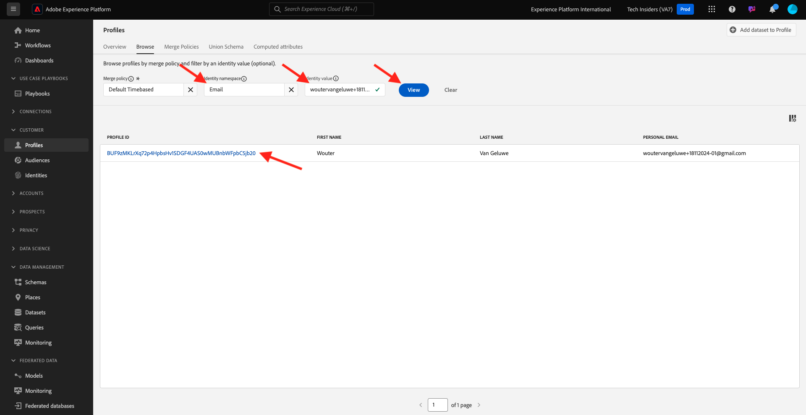

# 2.1.2 Visualizza il tuo Real-time Customer Profile - UI

In questo esercizio, accederai a Adobe Experience Platform e visualizzerai il tuo Real-time Customer Profile nell’interfaccia utente di.

## Contesto

In Real-time Customer Profile, tutti i dati di profilo vengono visualizzati insieme ai dati di evento, così come le appartenenze ai segmenti esistenti. I dati visualizzati possono provenire da qualsiasi luogo, da applicazioni Adobe e soluzioni esterne. Questa è la visualizzazione più potente di Adobe Experience Platform, il vero sistema di esperienza di registrazione.

## Utilizzare la vista Profilo cliente in Adobe Experience Platform

Vai a [Adobe Experience Platform](https://experience.adobe.com/platform). Dopo aver effettuato l’accesso, accedi alla home page di Adobe Experience Platform.

Prima di continuare, devi selezionare una **sandbox**. La sandbox da selezionare è denominata ``--aepSandboxName--``. Dopo aver selezionato la [!UICONTROL sandbox] appropriata, la schermata verrà modificata e ora sei nella [!UICONTROL sandbox] dedicata.

Nel menu a sinistra, vai a **Profili** e a **Sfoglia**.

Nel pannello Visualizzatore profili del sito web, puoi trovare più identità. Ogni identità è collegata a uno spazio dei nomi.

Nel pannello Visualizzatore profili puoi vedere le seguenti combinazioni di ID e spazi dei nomi:

| Identità | Namespace |
|:-------------:| :---------------:|
| Experience Cloud ID (ECID) | 79943948563923140522865572770524243489 |
| Experience Cloud ID (ECID) | 70559351147248820114888181867542007989 |
| ID e-mail | woutervangeluwe+18112024-01@gmail.com |
| ID numero cellulare | +32473622044+18112024-01 |

Con Adobe Experience Platform, tutti gli ID sono ugualmente importanti. In precedenza, l’ECID era l’ID più importante nel contesto di Adobe e tutti gli altri ID erano collegati all’ECID in una relazione gerarchica. Con Adobe Experience Platform questo non avviene più e ogni ID può essere considerato un identificatore primario.

In genere, l’identificatore primario dipende dal contesto. Se si chiede al call center, **Qual è l&#39;ID più importante?** probabilmente risponderanno, **il numero di telefono!** Ma se chiedi al tuo team CRM, ti risponderanno, **l&#39;indirizzo e-mail!** Adobe Experience Platform è consapevole di questa complessità e la gestisce al meglio. Ogni applicazione, sia essa Adobe o non Adobe, parlerà con Adobe Experience Platform facendo riferimento all’ID che considera primario. E funziona semplicemente.

Per il campo **Spazio dei nomi identità**, seleziona **E-mail** e per il campo **Valore identità** immetti l&#39;indirizzo e-mail utilizzato per la registrazione nell&#39;esercizio precedente. Fare clic su **Visualizza**. Visualizzerai quindi il tuo profilo nell’elenco. Fai clic sul **ID profilo** per aprire il tuo profilo.

Ora puoi vedere una panoramica di alcuni importanti **Attributi del profilo** del tuo profilo cliente. Per visualizzare tutti gli attributi di profilo disponibili per il tuo profilo, fai clic su **Attributi**.

Viene quindi visualizzato un elenco completo di tutti gli attributi.

Vai a **Eventi**, dove puoi visualizzare le voci per ogni evento esperienza collegato al tuo profilo.

Infine, passare all&#39;opzione di menu **Appartenenza al pubblico**. Qui troverai tutti i tipi di pubblico idonei per questo cliente. L’elenco potrebbe essere vuoto, ma questo cambierà nei moduli successivi.

Ora che hai imparato a visualizzare il profilo in tempo reale di un cliente utilizzando l’interfaccia utente di Adobe Experience Platform, facciamo lo stesso attraverso le API utilizzando Postman e Adobe I/O per eseguire query sulle API di Adobe Experience Platform.

## Passaggi successivi

Vai a [2.1.3 Visualizzare il tuo profilo cliente in tempo reale - API](./ex3.md){target="_blank"}

Torna a [Profilo cliente in tempo reale](./real-time-customer-profile.md){target="_blank"}

Torna a [Tutti i moduli](./../../../../overview.md){target="_blank"}
