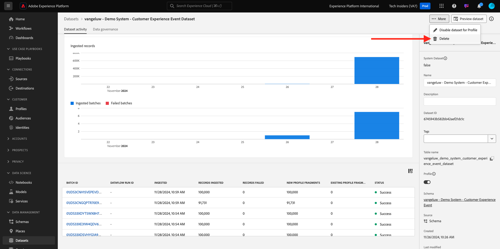

# 2.2.3 IA per l’analisi dei clienti - Dashboard di punteggio e segmentazione (Predict &amp; Take Action)

Una volta completata l’esecuzione di un modello, l’istanza di IA per l’analisi dei clienti ti consente di visualizzare il punteggio di propensione valutato per prevedere un cliente che effettua un acquisto nei successivi 30 giorni.

>[!NOTE]
>
>Solo un&#39;istanza di IA per l&#39;analisi dei clienti con stato **Operazione riuscita** ti consentirà di visualizzare in anteprima le informazioni del servizio.

## Previsione tendenza

Esaminiamo ora la tendenza prevista generata dal modello di istanza di IA per l’analisi dei clienti. Fai clic sul nome dell’istanza per visualizzare il dashboard.

La dashboard di IA per l’analisi dei clienti mostra il riepilogo relativo a punteggio, distribuzione della popolazione e fattori influenti per il modello da valutare.

Passa il mouse sui fattori influenti per visualizzare l’ulteriore suddivisione della distribuzione dei dati.

## Azioni aziendali

### Segmentazione dei clienti

La dashboard di Customer AI consente di definire i segmenti con un solo clic. Fai clic sul pulsante **Crea segmento** nelle schede delle tendenze.

Vedrai che viene creata automaticamente una definizione di segmento.

Assegna un nome al segmento seguendo questa convenzione di denominazione: `--aepUserLdap-- - Customer AI High Propensity`. Fai clic su **Pubblica**.

Ora puoi utilizzare questo segmento per il targeting utilizzando ad esempio Real-time CDP, Journey Optimizer e Adobe Target.

## Pulizia

Per assicurarsi che nell&#39;ambiente non vengano conservati dati demo non necessari, assicurarsi di eliminare il set di dati `--aepUserLdap-- - Demo System - Customer Experience Event Dataset` dopo aver completato correttamente questo esercizio. Se non elimini i dati demo, si avrà un impatto sui costi per l’istanza AEP.

## Passaggi successivi

Torna a [Intelligent Services](./intelligent-services.md){target="_blank"}

Torna a [Tutti i moduli](./../../../../overview.md){target="_blank"}
