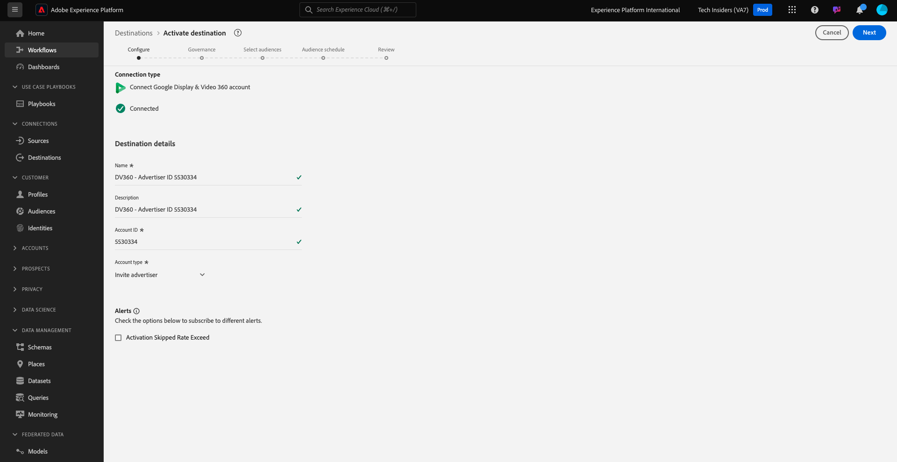

# 2.3.2 Configurare una destinazione Advertising come Google DV360

>[!IMPORTANT]
>
>Il contenuto seguente è parzialmente destinato ad essere utilizzato come indice analitico. Se tale destinazione esiste già nell&#39;istanza, **NOT** dovrà configurare una nuova destinazione per DV360. La destinazione è già stata creata in questo caso ed è possibile utilizzarla nell&#39;esercizio successivo.

Vai a [Adobe Experience Platform](https://experience.adobe.com/platform). Dopo aver effettuato l’accesso, accedi alla home page di Adobe Experience Platform.

Prima di continuare, devi selezionare una **sandbox**. La sandbox da selezionare è denominata ``--aepSandboxName--``. Dopo aver selezionato la [!UICONTROL sandbox] appropriata, la schermata verrà modificata e ora sei nella [!UICONTROL sandbox] dedicata.

Nel menu a sinistra, vai a **Destinazioni**, quindi vai a **Catalogo**. Verrà quindi visualizzato il **Catalogo destinazioni**.

In **Destinazioni**, fare clic su **Google Display &amp; Video 360** e quindi su **+ Configurazione**.

Poi vedrai questo. Fai clic su **Connetti alla destinazione**.

Nella schermata successiva è possibile configurare la destinazione su Google DV360.

Immettere un valore nei campi **Nome** e **Descrizione**.

Il campo **ID account** è **ID inserzionista** dell&#39;account DV360. Puoi trovarlo qui:

Il tipo di account **Tipo di account** deve essere impostato su **Invita inserzionista**.

Ora ce l&#39;hai. Fai clic su **Avanti**.

>[!NOTE]
>
>Google deve inserire nell&#39;elenco Consentiti Adobe affinché Adobe Experience Platform possa inviare dati a Google DV360. Contatta il tuo Google Account Manager per abilitare questo flusso di dati.

Dopo aver creato la destinazione, visualizzerai questo. È possibile selezionare un criterio di governance dei dati. Fare clic su **Salva ed esci**.

Viene quindi visualizzato un elenco delle destinazioni disponibili.
Nell&#39;esercizio successivo, il pubblico creato nell&#39;esercizio precedente verrà collegato alla destinazione di Google DV360.

## Passaggi successivi

Vai a [2.3.3 Azione: invia il pubblico a DV360](./ex3.md){target="_blank"}

Torna a [Real-time CDP - Crea un pubblico e intervieni](./real-time-cdp-build-a-segment-take-action.md){target="_blank"}

Torna a [Tutti i moduli](./../../../../overview.md){target="_blank"}
