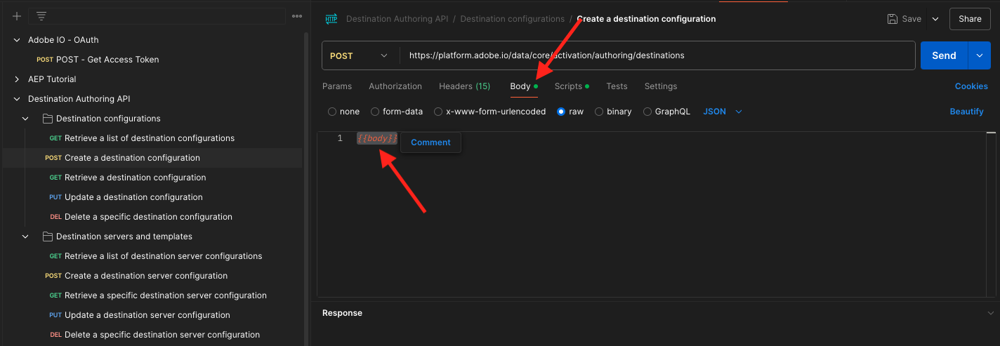

# 2.3.6 Destinazioni SDK

## Configurare il progetto Adobe I/O

In questo esercizio utilizzerai nuovamente Adobe I/O per eseguire query sulle API di Adobe Experience Platform. Se non hai ancora configurato il progetto Adobe I/O, torna all&#39;[Esercizio 3 nel Modulo 2.1](../rtcdpb2c-1/ex3.md) e segui le istruzioni.

>[!IMPORTANT]
>
>Se sei un dipendente Adobe, segui le istruzioni qui riportate per utilizzare [PostBuster](./../../../../modules/getting-started/gettingstarted/ex8.md).

## Autenticazione per Adobe I/O

In questo esercizio utilizzerai nuovamente Postman per eseguire query sulle API di Adobe Experience Platform. Se non hai ancora configurato l&#39;applicazione Postman, torna all&#39;[Esercizio 3 nel Modulo 2.1](../rtcdpb2c-1/ex3.md) e segui le istruzioni.

>[!IMPORTANT]
>
>Se sei un dipendente Adobe, segui le istruzioni qui riportate per utilizzare [PostBuster](./../../../../modules/getting-started/gettingstarted/ex8.md).

## Definire endpoint e formato

Per questo esercizio, dovrai configurare un endpoint in modo che, quando un pubblico si qualifica, l’evento di qualifica possa essere inviato in streaming a tale endpoint. In questo esercizio utilizzerai un endpoint di esempio utilizzando [https://pipedream.com/requestbin](https://pipedream.com/requestbin). Vai a [https://pipedream.com/requestbin](https://pipedream.com/requestbin), crea un account e quindi crea un&#39;area di lavoro. Una volta creata l’area di lavoro, verrà visualizzato qualcosa di simile a questo.

Fai clic su **copia** per copiare l&#39;URL. Nel prossimo esercizio dovrai specificare questo URL. L&#39;URL in questo esempio è `https://eodts05snjmjz67.m.pipedream.net`.


Per quanto riguarda il formato, utilizzeremo un modello standard che trasmetterà in streaming i requisiti o le non qualifiche del pubblico insieme a metadati come gli identificatori dei clienti. I modelli possono essere personalizzati per soddisfare le aspettative di endpoint specifici, ma in questo esercizio riutilizzeremo un modello standard, che si tradurrà in un payload come questo che verrà inviato in streaming all’endpoint.

```json
{
  "profiles": [
    {
      "identities": [
        {
          "type": "ecid",
          "id": "64626768309422151580190219823409897678"
        }
      ],
      "AdobeExperiencePlatformSegments": {
        "add": [
          "f58c723c-f1e5-40dd-8c79-7bb4ab47f041"
        ],
        "remove": []
      }
    }
  ]
}
```

## Creare una configurazione di server e modelli

Il primo passaggio per creare una tua destinazione in Adobe Experience Platform consiste nel creare una configurazione di server e modelli utilizzando Postman.

Per farlo, apri l&#39;applicazione Postman e vai a **API di authoring delle destinazioni**, ai **server e modelli di destinazione** e fai clic per aprire la richiesta **POST - Crea una configurazione del server di destinazione**.

>[!NOTE]
>
>Se non disponi della raccolta Postman, torna all&#39;esercizio 3 [del modulo 2.1](../rtcdpb2c-1/ex3.md) e segui le istruzioni per configurare Postman con le raccolte Postman fornite.

Poi vedrai questo. In **Intestazioni**, devi aggiornare manualmente il valore per la chiave **x-sandbox-name** e impostarlo su `--aepSandboxName--`. Selezionare il valore **{{SANDBOX_NAME}}**.


Sostituiscilo con `--aepSandboxName--`.


Quindi, vai a **Corpo**. selezionare il segnaposto **{{body}}**.


Sostituire il segnaposto **{{body}}** con il codice seguente:

```json
{
    "name": "Custom HTTP Destination",
    "destinationServerType": "URL_BASED",
    "urlBasedDestination": {
        "url": {
            "templatingStrategy": "PEBBLE_V1",
            "value": "yourURL"
        }
    },
    "httpTemplate": {
        "httpMethod": "POST",
        "requestBody": {
            "templatingStrategy": "PEBBLE_V1",
            "value": "{\n    \"profiles\": [\n    \n        {\n            \"identities\": [\n            \n            \n                \n                {\n                    \"type\": \"{{ namespace }}\",\n                    \"id\": \"{{ identity.id }}\"\n                },\n                ,\n            \n            ],\n            \"AdobeExperiencePlatformSegments\": {\n                \"add\": [\n                \n                    \"{{ segment.key }}\",\n                \n                ],\n                \"remove\": [\n                {#- Alternative syntax for filtering segments by status: -#}\n                \n                    \"{{ segment.key }}\",\n                \n                ]\n            }\n        },\n    \n    ]\n}"
        },
        "contentType": "application/json"
    }
}
```

Dopo aver incollato il codice precedente, è necessario aggiornare manualmente il campo **urlBasedDestination.url.value** e impostarlo sull&#39;URL del webhook creato nel passaggio precedente, che era `https://eodts05snjmjz67.m.pipedream.net` in questo esempio.


Dopo aver aggiornato il campo **urlBasedDestination.url.value**, dovrebbe essere simile al seguente. Fai clic su **Invia**.


>[!NOTE]
>
>Non dimenticare che prima di inviare una richiesta ad Adobe I/O, devi disporre di un `access_token` valido. Per ottenere un `access_token` valido, esegui la richiesta **POST - Ottieni token di accesso** nella raccolta **Adobe IO - OAuth**.

Dopo aver fatto clic su **Invia**, verrà creato il modello del server e come parte della risposta verrà visualizzato un campo denominato **instanceId**. Scrivilo, come ti servirà nel passaggio successivo. In questo esempio, **instanceId** è
`52482c90-8a1e-42fc-b729-7f0252e5cebd`.


## Creare la configurazione di destinazione

In Postman, in **Destination Authoring API**, vai a **Destination configurations** e fai clic per aprire la richiesta **POST - Create a destination configuration**. Poi vedrai questo. In **Intestazioni**, devi aggiornare manualmente il valore per la chiave **x-sandbox-name** e impostarlo su `--aepSandboxName--`. Selezionare il valore **{{SANDBOX_NAME}}** e sostituirlo con `--aepSandboxName--`.


Quindi, vai a **Corpo**. selezionare il segnaposto **{{body}}**.



Sostituire il segnaposto **{{body}}** con il codice seguente:

```json
{
    "name": "--aepUserLdap-- - Webhook",
    "description": "Exports segment qualifications and identities to a custom webhook via Destination SDK.",
    "status": "TEST",
    "customerAuthenticationConfigurations": [
        {
            "authType": "BEARER"
        }
    ],
    "customerDataFields": [
        {
            "name": "endpointsInstance",
            "type": "string",
            "title": "Select Endpoint",
            "description": "We could manage several instances across the globe for REST endpoints that our customers are provisioned for. Select your endpoint in the dropdown list.",
            "isRequired": true,
            "enum": [
                "US",
                "EU",
                "APAC",
                "NZ"
            ]
        }
    ],
    "uiAttributes": {
        "documentationLink": "https://experienceleague.adobe.com/docs/experience-platform/destinations/home.html?lang=it",
        "category": "streaming",
        "connectionType": "Server-to-server",
        "frequency": "Streaming"
    },
    "identityNamespaces": {
        "ecid": {
            "acceptsAttributes": true,
            "acceptsCustomNamespaces": false
        }
    },
    "segmentMappingConfig": {
        "mapExperiencePlatformSegmentName": true,
        "mapExperiencePlatformSegmentId": true,
        "mapUserInput": false
    },
    "aggregation": {
        "aggregationType": "BEST_EFFORT",
        "bestEffortAggregation": {
            "maxUsersPerRequest": "1000",
            "splitUserById": false
        }
    },
    "schemaConfig": {
        "profileRequired": false,
        "segmentRequired": true,
        "identityRequired": true
    },
    "destinationDelivery": [
        {
            "authenticationRule": "NONE",
            "destinationServerId": "yourTemplateInstanceID"
        }
    ]
}
```


Dopo aver incollato il codice precedente, devi aggiornare manualmente il campo **destinationDelivery. destinationServerId**, e devi impostarlo su **instanceId** del modello del server di destinazione creato nel passaggio precedente, che era `52482c90-8a1e-42fc-b729-7f0252e5cebd` in questo esempio. Fare clic su **Invia**.


Vedrai questa risposta.


La destinazione viene ora creata in Adobe Experience Platform. Andiamo lì e controlliamo.

Vai a [Adobe Experience Platform](https://experience.adobe.com/platform). Dopo aver effettuato l’accesso, accedi alla home page di Adobe Experience Platform.


Prima di continuare, devi selezionare una **sandbox**. La sandbox da selezionare è denominata ``--aepSandboxName--``. Dopo aver selezionato la [!UICONTROL sandbox] appropriata, la schermata verrà modificata e ora sei nella [!UICONTROL sandbox] dedicata.


Nel menu a sinistra, vai a **Destinazioni**, fai clic su **Catalogo** e scorri verso il basso fino alla categoria **Streaming**. La destinazione sarà ora disponibile.


## Collegare il pubblico alla destinazione

In **Destinazioni** > **Catalogo**, fai clic su **Configura** nella tua destinazione per iniziare ad aggiungere tipi di pubblico alla nuova destinazione.


Immetti un valore casuale per il token **bearer**, ad esempio **1234**. Fai clic su **Connetti alla destinazione**.


Poi vedrai questo. Come nome per la destinazione, utilizzare `--aepUserLdap-- - Webhook`. Seleziona un endpoint di scelta, in questo esempio **EU**. Fai clic su **Avanti**.


È possibile selezionare un criterio di governance dei dati. Fai clic su **Avanti**.


Selezionare il pubblico creato in precedenza, denominato `--aepUserLdap-- - Interest in Galaxy S24`. Fai clic su **Avanti**.


Poi vedrai questo. Assicurarsi di mappare il **CAMPO SOURCE** `--aepTenantId--.identification.core.ecid` al campo `Identity: ecid`. Fai clic su **Avanti**.


Fai clic su **Fine**.


La destinazione è ora live, i nuovi requisiti di pubblico verranno inviati in streaming al tuo webhook personalizzato ora.


## Verifica l’attivazione del pubblico

Vai a [https://dsn.adobe.com](https://dsn.adobe.com). Dopo aver effettuato l’accesso con il tuo Adobe ID, visualizzerai questo. Fai clic sui tre punti **...** del progetto del sito Web, quindi fai clic su **Esegui** per aprirlo.


Poi vedrai il tuo sito web demo aperto. Seleziona l’URL e copialo negli Appunti.


Apri una nuova finestra del browser in incognito.


Incolla l’URL del sito web demo, che hai copiato nel passaggio precedente. Ti verrà quindi chiesto di effettuare l’accesso con il tuo Adobe ID.


Seleziona il tipo di account e completa la procedura di accesso.


Vedrai quindi il tuo sito web caricato in una finestra del browser in incognito. Per ogni esercizio, dovrai utilizzare una nuova finestra del browser in incognito per caricare l’URL del sito web demo.


In questo esempio, desideri rispondere a un cliente specifico che visualizza un prodotto specifico.
Dalla home page di **Citi Signal**, vai a **Telefoni e dispositivi** e fai clic sul prodotto **Galaxy S24**.


La pagina del prodotto di Galaxy S24 è stata ora visualizzata, quindi il tuo pubblico si qualificherà per il tuo profilo nei minuti successivi.


Quando apri il Visualizzatore profili e vai a **Tipi di pubblico**, il pubblico sarà idoneo.


Torna al webhook aperto su [https://eodts05snjmjz67.m.pipedream.net](https://eodts05snjmjz67.m.pipedream.net), dove dovresti trovare una nuova richiesta in arrivo, proveniente da Adobe Experience Platform, che contiene l&#39;evento di qualificazione del pubblico.


## Passaggi successivi

Vai a [Riepilogo e vantaggi](./summary.md){target="_blank"}

Torna a [Real-time CDP - Crea un pubblico e intervieni](./real-time-cdp-build-a-segment-take-action.md){target="_blank"}

Torna a [Tutti i moduli](./../../../../overview.md){target="_blank"}
