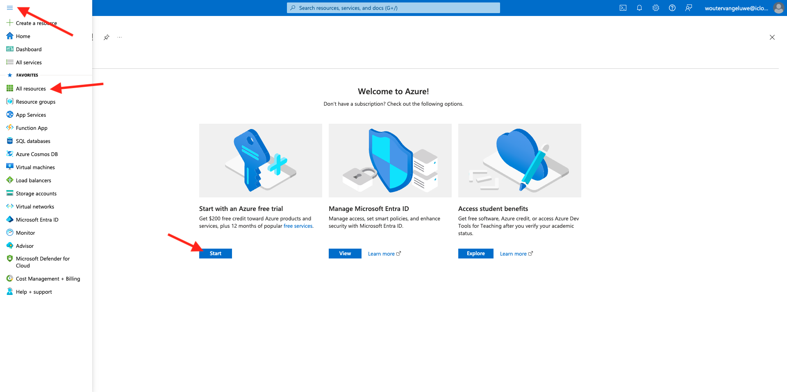

# 2.4.1 Configurare l’ambiente

## Creare un abbonamento Azure

>[!NOTE]
>
>Se disponi già di una sottoscrizione Azure, puoi saltare questo passaggio. Procedere con l&#39;esercizio successivo in questo caso.

Vai a [https://portal.azure.com](https://portal.azure.com) e accedi con il tuo account di Azure. Se non ne hai uno, utilizza il tuo indirizzo e-mail personale per creare il tuo account di Azure.


Dopo aver effettuato correttamente l’accesso viene visualizzata la seguente schermata:


Fai clic sul menu a sinistra e seleziona **Tutte le risorse**; se non sei ancora iscritto, verrà visualizzata la schermata della sottoscrizione di Azure. In tal caso, selezionare **Inizia con una versione di valutazione gratuita di Azure**.



Compila il modulo di abbonamento Azure, fornisci il telefono cellulare e la carta di credito per l’attivazione (avrai un livello gratuito per 30 giorni e non ti verrà addebitato alcun costo, a meno che non esegui l’aggiornamento).

Al termine del processo di abbonamento, sei a posto:


## Installare Visual Code Studio

Per gestire il progetto di Azure, è necessario utilizzare Microsoft Visual Code Studio. Puoi scaricarlo tramite [questo collegamento](https://code.visualstudio.com/download). Seguire le istruzioni di installazione per il sistema operativo specifico nello stesso sito Web.

## Installare le estensioni Visual Code

Installare le funzioni di Azure per il codice di Visual Studio da [https://marketplace.visualstudio.com/items?itemName=ms-azuretools.vscode-azurefunctions](https://marketplace.visualstudio.com/items?itemName=ms-azuretools.vscode-azurefunctions). Fai clic sul pulsante Installa:


Installa l&#39;account Azure e l&#39;accesso per il codice Visual Studio da [https://marketplace.visualstudio.com/items?itemName=ms-vscode.azure-account](https://marketplace.visualstudio.com/items?itemName=ms-vscode.azure-account). Fai clic sul pulsante Installa:


## Installare node.js

>[!NOTE]
>
>Se hai già installato node.js, puoi saltare questo passaggio. Procedere con l&#39;esercizio successivo in questo caso.

### macOS

Assicurati di avere [Homebrew](https://brew.sh/) installato per primo. Segui le istruzioni [qui](https://brew.sh/).


Dopo aver installato Homebrew, eseguire il comando seguente:

```javascript
brew install node
```

### Windows

Scarica [Windows Installer](https://nodejs.org/en/#home-downloadhead) direttamente dal sito Web [nodejs.org](https://nodejs.org/en/).

## Verifica la versione di node.js

Per questo modulo, devi aver installato node.js versione 18. Qualsiasi altra versione di node.js può causare problemi con questo esercizio.

Prima di continuare, verifica ora la versione di node.js in uso.

Esegui questo comando per verificare la versione di node.js:

```javascript
node -v
```

Se la tua versione è precedente o precedente a 18, devi effettuare l’aggiornamento o il downgrade.

### Aggiornamento/downgrade della versione di node.js in macOS

Verificare che il pacchetto **n** sia installato.

Per installare il pacchetto **n**, eseguire il comando seguente:

```javascript
sudo npm install -g n
```

Se la versione è precedente o successiva alla versione 12, eseguire questo comando per eseguire l&#39;aggiornamento o il downgrade:

```javascript
sudo n 18
```

### Aggiornamento/downgrade della versione di node.js in Windows

Disinstalla node.js da Windows > Pannello di controllo Campaign > Aggiungi o rimuovi programmi.

Installazione della versione richiesta dal sito Web [nodejs.org](https://nodejs.org/en/).

## Installa pacchetto NPM: richiesta

È necessario installare il pacchetto **richiesta** come parte della configurazione di node.js.

Per installare il pacchetto **richiesta**, eseguire il comando seguente:

```javascript
npm install request
```

## Installare gli strumenti core delle funzioni di Azure:

```
brew tap azure/functions
brew install azure-functions-core-tools@4
```

## Passaggi successivi

Vai a [2.4.2 Configurare l&#39;ambiente Microsoft Azure EventHub](./ex2.md){target="_blank"}

Torna a [Real-Time CDP: da Audience Activation a Microsoft Azure Event Hub](./segment-activation-microsoft-azure-eventhub.md){target="_blank"}

Torna a [Tutti i moduli](./../../../../overview.md){target="_blank"}
