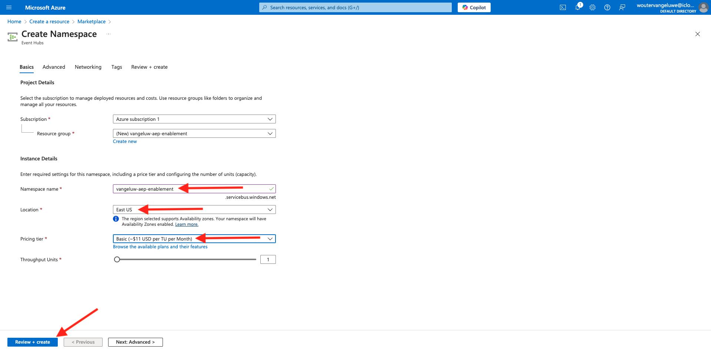

# 2.4.2 Configurare l’ambiente Microsoft Azure EventHub

Azure Event Hubs è un servizio di sottoscrizione pubblicazione altamente scalabile che può acquisire milioni di eventi al secondo e inviarli in streaming a più applicazioni. Questo consente di elaborare e analizzare le enormi quantità di dati prodotti dai dispositivi e dalle applicazioni collegati.

## Cos’è Azure Event Hub?

Azure Event Hubs è una piattaforma di streaming di big data e un servizio di acquisizione di eventi. Può ricevere ed elaborare milioni di eventi al secondo. I dati inviati a un hub eventi possono essere trasformati e memorizzati utilizzando qualsiasi provider di analisi in tempo reale o adattatori di batch/archiviazione.

Event Hubs rappresenta la **porta principale** di una pipeline di eventi, spesso denominata &quot;event ingestor&quot; nelle architetture della soluzione. Un’acquisizione di eventi è un componente o un servizio che si colloca tra gli editori di eventi (come Adobe Experience Platform RTCDP) e i consumatori di eventi per separare la produzione di un flusso di eventi dal consumo di tali eventi. Event Hubs fornisce una piattaforma di streaming unificata con un buffer di conservazione del tempo, separando i produttori di eventi dai consumatori di eventi.

## Creare uno spazio dei nomi degli hub eventi

Vai a [https://portal.azure.com/#home](https://portal.azure.com/#home) e seleziona **Crea una risorsa**.

Nella schermata delle risorse, immetti **Evento** nella barra di ricerca. Trova la scheda **Hub eventi**, fai clic su **Crea**, quindi su **Hub eventi**.

Se questa è la prima volta che crei una risorsa in Azure, dovrai creare un nuovo **gruppo di risorse**. Se disponi già di un gruppo di risorse, puoi selezionarlo (o crearne uno nuovo).

Fai clic su **Crea nuovo** e assegna un nome al gruppo `--aepUserLdap---aep-enablement`, quindi fai clic su **OK**.

Compila gli altri campi come indicato:

- Spazio dei nomi : Definisci lo spazio dei nomi, deve essere univoco, utilizza il seguente pattern `--aepUserLdap---aep-enablement`
- Ubicazione: scegli una posizione
- Piano tariffario: **Base**
- Unità di velocità effettiva: **1**

Fai clic su **Rivedi + crea**.

Fai clic su **Crea**.

L’implementazione del gruppo di risorse può richiedere 1-2 minuti; una volta completata, viene visualizzata la seguente schermata:

## Configurare l’hub eventi in Azure

Vai a [https://portal.azure.com/#home](https://portal.azure.com/#home) e seleziona **Tutte le risorse**.

Nell&#39;elenco delle risorse, fare clic sullo spazio dei nomi degli hub eventi `--aepUserLdap---aep-enablement`:

Nella schermata dei dettagli di `--aepUserLdap---aep-enablement`, vai a **Entità** e fai clic su **Hub eventi**:

Fare clic su **+ Hub eventi**.

Utilizza `--aepUserLdap---aep-enablement-event-hub` come nome e fai clic su **Rivedi + Crea**.

Fai clic su **Crea**.

In **Hub eventi** nello spazio dei nomi dell&#39;hub eventi, il **Hub eventi** verrà visualizzato nell&#39;elenco.

## Configurare l’account di archiviazione Azure

Per eseguire il debug della funzione dell&#39;hub eventi di Azure negli esercizi successivi, è necessario fornire un account di archiviazione di Azure come parte della configurazione del progetto di codice di Visual Studio. Ora creerai l’account di archiviazione Azure.

Vai a [https://portal.azure.com/#home](https://portal.azure.com/#home) e seleziona **Crea una risorsa**.

Immettere **account di archiviazione** nella ricerca, trovare la scheda per **account di archiviazione** e fare clic su **account di archiviazione**.

Specifica il **gruppo di risorse** (creato all&#39;inizio di questo esercizio), utilizza `--aepUserLdap--aepstorage` come nome dell&#39;account di archiviazione e seleziona **Archiviazione localmente ridondante (LRS)**, quindi fai clic su **Rivedi + crea**.

Fai clic su **Crea**.

La creazione del nostro account di archiviazione richiederà un paio di secondi:

Al termine della schermata verrà visualizzato il pulsante **Vai alla risorsa**.

Fare clic su **Home**.

L&#39;account di archiviazione è ora visibile in **Risorse recenti**.

## Passaggi successivi

Vai a [2.4.3 Configurare la destinazione dell&#39;hub eventi di Azure in Adobe Experience Platform](./ex3.md){target="_blank"}

Torna a [Real-Time CDP: da Audience Activation a Microsoft Azure Event Hub](./segment-activation-microsoft-azure-eventhub.md){target="_blank"}

Torna a [Tutti i moduli](./../../../../overview.md){target="_blank"}
