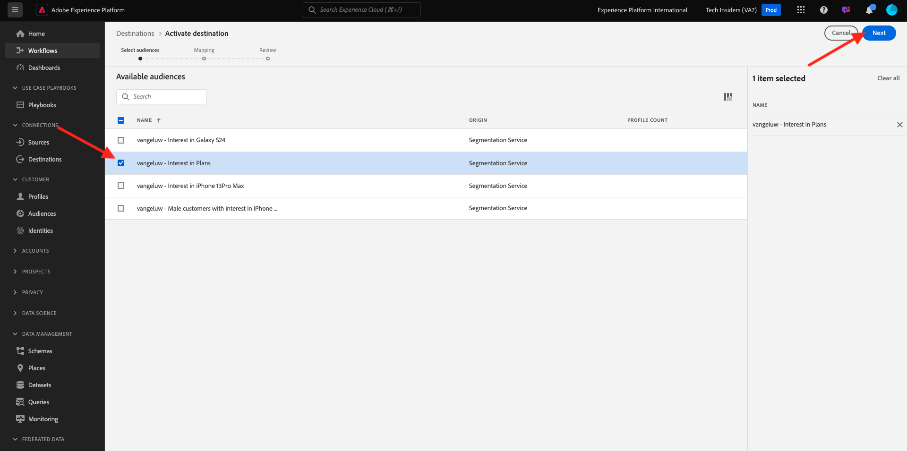

# 2.4.5 Attivare il pubblico

## Aggiungi pubblico alla destinazione dell’hub eventi di Azure

In questo esercizio aggiungerai il pubblico `--aepUserLdap-- - Interest in Plans` alla destinazione dell&#39;hub eventi di Azure `--aepUserLdap---aep-enablement`.

Accedi a Adobe Experience Platform da questo URL: [https://experience.adobe.com/platform](https://experience.adobe.com/platform).

Dopo aver effettuato l’accesso, accedi alla home page di Adobe Experience Platform.

Prima di continuare, devi selezionare una **sandbox**. La sandbox da selezionare è denominata ``--aepSandboxName--``. Dopo aver selezionato la sandbox appropriata, la schermata cambia e ora sei nella sandbox dedicata.

Vai a **Destinazioni**, quindi fai clic su **Sfoglia**. Vedrai quindi tutte le destinazioni disponibili. Individua la destinazione e fai clic sui tre punti&#x200B;**...** come indicato di seguito, quindi fai clic su **Attiva pubblico**.

Poi vedrai questo. Cerca il tuo pubblico utilizzando il tuo ldap e seleziona `--aepUserLdap-- - Interest in Plans` dall&#39;elenco dei tipi di pubblico.

Fai clic su **Avanti**.

Fai clic su **Aggiungi nuovo campo**, fai clic su Sfoglia schema e seleziona il campo `--aepTenantId--identification.core.ecid` (elimina qualsiasi altro campo che verrebbe visualizzato automaticamente).

Fai clic su **Avanti**.

Fai clic su **Fine**.

Il pubblico ora è attivato verso la destinazione dell’hub eventi di Microsoft.

## Passaggi successivi

Vai a [2.4.6 Creare il progetto Microsoft Azure](./ex6.md){target="_blank"}

Torna a [Real-Time CDP: da Audience Activation a Microsoft Azure Event Hub](./segment-activation-microsoft-azure-eventhub.md){target="_blank"}

Torna a [Tutti i moduli](./../../../../overview.md){target="_blank"}
