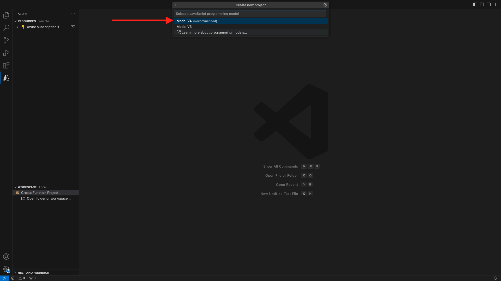

# 2.4.6 Creare il progetto Microsoft Azure

## Acquisizione di familiarità con le funzioni dell’hub eventi di Azure

Le funzioni di Azure consentono di eseguire piccole parti di codice (denominate **funzioni**) senza preoccuparsi dell&#39;infrastruttura dell&#39;applicazione. Con le funzioni di Azure, l’infrastruttura cloud fornisce tutti i server aggiornati necessari per mantenere l’applicazione in esecuzione su larga scala.
Funzione **attivata** da un tipo specifico di evento. I trigger supportati includono la risposta alle modifiche nei dati, la risposta ai messaggi (ad esempio, Hub eventi), l’esecuzione su una pianificazione o come risultato di una richiesta HTTP.
Azure Functions è un servizio di elaborazione senza server che consente di eseguire codice attivato da evento senza dover eseguire esplicitamente il provisioning o la gestione dell’infrastruttura.
Azure Event Hubs si integra con le funzioni di Azure per un’architettura senza server.
## Apri codice Visual Studio e accedi ad Azure

Visual Studio Code semplifica le operazioni di...
- definire e associare le funzioni di Azure agli hub eventi- test locale- distribuire in Azure- esecuzione della funzione di registro remoto
### Apri codice Visual Studio

### Accesso ad Azure

Quando si esegue l&#39;accesso con l&#39;account di Azure utilizzato per la registrazione nell&#39;esercizio precedente, il codice di Visual Studio consente di trovare e associare tutte le risorse dell&#39;hub eventi.
Aprire Visual Studio Code e fare clic sull&#39;icona **Azure**.
Selezionare **Accedi ad Azure**:

Verrai reindirizzato al browser per accedere. Ricorda di selezionare l’account di Azure utilizzato per la registrazione.
Quando viene visualizzata la seguente schermata nel browser, si è connessi con Visual Code Studio:

Torna a Visual Code Studio (verrà visualizzato il nome della sottoscrizione di Azure, ad esempio **sottoscrizione di Azure 1**):

## Creare un progetto Azure

Fare clic su **Crea progetto funzione...**:

Seleziona o crea una cartella locale di tua scelta per salvare il progetto e fai clic su **Seleziona**:

Verrà avviata la procedura guidata per la creazione del progetto. Fai clic su **Javascript** come lingua per il progetto:

Quindi selezionare **Modello v4**.

Seleziona **Trigger dell&#39;hub eventi di Azure** come primo modello di funzione del progetto:

Immettere un nome per la funzione, utilizzare il seguente formato `--aepUserLdap---aep-event-hub-trigger` e premere Invio:

Seleziona **Crea nuova impostazione app locale**:

Fare clic per selezionare lo spazio dei nomi hub eventi creato in precedenza, denominato `--aepUserLdap---aep-enablement`.

Fare quindi clic per selezionare l&#39;hub eventi creato in precedenza, denominato `--aepUserLdap---aep-enablement-event-hub`.

Fai clic per selezionare **RootManageSharedAccessKey** come criterio dell&#39;hub eventi:

Seleziona **Aggiungi all&#39;area di lavoro** per aprire il progetto:

Potresti ricevere un messaggio come questo. In tal caso, fare clic su **Sì, gli autori sono attendibili**.

Dopo aver creato il progetto, aprire il file `--aepUserLdap---aep-event-hub-trigger.js` nell&#39;editor:

Il payload inviato da Adobe Experience Platform all’hub eventi sarà simile al seguente:
```json
{
  "identityMap": {
    "ecid": [
      {
        "id": "36281682065771928820739672071812090802"
      }
    ]
  },
  "segmentMembership": {
    "ups": {
      "94db5aed-b90e-478d-9637-9b0fad5bba11": {
        "createdAt": 1732129904025,
        "lastQualificationTime": "2024-11-21T07:33:52Z",
        "mappingCreatedAt": 1732130611000,
        "mappingUpdatedAt": 1732130611000,
        "name": "vangeluw - Interest in Plans",
        "status": "realized",
        "updatedAt": 1732129904025
      }
    }
  }
}
```

Aggiornare il codice in `--aepUserLdap---aep-event-hub-trigger.js` del codice Visual Studio con il codice seguente. Questo codice verrà eseguito ogni volta che Real-time CDP invia i requisiti del pubblico alla destinazione dell’hub eventi. In questo esempio, il codice riguarda solo la visualizzazione del payload in ingresso, ma puoi immaginare qualsiasi tipo di funzione aggiuntiva per elaborare le qualifiche del pubblico in tempo reale e utilizzarle più in basso nell’ecosistema della pipeline dei dati.
La riga 11 nel file `--aepUserLdap---aep-event-hub-trigger.js` mostra attualmente quanto segue:
```javascript
context.log('Event hub message:', message);
```

Modificare la riga 11 in `--aepUserLdap---aep-event-hub-trigger.js` in modo che sia simile alla seguente:
```javascript
context.log('Event hub message:', JSON.stringify(message));
```

Il payload totale deve quindi essere simile al seguente:
```javascript
const { app } = require('@azure/functions');

app.eventHub('--aepUserLdap---aep-event-hub-trigger', {
    connection: '--aepUserLdap--aepenablement_RootManageSharedAccessKey_EVENTHUB',
    eventHubName: '--aepUserLdap---aep-enablement-event-hub',
    cardinality: 'many',
    handler: (messages, context) => {
        if (Array.isArray(messages)) {
            context.log(`Event hub function processed ${messages.length} messages`);
            for (const message of messages) {
                context.log('Event hub message:', message);
            }
        } else {
            context.log('Event hub function processed message:', messages);
        }
    }
});
```


Il risultato dovrebbe essere simile al seguente:

## Esegui progetto Azure

Ora è il momento di eseguire il progetto. In questa fase, il progetto non verrà distribuito ad Azure. Verrà eseguito localmente in modalità di debug. Seleziona l’icona Esegui e fai clic sulla freccia verde.

La prima volta che esegui un progetto in modalità di debug, dovrai allegare un account di archiviazione Azure e fare clic su **Seleziona account di archiviazione**.

quindi selezionare l&#39;account di archiviazione creato in precedenza, denominato `--aepUserLdap--aepstorage`.

Il progetto è ora operativo e l’elenco degli eventi nell’hub eventi è attivo. Nell&#39;esercizio successivo verrà illustrato il comportamento sul sito Web di dimostrazione di CitiSignal che risulterà idoneo per i tipi di pubblico. Di conseguenza, riceverai un payload di qualificazione del pubblico nel terminale della funzione di attivazione dell’hub eventi.

## Arresta progetto Azure

Per arrestare il progetto, vai al lenu **STACK CHIAMATE** in VSC, fai clic sulla freccia del progetto in esecuzione, quindi fai clic su **Interrompi**.

## Passaggi successivi

Vai a [2.4.7 Scenario end-to-end](./ex7.md){target="_blank"}
Torna a [Real-Time CDP: da Audience Activation a Microsoft Azure Event Hub](./segment-activation-microsoft-azure-eventhub.md){target="_blank"}
Torna a [Tutti i moduli](./../../../../overview.md){target="_blank"}
