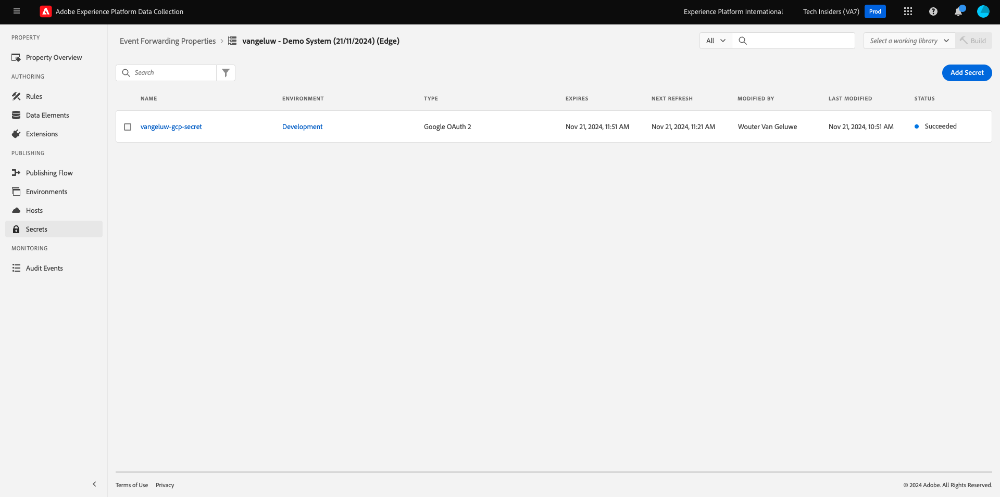
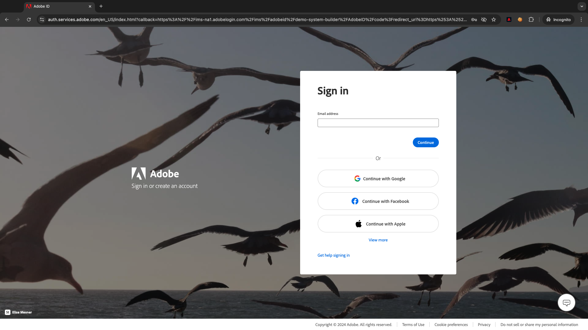

# 2.5.4 Inoltra gli eventi a GCP Pub/Sub

>[!NOTE]
>
>Per questo esercizio, devi accedere a un ambiente della piattaforma Google Cloud. Se non hai ancora accesso a GCP, crea un nuovo account utilizzando il tuo indirizzo e-mail personale.

## Crea il tuo argomento Google Cloud Pub/Sub

Vai a [https://console.cloud.google.com/](https://console.cloud.google.com/). Nella barra di ricerca immettere `pub/sub`. Fai clic sul risultato della ricerca **Pub/Sub - Messaggistica globale in tempo reale**.

Poi vedrai questo. Fare clic su **CREA ARGOMENTO**.

Poi vedrai questo. Per il tuo ID argomento, usa `--aepUserLdap---event-forwarding`. Fai clic su **Crea**.

L&#39;argomento è stato creato. Fare clic sul **ID sottoscrizione** dell&#39;argomento.

Poi vedrai questo. Copia il **Nome argomento** negli Appunti e archivialo, come ti servirà nei prossimi esercizi.

Passiamo ora all’inoltro degli eventi di raccolta dati di Adobe Experience Platform, per aggiornare la proprietà di inoltro degli eventi in modo da avviare l’inoltro degli eventi a Pub/Sub.

## Aggiorna la proprietà di Inoltro eventi: Secrets

**I segreti** nelle proprietà di Inoltro eventi vengono utilizzati per memorizzare le credenziali che verranno utilizzate per l&#39;autenticazione in base alle API esterne. In questo esempio, devi configurare un segreto per memorizzare il token OAuth di Google Cloud Platform, che verrà utilizzato per l’autenticazione quando si utilizza Pub/Sub per lo streaming dei dati verso GCP.

Vai a [https://experience.adobe.com/#/data-collection/](https://experience.adobe.com/it#/data-collection/) e vai a **Segreti**. Fai clic su **Crea nuovo segreto**.

Poi vedrai questo. Seguire queste istruzioni:

- Nome: utilizzare `--aepUserLdap---gcp-secret`
- Ambiente di destinazione: seleziona **Sviluppo**
- Tipo: **Google OAuth 2**
- Seleziona la casella di controllo per **Pub/Sub**

Fai clic su **Crea segreto**.

Dopo aver fatto clic su **Crea segreto**, verrà visualizzata una finestra a comparsa per impostare l&#39;autenticazione tra il segreto della proprietà di Inoltro eventi e Google. Fai clic su **Crea e autorizza segreto `--aepUserLdap---gcp-secret` con Google**.

Fai clic su per selezionare il tuo account Google.

Fai clic su **Continua**.

>[!NOTE]
>
>Il messaggio popup può variare. Autorizzare/consentire l’accesso richiesto per continuare con l’esercizio.

Dopo l’autenticazione, visualizzerai questo messaggio.

Il segreto è ora configurato correttamente e può essere utilizzato in un elemento dati.

## Aggiorna la proprietà di Inoltro eventi: Elemento dati

Per utilizzare il segreto nella proprietà Inoltro eventi, è necessario creare un elemento dati in cui venga memorizzato il valore del segreto.

Vai a [https://experience.adobe.com/#/data-collection/](https://experience.adobe.com/it#/data-collection/) e vai a **Inoltro eventi**. Cerca nella proprietà Inoltro eventi e fai clic su di essa per aprirla.

Nel menu a sinistra, vai a **Elementi dati**. Fare clic su **Aggiungi elemento dati**.

Configura l’elemento dati in questo modo:

- Nome: **Segreto GCP**
- Estensione: **Core**
- Tipo di elemento dati: **Segreto**
- Segreto di sviluppo: selezionare il segreto creato, denominato `--aepUserLdap---gcp-secret`

Fai clic su **Salva**

## Aggiorna la proprietà di Inoltro eventi: Extension

Con il segreto e l’elemento dati configurati, ora puoi impostare l’estensione per Google Cloud Platform nella proprietà Inoltro eventi.

Vai a [https://experience.adobe.com/#/data-collection/](https://experience.adobe.com/it#/data-collection/), vai a **Inoltro eventi** e apri la tua proprietà Inoltro eventi.

Quindi, vai a **Estensioni**, a **Catalogo**. Fai clic sull&#39;estensione **Google Cloud Platform** e fai clic su **Installa**.

Poi vedrai questo. Fai clic sull’icona Elemento dati.

Selezionare l&#39;elemento dati creato nell&#39;esercizio precedente, denominato **Segreto GCP**. Fai clic su **Seleziona**.

Poi vedrai questo. Fai clic su **Salva**.

## Aggiornare la proprietà di inoltro degli eventi: Aggiornare una regola

Ora che l’estensione Google Cloud Platform è configurata, puoi definire una regola per iniziare a inoltrare i dati dell’evento all’argomento Pub/Sub. A tale scopo, è necessario aggiornare la regola **Tutte le pagine** creata in uno degli esercizi precedenti.

Nel menu a sinistra, vai a **Regole**. Nell&#39;esercizio precedente hai creato la regola **Tutte le pagine**. Fai clic su quella regola per aprirla.

Allora questo lo farai. Fai clic sull&#39;icona **+** in **Azioni** per aggiungere una nuova azione.

Poi vedrai questo. Effettua la seguente selezione:

- Seleziona l&#39;**estensione**: **Google Cloud Platform**.
- Seleziona **Tipo azione**: **Invia dati a Cloud Pub/Sub**.

Questo dovrebbe darti **Nome**: **Piattaforma Google Cloud - Invia dati a Cloud Pub/Sub**. Ora dovresti vedere:

Ora è necessario configurare l’argomento Pub/Sub creato in precedenza.

Puoi trovare il **Nome argomento** qui, copialo.

Incolla **Nome argomento** nella configurazione regola. Fare clic sull&#39;icona Elemento dati accanto al campo **Dati (obbligatorio)**.

Seleziona **Evento XDM** e fai clic su **Seleziona**.

Poi vedrai questo. Fai clic su **Mantieni modifiche**.

Fai clic su **Salva**.

Poi vedrai questo.

## Pubblicare le modifiche

La configurazione è terminata. Vai a **Flusso di pubblicazione** per pubblicare le modifiche. Apri la libreria di sviluppo **Principale** facendo clic su **Modifica** come indicato.

Fai clic sul pulsante **Aggiungi tutte le risorse modificate**, dopo di che la regola e l&#39;elemento dati verranno visualizzati in questa libreria. Fare clic su **Salva e genera per sviluppo**. Le modifiche sono ora in fase di implementazione.

Dopo un paio di minuti, vedrai che l’implementazione è completata e pronta per essere testata.

## Verifica la configurazione

Vai a [https://dsn.adobe.com](https://dsn.adobe.com). Dopo aver effettuato l’accesso con il tuo Adobe ID, visualizzerai questo. Fai clic sui tre punti **...** del progetto del sito Web, quindi fai clic su **Esegui** per aprirlo.

Poi vedrai il tuo sito web demo aperto. Seleziona l’URL e copialo negli Appunti.

Apri una nuova finestra del browser in incognito.

Incolla l’URL del sito web demo, che hai copiato nel passaggio precedente. Ti verrà quindi chiesto di effettuare l’accesso con il tuo Adobe ID.

Seleziona il tipo di account e completa la procedura di accesso.

Vedrai quindi il tuo sito web caricato in una finestra del browser in incognito. Per ogni esercizio, dovrai utilizzare una nuova finestra del browser in incognito per caricare l’URL del sito web demo.

Passa al tuo Google Cloud Pub/Sub e passa a **MESSAGES**. Fai clic su **PULL** e dopo un paio di secondi verranno visualizzati alcuni messaggi nell&#39;elenco. Fai clic su un messaggio per visualizzarne il contenuto.

Ora puoi visualizzare il payload XDM dell’evento in Google Pub/Sub. Hai inviato correttamente i dati raccolti dalla raccolta dati di Adobe Experience Platform, in tempo reale, a un endpoint Google Cloud Pub/Sub. Da lì, tali dati possono essere utilizzati da qualsiasi applicazione Google Cloud Platform, ad esempio BigQuery per l’archiviazione e il reporting o per casi di utilizzo di apprendimento automatico.

## Passaggi successivi

Vai a [2.5.5 Inoltra gli eventi ad AWS Kinesis &amp; AWS S3](./ex5.md){target="_blank"}

Torna a [Connessioni Real-Time CDP: Inoltro eventi](./aep-data-collection-ssf.md){target="_blank"}

Torna a [Tutti i moduli](./../../../../overview.md){target="_blank"}
