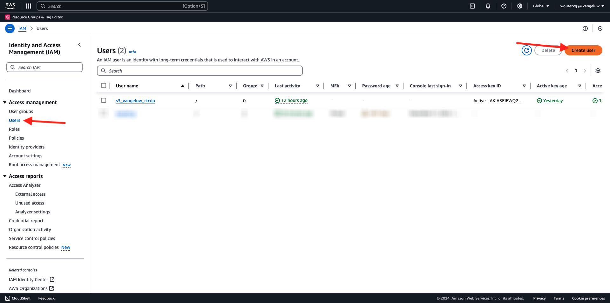
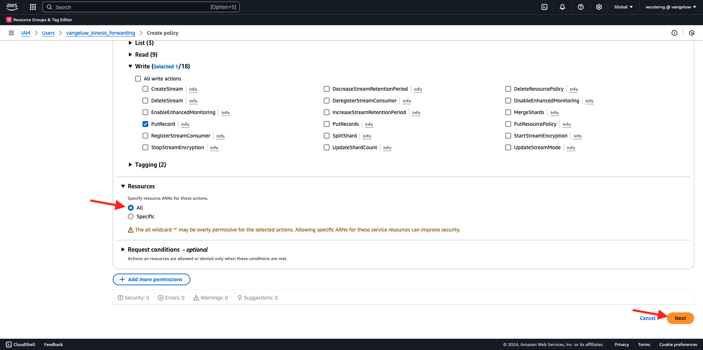

# 2.5.5 Inoltrare gli eventi ad AWS Kinesis e AWS S3

>[!IMPORTANT]
>
>Il completamento di questo esercizio è facoltativo e implica un costo per l’utilizzo di AWS Kinesis. AWS offre un account di livello gratuito che consente di testare e configurare molti servizi senza costi aggiuntivi, ma AWS Kinesis non fa parte di tale account di livello gratuito. Quindi, al fine di implementare e testare questo esercizio, sarà coinvolto un costo per utilizzare AWS Kinesis.

## Buono a sapersi

Adobe Experience Platform supporta vari servizi Amazon come destinazione.
Kinesis e S3 sono entrambe [destinazioni di esportazione profilo](https://experienceleague.adobe.com/docs/experience-platform/destinations/destination-types.html?lang=it) e possono essere utilizzate come parte di Adobe Experience Platform Real-Time CDP.
Puoi inserire facilmente eventi di segmento di alto valore e gli attributi di profilo associati nei sistemi preferiti.

In questo esercizio imparerai a configurare il tuo flusso Amazon Kinesis per inviare in streaming i dati dell’evento provenienti dall’ecosistema Adobe Experience Platform Edge a una destinazione di archiviazione cloud, come Amazon S3. Questa funzione è utile quando desideri raccogliere eventi di esperienza da proprietà web e mobili e inviarli nel data lake per l’analisi e il reporting operativo. I Datalake generalmente acquisiscono i dati in modalità batch con importazioni giornaliere di file di grandi dimensioni, non espongono un endpoint http pubblico che potrebbe essere utilizzato insieme all’inoltro di eventi.

Il supporto dei casi d’uso di cui sopra implica che i dati in streaming devono essere inseriti nel buffer o in una coda prima di essere scritti in un file. Fare attenzione a non aprire il file per l&#39;accesso in scrittura in più processi. Delegare questo compito a un sistema dedicato è ideale per scalare bene garantendo al contempo un grande livello di servizio, ed è qui che Kinesis viene in soccorso.

Amazon Kinesis Data Streams si concentra sull’acquisizione e l’archiviazione dei flussi di dati. Kinesis Data Firehose si concentra sulla distribuzione di flussi di dati a destinazioni selezionate, come ad esempio bucket S3.

Come parte di questo esercizio...

- Eseguire una configurazione di base di un flusso di dati Kinesis
- Creare un flusso di consegna Firehose e utilizzare il bucket S3 come destinazione
- Configurare il gateway API di Amazon come endpoint API rest per ricevere i dati dell’evento
- Inoltrare i dati grezzi dell’evento dall’Edge di Adobe al flusso Kinesis

## Configurare il bucket AWS S3

Vai a [https://console.aws.amazon.com](https://console.aws.amazon.com) e accedi con il tuo account Amazon.

Dopo l&#39;accesso, verrai reindirizzato a **AWS Management Console**.

Nel menu **Trova servizi**, cerca **s3**. Fare clic sul primo risultato della ricerca: **S3 - Storage scalabile nel cloud**.

Verrà quindi visualizzata la home page di **Amazon S3**. Fai clic su **Crea bucket**.

Nella schermata **Crea bucket**, è necessario configurare due elementi:

- Nome: utilizzare il nome `eventforwarding---aepUserLdap--`.

Lascia invariate tutte le altre impostazioni predefinite. Scorri verso il basso e fai clic su **Crea bucket**.

Vedrai quindi il tuo bucket in fase di creazione e verrà reindirizzato alla home page di Amazon S3.

## Configurare il flusso di dati AWS Kinesis

Nel menu **Trova servizi**, cerca **kinesis**. Fare clic sul primo risultato della ricerca: **Kinesis - Utilizzare i dati in streaming in tempo reale**.

Seleziona **Flussi dati Kinesis**. Fare clic su **Crea flusso di dati**.

Per il **nome flusso dati**, utilizzare `--aepUserLdap---datastream`.

Non è necessario modificare nessuna delle altre impostazioni. Scorri verso il basso e fai clic su **Crea flusso di dati**.

Poi vedrai questo. Una volta creato correttamente il flusso di dati, puoi passare all’esercizio successivo.

## Configurare il flusso di consegna AWS Firehose

Nel menu **Trova servizi**, cerca **kinesis**. Fai clic su **Firehose dati Kinesis**.

Fare clic su **Crea flusso Firehose**.

Per **Source**, seleziona **Flussi dati Amazon Kinesis**. Per **Destinazione**, selezionare **Amazon S3**. Fai clic su **Sfoglia** per selezionare il flusso di dati.

Seleziona il flusso di dati. Fai clic su **Scegli**.

Poi vedrai questo. Ricorda il nome di flusso **Firehose**, che ti servirà in seguito.

Scorri verso il basso fino a visualizzare **Impostazioni di destinazione**. Fai clic su **Sfoglia** per selezionare il bucket S3.

Seleziona il bucket S3 e fai clic su **Scegli**.

Poi vedrai qualcosa del genere. Aggiorna le seguenti impostazioni:

- Nuovo delimitatore di riga: impostato su **Abilitato**
- Partizionamento dinamico: impostato su **Non abilitato**

Scorri verso il basso ancora e fai clic su **Crea flusso Firehose**

Dopo alcuni minuti verrà creato il flusso Firehose e **Attivo**.

## Crea utente IAM

Nel menu IAM di AWS a sinistra, fai clic su **Utenti**. Viene visualizzata la schermata **Utenti**. Fare clic su **Crea utente**.

Quindi, configura l’utente:

- Nome utente: utilizzare `--aepUserLdap--_kinesis_forwarding`

Fai clic su **Avanti**.

Viene quindi visualizzata questa schermata delle autorizzazioni. Fai clic su **Allega criteri direttamente**.

Immettere il termine di ricerca **kinesisfirehose** per visualizzare tutti i criteri correlati. Seleziona il criterio **AmazonKinesisFirehoseFullAccess**. Scorri verso il basso e fai clic su **Avanti**.

Controlla la configurazione. Fare clic su **Crea utente**.

Poi vedrai questo. Fare clic su **Visualizza utente**.

Fare clic su **Aggiungi autorizzazioni** e su **Crea criterio in linea**.

Poi vedrai questo. Selezionare il servizio **Kinesis**.

Vai a **Scrivi** e seleziona la casella di controllo per **PutRecord**.

Scorri verso il basso fino a **Risorse** e seleziona **Tutto**. Fai clic su **Avanti**.

Assegna un nome al criterio: **Kinesis_PutRecord** e fai clic su **Crea criterio**.

Poi vedrai questo. Fare clic su **Credenziali di protezione**.

Fai clic su **Crea chiave di accesso**.

Selezionare **l&#39;applicazione in esecuzione all&#39;esterno di AWS**. Scorri verso il basso e fai clic su **Avanti**.

Fai clic su **Crea chiave di accesso**

Poi vedrai questo. Fai clic su **Mostra** per visualizzare la chiave di accesso segreta:

È ora visualizzata la **chiave di accesso segreta**.

>[!IMPORTANT]
>
>Memorizzare le credenziali in un file di testo nel computer.
>
> - ID chiave di accesso: ...
> - Chiave di accesso segreta: ...
>
> Dopo aver fatto clic su **Fine** non verranno più visualizzate le credenziali.

Fai clic su **Fine**.

Ora hai creato correttamente un utente IAM con le autorizzazioni appropriate, che dovrai specificare durante la configurazione dell&#39;estensione AWS nella proprietà Inoltro eventi.

## Aggiorna la proprietà di Inoltro eventi: Extension

Con il segreto e l’elemento dati configurati, ora puoi impostare l’estensione per Google Cloud Platform nella proprietà Inoltro eventi.

Vai a [https://experience.adobe.com/#/data-collection/](https://experience.adobe.com/it#/data-collection/), vai a **Inoltro eventi** e apri la tua proprietà Inoltro eventi.

Quindi, vai a **Estensioni**, a **Catalogo**. Fai clic sull&#39;estensione **AWS** e fai clic su **Installa**.

Immettere le credenziali utente IAM generate nell&#39;esercizio precedente. Fai clic su **Salva**.

Successivamente, devi configurare una regola che avvii l’inoltro dei dati dell’evento a Kinesis.

## Aggiorna la proprietà di inoltro eventi: regola

Nel menu a sinistra, vai a **Regole**. Fare clic per aprire la regola **Tutte le pagine** creata in uno degli esercizi precedenti.

Poi vedrai questo. Fai clic sull&#39;icona **+** per aggiungere una nuova azione.

Poi vedrai questo. Effettua la seguente selezione:

- Seleziona l&#39;**estensione**: **AWS**
- Seleziona il **Tipo azione**: **Invia dati a flusso dati Kinesis**
- Nome: **AWS - Invia dati al flusso di dati Kinesis**

Ora dovresti vedere:

Quindi, configura quanto segue:

- Nome flusso: `--aepUserLdap---datastream`
- Area geografica di AWS: controlla la tua area geografica nella configurazione del flusso di dati di AWS
- Chiave partizione: **0**

Puoi visualizzare la tua regione AWS qui:

Ora dovresti avere questo. Fare clic sull&#39;icona dell&#39;elemento dati per il campo **Dati**.

Seleziona **Evento XDM** e fai clic su **Seleziona**.

Allora avrai questo. Fai clic su **Mantieni modifiche**.

Poi vedrai questo. Fai clic su **Salva**.

Vai a **Flusso di pubblicazione** per pubblicare le modifiche.
Apri la libreria di sviluppo facendo clic su **Principale**.

Fai clic sul pulsante **Aggiungi tutte le risorse modificate**, dopo di che le modifiche apportate alla regola e all&#39;elemento dati verranno visualizzate in questa libreria. Fare clic su **Salva e genera per sviluppo**. Le modifiche sono ora in fase di implementazione.

Dopo un paio di minuti, vedrai che l’implementazione è completata e pronta per essere testata.

## Verifica la configurazione

Vai a [https://dsn.adobe.com](https://dsn.adobe.com). Dopo aver effettuato l’accesso con il tuo Adobe ID, visualizzerai questo. Fai clic sui tre punti **...** del progetto del sito Web, quindi fai clic su **Esegui** per aprirlo.

Poi vedrai il tuo sito web demo aperto. Seleziona l’URL e copialo negli Appunti.

Apri una nuova finestra del browser in incognito.

Incolla l’URL del sito web demo, che hai copiato nel passaggio precedente. Ti verrà quindi chiesto di effettuare l’accesso con il tuo Adobe ID.

Seleziona il tipo di account e completa la procedura di accesso.

Vedrai quindi il tuo sito web caricato in una finestra del browser in incognito. Per ogni esercizio, dovrai utilizzare una nuova finestra del browser in incognito per caricare l’URL del sito web demo.

Passa a **AWS**. Aprendo il flusso di dati e andando nella scheda **Monitoraggio**, ora vedrai il traffico in arrivo.

Quando apri il flusso Data Firehose e vai alla scheda **Monitoraggio**, verrà visualizzato anche il traffico in arrivo.

Infine, quando analizzi il bucket S3, noterai che i file vengono creati lì in seguito all’acquisizione dei dati.

Quando scarichi tale file e lo apri utilizzando un editor di testo, vedrai che contiene il payload XDM dagli eventi inoltrati.

>[!IMPORTANT]
>
>Una volta che la configurazione funziona come previsto, non dimenticare di attivare AWS Kinesis Data Stream e Data Firehose per evitare di essere caricati!

## Passaggi successivi

Vai a [Riepilogo e vantaggi](./summary.md){target="_blank"}

Torna a [Connessioni Real-Time CDP: Inoltro eventi](./aep-data-collection-ssf.md){target="_blank"}

Torna a [Tutti i moduli](./../../../../overview.md){target="_blank"}
