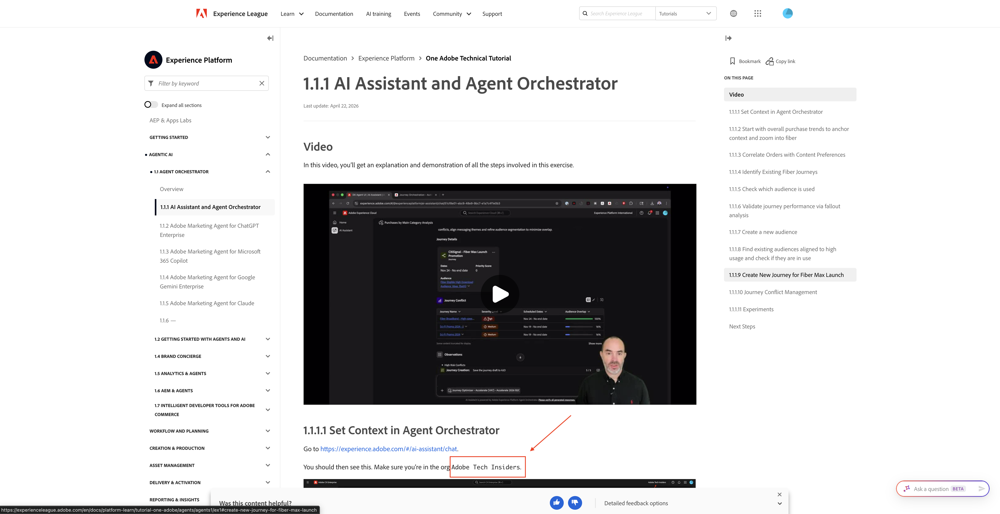
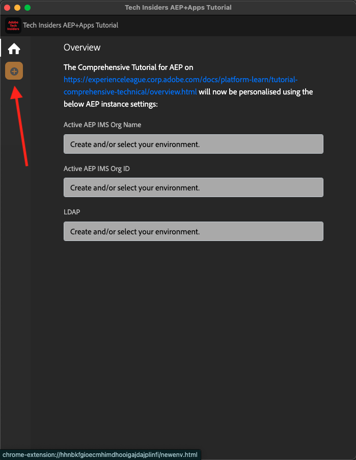
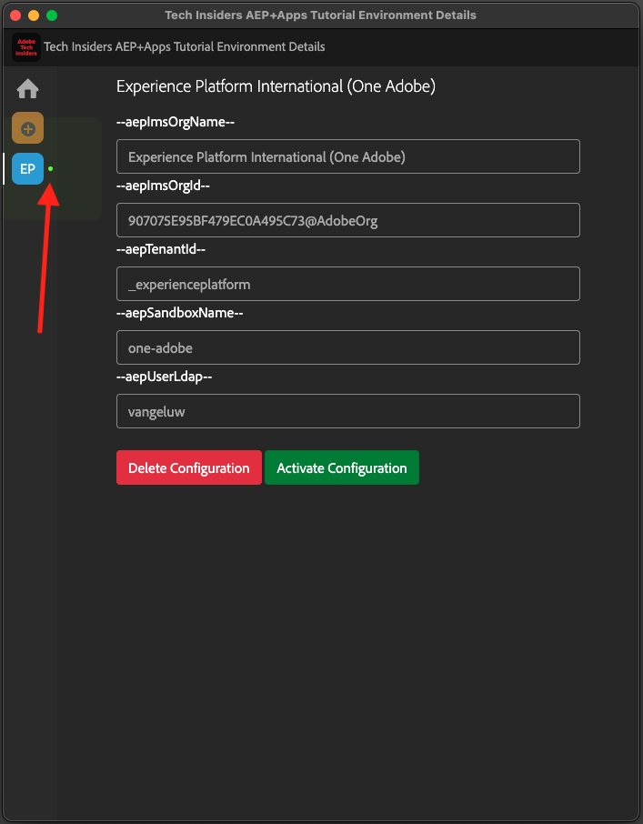

# Installare l’estensione Chrome per la documentazione di Experience League

## Informazioni sull’estensione Chrome

Questo tutorial è stato reso generico, in modo che possa essere riutilizzato facilmente da chiunque, utilizzando qualsiasi istanza Adobe Experience Cloud.

Per rendere riutilizzabile la documentazione, nell&#39;esercitazione sono state introdotte **Variabili di ambiente**. Di conseguenza, nella documentazione troverai i **segnaposto** seguenti. Ogni segnaposto è una variabile specifica per un ambiente specifico e l’estensione Chrome modificherà tale variabile per semplificare la copia di codice e testo dalle pagine dei tutorial e incollarla nelle varie interfacce utente che verranno utilizzate come parte dell’esercitazione.

Di seguito è riportato un esempio di tali valori. Attualmente, questi valori non possono ancora essere utilizzati, ma non appena installi e attivi l’estensione Chrome, vedrai che queste variabili cambiano in testo normale che puoi copiare e riutilizzare.

| Nome | Chiave | Esempio |
|:-------------:| :---------------:| :---------------:|
| ID organizzazione IMS | `--aepImsOrgId--` | `907075E95BF479EC0A495C73@AdobeOrg` |
| Nome organizzazione IMS | `--aepImsOrgName--` | `Adobe Tech Insiders` |
| ID tenant AEP | `--aepTenantId--` | `_experienceplatform` |
| Nome sandbox AEP | `--aepSandboxName--` | `one-adobe` |
| Profilo Allievo LDAP | `--aepUserLdap--` | `vangeluw` |

Ad esempio, nella schermata seguente è possibile visualizzare un riferimento a `aepImsOrgName`.

Una volta installata l’estensione, lo stesso testo verrà modificato automaticamente in modo da riflettere i valori specifici dell’istanza.

## Installare l’estensione Chrome

Per installare l&#39;estensione Chrome, apri il browser Chrome e vai a: [https://chromewebstore.google.com/detail/tech-insiders-learning-fo/hhnbkfgioecmhimdhooigajdajplinfi](https://chromewebstore.google.com/detail/tech-insiders-learning-fo/hhnbkfgioecmhimdhooigajdajplinfi){target="_blank"}. Poi vedrai questo.

Fai clic su **Aggiungi a Chrome**.

Poi vedrai questo. Fai clic su **Aggiungi estensione**.

L&#39;estensione verrà quindi installata e verrà visualizzata una notifica simile.

Nel menu **extensions**, fai clic sull&#39;icona **puzzle** e aggiungi l&#39;estensione **Platform Learn - Configuration** al menu dell&#39;estensione.

## Configurare l&#39;estensione Chrome

Vai a [https://experienceleague.adobe.com/en/docs/platform-learn/tutorial-comprehensive-technical/overview](https://experienceleague.adobe.com/en/docs/platform-learn/tutorial-comprehensive-technical/overview){target="_blank"} e fai clic sull&#39;icona dell&#39;estensione per aprirla.

Poi vedrai questo popup. Fai clic sull&#39;icona **+**.

Immetti i valori come indicato di seguito, che sono tutti relativi all’istanza Adobe Experience Platform.

Se partecipi a uno degli eventi indicati di seguito, utilizza i valori riportati come indicato.

| Nome | Partner Tech Labs New Orleans | Workshop interno su Tech Insiders | Abilitazione on-demand di Tech Insiders |
|:-------------:| :---------------:| :---------------:|:---------------:|
| ID organizzazione IMS | `907075E95BF479EC0A495C73@AdobeOrg` | `907075E95BF479EC0A495C73@AdobeOrg` | `0B6930256441790E0A495FFE@AdobeOrg` |
| Nome organizzazione IMS | `Adobe Tech Insiders` | `Adobe Tech Insiders` | `CXO Enablement Training LAB` |
| ID tenant AEP | `_experienceplatform` | `_experienceplatform` | `_acsultimatesupport` |
| Nome sandbox AEP | `one-adobe` | `one-adobe` | `one-adobe` |
| Profilo Allievo LDAP | `XXX` | `XXX` | `XXX` |

**Profilo Allievo LDAP**

Questo è il nome utente che verrà usato come parte dell&#39;esercitazione. In questo esempio, il protocollo LDAP si basa sull’indirizzo e-mail di questo utente. Se l&#39;indirizzo di posta elettronica è **vangeluw@adobe.com**, il protocollo LDAP diventa **vangeluw**.

Se stai partecipando all’evento Partner Tech Labs a New Orleans, applica la stessa logica e utilizza la prima parte del tuo indirizzo e-mail come LDAP.

Il protocollo LDAP viene utilizzato per garantire che la configurazione che eseguirai sia collegata all’utente e non sia in conflitto con altri utenti che potrebbero utilizzare la stessa istanza e sandbox in uso.

I valori dovrebbero essere simili a questi.
Infine, fare clic su **Crea nuovo**.

Nel menu a sinistra dell’estensione, viene ora visualizzata una nuova icona con le iniziali dell’ambiente. Fai clic su di esso. Verrà quindi visualizzata la mappatura tra le **Variabili di ambiente** e i valori specifici dell&#39;istanza di Adobe Experience Platform. Fare clic su **Attiva configurazione**.

Dopo aver attivato la configurazione, accanto alle iniziali dell’ambiente compare un punto verde. Ciò significa che l’ambiente è ora attivo.

## Verificare il contenuto del tutorial

Come test, passa a [questa pagina](https://experienceleague.adobe.com/en/docs/platform-learn/tutorial-one-adobe/agents/agents1/ex1){target="_blank"}.

Ora tutte le **Variabili di ambiente** in questa pagina sono state sostituite dai loro valori effettivi, in base all&#39;ambiente attivato nell&#39;estensione chrome.

È ora necessario disporre di una visualizzazione simile a quella riportata di seguito, in cui la variabile di ambiente `aepSandboxName` è stata sostituita dal nome effettivo della sandbox di AEP, che in questo caso è **one-adobe**.

## Passaggi successivi

Vai a [Applicazioni da installare](./ex2.md){target="_blank"}

Torna a [Guida introduttiva - IA agente](./getting-started-agentic-ai.md){target="_blank"}

Torna a [Tutti i moduli](./../../../overview.md){target="_blank"}
