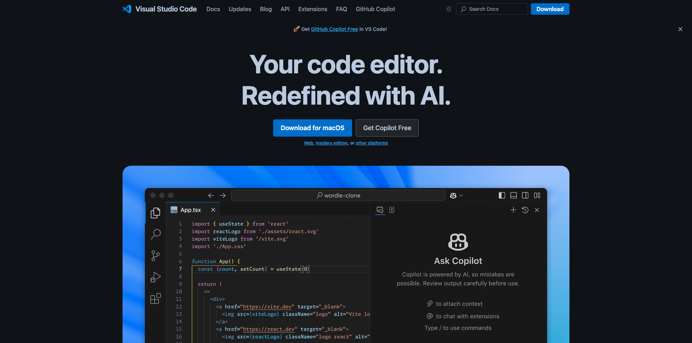
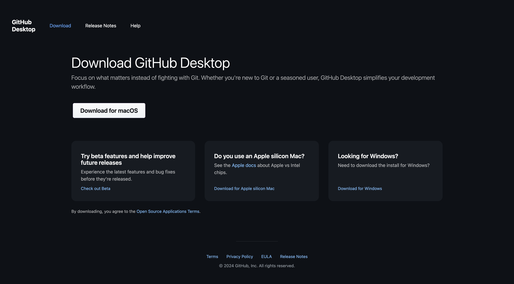

# Applicazioni da installare

Di seguito è riportata una panoramica delle applicazioni da installare sul computer prima di avviare l&#39;esercitazione.

## Adobe Creative Cloud

Vai a [https://creativecloud.adobe.com/apps/download/creative-cloud](https://creativecloud.adobe.com/apps/download/creative-cloud){target="_blank"} e fai clic su **Scarica Creative Cloud**.

## Adobe Photoshop

Apri l&#39;app **Adobe Creative Cloud**, vai a **App**. Installa Photoshop nel computer.

## Codice di Visual Studio

Vai a [https://code.visualstudio.com/](https://code.visualstudio.com/){target="_blank"}, scarica e installa **Visual Studio Code**.

## Editor di testo

Se non disponi di un&#39;app Editor di testo, puoi passare a [https://www.sublimetext.com/](https://www.sublimetext.com/){target="_blank"} e scaricare e installare questo editor di testo.

## Account GitHub

Se non hai ancora un account GitHub, passa a [https://github.com/](https://github.com/){target="_blank"} e fai clic su **Registrati**. Utilizza il tuo indirizzo e-mail personale e crea il tuo account.

## Desktop GitHub

Vai a [https://desktop.github.com/download/](https://desktop.github.com/download/){target="_blank"}, scarica e installa **Github Desktop**.

Hai completato il modulo Guida introduttiva.

## Passaggi successivi

Vai a [Utilizza il tuo sito Web AEM e AEP sandbox](./ex3.md){target="_blank"}

Torna a [Guida introduttiva - IA agente](./getting-started-agentic-ai.md){target="_blank"}

Torna a [Tutti i moduli](./../../../overview.md){target="_blank"}./images
