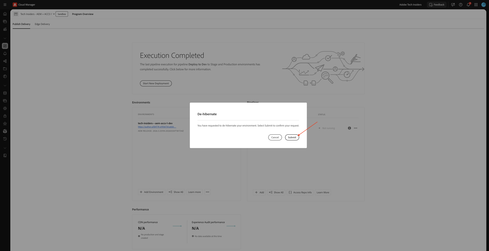

# Utilizza il tuo sito web AEM e AEP sandbox

Quando utilizzi i laboratori tecnici di IA per l’analisi dei dati, utilizzerai un programma AEM as a Cloud Service esistente utilizzando Edge Delivery Services. Questo programma AEM as a Cloud Service che utilizza Edge Delivery Services è stato creato per te ed è già disponibile all’inizio dei Tech Labs.

## Numero corrente

Quando hai accesso all’ambiente di abilitazione, ti è stato assegnato un numero. Questo numero indica il programma AEM as a Cloud Service da utilizzare e la sandbox AEP da utilizzare per il Brand Concierge Tech Lab.

>[!IMPORTANT]
>
>Se non hai ancora ricevuto questa e-mail, non potrai ancora eseguire i passaggi seguenti. Devi attendere fino a quando non ricevi l’e-mail seguente prima di accedere alle seguenti applicazioni di Adobe.

## Il tuo programma AEM

>[!NOTE]
>
>Tutte le schermate seguenti utilizzano il numero 1 solo a scopo illustrativo. Devi utilizzare il numero che ti è stato assegnato come parte dell’e-mail che hai ricevuto mentre segui i passaggi seguenti.

Il programma AEM utilizza il numero assegnato a te nel nome. Il nome del programma AEM deve essere:

- **Approfondimenti tecnici - AEM + ACCS X** dove X rappresenta il numero assegnato.

Puoi accedere e trovare il tuo programma AEM da [https://experience.adobe.com/cloud-manager/landing.html](https://experience.adobe.com/cloud-manager/landing.html). Verifica che l&#39;ambiente selezionato sia **`--aepImsOrgName--`**. Puoi verificarlo nell&#39;angolo in alto a destra dello schermo.

### Riattivazione del programma AEM

Il programma AEM utilizzato è un programma &quot;sandbox&quot;. Le sandbox di AEM si ibernano automaticamente dopo un paio d’ore di mancato utilizzo; sarà quindi necessario riattivarle prima di utilizzarle. Per riattivare un programma, vai a [https://experience.adobe.com/cloud-manager/landing.html](https://experience.adobe.com/cloud-manager/landing.html). Fai clic su per aprire il programma.

Dovresti vedere questo. Fare clic sui tre punti **...**, quindi selezionare **Riattiva**.

Fai clic su **Invia**. La riattivazione richiede 10-15 minuti.

### Archivio GitHub per il programma AEM

Ogni programma di AEM utilizza Edge Delivery Services per distribuire il sito web. Ciò significa che il codice del sito web è ospitato in un archivio GitHub. L’archivio GitHub è stato creato e accessibile da:

**https://github.com/woutervangeluwe/techinsidersX-citisignal-aem-accs**, dove devi sostituire X con il tuo numero.

L’archivio GitHub avrà un aspetto simile al seguente.

Come parte del processo di onboarding prima dell’inizio delle sessioni del Tech Lab, ti verrà chiesto di fornire il nome utente GitHub. Specificando il tuo nome utente GitHub, verrai aggiunto come collaboratore all’archivio GitHub allegato al tuo sito web in modo da poter apportare modifiche.

### Accedi al tuo sito web

Per accedere al tuo sito web, puoi utilizzare i seguenti URL predefiniti:

- **https://main--techinsidersX-citisignal-aem-accs--woutervangeluwe.aem.page/**
- **https://main--techinsidersX-citisignal-aem-accs--woutervangeluwe.aem.live/**

Devi sostituire la X in questi URL con il numero che ti è stato assegnato.

Inoltre, è stato creato un nome di dominio personalizzato per ciascun sito web, a cui è possibile accedere utilizzando questo URL:

- **https://techinsidersX.adobedemosystem.com/**

Devi sostituire la X in questi URL con il numero che ti è stato assegnato.

Dovresti quindi essere in grado di visualizzare il tuo sito web, che è simile al seguente:

## La tua sandbox AEP

>[!NOTE]
>
>Tutte le schermate seguenti utilizzano il numero 1 solo a scopo illustrativo. Devi utilizzare il numero che ti è stato assegnato come parte dell’e-mail che hai ricevuto mentre segui i passaggi seguenti.

Per il Brand Concierge Tech Lab, devi utilizzare una sandbox AEP specifica. Questa sandbox di AEP si chiama: **techinsidersX**, dove devi sostituire la X con il numero che ti è stato assegnato.

Vai a [https://platform.adobe.com](https://platform.adobe.com). Nell’angolo in alto a destra dello schermo, apri il menu a discesa per selezionare la sandbox.

È sufficiente utilizzare questa sandbox per il Brand Concierge Tech Lab.

## Passaggi successivi

Torna a [Guida introduttiva - IA agente](./getting-started-agentic-ai.md){target="_blank"}

Torna a [Tutti i moduli](./../../../overview.md){target="_blank"}./images
