# Configurare il progetto Adobe I/O

## Video

Questo video illustra e illustra tutti i passaggi di questo esercizio.

>[!VIDEO](https://video.tv.adobe.com/v/3476494?quality=12&learn=on)

## Creare un progetto Adobe I/O

In questo esercizio, Adobe I/O viene utilizzato per eseguire query su vari endpoint di Adobe. Segui questi passaggi per configurare Adobe I/O.

Vai a [https://developer.adobe.com/console/home](https://developer.adobe.com/console/projects){target="_blank"}.

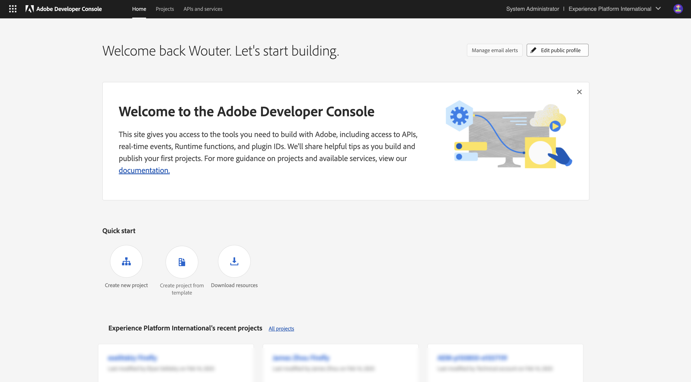

Assicurati di selezionare l’istanza corretta nell’angolo in alto a destra dello schermo. L&#39;istanza è `--aepImsOrgName--`.

>[!NOTE]
>
> La schermata seguente mostra un’organizzazione specifica selezionata. Durante l’esercitazione, è molto probabile che il nome dell’organizzazione sia diverso. Quando ti sei iscritto a questo tutorial, ti sono stati forniti i dettagli dell’ambiente da utilizzare, segui queste istruzioni.

Selezionare **Crea nuovo progetto**.

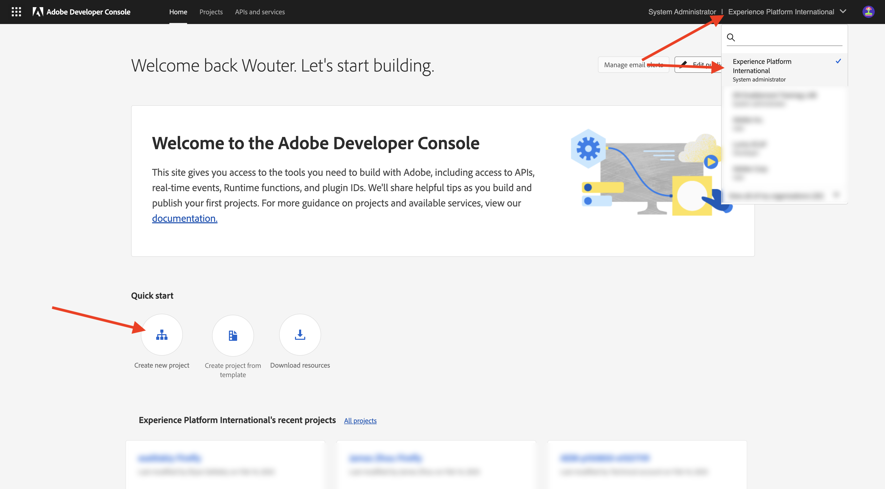

### API FIREFLY SERVICES

>[!IMPORTANT]
>
>A seconda del percorso di apprendimento selezionato, potresti non avere accesso all’API di Firefly Services. Potrai accedere all&#39;API di Firefly Services solo se ti trovi nel percorso di apprendimento **Firefly**, **Workfront Fusion**, **ALL** o se stai partecipando a un **workshop live di persona**. Puoi saltare questo passaggio se non sei su uno di questi percorsi di apprendimento.

Dovresti vedere questo. Selezionare **+ Aggiungi al progetto** e scegliere **API**.

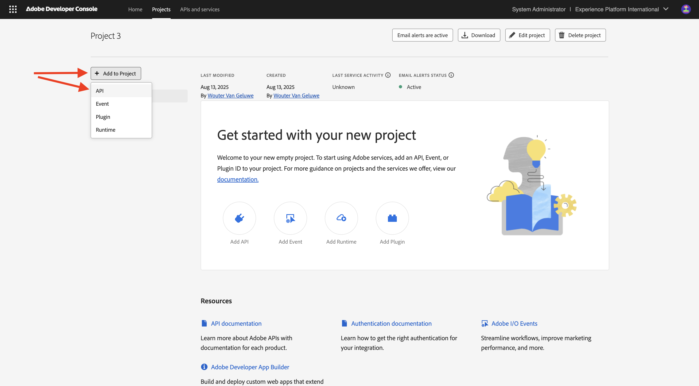

Seleziona **Adobe Firefly Services** e scegli **Firefly - Firefly Services**, quindi seleziona **Next**.

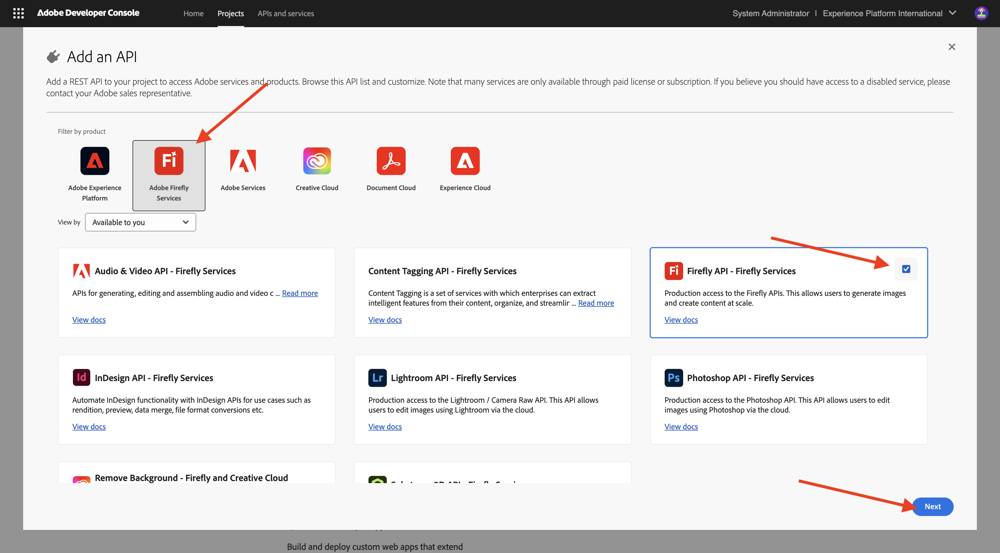

Specifica un nome per le credenziali: `--aepUserLdap-- - One Adobe OAuth credential` e seleziona **Avanti**.

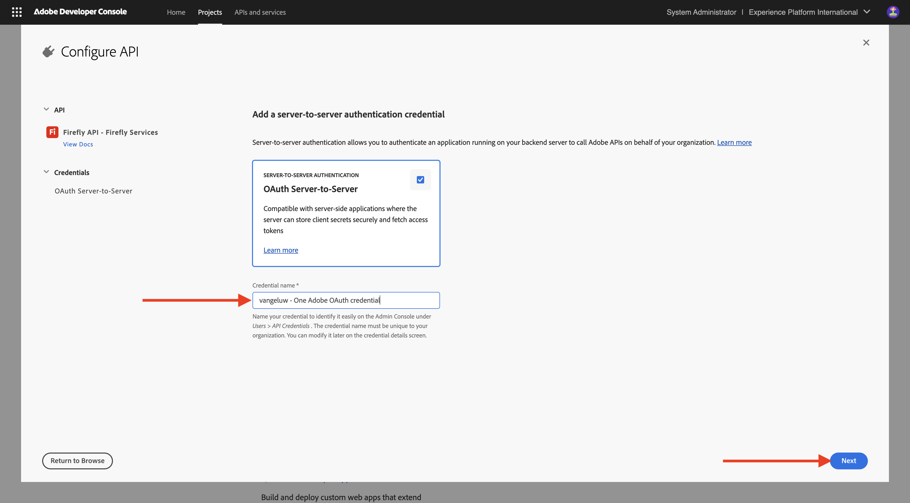

Selezionare il profilo predefinito **Configurazione Firefly Services predefinita** e selezionare **Salva API configurata**.

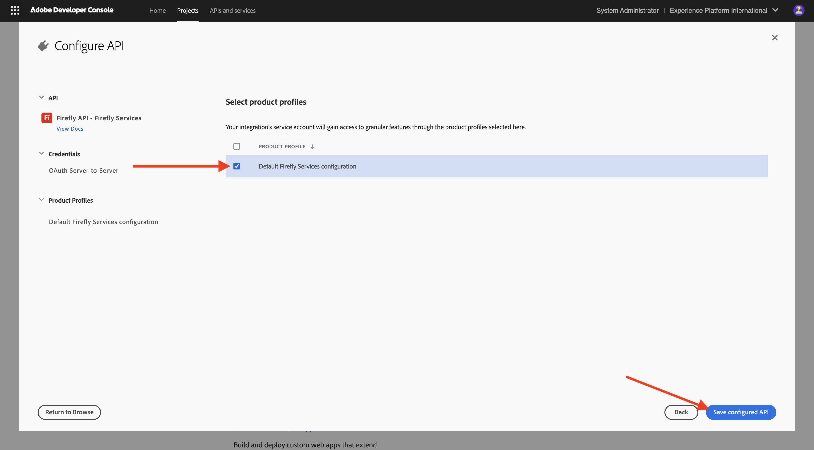

Dovresti vedere questo.

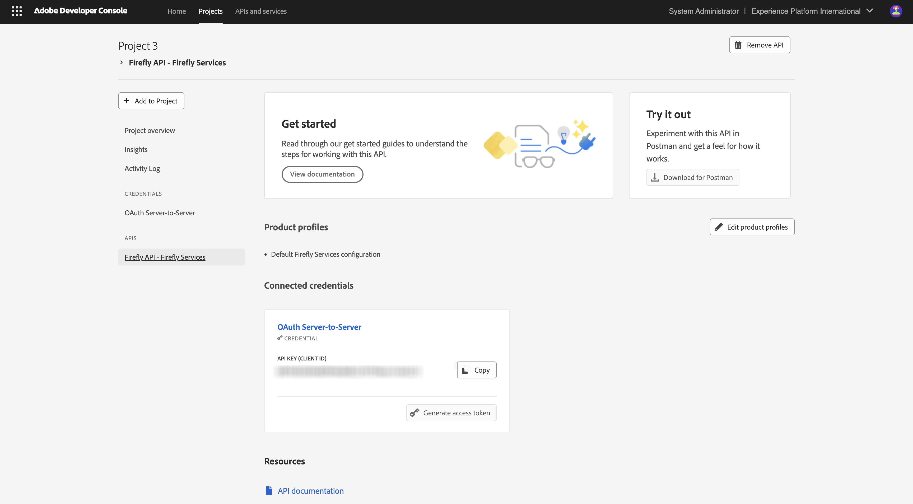

### API PHOTOSHOP SERVICES

>[!IMPORTANT]
>
>A seconda del percorso di apprendimento selezionato, potresti non avere accesso all’API di Photoshop Services. Potrai accedere all&#39;API di Photoshop Services solo se ti trovi nel percorso di apprendimento **Firefly**, **Workfront Fusion**, **ALL** o se stai partecipando a un **workshop live di persona**. Puoi saltare questo passaggio se non sei su uno di questi percorsi di apprendimento.
>
Selezionare **+ Aggiungi al progetto**, quindi selezionare **API**.

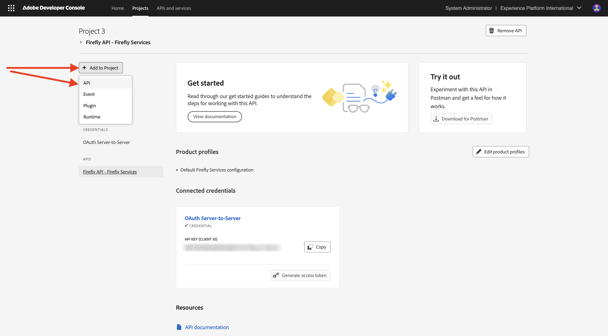

Seleziona **Adobe Firefly Services** e scegli **Photoshop - Firefly Services**. Seleziona **Avanti**.

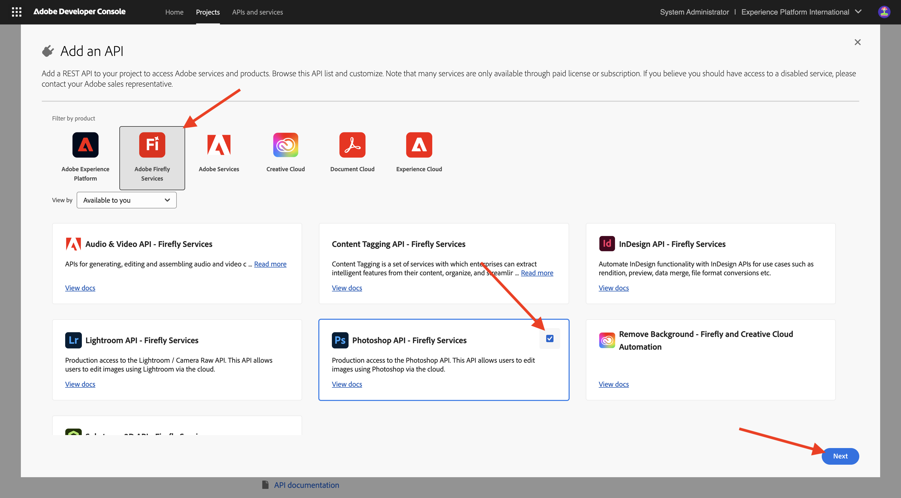

Seleziona **Avanti**.

Successivamente, devi selezionare un profilo di prodotto che definisca quali autorizzazioni sono disponibili per questa integrazione.

Selezionare **Configurazione predefinita Firefly Services** e **Configurazione predefinita Creative Cloud Automation Services**.

Seleziona **Salva API configurata**.

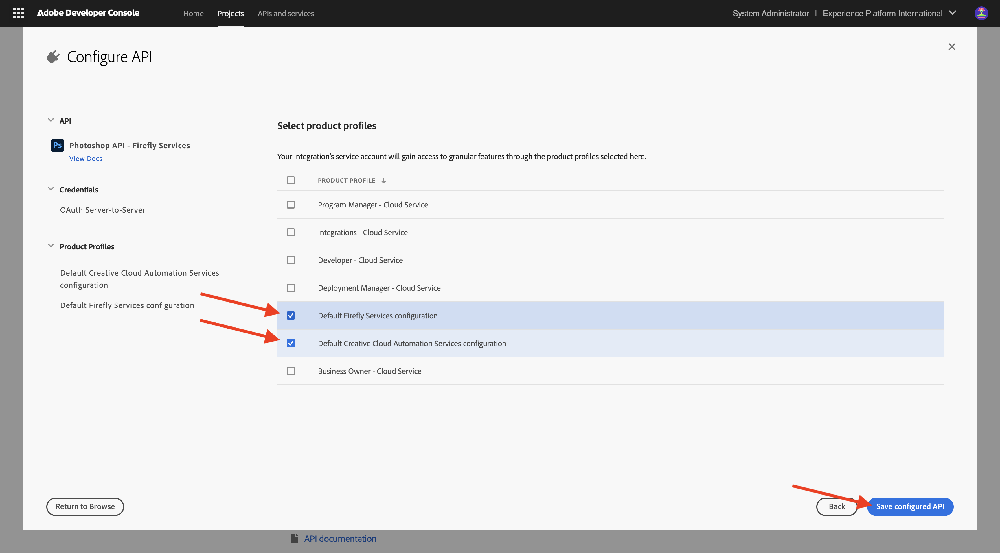

Dovresti vedere questo.

### API ADOBE EXPERIENCE PLATFORM

>[!IMPORTANT]
>
>A seconda del percorso di apprendimento selezionato, potresti non avere accesso all’API di Adobe Experience Platform. You will only have access to Adobe Experience Platform API if you&#39;re on the learning path **AEP + Apps**, **ALL**, or when you&#39;re attending a **live in-person workshop**. Puoi saltare questo passaggio se non sei su uno di questi percorsi di apprendimento.

Selezionare **+ Aggiungi al progetto**, quindi selezionare **API**.

Select **Adobe Experience Platfrom** and choose **Experience Platform API**. Seleziona **Avanti**.

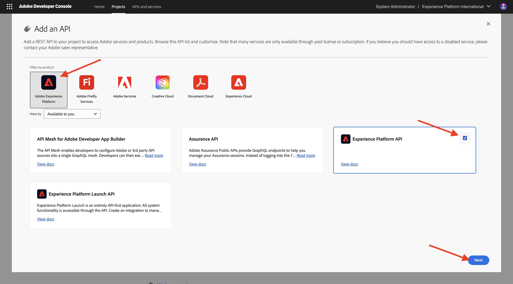

Seleziona **Avanti**.

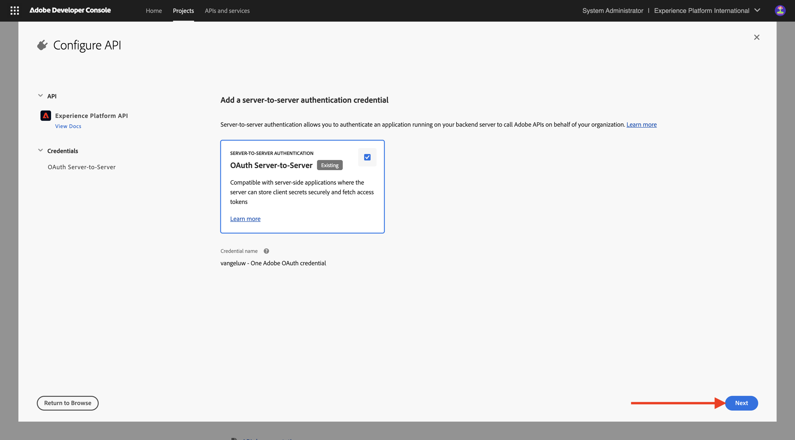

Successivamente, devi selezionare un profilo di prodotto che definisca quali autorizzazioni sono disponibili per questa integrazione.

Select **Adobe Experience Platform - All Users - PROD**.

>[!NOTE]
>
>The name of the Product Profile for AEP is dependent on how the environment was configured. If you don&#39;t see the above mentioned product profile, you may have a product profile that is called **Default Production All Access**. If you&#39;re not sure which one to choose, ask your AEP System Admin.

Seleziona **Salva API configurata**.

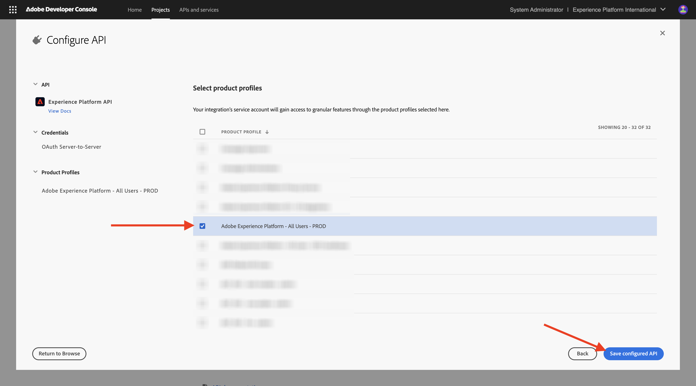

Dovresti vedere questo.

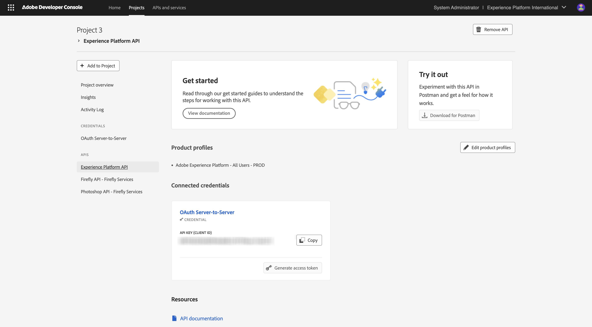

### Frame.io API

>[!IMPORTANT]
>
>Depending on the learning path that you selected, you may not have access to Frame.io API. You will only have access to Frame.io API if you&#39;re on the learning path **Workfront Fusion**, **ALL**, or when you&#39;re attending a **live in-person workshop**. Puoi saltare questo passaggio se non sei su uno di questi percorsi di apprendimento.

Selezionare **+ Aggiungi al progetto**, quindi selezionare **API**.

Select **Creative Cloud** and choose **Frame.io API**. Seleziona **Avanti**.

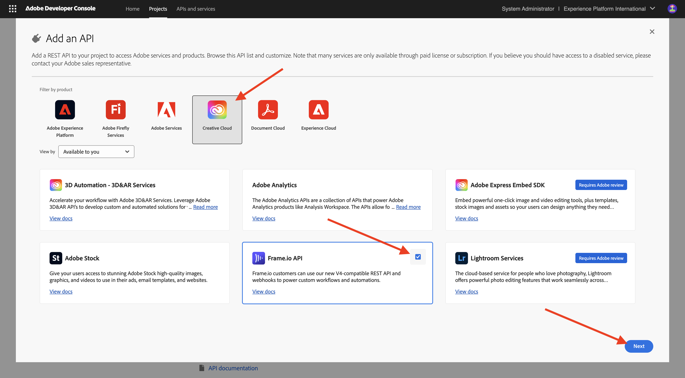

Selezionare **Autenticazione da server a server** e quindi fare clic su **Avanti**.

Seleziona **OAuth Server-to-Server** e fai clic su **Avanti**.

Successivamente, devi selezionare un profilo di prodotto che definisca quali autorizzazioni sono disponibili per questa integrazione.

Seleziona **Default Frame.io Enterprise - Configurazione Prime** e fai clic su **Salva API configurata**.

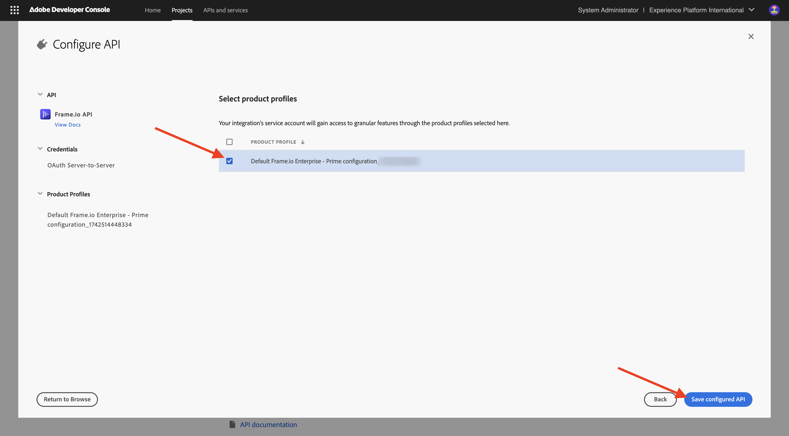

Dovresti vedere questo.

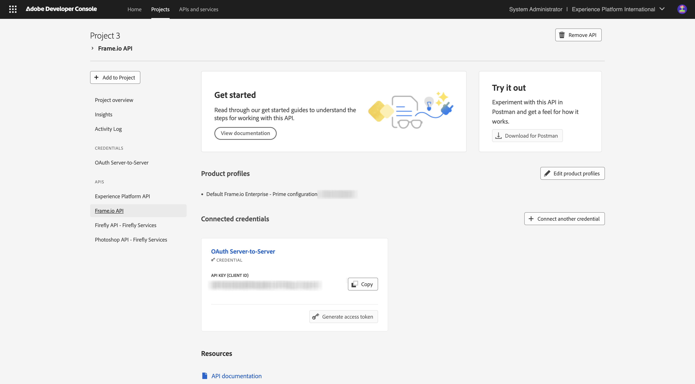

### Nome progetto

Fai clic sul nome del progetto.

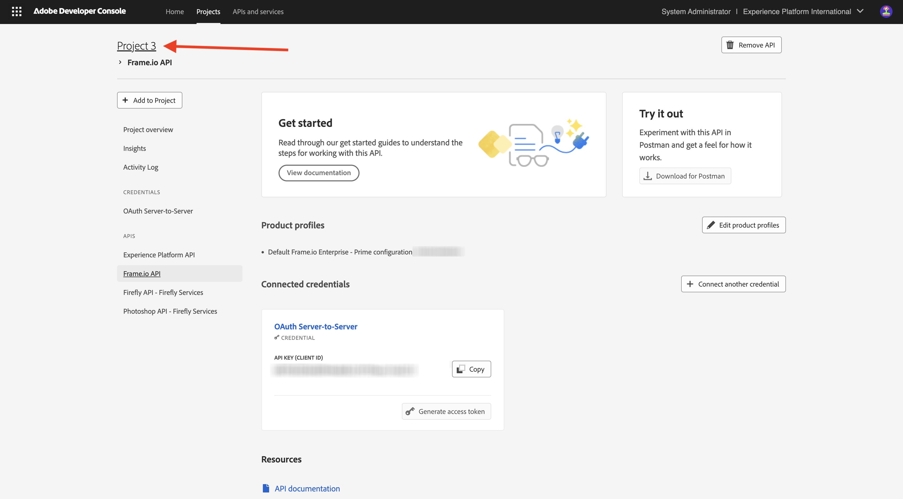{zoomable="yes"}

Seleziona **Modifica progetto**.

{zoomable="yes"}

Immetti un nome descrittivo per l&#39;integrazione: `--aepUserLdap-- One Adobe tutorial` e seleziona **Salva**.

{zoomable="yes"}

La configurazione del progetto Adobe I/O è terminata.

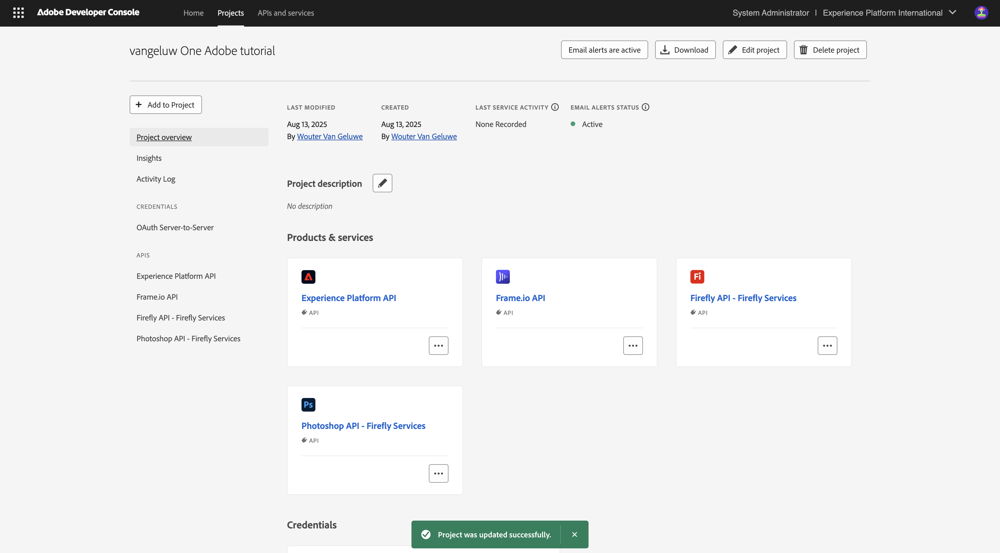{zoomable="yes"}

## Passaggi successivi

Vai a [Opzione 1: installazione di Postman](./ex3.md){target="_blank"}

Vai a [Opzione 2: installazione di PostBuster](./ex4.md){target="_blank"}

Torna a [Guida introduttiva - GenStudio](./getting-started-genstudio.md){target="_blank"}

Torna a [Tutti i moduli](./../../../overview.md){target="_blank"}
