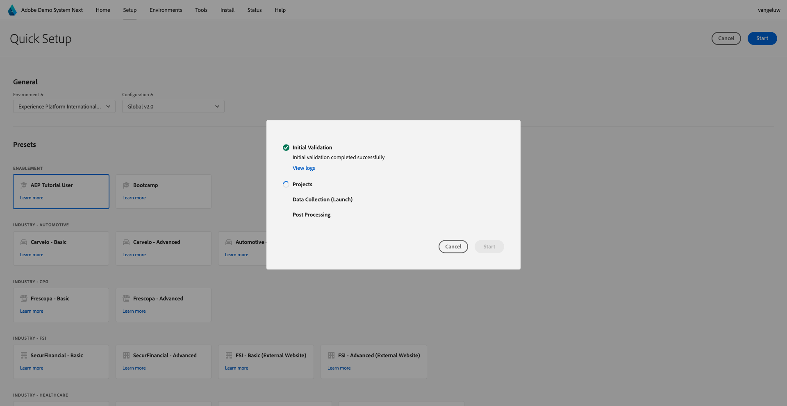

# Utilizza Demo System Next per configurare la proprietà client di Adobe Experience Platform Data Collection

Per visualizzare i risultati di questo tutorial e consentirti di testare la configurazione in un ambiente sicuro, questo tutorial utilizza gli strumenti Successivo di Adobe Demo System. Per ottenere il massimo da questa esercitazione, l’istanza AEP deve essere configurata per essere integrata con Demo System Next.

Dopo aver effettuato l&#39;accesso a Sistema demo, procedere come segue.

Vai a [https://dsn.adobe.com/](https://dsn.adobe.com/) e passa a **Configurazione**.

Nel menu a discesa **Ambiente**, seleziona l&#39;istanza AEP e la sandbox.

Selezionare quindi il predefinito **Utente tutorial AEP**.

Fare clic su **Inizio**.

Nella finestra a comparsa, immetti un nome per le proprietà di raccolta dati e i progetti Experience Builder. Utilizza questa convenzione per i nomi: **Sistema demo (GG/MM/AAAA)**. Nota: il tuo LDAP verrà aggiunto automaticamente, non è necessario aggiungerlo autonomamente.

Fare clic su **Inizio**.

Viene quindi visualizzata questa finestra a comparsa che mostra l’avanzamento della creazione dei progetti per siti web e app mobili e delle proprietà di raccolta dati.

Una volta completato il processo di configurazione rapida, avrai:

- 1 progetto web, che consente di utilizzare un sito web demo con un marchio telco demo
- 1 progetto di app mobile, che consente di utilizzare un’app mobile demo con un marchio telco demo
- 1 Progetto dell&#39;app CX, che consente di utilizzare un&#39;app del call center con un marchio dimostrativo telco
- 1 Proprietà di raccolta dati per il Web, che verrà utilizzata per raccogliere i dati dal sito Web
- 1 Proprietà di raccolta dati per dispositivi mobili, che utilizzerai per raccogliere dati dall’app mobile

Tieni aperta questa schermata come ti servirà nei passaggi successivi.

Passaggio successivo: [Crea lo stream di dati](./ex3.md)

[Torna a Guida introduttiva](./getting-started.md)

[Torna a tutti i moduli](./../../../overview.md)
