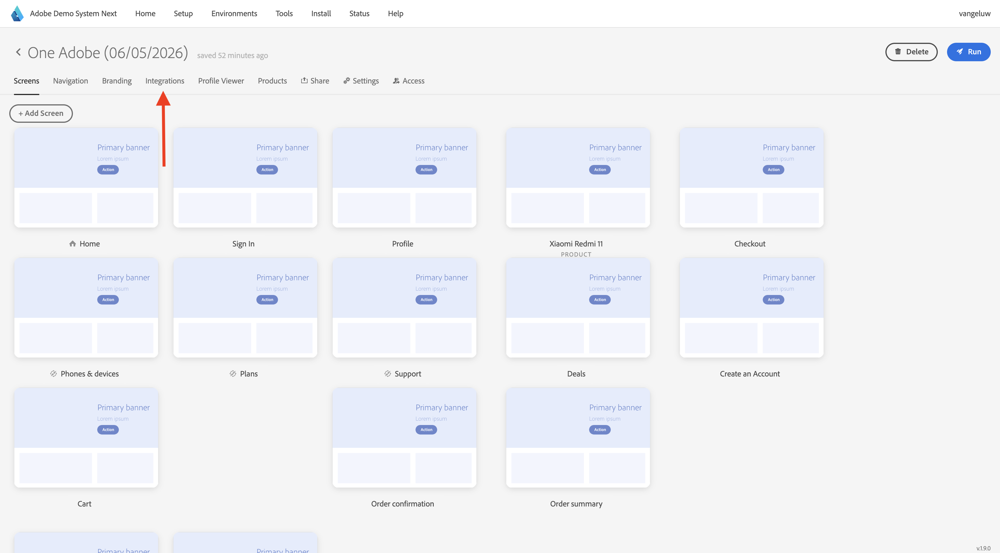
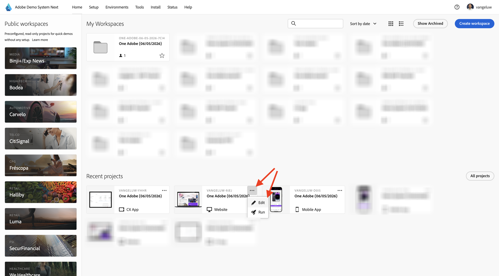

# Utilizza il sito web

## Opzione 1: continuare dall&#39;esercizio precedente

>[!NOTE]
>
>Se la schermata seguente non è più aperta, passa all’opzione 2.

Questo risultato è stato ottenuto dopo l&#39;esercizio precedente. Fare clic per aprire il **progetto Web Telco** creato per l&#39;utente.

Poi vedrai questo. Fai clic su **Integrazioni**.

Nella pagina **Integrazioni** è necessario selezionare la proprietà Raccolta dati creata nell&#39;esercizio precedente. A tale scopo, fare clic su **Seleziona ambiente**.

Fare clic su **Seleziona** nella proprietà Raccolta dati creata nel passaggio precedente, denominata `--aepUserLdap-- - Demo System (DD/MM/YYYY) (web)`.

Poi vedrai questo. Fai clic su **Esegui** per aprire il sito Web della demo.

Poi vedrai il tuo sito web demo aperto. Seleziona l’URL e copialo negli Appunti.

Apri una nuova finestra del browser in incognito.

Incolla l’URL del sito web demo, che hai copiato nel passaggio precedente. Ti verrà quindi chiesto di effettuare l’accesso con il tuo Adobe ID.

Seleziona il tipo di account e completa la procedura di accesso.

Vedrai quindi il tuo sito web caricato in una finestra del browser in incognito. Per ogni dimostrazione, dovrai utilizzare una nuova finestra del browser in incognito per caricare l’URL del sito web demo.

## Opzione 2: iniziare con una nuova finestra del browser in incognito

Nel caso in cui la finestra del browser sia stata chiusa accidentalmente o per sessioni future, puoi accedere al progetto del tuo sito web anche da [https://dsn.adobe.com/](https://dsn.adobe.com/). Dopo aver effettuato l’accesso con il tuo Adobe ID, visualizzerai questo. Fai clic sui tre punti **...** nel progetto del tuo sito Web, quindi fai clic su **Modifica**.

Ora puoi seguire il flusso seguente per accedere al sito web. Fai clic su **Integrazioni**.

Nella pagina **Integrazioni** è necessario selezionare la proprietà Raccolta dati creata nell&#39;esercizio precedente. A tale scopo, fare clic su **Seleziona ambiente**.

Fare clic su **Seleziona** nella proprietà Raccolta dati creata nel passaggio precedente, denominata `--aepUserLdap - Demo System (DD/MM/YYYY) (web)`.

Poi vedrai questo. Fai clic su **Esegui** per aprire il sito Web della demo.

Poi vedrai il tuo sito web demo aperto. Seleziona l’URL e copialo negli Appunti.

Apri una nuova finestra del browser in incognito.

Incolla l’URL del sito web demo, che hai copiato nel passaggio precedente. Ti verrà quindi chiesto di effettuare l’accesso con il tuo Adobe ID.

Seleziona il tipo di account e completa la procedura di accesso.

Vedrai quindi il tuo sito web caricato in una finestra del browser in incognito. Per ogni dimostrazione, dovrai utilizzare una nuova finestra del browser in incognito per caricare l’URL del sito web demo.

Passaggio successivo: [Utilizzare l&#39;app mobile](./ex5.md)

[Torna a Guida introduttiva](./getting-started.md)

[Torna a tutti i moduli](./../../../overview.md)
