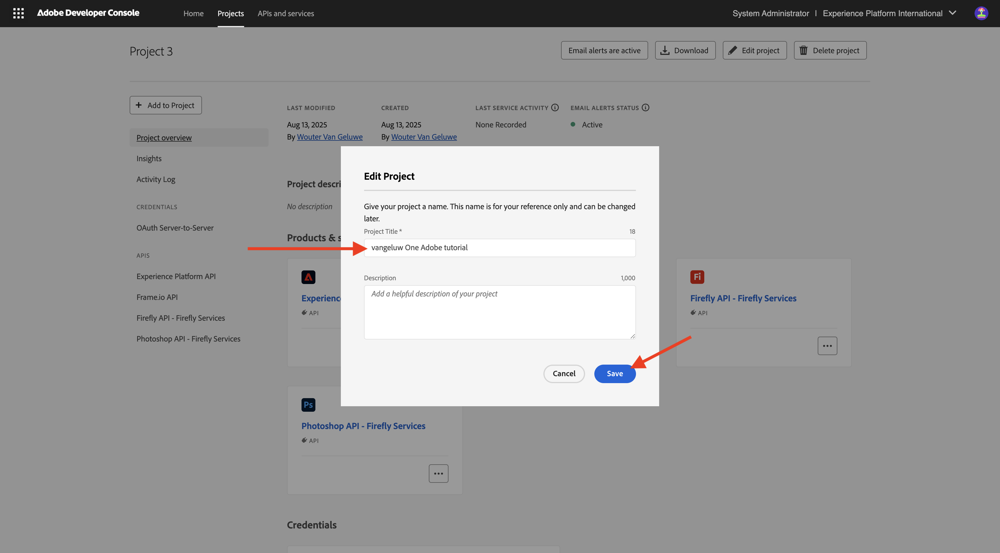

# Configurare il progetto Adobe I/O

## Creare un progetto Adobe I/O

In questo esercizio, Adobe I/O viene utilizzato per eseguire query su vari endpoint di Adobe. Segui questi passaggi per configurare Adobe I/O.

Vai a [https://developer.adobe.com/console/home](https://developer.adobe.com/console/projects){target="_blank"}.

{zoomable="yes"}

Assicurati di selezionare l’istanza corretta nell’angolo in alto a destra dello schermo. L&#39;istanza è `--aepImsOrgName--`.
Selezionare **Crea nuovo progetto**.

{zoomable="yes"}

### API dei servizi Firefly

Dovresti vedere questo. Selezionare **+ Aggiungi al progetto** e scegliere **API**.

{zoomable="yes"}

Lo schermo dovrebbe essere simile al seguente.

{zoomable="yes"}

Seleziona **Creative Cloud** e scegli **Firefly - Firefly Services**, quindi seleziona **Next**.

{zoomable="yes"}

Immetti un nome per le credenziali: `--aepUserLdap-- - One Adobe OAuth credential`e seleziona **Avanti**.

{zoomable="yes"}

Selezionare il profilo predefinito **Configurazione predefinita servizi Firefly** e selezionare **Salva API configurata**.

{zoomable="yes"}

Dovresti vedere questo.

{zoomable="yes"}

### API PHOTOSHOP SERVICES

Selezionare **+ Aggiungi al progetto**, quindi selezionare **API**.

{zoomable="yes"}

Selezionare **Creative Cloud** e scegliere **Photoshop - Servizi Firefly**. Seleziona **Avanti**.

{zoomable="yes"}

Seleziona **Avanti**.

{zoomable="yes"}

Successivamente, devi selezionare un profilo di prodotto che definisca quali autorizzazioni sono disponibili per questa integrazione.

Selezionare **Configurazione predefinita servizi Firefly** e **Configurazione predefinita servizi di automazione Creative Cloud**.

Seleziona **Salva API configurata**.

{zoomable="yes"}

Dovresti vedere questo.

{zoomable="yes"}

### API ADOBE EXPERIENCE PLATFORM

Selezionare **+ Aggiungi al progetto**, quindi selezionare **API**.

{zoomable="yes"}

Seleziona **Adobe Experience Platform** e scegli **Experience Platform API**. Seleziona **Avanti**.

{zoomable="yes"}

Seleziona **Avanti**.

{zoomable="yes"}

Successivamente, devi selezionare un profilo di prodotto che definisca quali autorizzazioni sono disponibili per questa integrazione.

Selezionare **Adobe Experience Platform - Tutti gli utenti - PROD**.

Seleziona **Salva API configurata**.

{zoomable="yes"}

Dovresti vedere questo.

{zoomable="yes"}

### Nome progetto

Fai clic sul nome del progetto.

{zoomable="yes"}

Seleziona **Modifica progetto**.

{zoomable="yes"}

Immetti un nome descrittivo per l&#39;integrazione: `--aepUserLdap-- One Adobe tutorial`e seleziona **Salva**.

{zoomable="yes"}

La configurazione del progetto Adobe I/O è terminata.

{zoomable="yes"}

## Passaggi successivi

Vai a [Opzione 1: installazione di Postman](./ex7.md){target="_blank"}

Vai a [Opzione 2: installazione di PostBuster](./ex8.md){target="_blank"}

Torna a [Guida introduttiva](./getting-started.md){target="_blank"}

Torna a [Tutti i moduli](./../../../overview.md){target="_blank"}