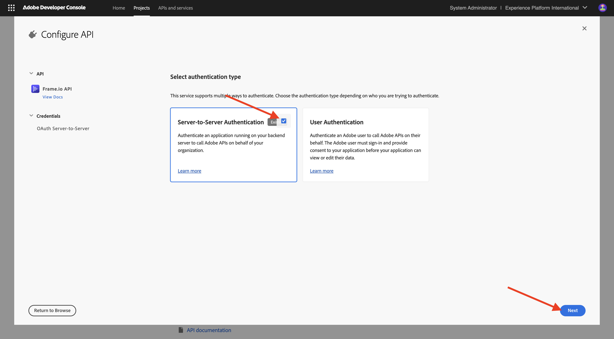

# Configurare il progetto Adobe I/O

## Creare un progetto Adobe I/O

In questo esercizio, Adobe I/O viene utilizzato per eseguire query su vari endpoint di Adobe. Segui questi passaggi per configurare Adobe I/O.

Vai a [https://developer.adobe.com/console/home](https://developer.adobe.com/console/projects){target="_blank"}.

Assicurati di selezionare l’istanza corretta nell’angolo in alto a destra dello schermo. L&#39;istanza è `--aepImsOrgName--`.

>[!NOTE]
>
> La schermata seguente mostra un’organizzazione specifica selezionata. Durante l’esercitazione, è molto probabile che il nome dell’organizzazione sia diverso. Quando ti sei iscritto a questo tutorial, ti sono stati forniti i dettagli dell’ambiente da utilizzare, segui queste istruzioni.

Selezionare **Crea nuovo progetto**.

### API FIREFLY SERVICES

>[!IMPORTANT]
>
>A seconda del percorso di apprendimento selezionato, potresti non avere accesso all’API di Firefly Services. Potrai accedere all&#39;API di Firefly Services solo se ti trovi nel percorso di apprendimento **Firefly**, **Workfront Fusion**, **ALL** o se stai partecipando a un **workshop live di persona**. Puoi saltare questo passaggio se non sei su uno di questi percorsi di apprendimento.

Dovresti vedere questo. Selezionare **+ Aggiungi al progetto** e scegliere **API**.

Seleziona **Adobe Firefly Services** e scegli **Firefly - Firefly Services**, quindi seleziona **Next**.

Specifica un nome per le credenziali: `--aepUserLdap-- - One Adobe OAuth credential` e seleziona **Avanti**.

Selezionare il profilo predefinito **Configurazione Firefly Services predefinita** e selezionare **Salva API configurata**.

Dovresti vedere questo.

### API PHOTOSHOP SERVICES

>[!IMPORTANT]
>
>A seconda del percorso di apprendimento selezionato, potresti non avere accesso all’API di Photoshop Services. Potrai accedere all&#39;API di Photoshop Services solo se ti trovi nel percorso di apprendimento **Firefly**, **Workfront Fusion**, **ALL** o se stai partecipando a un **workshop live di persona**. Puoi saltare questo passaggio se non sei su uno di questi percorsi di apprendimento.
>
Selezionare **+ Aggiungi al progetto**, quindi selezionare **API**.

Seleziona **Adobe Firefly Services** e scegli **Photoshop - Firefly Services**. Seleziona **Avanti**.

Seleziona **Avanti**.

Successivamente, devi selezionare un profilo di prodotto che definisca quali autorizzazioni sono disponibili per questa integrazione.

Selezionare **Configurazione predefinita Firefly Services** e **Configurazione predefinita Creative Cloud Automation Services**.

Seleziona **Salva API configurata**.

Dovresti vedere questo.

### API ADOBE EXPERIENCE PLATFORM

>[!IMPORTANT]
>
>A seconda del percorso di apprendimento selezionato, potresti non avere accesso all’API di Adobe Experience Platform. Potrai accedere all&#39;API di Adobe Experience Platform solo se ti trovi nel percorso di apprendimento **AEP + App**, **ALL** o se stai partecipando a un **workshop live di persona**. Puoi saltare questo passaggio se non sei su uno di questi percorsi di apprendimento.

Selezionare **+ Aggiungi al progetto**, quindi selezionare **API**.

Seleziona **Adobe Experience Platform** e scegli **Experience Platform API**. Seleziona **Avanti**.

Seleziona **Avanti**.

Successivamente, devi selezionare un profilo di prodotto che definisca quali autorizzazioni sono disponibili per questa integrazione.

Selezionare **Adobe Experience Platform - Tutti gli utenti - PROD**.

>[!NOTE]
>
>Il nome del profilo di prodotto per AEP dipende da come è stato configurato l’ambiente. Se il profilo di prodotto sopra indicato non viene visualizzato, è possibile che sia presente un profilo di prodotto denominato **Default Production All Access**. Se non sai quale scegliere, rivolgiti all’amministratore di sistema di AEP.

Seleziona **Salva API configurata**.

Dovresti vedere questo.

### API Frame.io

>[!IMPORTANT]
>
>A seconda del percorso di apprendimento selezionato, potresti non avere accesso all’API Frame.io. Potrai accedere all&#39;API Frame.io solo se ti trovi nel percorso di apprendimento **Workfront Fusion**, **ALL** o se stai partecipando a un **workshop live in-person**. Puoi saltare questo passaggio se non sei su uno di questi percorsi di apprendimento.

Selezionare **+ Aggiungi al progetto**, quindi selezionare **API**.

Seleziona **Creative Cloud** e scegli **API Frame.io**. Seleziona **Avanti**.

Selezionare **Autenticazione da server a server** e quindi fare clic su **Avanti**.

Seleziona **OAuth Server-to-Server** e fai clic su **Avanti**.

Successivamente, devi selezionare un profilo di prodotto che definisca quali autorizzazioni sono disponibili per questa integrazione.

Seleziona **Default Frame.io Enterprise - Configurazione Prime** e fai clic su **Salva API configurata**.

Dovresti vedere questo.

### Nome progetto

Fai clic sul nome del progetto.

{zoomable="yes"}

Seleziona **Modifica progetto**.

{zoomable="yes"}

Immetti un nome descrittivo per l&#39;integrazione: `--aepUserLdap-- One Adobe tutorial` e seleziona **Salva**.

{zoomable="yes"}

La configurazione del progetto Adobe I/O è terminata.

{zoomable="yes"}

## Passaggi successivi

Vai a [Opzione 1: installazione di Postman](./ex7.md){target="_blank"}

Vai a [Opzione 2: installazione di PostBuster](./ex8.md){target="_blank"}

Torna a [Guida introduttiva](./getting-started.md){target="_blank"}

Torna a [Tutti i moduli](./../../../overview.md){target="_blank"}
