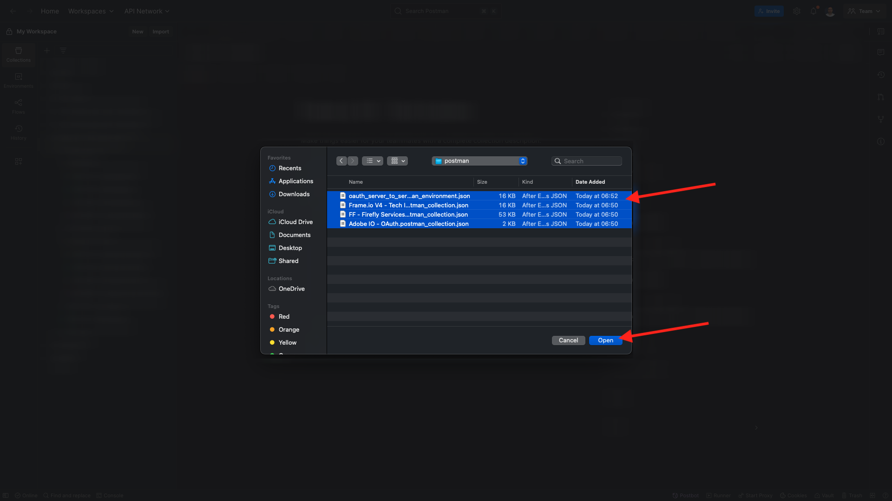
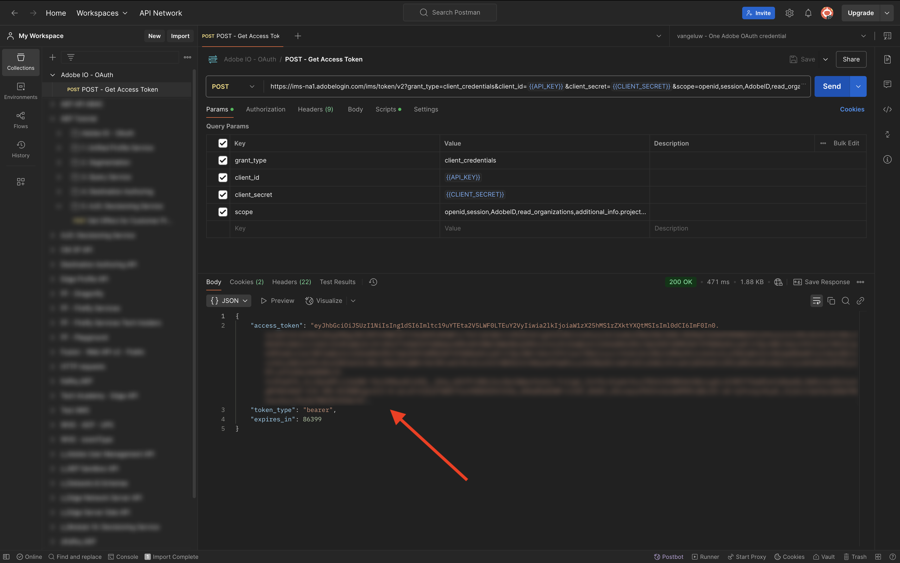

# Opzione 1: utilizzare Postman

>[!IMPORTANT]
>
>Se sei un dipendente Adobe, segui le istruzioni per [installare PostBuster](./ex8.md){target="_blank"}.

## Download dell’ambiente Postman

Vai a [https://developer.adobe.com/console/home](https://developer.adobe.com/console/projects){target="_blank"} e apri il progetto.

Fare clic sull&#39;API **Firefly - Firefly Services**. Quindi, fai clic su **Scarica per Postman** e scegli **OAuth Server-to-Server** per scaricare un ambiente Postman.

## Autenticazione di Postman in Adobe I/O

Scarica e installa la versione rilevante di Postman per il tuo sistema operativo in [Download di Postman](https://www.postman.com/downloads/){target="_blank"}.

Avvia l’applicazione.

In Postman sono disponibili 2 concetti: ambienti e raccolte.

Il file di ambiente contiene tutte le variabili di ambiente che sono più o meno coerenti. Nell’ambiente troverai elementi come l’IMSOrg dell’ambiente Adobe, insieme alle credenziali di sicurezza come l’ID client e altri. Il file di ambiente è stato scaricato durante la configurazione di Adobe I/O in precedenza ed è denominato **`oauth_server_to_server.postman_environment.json`**.

La raccolta contiene diverse richieste API che puoi utilizzare. Utilizzerai le seguenti raccolte:

- 1 raccolta per l’autenticazione in Adobe I/O
- 1 Raccolta per gli esercizi dei servizi Adobe Firefly in questo modulo
- 1 Raccolta per gli esercizi Adobe Frame.io V4 in questo modulo

Scarica [postman-ff.zip](./../../../assets/postman/postman-ff.zip){target="_blank"} sul desktop locale.

Nel file **postman-ff.zip** sono presenti i seguenti file:

- `Adobe IO - OAuth.postman_collection.json`
- `FF - Firefly Services Tech Insiders.postman_collection.json`
- `Frame.io V4 - Tech Insiders.postman_collection.json`

Decomprimi **postman-ff.zip** e archivia i seguenti file in una cartella sul desktop:

- `Adobe IO - OAuth.postman_collection.json`
- `FF - Firefly Services Tech Insiders.postman_collection.json`
- `Frame.io V4 - Tech Insiders.postman_collection.json`
- `oauth_server_to_server.postman_environment.json`

In Postman, selezionare **Importa**.

Selezionare **File**.

Scegli tutti i file dalla cartella, quindi seleziona **Apri** e **Importa**.

Fai clic su **Importa**.

Ora disponi di tutto il necessario in Postman per iniziare a interagire con Firefly Services tramite le API.

## Richiedi un token di accesso

Successivamente, per assicurarti di essere autenticato correttamente, devi richiedere un token di accesso.

Accertati di aver selezionato l’ambiente corretto prima di eseguire qualsiasi richiesta, verificando l’elenco a discesa Ambiente nell’angolo in alto a destra. L&#39;ambiente selezionato deve avere un nome simile a questo, `--aepUserLdap-- One Adobe OAuth Credential`.

L&#39;ambiente selezionato deve avere un nome simile a questo, `--aepUserLdap-- One Adobe OAuth Credential`.

Ora che l’ambiente e le raccolte Postman sono configurati e funzionanti, puoi eseguire l’autenticazione da Postman ad Adobe I/O.

Nella raccolta **Adobe IO - OAuth**, selezionare la richiesta denominata **POST - Ottieni token di accesso** e selezionare **Invia**.

In **Parametri query** sono presenti due variabili di riferimento, `API_KEY` e `CLIENT_SECRET`. Queste variabili vengono prese dall&#39;ambiente selezionato, `--aepUserLdap-- One Adobe OAuth Credential`.

In caso di esito positivo, nella sezione **Body** di Postman verrà visualizzata una risposta contenente un token Bearer, un token di accesso e una finestra di scadenza.

Dovresti vedere una risposta simile contenente le seguenti informazioni:

| Chiave | Valore |
|:-------------:| :---------------:| 
| token_type | **portatore** |
| access_token | **eyJhbGciOiJSUz...** |
| expires_in | **86399** |

Il **bearer-token** di Adobe I/O ha un valore specifico (access_token molto lungo) e una finestra di scadenza ed è ora valido per 24 ore. Ciò significa che dopo 24 ore, se desideri interagire con le API di Adobe con Postman, dovrai generare un nuovo token eseguendo nuovamente questa richiesta.

L’ambiente Postman è ora configurato e funzionante.

## Passaggi successivi

Vai a [Applicazioni da installare](./ex9.md){target="_blank"}

Torna a [Guida introduttiva](./getting-started.md){target="_blank"}

Torna a [Tutti i moduli](./../../../overview.md){target="_blank"}
