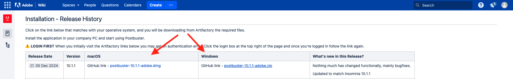
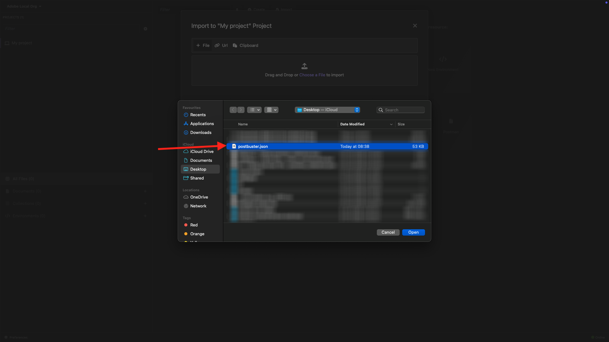
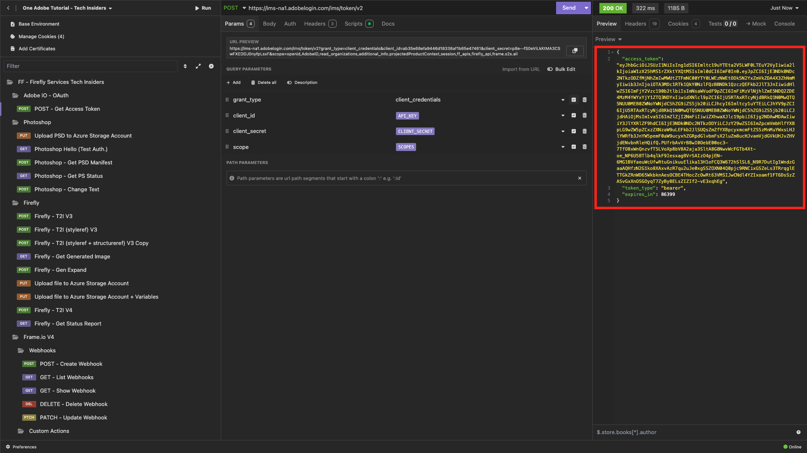

# Opzione 2: configurazione di PostBuster

>[!IMPORTANT]
>
>Se non sei un dipendente Adobe, segui le istruzioni per [installare Postman](./ex7.md){target="_blank"}. Le istruzioni seguenti sono destinate esclusivamente ai dipendenti di Adobe.

## Installare PostBuster

Vai a [https://adobe.service-now.com/esc?id=adb_esc_kb_article&amp;sysparm_article=KB0020542](https://adobe.service-now.com/esc?id=adb_esc_kb_article&sysparm_article=KB0020542){target="_blank"}.

Fai clic per scaricare l&#39;ultima versione di **PostBuster**.


Scarica la versione corretta per il tuo sistema operativo.



Una volta completato e installato il download, aprire PostBuster. Dovresti vedere questo. Fai clic su **Importa**.


Scarica [postbuster.json.zip](./../../../assets/postman/postbuster.json.zip){target="_blank"} ed estrailo dal desktop.


Fare clic su **Scegli un file**.


Seleziona il file **postbuster.json**. Fai clic su **Apri**.



Dovresti vedere questo. Fare clic su **Scansione**.


Fai clic su **Importa**.


Dovresti vedere questo. Fai clic su per aprire la raccolta importata.


Ora puoi vedere la tua raccolta. È comunque necessario configurare un ambiente in modo che contenga alcune variabili di ambiente.


Fare clic su **Ambiente base** e quindi sull&#39;icona **modifica**.


Dovresti vedere questo.


Copiare il segnaposto dell&#39;ambiente seguente e incollarlo nell&#39;**ambiente base**, sostituendo quello esistente.

```json
{
	"CLIENT_SECRET": "",
	"API_KEY": "",
	"ACCESS_TOKEN": "",
	"SCOPES": [
		"openid",
		"AdobeID",
		"read_organizations", 
		"additional_info.projectedProductContext", 
		"session",
		"ff_apis",
		"firefly_api",
		"frame.s2s.all"
	],
	"TECHNICAL_ACCOUNT_ID": "",
	"IMS": "ims-na1.adobelogin.com",
	"IMS_ORG": "",
	"access_token": "",
	"IMS_TOKEN": "",
	"AZURE_STORAGE_URL": "",
	"AZURE_STORAGE_CONTAINER": "",
	"AZURE_STORAGE_SAS_READ": "",
	"AZURE_STORAGE_SAS_WRITE": "",
	"FRAME_IO_BASE_URL": "https://api.frame.io",
	"FRAME_IO_ACCOUNT_ID": "",
	"FRAME_IO_WORKSPACE_ID": ""
}
```

Dovresti avere questo.


## Immetti le variabili Adobe I/O

Vai a [https://developer.adobe.com/console/home](https://developer.adobe.com/console/projects){target="_blank"} e apri il progetto.


Vai a **Server-to-Server OAuth**.


È ora necessario copiare i seguenti valori dal progetto Adobe I/O e incollarli nell’ambiente base PostBuster.

- ID client
- Segreto client (fare clic su **Recupera segreto client**)
- ID account tecnico
- ID organizzazione (scorri verso il basso per trovare l’ID organizzazione)


Copiare le variabili precedenti una alla volta e incollarle nell&#39;**ambiente base** in PostBuster.

| Nome variabile in Adobe I/O | Nome variabile nell&#39;ambiente base PostBuster |
|:-------------:| :---------------:| 
| ID client | `API_KEY` |
| Segreto client | `CLIENT_SECRET` |
| ID account tecnico | `TECHNICAL_ACCOUNT_ID` |
| ID organizzazione | `IMS_ORG` |

Dopo aver copiato le variabili in uno, l&#39;ambiente di base PostBuster sarà simile al seguente.

Fai clic su **Chiudi**.


Nella raccolta **Adobe IO - OAuth**, selezionare la richiesta denominata **POST - Ottieni token di accesso** e selezionare **Invia**.


Dovresti vedere una risposta simile contenente le seguenti informazioni:

| Chiave | Valore |
|:-------------:| :---------------:| 
| token_type | **portatore** |
| access_token | **eyJhbGciOiJS...** |
| expires_in | **86399** |

Il **bearer-token** di Adobe I/O ha un valore specifico (access_token molto lungo) e una finestra di scadenza ed è ora valido per 24 ore. Ciò significa che dopo 24 ore, se desideri interagire con le API di Adobe con Postman, dovrai generare un nuovo token eseguendo nuovamente questa richiesta.



L’ambiente PostBuster è ora configurato e funzionante. Hai completato l&#39;esercizio.

## Passaggi successivi

Vai a [Applicazioni da installare](./ex9.md){target="_blank"}

Torna a [Guida introduttiva](./getting-started.md){target="_blank"}

Torna a [Tutti i moduli](./../../../overview.md){target="_blank"}
