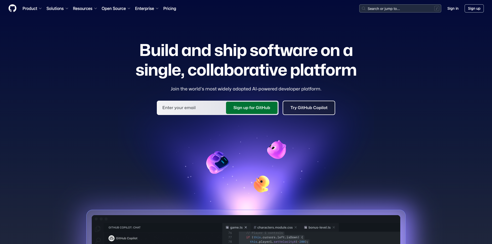

# Applicazioni da installare

Di seguito è riportata una panoramica delle applicazioni da installare sul computer prima di avviare l&#39;esercitazione.

## Adobe Creative Cloud

Vai a [https://creativecloud.adobe.com/apps/download/creative-cloud](https://creativecloud.adobe.com/apps/download/creative-cloud){target="_blank"}.

## Adobe Photoshop

Apri l&#39;app **Adobe Creative Cloud**, vai a **App**. Installa Photoshop nel computer.

## Adobe Illustrator

Apri l&#39;app **Adobe Creative Cloud**, vai a **App**. Installa Illustrator sul computer.

## Adobe Premiere Pro

Installa la versione di Adobe Premiere Pro Beta nel computer da [https://helpx.adobe.com/premiere-pro/using/premiere-pro-beta.html](https://helpx.adobe.com/premiere-pro/using/premiere-pro-beta.html)

Fare clic su **Apri app desktop Creative Cloud**.

Fai clic su **Installa** sulla scheda dell&#39;app **Premiere Pro (Beta)**.

## App di trasferimento Frame.io

Vai a [https://frame.io/transfer](https://frame.io/transfer) e scarica la versione per il tuo computer.

## Codice di Visual Studio

Vai a [https://code.visualstudio.com/](https://code.visualstudio.com/){target="_blank"}, scarica e installa **Visual Studio Code**.

## Editor di testo

Se non disponi di un&#39;app Editor di testo, puoi passare a [https://www.sublimetext.com/](https://www.sublimetext.com/){target="_blank"} e scaricare e installare questo editor di testo.

## Account GitHub

Se non hai ancora un account GitHub, passa a [https://github.com/](https://github.com/){target="_blank"} e fai clic su **Registrati**. Utilizza il tuo indirizzo e-mail personale e crea il tuo account.

## Desktop GitHub

Vai a [https://desktop.github.com/download/](https://desktop.github.com/download/){target="_blank"}, scarica e installa **Github Desktop**.

## Azure Storage Explorer

[Scarica Microsoft Azure Storage Explorer per gestire i file](https://azure.microsoft.com/en-us/products/storage/storage-explorer#Download-4){target="_blank"}. Selezionare la versione corretta per il sistema operativo specifico, scaricarla e installarla.

{zoomable="yes"}

Hai completato il modulo Guida introduttiva.

## Passaggi successivi

Torna a [Guida introduttiva](./getting-started.md){target="_blank"}

Torna a [Tutti i moduli](./../../../overview.md){target="_blank"}./images
