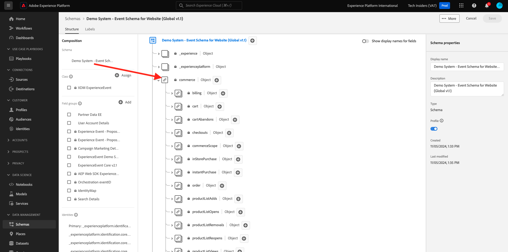

# 1.1.1 Customer Journey Analytics 101

## Obiettivi

- Comprendere il servizio dell’applicazione CJA
- Scopri come posizionare CJA
- Comprendere il flusso di lavoro di CJA: dalla connessione dati agli approfondimenti

## 1.1.1.1 Cos’è Customer Journey Analytics?

Customer Journey Analytics (CJA) fornisce un toolkit ai team di business intelligence e data science per l’unione e l’analisi dei dati cross-channel (online e offline). Le funzionalità di CJA forniscono contesto e chiarezza al complesso percorso di clienti multicanale. Il contesto fornito consente di ottenere informazioni utili per eliminare i punti critici dal processo di conversione del cliente e per progettare e distribuire esperienze eccezionali nei momenti più importanti.

CJA porta Analysis Workspace al di sopra di Adobe Experience Platform. Adobe Experience Platform è il cervello per la comunicazione e l’orchestrazione e con CJA, i brand possono ora contestualizzare e visualizzare tutti i dati, in modo che i team di Business e Insight possano imparare da esso analizzando il percorso completo dei clienti online e offline.

I team di Business e Insight possono parlare con CJA, porre domande e ottenere risposte rapide con l’interfaccia utente di Analysis Workspace semplice da usare e con funzionalità di trascinamento della selezione.

## 1.1.1.2 Vantaggi chiave

I tre principali vantaggi per i clienti sono:

- La possibilità di rendere le informazioni disponibili a tutti (ad esempio, democratizzare l’accesso ai dati)
- Possibilità di visualizzare il cliente in un percorso contestuale (ovvero i dati possono essere visualizzati in sequenza, su più canali online e offline)
- La capacità di sfruttare la potenza dei dati senza la necessità di (ovvero, consente alle persone normali di utilizzare i dati per acquisire informazioni approfondite e analisi per l’attivazione del marketing)

## 1.1.1.3 Perché scegliere Customer Journey Analytics?

CJA non intende sostituire un’applicazione BI corrente come Power BI, Microstrategy, Locker o Tableau. Queste applicazioni BI hanno lo scopo di visualizzare i dati per creare dashboard aziendali in modo che tutti gli utenti di un’organizzazione possano rapidamente esaminare metriche importanti.\
L’obiettivo di CJA è di fornire ai team di marketing e business una potenza di analisi, rendendola uno strumento di analisi &quot;obbligatorio&quot; per questi utenti tipo.

In passato, le applicazioni BI non erano in grado di fornire informazioni reali sui clienti:

- Non possono eseguire l’attribuzione né l’analisi del percorso del cliente.
- Le applicazioni BI devono conoscere la domanda in anticipo
- Le query interattive sono limitate dalla struttura del database
- Sono necessarie competenze SQL.
- Le applicazioni BI non permettono di sapere perché è successo qualcosa.
- Le applicazioni BI non dispongono di una connessione diretta ai punti di contatto del cliente.

Per questi motivi, gli utenti aziendali e gli analisti hanno raggiunto quasi immediatamente un vicolo cieco, rendendo l&#39;analisi costosa, lenta, inflessibile e scollegata dai sistemi di azione.

Con CJA puoi avere una visione a 360 del percorso dei clienti, utilizzando dati offline e online, con gli strumenti giusti per ridurre il tempo necessario per acquisire informazioni approfondite, rendendo gli utenti aziendali indipendenti nel comprendere perché è successo qualcosa e come rispondervi.

## 1.1.1.4 Comprendere il flusso di lavoro Customer Journey Analytics

Prima di iniziare gli esercizi successivi, è fondamentale comprendere quali passaggi sono necessari per inserire in CJA i dati provenienti da Adobe Experience Platform, al fine di visualizzarli e ottenere informazioni approfondite. È quello che chiamiamo flusso di lavoro CJA. Diamo un&#39;occhiata:

Prima di iniziare i passaggi precedenti, non dimenticare il passaggio 0, che consiste nel comprendere i dati disponibili in Adobe Experience Platform.

**Spazzatura in entrata, spazzatura in uscita.** Ricordi? Devi avere un’idea chiara di quali dati sono disponibili e come sono configurati gli schemi in Adobe Experience Platform. Comprendere i dati presenti in Adobe Experience Platform semplificherà le cose, non solo sulla parte di connessione dati, ma anche durante la creazione di visualizzazioni e l’analisi.

## 1.1.1.5 Passaggio 0: informazioni sugli schemi e i set di dati di Adobe Experience Platform

Accedi a Adobe Experience Platform da questo URL: [https://experience.adobe.com/platform](https://experience.adobe.com/platform).

Dopo aver effettuato l’accesso, accedi alla home page di Adobe Experience Platform.

Prima di continuare, devi selezionare una **sandbox**. La sandbox da selezionare è denominata ``--aepSandboxName--``. Dopo aver selezionato la sandbox appropriata, la schermata cambia e ora sei nella sandbox dedicata.

Dai un&#39;occhiata a questi schemi e set di dati in Adobe Experience Platform.

| Set di dati | Schema |
| ----------------- |-------------| 
| Sistema di dimostrazione - Set di dati di eventi per il sito web (Global v1.1) | Sistema di dimostrazione - Schema eventi per il sito web (Global v1.1) |
| Sistema demo - Set di dati evento per Call Center (Global v1.1) | Sistema demo - Schema eventi per Call Center (Global v1.1) |
| Sistema demo - Set di dati evento per assistenti vocali (Global v1.1) | Sistema demo - Schema eventi per assistenti vocali (Global v1.1) |

Assicurati di aver controllato almeno elementi come:

- Identità: CRMID, phoneNumber, ECID, e-mail. Quali identità sono gli identificatori primari, quali sono gli identificatori secondari?
Per trovare gli identificatori, aprire uno schema e controllare l&#39;oggetto `--aepTenantId--.identification.core`. Dai un&#39;occhiata allo schema [Demo System - Event Schema for Website (Global v1.1)](https://experience.adobe.com/platform/schema).

- Esplora l&#39;oggetto commerce nello schema [Sistema demo - Schema evento per il sito Web (Global v1.1)](https://experience.adobe.com/platform/schema).

- Visualizza in anteprima tutti i [set di dati](https://experience.adobe.com/platform/dataset/browse?limit=50&amp;page=1&amp;sortDescending=1&amp;sortField=created) e osserva i dati

Ora puoi iniziare a utilizzare l’interfaccia utente di Customer Journey Analytics.

## Passaggi successivi

Vai a [1.1.2 Connetti set di dati Adobe Experience Platform in Customer Journey Analytics](./ex2.md){target="_blank"}

Torna a [Customer Journey Analytics](./customer-journey-analytics-build-a-dashboard.md){target="_blank"}

Torna a [Tutti i moduli](./../../../../overview.md){target="_blank"}
