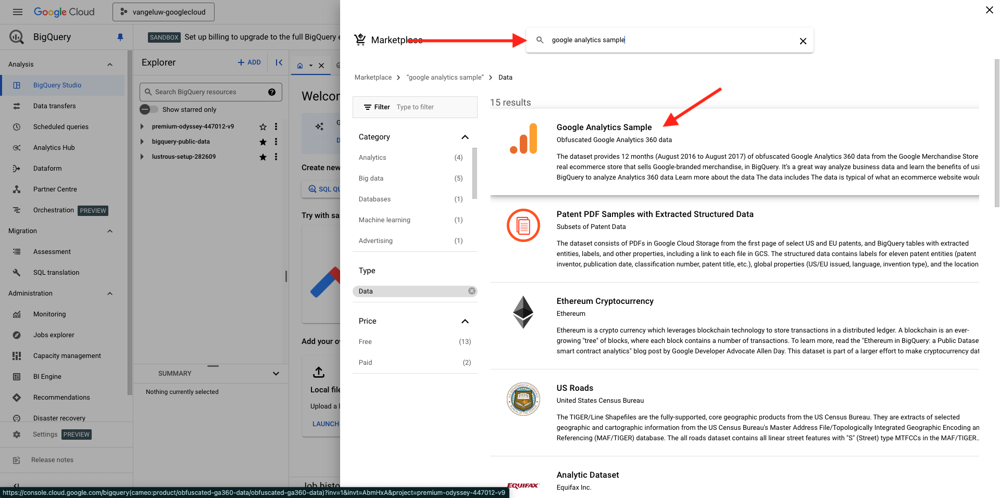

# 1.2.1 Iniziare a utilizzare la piattaforma Google Cloud

>[!NOTE]
>
>Per questo esercizio, devi accedere a un ambiente della piattaforma Google Cloud. Se non hai ancora accesso a GCP, crea un nuovo account utilizzando il tuo indirizzo e-mail personale.

## 1.2.1.1 Perché collegare Google BigQuery a Adobe Experience Platform per ottenere i dati Google Analytics

Google Cloud Platform (GCP) è una suite di servizi pubblici di cloud computing offerti da Google. La piattaforma Google Cloud include una serie di servizi in hosting per lo sviluppo di applicazioni, applicazioni e sistemi di elaborazione che vengono eseguiti su hardware Google.

BigQuery è uno di questi servizi ed è sempre incluso con Google Analytics 360. I dati di Google Analytics vengono spesso campionati quando si tenta di ottenere dati direttamente da esso (ad esempio, API). Ecco perché Google include BigQuery per ottenere dati non campionati, in modo che i brand possano eseguire analisi avanzate utilizzando SQL e beneficiare della potenza di GCP.

I dati Google Analytics vengono caricati quotidianamente in BigQuery utilizzando un meccanismo batch. Di conseguenza, non ha alcun senso utilizzare questa integrazione GCP/BigQuery per casi d’uso di personalizzazione e attivazione in tempo reale.

Se un brand desidera fornire casi di utilizzo di personalizzazione in tempo reale basati su dati Google Analytics, può raccogliere tali dati sul sito web con Google Tag Manager e quindi trasmetterli in streaming a Adobe Experience Platform in tempo reale.

Utilizza il connettore Source GCP/BigQuery per...

- tieni traccia del comportamento dei clienti sul sito web e carica tali dati in Adobe Experience Platform per l’analisi, la scienza dei dati e i casi d’uso di personalizzazione che non richiedono attivazione in tempo reale.
- caricare i dati storici di Google Analytics in Adobe Experience Platform, ancora una volta per casi di utilizzo di analisi e data science

## 1.2.1.2 Account Google

>[!NOTE]
>
>Per questo esercizio, devi accedere a un ambiente della piattaforma Google Cloud. Se non hai ancora accesso a GCP, crea un nuovo account utilizzando il tuo indirizzo e-mail personale.

## 1.2.1.3 Selezionare o creare un progetto

Vai a [https://console.cloud.google.com/](https://console.cloud.google.com/).

Fare clic su **Seleziona un progetto** o su un progetto esistente.

Se non hai ancora un progetto, fai clic su **NUOVO PROGETTO**. Se disponi già di un progetto, puoi scegliere di selezionarlo e continuare con il passaggio successivo.

Assegna un nome al progetto seguendo questa convenzione di denominazione. Fare clic su **CREA**.

| Convenzione |
| ----------------- |
| `--aepUserLdap---googlecloud` |

Attendi che la notifica in alto a destra dello schermo indichi che la creazione è terminata. Quindi fare clic su **SELEZIONA PROGETTO**.

Quindi, vai alla barra di ricerca nella parte superiore dello schermo e digita **BigQuery**. Selezionare il primo risultato.

L’obiettivo di questo modulo è quello di inserire i dati di Google Analytics in Adobe Experience Platform. Per farlo, devi disporre inizialmente di dati fittizi in un set di dati Google Analytics.

Fai clic su **+ Aggiungi**, quindi fai clic su **Set di dati pubblici** nel menu a destra.

Viene quindi visualizzata questa finestra:

Immetti il termine di ricerca **Google Analytics Sample** nella barra di ricerca e fai clic sul primo risultato della ricerca.

Viene visualizzata la schermata seguente con una descrizione del set di dati. Fare clic su **VISUALIZZA SET DI DATI**.

Verrai quindi reindirizzato a BigQuery dove visualizzerai questo **set di dati bigquery-public-data** in **Explorer**.

In **Explorer**, ora dovresti visualizzare diverse tabelle. Sentiti libero di esplorarle. Vai a `google_analytics_sample`.

Fare clic per aprire la tabella `ga_sessions`.

Prima di continuare con l&#39;esercizio successivo, annotare i seguenti elementi in un file di testo separato sul computer:

| Credenziali | Denominazione | Esempio |
| ----------------- |-------------| -------------|
| Nome progetto | `--aepUserLdap---googlecloud` | vangeluw-googlecloud |
| ID Progetto | random | possible-bee-447102-h3 |

Per trovare il nome e l&#39;ID progetto, fai clic sul **nome progetto** nella barra dei menu superiore:

A questo punto, a destra viene visualizzato il tuo ID progetto:

Ora puoi passare all’esercizio successivo, in cui le mani si sporcano interrogando i dati di Google Analytics.

## Passaggi successivi

Vai a [1.2.2 Crea la tua prima query in BigQuery](./ex2.md){target="_blank"}

Torna a [Acquisire e analizzare i dati Google Analytics in Adobe Experience Platform con il connettore Source BigQuery](./customer-journey-analytics-bigquery-gcp.md){target="_blank"}

Torna a [Tutti i moduli](./../../../../overview.md){target="_blank"}
